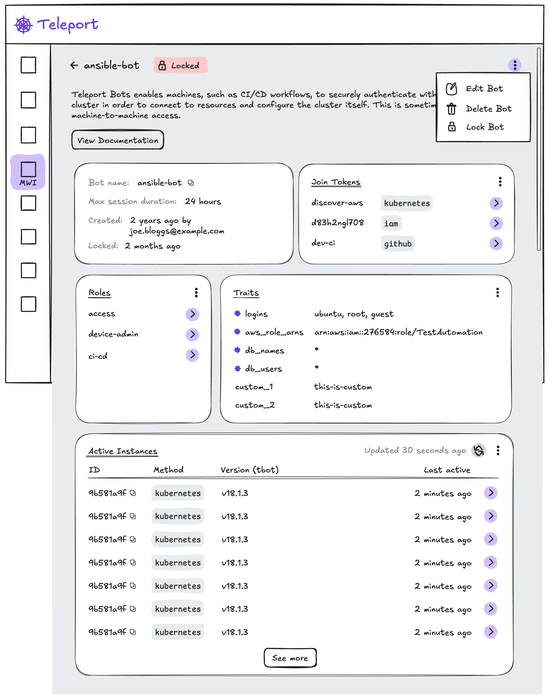
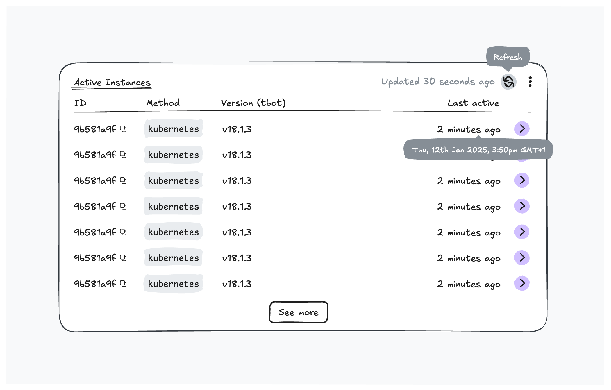
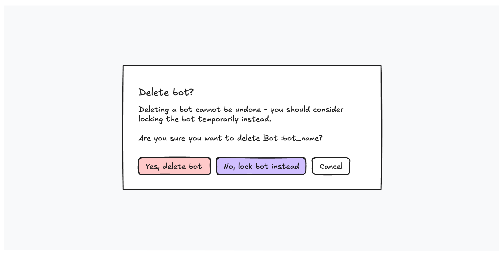

# RFD0217 - Bot Details (web)

## Required Approvers

* Engineering: @strideynet
* Product: @thedevelopnik && @samratambadekar

## What

Add a page to the web app which provides details for a single bot. This page is linked to from the existing bots list. Features of the page will be delivered incrementally.

In the first iteration, the page will show basic details (name, created at, max ttl, etc), roles, traits, linked join methods and *active* bot instances. Deleting and locking the bot is allowed, as well as editing role assignment, allowed logins and max session duration (ttl) - this matches the operations available using `tctl`.

The feature set of subsequent iterations remains flexible to allow customer and community feedback to shape the direction of the product. This document will be updated to reflect future iterations as they are planned and implemented. A [wish list of features](#wishlist-features) is included.

## Why

Management operations and diagnostic information on bots is only possible via `tctl` - this change seeks to make these more accessible and more friendly for non-technical users (i.e. users less comfortable on the command line). The new page is targeted mainly at members of the Infrastructure Security team whose role it is to configure and maintain a Teleport deployment, as well as enroll protected resources.

## Details

### Day 1 vs. day 2

In its first increment the Bot Details page has no expected differences between day 1 and day 2 experiences, and it's likely to be used by users who are already acquainted with Teleport.

### User stories

As a member of the **Infrastructure Security team**,
I would like to **edit the assigned roles, allowed traits and max session duration** for a bot,
So that I can easily extend or reduce the scope of a bot without the need to migrate existing agents (e.g. by needing to recreate the bot) or using `tctl`.

As a member of the **Infrastructure Security team**,
I would like to **delete a bot** when it is no longer required,
So that I can reduce unnecessary access paths to resources, and keep the cluster configuration tidy and free of historic clutter.

As a member of the **Incident Response team**,
I would like to **lock a bot** and all active instances,
So that current and future access to protected resources is immediately prevented.

As a member of the **Infrastructure Security team**,
I would like to **view assigned roles and allowed traits** for a bot,
So that I can easily determine the scope of access at a glance.

As a member of the **Infrastructure Security team**,
I would like to **view configured join methods** for a bot,
So that I can easily determine the enrolment mechanisms available at a glance.

As a member of the **Infrastructure Security team**,
I would like to see a list of **currently active** instances for a bot with **last active times** and high-level characteristics (such as **bot name**, **hostname** and **join method**),
So that I can assess the usage of the bot by scanning over the results to build an overall picture of recency and a distribution of characteristics.

As a member of the **DevOps/Development team**, who has just set up an MWI agent (e.g. GitHub Actions),
I would like to get **realtime feedback** that my new **agent/s are enrolling correctly**,
So that I can feel confident that the agents will work going forwards.

### UX



#### Bot info and config

Shows basic details and configuration. All items are readonly. Date/time items have a hover state which shows a tooltip with the full date and time.


A lock status is included showing details of the in-force lock on hover. If more than once lock is in-force, appropriate messaging is shown explaining that removing the lock state need to be done by navigating to **Identity Governance > Session & Identity Locks** where the user can review all locks.

**Data source**

``` yaml
# Bot resource (calculated)
kind: bot
metadata:
  name: robot
spec:
  max_session_ttl:
    seconds: 43200
status:
  role_name: bot-robot # Links to role
  user_name: bot-robot # Links to user

# User resource
kind: user
metadata:
  labels:
    teleport.internal/bot: robot # Links to bot
  name: bot-robot
spec:
  created_by:
    time: "2025-06-02T11:25:13.238653583Z"
    user:
      name: nicholas.marais@goteleport.com
  roles:
  - bot-robot # Links to role

# Role resource
kind: role
metadata:
  name: bot-robot
```

#### Join tokens

Lists Join Tokens with a role of "Bot" and `bot_name` matching the bot being viewed. An overflow menu allows navigating to **Zero Trust Access > Join Tokens**. Clicking an item navigates to the view/edit page for that token.


To support MFA for Admin Actions, which includes viewing Join Tokens, a call to the endpoint will be made without the standard auto-challenge mechanism. If the call succeeds, the items are displayed without a prompt. If a requires-MFA error is returned, the UI will instead show an alert explaining that verification is required and provide an action to retry. On retry the usual auto-challenge mechanism kicks in to prompt the user, and the items are returned and displayed. This approach provides an improved user experience by giving the user full context before an MFA prompt appears.


**Data source**

``` yaml
# Token resource
kind: token
metadata:
  name: robot-github
spec:
  bot_name: robot
  join_method: github
  roles:
  - Bot
```

#### Roles and traits

Provides full lists of roles and traits (well-known and custom). Edit operations are provided for each for convenience, which open the page-wide edit modal with all editable fields available.


**Data source**
``` yaml
# Bot resource
kind: bot
metadata:
  name: robot
spec:
  roles:
  - file-browser-access
  - mac.lan-ssh-access
  traits:
  - name: logins
    values:
    - nick.marais
```

#### Active instances

Lists the most recent (max 10) instances for the bot, ordered most recent heartbeat first. A refresh action reloads the data for this panel only, and is provided to make monitoring instance activity easier. A "see more" action navigates to the bot instances page with a pre-populated search filter on the bot's name - this is an imperfect filter as it's a contains-text filter across all fields.



In order to display only the instances with the most recent heartbeat, sorting will be added by cache-enabling bot instances and including an additional index (beyond the standard index on `name`). This index will operate on a combination of the instance id and the timestamp of the most recent heartbeat for each instance. The first page of 10 will be requested and no further paging is required. As part of this work, the Bot Instance list will be upgraded to support sorting (on both `name` and recent `last_active_at`) and will continue to make use of paging.

#### Edit roles, traits and max session duration (`max_session_ttl`)

Shows a dialog where the user can add and/or remove assigned roles, add and/or remove traits (well-known or custom), and edit the configured max session duration in the form `43200s`, `30m` or `3h`. Allows all changes to be made in a single atomic transaction.


#### Delete bot

Deletes the bot after confirmation. Suggests locking instead, as a lower severity action that can be undone. Shows a loading indicator during the call to the api. On success, navigates to the bots list (`/web/bots`). On error, shows a message within the confirmation dialog.



#### Lock bot

Locks the bot after confirmation. Shows a loading indicator during the call to the api. On success, removes the dialog but remains on the bot detail page. On error, shows a message within the confirmation dialog.


#### Unlock bot

Unlocks a bot after confirmation. Shows a loading indicator during the call to the api. On success, removes the dialog but remains on the bot detail page. On error, shows a message within the confirmation dialog.


### Implementation

#### Data fetching and caching

In order to keep the implementation modular, each logical section of the page fetches its own data, shows loading status and manages error states. This increases flexibility for future iterations while reducing the likelihood of introducing regression issues. Data caching behaviour can be tailored to each area of data independently.

#### Web APIs

##### `GET /v1/webapi/sites/:site/machine-id/bot/:name`

Fetch a bot by name, including roles and traits. Endpoint exists and will be reused.

##### `GET /v2/webapi/tokens?role=bot&bot_name=:name`

Fetch join tokens linked to a bot by name.

**Approach**

New endpoint and RPC which supports filtering and pagination (although not required by this work). Filtering by role and bot name will be supported. The endpoint will be protected by MFA for Admin Actions just like its `v1` counterpart.

``` protobuf
// ListProvisionTokensRequest is used to retrieve a paginated list of provision tokens.
message ListProvisionTokensRequest {
    // Limit is the maximum amount of items per page.
    int32 Limit = 1;

    // StartKey is used to resume a query in order to enable pagination.
    // If the previous response had NextKey set then this should be
    // set to its value. Otherwise leave empty.
    string StartKey = 2;

    // FilterRoles allows filtering for tokens with the provided role.
    repeated string FilterRoles = 3;

    // FilterBotName allows filtering for tokens associated with the
    // named bot. This is a no-op unless FilterRole is 'Bot'.
    string FilterBotName = 4;
}

// ListProvisionTokensResponse is used to retrieve a paginated list of provision tokens.
message ListProvisionTokensResponse {
    // Tokens is the list of tokens.
    repeated types.ProvisionTokenV2 Tokens = 1;

    // NextKey is used to resume a query in order to enable pagination.
    // Leave empty to start at the beginning.
    string NextKey = 2;
}

service AuthService {
  // ListProvisionTokens retrieves a paginated list of provision tokens.
  rpc ListProvisionTokens(ListProvisionTokensRequest) returns (ListProvisionTokensResponse);
}
```
_api/proto/teleport/legacy/client/proto/authservice.proto_

**Performance**

While the endpoint will support pagination it wont be used in this case - a page size of 100 will be used and all pages will be retrieved. It is not anticipated that use of the endpoint for the Bot Details page will increase usage or load significantly. Bot's are likely to have fewer than 20 associated join methods.

**Backwards compatibility**

In a scenario where an older version proxy is in place, the api will return a 404 (including a `proxyVersion` field), as the new endpoint wont exist. In this case, the frontend will detect the version mismatch and provide the user with an explanation.

##### `GET /v1/webapi/sites/:site/machine-id/bot-instance?search=:bot-name`

Fetch active instances for a bot by name. Endpoint exists.

##### `PUT /v2/webapi/sites/:site/machine-id/bot/:name`

Update roles, traits and config (`max_session_ttl`).

**Approach**

New endpoint supporting updating roles, traits and max session duration. Support for updating traits and `max_session_ttl` are already supported by the underlying RPC and will be exposed by this endpoint. Not all items of data are saved to the same resource. As such, it's important to ensure the update happens atomically and rolled back on failure. The `v1` endpoint will be marked for removal.

**Backwards compatibility**
In a scenario where an older version proxy is in place, the api will return a 404 (including a `proxyVersion` field), as the new endpoint wont exist. In this case, the frontend will detect the version mismatch and provide the user with an explanation. This is preferable to a partial update, as performing only some of the update (roles only) may introduce a security risk, or simply just be confusing to users.

##### `DELETE /v1/webapi/sites/:site/machine-id/bot/:name`

Delete a bot. Existing endpoint.

##### `GET /v2/webapi/sites/:site/locks`

Returns in-force locks for the bot, either role or user locks.

**Approach**

New (v2) endpoint which will support filtering for in-force locks only, as well as filtering for the provided targets (the bot's user). The underlying RPC and it's cache already support these filters.

**Backwards compatibility**

In a scenario where an older version proxy is in place, the endpoint will return a 404 (including a `proxyVersion` field), as the new endpoint wont exist. In this case, the frontend will detect the version mismatch and provide the user with an explanation.

##### `PUT /v1/webapi/sites/:site/locks`

Creates a new lock. Endpoint exists and will be used as-is to create a lock for a bot by name including a message and TTL.

##### `DELETE /v1/webapi/sites/:site/locks/:uuid`

Removed a lock by ID. Existing endpoint will be used as-is to remove a lock.

#### UI

Implementation of the UI will make heavy use of existing shared components. No new design components will be contributed.

#### Feature Flag

A feature flag should be used to allow partial features to be build and merged without worrying about incomplete features being released to customers.

#### Tasks

A rough breakdown of tasks with the goal of delivering implementation items in manageable chunks without requiring large PRs and time consuming reviews.

1. Page scaffold, feature flag and UI panel component
2. Bot info panel
3. Add filters to endpoint `GET /v1/webapi/tokens?role=Bot&bot=:name`
4. Enable deep-linking to Join Token view/edit page
5. Join tokens panel and MFA support
6. Roles and traits panels
7. Enable sorting for endpoint `GET /v1/webapi/sites/:site/machine-id/bot-instance?search=:bot-name`
8. Active instances panel
9. Delete bot operation (RBAC aware)
10. Add filters to endpoint `GET /v1/webapi/sites/:site/locks`
11. Lock status
12. Lock bot operation (RBAC aware)
13. Extend updatable fields for endpoint `PUT /v1/webapi/sites/:site/machine-id/bot/:name`
14. Edit operation (inc roles, traits and max session duration)
15. Remove temporary feature flag

### Wishlist features

#### Recent instances (historic)

Similar to the active instance list, except show instances whose credentials have recently expired (in the last 24 hours).


#### Audit log

Filtered to show only the bot being viewed. Needs to filter the log in a performant way, and likely only available to customers using Athena.


#### Access Graph

Likely a simplified version of the Access Graph focused on the bot and without the ability to explore other parts of the graph.


#### Session recordings

Bot sessions are non-interactive, so recordings are not possible in many cases. Session in this list may show command input and output, but aren't re-playable.


#### Activity visualization

A minimalist representation of a bot activity over various time frames. Authentication records as well as heartbeats could be used to provide the data. Otherwise, data from the Audit Log could be used where that data is retrievable in a performant way (i.e. customers using Athena).

