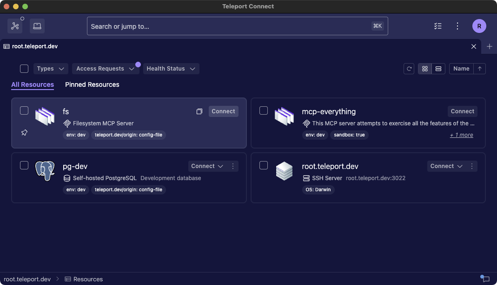
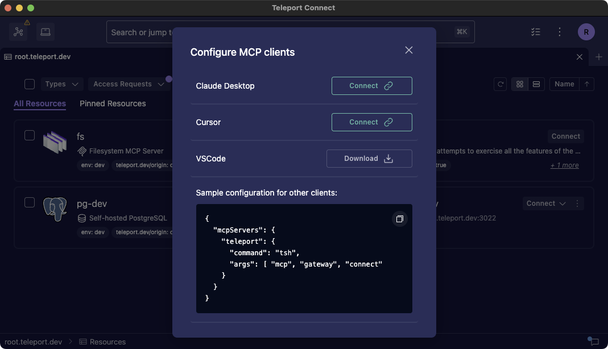
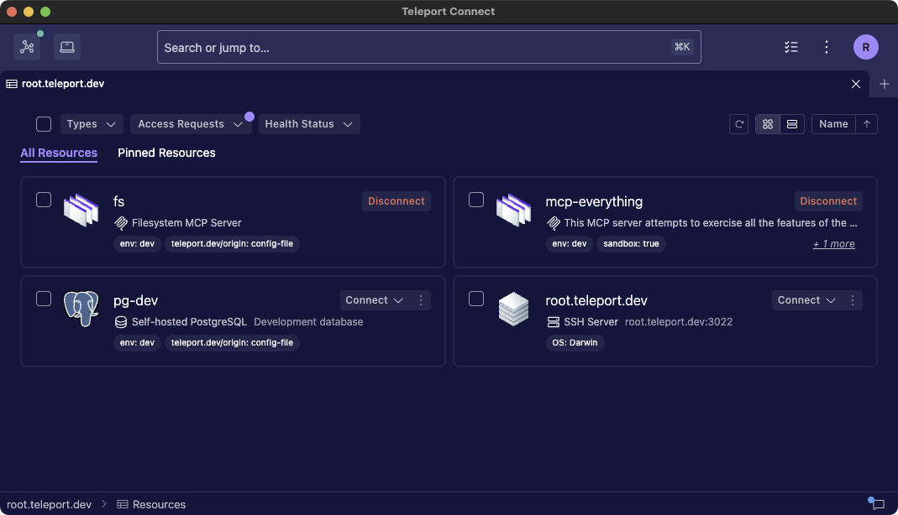
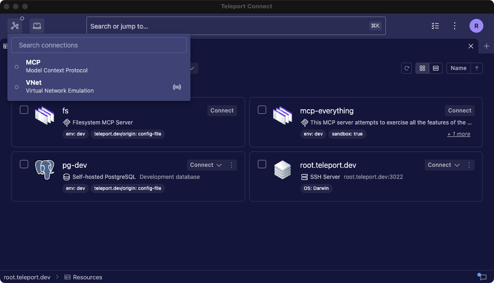
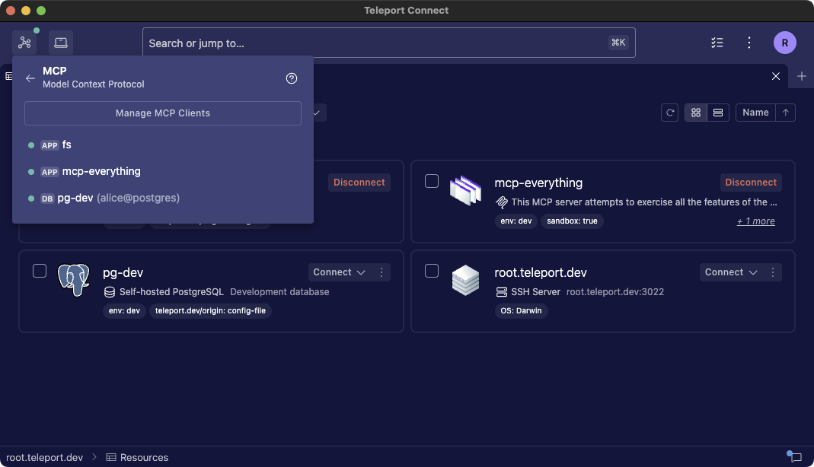
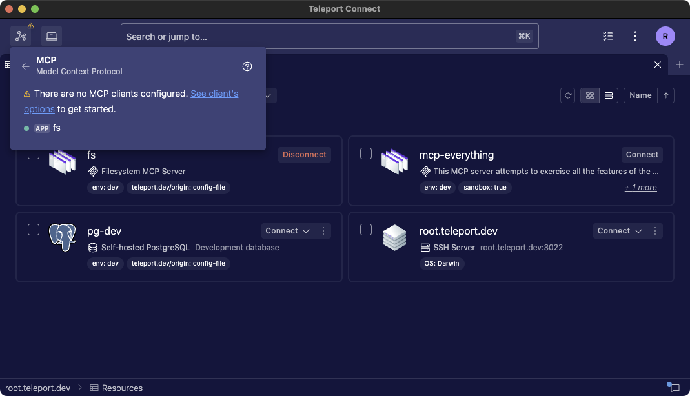
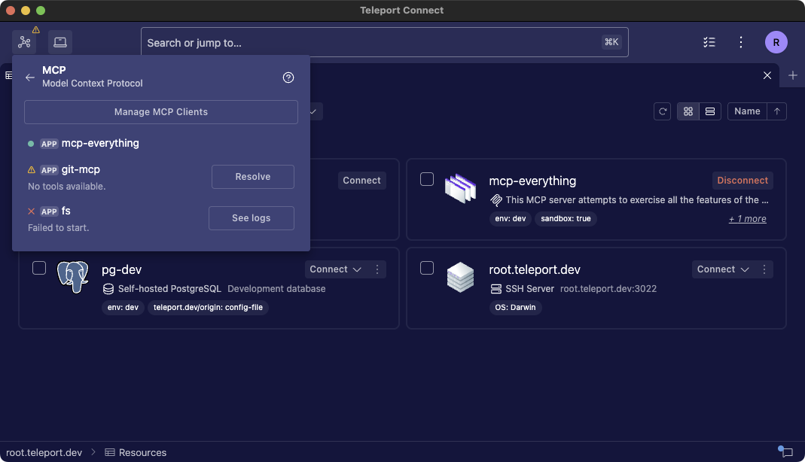

# RFD 0221 - MCP Gateway

## Required Approvers

* Engineering: @r0mant && @greedy52
* Product: @klizhentas

## What

A single local MCP server that can serve all Teleport MCPs to clients,
providing a single experience for managing configurations and troubleshooting
issues.

## Why

The MCP local gateway reduces the operational overhead of setting up each
resource by allowing clients to integrate once instead of editing configurations
for each new server. It complements the current approach while improving
visibility of runtime failures, providing actionable errors, and centralizing
remediation in Teleport Connect/`tsh`.

## UX

The MCP gateway is available in both tsh and Teleport Connect. This section
mainly focuses on integration within Teleport Connect, with a brief subsection
on MCP gateway usage in `tsh` at the end.

### Guiding users into knowing Teleport's MCP capabilities and features

Previously, Teleport Connect did not support launching or connecting to MCP
applications. Now, users will see a "Connect" button on MCP applications and an
additional connect option for supported databases. By clicking it, they will
enable the server on the gateway.



When enabling a resource as an MCP server for the first time, Teleport Connect
will display a modal allowing users to install the Teleport gateway MCP on their
preferred client. The modal will offer a one-click install option for user
clients and a sample configuration that can be customized for other clients.



With the clients configured, users can now enable or disable the MCP servers,
including supported databases. This will impact all connected clients.



### Managing MCP Gateway

The MCP Gateway remains a permanent fixture in the UI within the connection
list at the top left.



Clicking on the MCP item opens a dedicated MCP Gateway panel within the
connection list. The panel features a button for managing the MCP clients'
installation server and also shows a list of enabled resources.



If users enable MCP servers but have no clients configured, the MCP connection
will show a warning, emphasizing that turning servers on or off does not affect
any clients and that some action is needed to complete the setup.



### Expired credentials

Given an MCP client already configured with some MCP servers enabled, once the
user credentials expire, the gateway will maintain their last view of tools
unchanged. However, tool calls will still send a message guiding users to
Teleport Connection, which will prompt them to re-login.

### Identifying and resolving issues

With the MCP, clients are configured, and MCP servers are enabled. After the MCP
client initializes the session, the gateway can monitor each connection and
detect potential issues. The most common issues will be mapped, and resolution
instructions will be displayed to users.



Besides the reported issues, Teleport Connect will also have access to the
gateway logs. This will be shown in a separate tab with a save/export button so
users can share this information on support tickets.

It's important to note that without an MCP client configured, no diagnosis or
logs will be available. This is mainly because Teleport Connect won't initialize
the MCP sessions. In the future, we can develop a diagnosis process that acts
like an MCP client and initializes the session to ensure the MCP server starts
properly.

### Restoring configured MCP servers

The enabled servers and their options will be saved as user preferences, so
logging in to a different cluster or computer will automatically update the
gateway configuration.

### `tsh`

A new set of commands will be added, all of which will relate to installing and
managing the MCP gateway.

```code
# Installing MCP gateway in different clients will work similar to the MCP
# config commands.
$ tsh mcp gateway install --client-config=claude
$ tsh mcp gateway install --client-config=vscode

# Listing the available MCPs will still be done by the current commands
# `tsh mcp ls` and `tsh db ls`.

# Managing servers will have no different commands for apps and databases.
$ tsh mcp gateway add mcp-everything
$ tsh mcp gateway add pg-dev --db-user=readonly --db-name=postgres

$ tsh mcp gateway rm mcp-everything
$ tsh mcp gateway rm pg-dev
```

## Details

WIP
