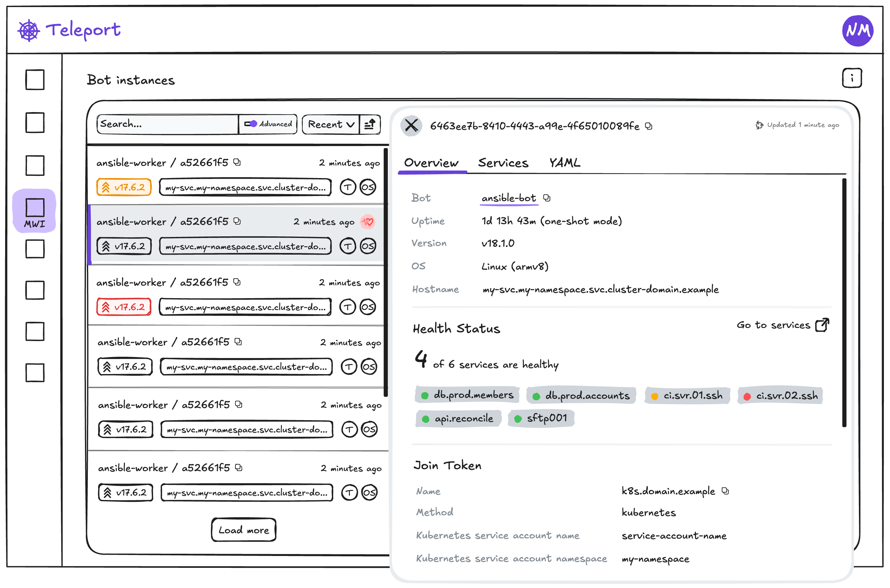

# RFD 0222 - Bot Instances at Scale

## Required Approvers

- Engineering: @strideynet
- Product: @thedevelopnik

# RFD 0222 - Bot Instances at Scale

# What

Machine ID bots allow non-human users to access resources in a Teleport cluster. They are useful for automating tasks, such as CI/CD runners, monitoring systems, and running scripts. The bot resource encapsulates a bot's access rights and roles. The `tbot` binary is used to start an instance of a bot and enrol it with the cluster (using a join token). When `tbot` starts and receives its credentials, a bot instance record is created in the cluster. Bot instance records expire when their credentials expire. Bot instances can be long-running processes which periodically renew their credentials, or short-lived, ephemeral processes which are created and destroyed on demand. Many instances of the same bot can exist at once, and clusters can have many thousands of bot instances.

This proposal seeks to address the pain points of configuring and running a large fleet of Machine ID bots. It will focus solely on the Day 1 experience, and users are expected to be familiar with Teleport in general as well as the config and setup of their respective clusters. Day 0 tutorialization of setup steps and guided beginner scenarios are left to other initiatives.

# Why

As adoption of Machine & Workload ID increases, in part due to the drive to increase efficiency through automation as well as trends like Agentive AI, customers expect managing large fleets of bots to be simple and easy.

It’s the responsibility of the **infrastructure security team** to own and manage the Teleport cluster and enrol protected resources. For teams which make extensive use of Machine ID, it has become cumbersome to manage many bots and thousands of instances. Where Dev/Dev Ops teams deploy bot instances themselves, it can be doubly difficult to coordinate upgrades and security initiatives.

# Details

## UX

### User Stories

**As a cluster owner (Infrastructure Security team), I want to know which Bot Instances, across all Bots, are blocking a safe cluster upgrade (major) due to their version.**

The upgrade process can vary depending on the flavour of Teleport in use (cloud, oss, etc), and how it’s deployed. A common step is to query for agents running a version which would become incompatible should an upgrade be done - using `tctl inventory ls --older-than=v18.0.0`. This command does not include bot instances, and `tctl bots instances ls` doesn’t return versions numbers for instances.

As such, it is a difficult task to identify bot instances that may be running an old version of `tbot`. This is especially difficult at scale. The current bot instance list available in the web UI allows filtering by version, although it’s a text search and it is not aware of semantic versioning - finding versions older than a given version is not possible.

A breakdown of active instance versions will make the process of monitoring the version status easy at a glance, as well as provide convenient links to filter the instance list for versions already one or more major versions behind the control plane (thereby preventing a safe upgrade). To facilitate this in the web UI, the filter will allow queries such as `older_than(version, "18.1.0")`. The instance list will also indicate the status of an instance’s most recent version (as up-to-date, upgrade available, patch available, or incompatible). For the CLI, the `query` flag can be used to filter instances (e.g. `tctl bots instances ls --query=older_than(version, "18.1.0")`).

**As a cluster owner (Infrastructure Security team), I want to know which Bot Instances, across all Bots, are running vulnerable versions.**

Currently in the web UI the instances list can be filtered by version, but this is a text search and it is not aware of semantic versioning. It’s possible to find a specific version number, but it’s not easy to isolate a range of versions, such as “>18 & <18.2.1”, which is likely required to find instances between a vulnerable and patched version.

To support this use-case, the filter for bot instances will support the predicate language and allow queries such as `newer_than_or_equal(version, "18.1.0") && older_than(version, "19.0.0")`. This works though the web UI and the CLI (`tctl`).

**As a cluster owner (Infrastructure Security team), I want to know which Bot Instances are running with deprecated/problematic configuration.**

Issues in `tbot` (or just typos) can be difficult to detect and logs may not adequately highlight these. To improve the rate of these events reaching users, `tbot` will detect and collate notices which are sent with the next heartbeat. They will then be available to view for a bot instance. To help in situations where it’s infeasible to check each individual instance, notices will be summarized by title and presented in aggregate form. Each aggregated item will be selectable and will filter the bot instances list. A filter such as `contains(notices, "Proxy URL not set")` will be pre-populated.

**As a Bot Instance owner (Dev/Dev Ops team), I'd like help in understanding why my Bot Instance is not working properly.**

For somebody diagnosing an issue with `tbot`, they’re likely to have access to the `tbot` log output. Such as;

```
INFO [TBOT:IDENTITY] Fetched new bot identity identity:mwi-demo-aws-manager, id=5c6af2e6-13a4-48c1-855f-74d8b8e01d86 | valid: after=2025-08-21T12:10:15Z, before=2025-08-21T12:31:13Z, duration=20m58s | kind=tls, renewable=false, disallow-reissue=false, roles=[bot-mwi-demo-aws-manager], principals=[-teleport-internal-join], generation=1 tbot/service_bot_identity.go:224
```

This log entry contains the bot name (as `identity`) and the instance’s ID. The instance ID can be used to filter the instances list in the web UI, and should make finding the relevant instance easy. In the CLI (`tctl`), both the bot name and instance ID are required to perform the look-up; `tctl bots instances show [bot_name]/[instance_id]`.

Once found, the instance's details can be seen. Here a health status can be found for each `tbot` service (outputs, tunnels, etc), which includes failure info for those services which are unhealthy. Additionally, a listing of all notices raised by the instance in it’s last run can be viewed, which may reveal the root cause of a failure. Notices are raised by `tbot` for actionable items that require attention, such as invalid config or deprecations.

### Instances dashboard

This mock-up shows the bot instance page as it would be when first arriving at the page. No filters are set, so all instances are available in the list. Results are paginated, and the default sort order is by recency - instances with the most recent heartbeat are displayed first. Sorting can be toggled between ascending and descending, and the following sort fields are available; recency, version, hostname. Filtering can be performed using a basic text search over supported fields, or an advanced search using the Teleport predcate language.

The right-hand half of the page displays the dashboard, which is a summary over all instances. The visualizations use aggregate data prepared and updated by the auth server. An indication of when the data current is provided, as well as a refresh button which retrieves the most recently available data. A selection of timeframes is also available.

The Activity visualization shows the number of events (joins, authentications, and heartbeats) that occurred over time. This can be used to identify trends and patterns in activity. It is non-interactable.

The Upgrade Status visualization show a summary of all instances grouped by upgrade status; up-to-date, upgrade available, patch available, or incompatible. Status labels are selectable, and will prepopulate the advanced search with the appropriate filter. For example, if the auth server is running v18 the filter will be populated with `older_than(version, "16.0.0")` when a user selects "not supported".

The Notices visualization shows a summary of all notices across all instances. They're conveniently grouped by notice title and a count is included. Each item selectable, and will prepopulate the advances fiilter (e.g. `contains(notices, "Proxy URL not set")`). This visualization will be hidded if there is no data to display.


### Instance details
These mock-ups shows the state of the page once an item had been selected from the instances list by clicking it. The dashboard section is replaced by the selected instance's details.

The overview tab is displayed by default when an instance is selected. It shows further infomation about the instance, the join token that was used to enrol, and a summary of service health.



The services tab shows a list of all configurted services (or outputs). Each includes it's name, type and health status. If there is extra health info available (such as and error message), this is also displayed.


The notices tab is a listing of all notices raised since the instance was started. Notices have a type, a title and a message body. Some notice types contain extra data such as a planned removal version for deprecation notices. An indication of when the notice was raised is included, and notices are ordered by most recent first and this is not user-configurable.


The configuration tab show the _effective_ `tbot` configuration as readonly yaml.


### tctl bots instances ls --search [freetext] --query [tql]

The list bot instances command will include extra information about each instance; version, health status and notices count. A search term or advanced query can be used to filter the results - in this case a filter summary is included below the results confirming the applied filter and giving a result count. The data is not paginated and all instances are returned and displayed.

```diff
- ID                                         Join Method Hostname      Joined               Last Seen            Generation
- ------------------------------------------ ----------- ------------- -------------------- -------------------- ----------
- bot-1/d83b381d-b46c-4b92-a899-755991a6d0f5 iam         ip-10-0-15-34 2025-08-29T06:09:26Z 2025-09-01T12:49:26Z 237
-
+ ID                                         Join Method Version Hostname      Status    Notices Last Seen
+ ------------------------------------------ ----------- ------- ------------- --------- ------- --------------------
+ bot-1/d83b381d-b46c-4b92-a899-755991a6d0f5 iam         v18.2.1 ip-10-0-15-34 UNHEALTHY 6       2025-09-01T12:49:26Z
+
+ Filter:
+ Search text: "ip-10-0-15"
+ Query: older_than(version, "18.0.0")
+ Results: 128
+
To view more information on a particular instance, run:

> /Users/nick.marais/.tsh/bin/tctl bots instances show [id]
```

### tctl bots instances show [id]

The should bot instance command gives an overall health summary as well as a listing of services and their respective health status. A list of notices is also included.

```diff
Bot: w2w-demo-app-bot
ID:  d83b381d-b46c-4b92-a899-755991a6d0f5
+ Status: UNHEALTHY

Initial Authentication:
  Authenticated At: 2025-08-29T06:09:26Z
  Join Method:      iam
  Join Token:       w2w-demo-web-bot
  Join Metadata:    meta:{join_token_name:"w2w-demo-web-bot" join_method:"iam"} iam:{account:"668558765449" arn:"arn:aws:sts::668558765449:assumed-role/MWIw2wDemoInstance/i-0b7667843950debfd"}
  Generation:       1
  Public Key:       <178 bytes>

Latest Authentication:
  Authenticated At: 2025-09-01T12:49:26Z
  Join Method:      iam
  Join Token:       w2w-demo-web-bot
  Join Metadata:    meta:{join_token_name:"w2w-demo-web-bot" join_method:"iam"} iam:{account:"668558765449" arn:"arn:aws:sts::668558765449:assumed-role/MWIw2wDemoInstance/i-0b7667843950debfd"}
  Generation:       237
  Public Key:       <178 bytes>

Latest Heartbeat:
  Recorded At:  2025-09-01T12:39:26Z
  Is Startup:   false
  Version:      18.1.5
  Hostname:     ip-10-0-15-34
  Uptime:       78h30m0.539099441s
  Join Method:  iam
  One Shot:     false
  Architecture: arm64
  OS:           linux
+
+ Service status:
+ Status    Name        Type                Reason         Updated At
+ --------- ----------- ------------------- -------------- --------------------
+ UNHEALTHY prod-aws-01 X509-output-service out of bananas 2025-09-01T12:49:26Z
+
+ Notices:
+ Type                Service     Message                              Raised At
+ ------------------- ----------- ------------------------------------ --------------------
+ DEPRECATION_WARNING prod-aws-01 Lorem ipsum delor sit amet (v19.0.0) 2025-09-01T12:49:26Z

To view a full, machine-readable record including past heartbeats and authentication records, run:
> /Users/nick.marais/.tsh/bin/tctl get bot_instance/w2w-demo-app-bot/d83b381d-b46c-4b92-a899-755991a6d0f5

To onboard a new instance for this bot, run:
> /Users/nick.marais/.tsh/bin/tctl bots instances add w2w-demo-app-bot
```

### Predicate language for instance filters

The predicate language will be used to provide advanced filtering for instances. The filter query will be applied in the same way the existing filters work, and no changes to indexes are required. As items are read out of the backend storage, they are filtered one by one until the page size is reached or the end of the list. For a narrow filter, many or even all records will be scanned - this inefficiency is mitigated by the in-memory caching layer's performance.

Instance-specific functions will be supported by implementing a custom `typical.ParserSpec`, such as those in the table below.

| Purpose | Example |
| --- | --- |
| Find instances running versions less than a given version - based on the most recent heartbeat | `older_than(version, 18.1.0)` |
| Find instances running versions between a vulnerable version and a fix version - based on the most recent heartbeat | `newer_than_or_equal(version, "18.0.0") && older_than(version, "18.1.0")` |
| Find instances which have a particular notice (by title) | `contains(notices, "Proxy URL not set")` |

## Privacy and Security

The proposed changes are mainly capturing extra data and presenting it in the web UI. As such, it is light on security and privacy concerns.

In order to allow instance config to be viewed without needing log in to the machine running `tbot` the complete configuration will be included in the start-up heartbeat and stored for the lifetime of the instance. Instead of capturing the config YAML verbatim, the _effective_ configuration will be used. This includes any environment variable and flag overrides. For security reasons, the join token will be omitted. For privacy reasons, any unrecognized values as well as comments will also be omitted. There may be other sensitive information such as service/output names, but these are only visible to authorised users.

## Heartbeat additions

```protobuf
message BotInstanceStatusHeartbeat {
  // ...[snip]...

  // The health of the services/output `tbot` is running.
  repeated BotInstanceServiceHealth service_health = 10;

  // tbot configuration, sourced from YAML configuration file and CLI flags.
  //
  // Will only be sent on startup. Could later be whenever the configuration
  // changes if we support reloading by sending SIGHUP or something.
  structpb.Struct config = 11;

  // Kind identifies whether the bot is running in the tbot binary or embedded
  // in another component.
  BotKind kind = 12;

  // Notices emitted since the last heartbeat.
  //
  // The server will clear any previous notices if `is_startup` is true, so that
  // editing tbot's configuration and restarting it clears any warnings from a
  // previous bad configuration.
  repeated BotInstanceNotice notices = 13;
}

// BotKind identifies whether the bot is the tbot binary or embedded in another
// component.
enum BotKind {
  // The enum zero-value, it means no notice type was included.
  BOT_KIND_UNSET = 0;

  // Means the bot is running the tbot binary.
  BOT_KIND_TBOT_BINARY = 1;

  // Means the bot is running inside the Teleport Terraform provider.
  BOT_KIND_TERRAFORM_PROVIDER = 2;

  // Means the bot is running inside the Teleport Kubernetes operator.
  BOT_KIND_KUBERNETES_OPERATOR = 3;
}

// BotInstanceNotice contains an error message, deprecation warning, etc. emitted
// by the bot instance.
message BotInstanceNotice {
  // ID is a client-generated identifier (i.e. UUID) that can be used by the
  // auth server to detect and discard duplicate notices caused by partially
  // failed heartbeat RPCs.
  string id = 1;

  // Type of notice (e.g. deprecation or warning).
  BotInstanceNoticeType type = 1;

  // Service this notice relates to (or nil if it relates to the bot instance
  // more generally).
  optional BotInstanceService service = 2;

  // Timestamp at which this notice was emitted.
  google.protobuf.Timestamp timestamp = 3;

  oneof notice {
    // Deprecation warning details.
    BotInstanceDeprecationWarning deprecation_warning = 4;

    // Generic message text.
    string message = 5;
  }
}

// BotInstanceNoticeType identifies the type of notice.
enum BotInstanceNoticeType {
  // The enum zero-value, it means no notice type was included.
  BOT_INSTANCE_NOTICE_TYPE_UNSPECIFIED = 0;

  // Means the notice contains a warning that the user is using a configuration
  // option that will be removed in a future release.
  BOT_INSTANCE_NOTICE_TYPE_DEPRECATION_WARNING = 1;

  // Means the notice contains a generic error message.
  BOT_INSTANCE_NOTICE_TYPE_MESSAGE = 2;
}

// BotInstanceDeprecationWarning contains the details of a deprecation warning.
message BotInstanceDeprecationWarning {
  // Message explaining the deprecation.
  string message = 1;

  // The major version in which the deprecated configuration will no longer work.
  string removal_version = 2;
}

// BotInstanceHealthStatus describes the healthiness of a `tbot` service.
enum BotInstanceHealthStatus {
  // The enum zero-value, it means no status was included.
  BOT_INSTANCE_HEALTH_STATUS_UNSPECIFIED = 0;

  // Means the service is still "starting up" and hasn't reported its status.
  BOT_INSTANCE_HEALTH_STATUS_INITIALIZING = 1;

  // Means the service is healthy and ready to serve traffic, or it has
  // recently succeeded in generating an output.
  BOT_INSTANCE_HEALTH_STATUS_HEALTHY = 2;

  // Means the service is failing to serve traffic or generate output.
  BOT_INSTANCE_HEALTH_STATUS_UNHEALTHY = 3;
}

// BotInstanceServiceIdentifier uniquely identifies a `tbot` service.
message BotInstanceServiceIdentifier {
  // Type of service (e.g. database-tunnel, ssh-multiplexer).
  string type = 1;

  // Name of the service, either given by the user or auto-generated.
  string name = 2;
}

// BotInstanceServiceHealth is a snapshot of a `tbot` service's health.
message BotInstanceServiceHealth {
  // Service identifies the service.
  BotInstanceServiceIdentifier service = 1;

  // Status describes the service's healthiness.
  BotInstanceHealthStatus status = 2;

  // Reason is a human-readable explanation for the service's status. It might
  // include an error message.
  optional string reason = 3;

  // UpdatedAt is the time at which the service's health last changed.
  google.protobuf.Timestamp updated_at = 4;
}
```

### Data fields and expected quantities

| Field | Description | Example | Quantity | Limitations |
| --- | --- | --- | --- | --- |
| Bot | A collection of roles and access assumed by `tbot` using a join token |  | 0-300+ per cluster |  |
| Bot instance | A unique joined instance of `tbot` in either a long-running or ephemeral environment |  | 1-300+ per bot |  |
| Authentication record | Created for each join or renewal |  | 0-10 per instance (max enforced) |  |
| Instance heartbeat | Self-reported by each bot instance |  | 0-10 per instance (max enforced) | Data is **not** validated by the auth server, and cannot be used for making access decisions. |
| Service | An independent, internal part of `tbot`. Generally maps 1:1 with configured outputs/tunnels. | `application-tunnel`, `workload-identity-api` | 1-30+ per heartbeat |  |
| Notice | An item created by `tbot` to capture an unusual event, configuration warning, or important status |  | 0-100+ per heartbeat |  |
| OS | Operating system from `runtime.GOOS` | linux, windows or darwin | Once per heartbeat |  |
| Version | Version of `tbot` | 18.1.0 | Once per heartbeat |  |
| Hostname |  |  | Once per heartbeat |  |
| Uptime | How long `tbot` has been running |  | Once per heartbeat |  |
| Raw config | `tbot`’s local config (combination of YAML and CLI flags) as a protobuf struct |  | Once per heartbeat |  |
| Join token name |  |  | Once per auth |  |
| Join method |  | github, iam, kubernetes | Once per auth |  |
| Join attributes | Metadata specific to a join method | GitHub repository name | Once per auth |  |
| Health status |  | INITIALIZING, HEALTHY, UNHEALTHY,
UNKNOWN | Once per service |  |

## Notices

Today, when `tbot` encounters a configuration that is suboptimal or will not be supported in an upcoming release, it typically logs a message with the `WARN` severity. These messages can easily be missed because `tbot`'s logs are noisy, it is often running non-interactively (e.g. in CI/CD pipeline), and because many users do not have a decent centralized logging solution.

We have historically kept deprecated features around for longer than promised, to mitigate the risk of users missing these warnings, which creates a compounding maintenance burden.

Instead, we will surface deprecation warnings and other such important messages in the web product by having `tbot` include them in its heartbeats to the auth server. It’s important to note that we will only send notices that **require some user action** or intervention, in order to avoid information fatigue — collecting the full stream of logs is out of scope (and would require a very different architecture).

Services will receive a `NoticeLogger` along with their `readyz.Reporter`, it will “tag” all notices with the name and type of the service.

```go
// NoticeLogger allows a service to emit a notice that will be sent in the bot's
// next heartbeat.
type NoticeLogger interface {
	// DeprecationWarning notifies the user that they're using a feature or
	// configuration optional that will be removed in a future release.
	//
	// removalVersion identifies the major version in which the feature will
	// be removed.
	DeprecationWarning(message string, removalVersion string)

	// Message sends a generic message.
	Message(title string, body string)
}
```

Notices emitted using the `NoticeLogger` will be buffered in-memory and flushed to the auth server on the bot’s next heartbeat. Once notices have been sent to the auth server, `tbot` will delete them from memory. To avoid unbounded memory growth if the heartbeat service becomes unavailable, notices will be stored in fixed-size data structure such as a ring buffer, although the volume of notices should be low enough for this not to be a problem anyway.

On the auth server, notices will be stored on the bot instance record like all other heartbeat data. The server will keep a limited number (e.g. 50) of the most recent notices and discard the rest. We do not need to worry about concurrent writers because the `tbot`'s heartbeat service is a singleton and except in rare misconfigurations, it’s only possible for a single `tbot` process to use a bot instance’s identity at a time.

If the heartbeat message’s `is_startup` flag is set, the auth server will discard all previous notices so that if the user fixes their configuration and restarts `tbot`, any warnings from their previous bad configuration will be immediately cleared to avoid confusion. This decision will also prevent us from treating notices as a general logging solution, as they will inherently be ephemeral and only representative of the most recent run.

## Configuration

For visibility, `tbot` will also send its full configuration to the auth server. As we do not yet support dynamically reloading `tbot`'s configuration (e.g. by sending a `SIGHUP`) we will only include it in the first heartbeat after the bot starts up, but this may change if we support dynamic configuration in the future.

**Effective vs Literal Configuration**

The actual configuration `tbot` uses at runtime is a combination of values from the YAML configuration file, CLI flags, default values, and sometimes environment variables.

While there are benefits to sending the raw inputs (e.g. the literal content of the YAML file) such as being able to spot typos, we think it’s more useful overall to send the “effective” configuration after it has been parsed, validated, and default values have been applied. This also gives us an opportunity to redact fields we know to contain sensitive information such as the join token.

## Data aggregation

To power the Upgrade Status and Notices sections of the bot instance dashboard, we will pre-aggregate the following metrics:

- Number of instances per version
- Number of instances emitting a given notice (i.e. use the same deprecated config option)

As these metrics are intended to provide a rough overview of fleet health, and do not need to be strictly up-to-date, we will recalculate them on a timer (e.g. every 10 minutes). This is simpler, and in many cases likely more efficient than updating them incrementally by consuming the event stream, especially if we increase the rate of heartbeats to publish notices more quickly, which would generate a lot of chatter.

To avoid the need to "elect" a leader to calculate these metrics, each auth server instance will calculate them independently. Users therefore may see the numbers change if they refresh the dashboard, but this is an acceptable trade-off.

## Web API

**GET /v2/webapi/sites/:site/machine-id/bot-instance**

A new version of an existing API with a `query` parameter added to accept a string query in the Teleport predicate language (e.g. `older_than(version, 18.1)`) which is used to filter returned instances.

In the situation where a new web client sends a request to an old proxy (in a load balanced setup), the old proxy will not host the new endpoint and will return a 404 and the proxy’s version. A helpful message is then displayed to the user advising that the proxy needs to be upgraded to support the operation.

**GET /webapi/:site/machine-id/bot-instance/dashboard**

A new endpoint to return summary data for bot instances. The result will contain multiple named datasets (one for each supported visualization). A “last updated at” timestamp will be included to give users a sense of recency.

## Backward Compatibility

> Describe the impact that your design doc has on backwards compatibility and include any migration steps. (Non-exhaustive list below.)
> Will the change impact older clients? (tsh, tctl)
> What impact does the change have on remote clusters?
> Are there any backend migrations required?
> How will changes be rolled out across future versions?

// TODO

## Test Plan

> Include any changes or additions that will need to be made to the [Test Plan](https://www.notion.so/.github/ISSUE_TEMPLATE/testplan.md) to appropriately test the changes in your design doc and prevent any regressions from happening in the future.

// TODO

# Delivery phases

## Phase 1

**tl;dr**: list, yaml, and filter & sort by version

**Backports**: v17 and v18

In this phase we’ll focus on the requirements to manage the versions of bot instances at scale. This includes filtering for instances running a version that prevents an upgrade, as well as instances running a compromised version.

The instances list from the bot details will be reused with minimal changes (except the addition of bot name), and the details view will simply house the full instance yaml (including auth records and heartbeats). This lays the UI foundation for the following phases.

The search field will get an ‘advanced’ mode where the Teleport predicate language can be used to filter items using semver-aware functions (such as `older_than` and `newer_than_or_equal`).

An additional sort, by version, will also be included.

## Phase 2

**tl;dr**: upgrades dashboard, service-level health, and `tbot` configuration

**Backports**: v17 and v18

This phase focuses on the requirements of the dev/dev-ops teams, who deploy instances of `tbot`. It includes features that enable easy confirmation of `tbot` running correctly, as well as tools to help troubleshoot issues.

Giving users access to fine-grained health statuses (for each service/output) will help pinpoint areas where problems lie.

Providing the resolved configuration will allow users to troubleshoot issues related to environment variables, flags and `tbot` config.

An aggregated dashboard will help to give a high-level overview of the MWI estate, and is invaluable when dealing with a large fleet. This phase will provide the groundwork for data aggregation and reporting, and will pave the way for the rest of the proposed data visualizations.

## Phase 3

**tl;dr**: notices

**Backports**: v17 and v18

This phase focuses on reducing the risk of users using deprecated config, or sub-optimal config while deploying `tbot`. This is done by allowing `tbot` to raise notices. Notices provide a way to surface helpful events and warnings to users, and are easily accessed via the web interface.

In addition, the instances dashboard will be expanded to include a breakdown of notices across all instances.
