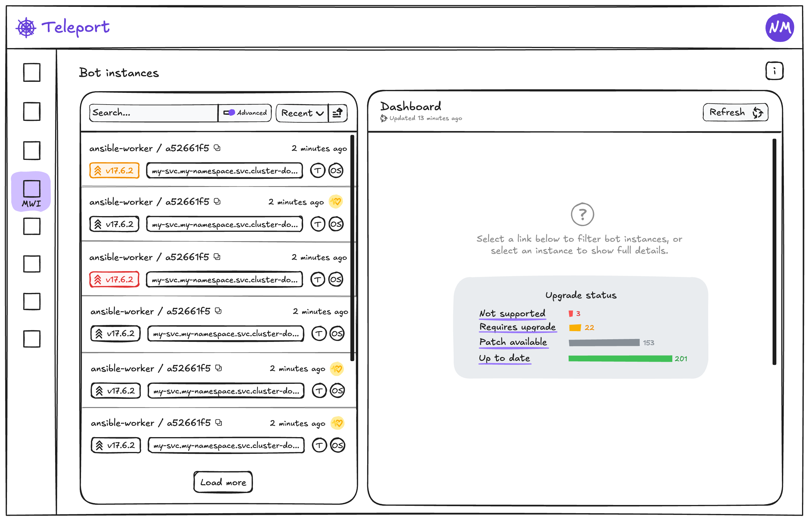
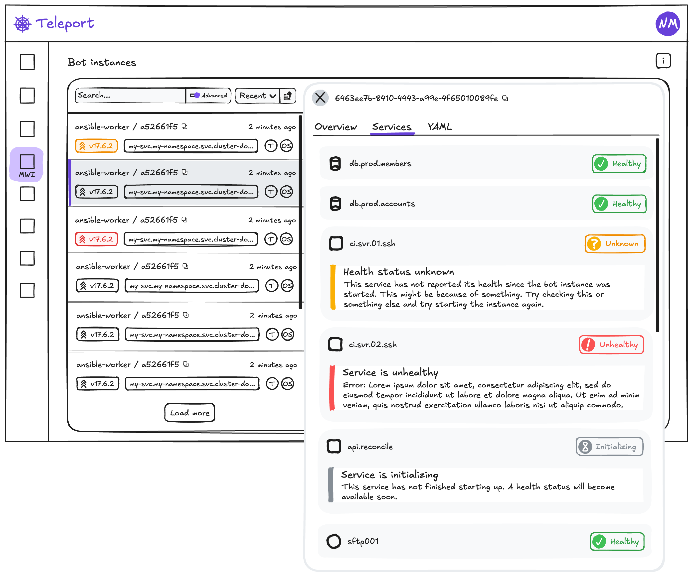

# RFD 0222 - Bot Instances at Scale

## Required Approvers

- Engineering: @strideynet
- Product: @thedevelopnik

# RFD 0222 - Bot Instances at Scale

# What

Machine ID bots allow non-human users to access resources in a Teleport cluster. They are useful for automating tasks, such as CI/CD runners, monitoring systems, and running scripts. The bot resource encapsulates a bot's access rights and roles. The `tbot` binary is used to start an instance of a bot and enrol it with the cluster (using a join token). When `tbot` starts and receives its credentials, a bot instance record is created in the cluster. Bot instance records expire when their credentials expire. Bot instances can be long-running processes which periodically renew their credentials, or short-lived, ephemeral processes which are created and destroyed on demand. Many instances of the same bot can exist at once, and clusters can have many bot instances. `tbot` periodically sends heartbeats which contain info such as uptime, hostname, tbot version and join method. Heartbeats are stored as part of the bot instance resource, and are limited to the 10 most recent.

Today, the highest number of active bot instances is around 550 across 40 bots with most being long-running workloads. In general, 95% of Teleport clusters have fewer than 50 bot instances.

This proposal seeks to address the pain points of deploying and maintaining a large fleet of Machine ID bots. It will focus solely on the Day 1 experience, and users are expected to be familiar with Teleport in general as well as the config and setup of their respective clusters. Day 0 tutorialization of setup steps and guided beginner scenarios are left to other initiatives.

# Why

As adoption of Machine & Workload ID increases, in part due to the drive to increase efficiency through automation as well as trends like Agentive AI, customers expect managing large fleets of bots to be simple and easy.

The current bot instance list in the Web UI is suitable for the today's usage and future expansion and is scalable in terms of performance, but does not cater for the UX challenge of scaling. Currently, bot instances are paginated, sorted by either recency (default) or bot name, and can be filtered by basic text search term.

It’s the responsibility of the **infrastructure security team** to own and manage the Teleport cluster and enrol protected resources. For teams which make extensive use of Machine ID, it has become cumbersome to manage many bots and bot instances. Where Dev/Dev Ops teams deploy bot instances themselves, it can be doubly difficult to coordinate upgrades and security initiatives.

# Details

## UX

### User Stories

**As a cluster owner (Infrastructure Security team), I want to know which Bot Instances, across all Bots, are blocking a safe cluster upgrade (major) due to their version.**

The upgrade process can vary depending on the flavour of Teleport in use (cloud, oss, etc), and how it’s deployed. A common step is to query for agents running a version which would become incompatible should an upgrade be done - using `tctl inventory ls --older-than=v18.0.0`. This command does not include bot instances, and `tctl bots instances ls` doesn’t return versions numbers for instances.

As such, it is a difficult task to identify bot instances that may be running an old version of `tbot`. This is especially difficult at scale. The current bot instance list available in the web UI allows filtering by version, although it’s a text search and it is not aware of semantic versioning - finding versions older than a given version is not possible.

A breakdown of active instance versions will make the process of monitoring the version status easy at a glance, as well as provide convenient links to filter the instance list for versions already one or more major versions behind the control plane (thereby preventing a safe upgrade). To facilitate this in the web UI, the filter will allow queries such as `older_than(version, "18.1.0")`. The instance list will also indicate the status of an instance’s most recent version (as up-to-date, upgrade available, patch available, or incompatible). For the CLI, the `query` flag can be used to filter instances (e.g. `tctl bots instances ls --query=older_than(version, "18.1.0")`).

**As a cluster owner (Infrastructure Security team), I want to know which Bot Instances, across all Bots, are running vulnerable versions.**

Currently in the web UI the instances list can be filtered by version, but this is a text search and it is not aware of semantic versioning. It’s possible to find a specific version number, but it’s not easy to isolate a range of versions, such as “>18 & <18.2.1”, which is likely required to find instances between a vulnerable and patched version.

To support this use-case, the filter for bot instances will support the predicate language and allow queries such as `version.between("18.1.0")`. This works though the web UI and the CLI (`tctl`).

**As a Bot Instance owner (Dev/Dev Ops team), I'd like help in understanding why my Bot Instance is not working properly.**

For somebody diagnosing an issue with `tbot`, they’re likely to have access to the `tbot` log output. Such as;

```
INFO [TBOT:IDENTITY] Fetched new bot identity identity:mwi-demo-aws-manager, id=5c6af2e6-13a4-48c1-855f-74d8b8e01d86 | valid: after=2025-08-21T12:10:15Z, before=2025-08-21T12:31:13Z, duration=20m58s | kind=tls, renewable=false, disallow-reissue=false, roles=[bot-mwi-demo-aws-manager], principals=[-teleport-internal-join], generation=1 tbot/service_bot_identity.go:224
```

This log entry contains the bot name (as `identity`) and the instance’s ID. The instance ID can be used to filter the instances list in the web UI, and should make finding the relevant instance easy. In the CLI (`tctl`), both the bot name and instance ID are required to perform the look-up; `tctl bots instances show [bot_name]/[instance_id]`.

Once found, in the web UI or CLI, the instance's details can be seen. Here a health status can be found for each `tbot` service (outputs, tunnels, etc), which includes failure info for those services which are unhealthy.

### Instances dashboard

This mock-up shows the bot instance page as it would be when first arriving at the page. No filters are set, so all instances are available in the list. Results are paginated, and the default sort order is by recency - instances with the most recent heartbeat are displayed first. Sorting can be toggled between ascending and descending, and the following sort fields are available; bot, recency, version, hostname. Filtering can be performed using a basic text search over supported fields, or an advanced search using the Teleport predicate language.

The right-hand half of the page displays the dashboard, which is a summary over all instances. The visualizations use aggregate data prepared and updated by the auth server. An indication of when the data current is provided, as well as a refresh button which retrieves the most recently available data. A selection of timeframes is also available.

The Upgrade Status visualization show a summary of all instances grouped by upgrade status; up-to-date, upgrade available, patch available, or incompatible. Status labels are selectable, and will populate the advanced search with the appropriate filter. For example, if the auth server is running v18 the filter will be populated with `older_than(version, "16.0.0")` when a user selects "not supported".



### Instance details
These mock-ups shows the state of the page once an item had been selected from the instances list by clicking it. The dashboard section is replaced by the selected instance's details.

The overview tab is displayed by default when an instance is selected. It shows further information about the instance, the join token that was used to enrol, and a summary of service health.


The services tab shows a list of all configured services (or outputs). Each includes it's name, type and health status. If there is extra health info available (such as and error message), this is also displayed.



The YAML tab show the raw resource as readonly YAML.


### tctl bots instances ls --search [term] --query [tql]

The list bot instances command will include extra information about each instance; version and health status. A search term (`--search` flag) or advanced query (`--query` flag) can be used to filter the results. All instances are displayed, by fetching all available pages.

```diff
- ID                                         Join Method Hostname      Joined               Last Seen            Generation
- ------------------------------------------ ----------- ------------- -------------------- -------------------- ----------
- bot-1/d83b381d-b46c-4b92-a899-755991a6d0f5 iam         ip-10-0-15-34 2025-08-29T06:09:26Z 2025-09-01T12:49:26Z 237
-
+ ID                                         Join Method Version Hostname      Status    Last Seen
+ ------------------------------------------ ----------- ------- ------------- --------- --------------------
+ bot-1/d83b381d-b46c-4b92-a899-755991a6d0f5 iam         v18.2.1 ip-10-0-15-34 UNHEALTHY 2025-09-01T12:49:26Z
+
To view more information on a particular instance, run:

> /Users/example/.tsh/bin/tctl bots instances show [id]
```

### tctl bots instances show [id]

The show bot instance command gives an overall health summary as well as a listing of services and their respective health status.

```diff
Bot: w2w-demo-app-bot
ID:  d83b381d-b46c-4b92-a899-755991a6d0f5
+ Status: UNHEALTHY

Initial Authentication:
  Authenticated At: 2025-08-29T06:09:26Z
  Join Method:      iam
  Join Token:       w2w-demo-web-bot
  Join Metadata:    meta:{join_token_name:"w2w-demo-web-bot" join_method:"iam"} iam:{account:"668558765449" arn:"arn:aws:sts::668558765449:assumed-role/MWIw2wDemoInstance/i-0b7667843950debfd"}
  Generation:       1
  Public Key:       <178 bytes>

Latest Authentication:
  Authenticated At: 2025-09-01T12:49:26Z
  Join Method:      iam
  Join Token:       w2w-demo-web-bot
  Join Metadata:    meta:{join_token_name:"w2w-demo-web-bot" join_method:"iam"} iam:{account:"668558765449" arn:"arn:aws:sts::668558765449:assumed-role/MWIw2wDemoInstance/i-0b7667843950debfd"}
  Generation:       237
  Public Key:       <178 bytes>

Latest Heartbeat:
  Recorded At:  2025-09-01T12:39:26Z
  Is Startup:   false
  Version:      18.1.5
  Hostname:     ip-10-0-15-34
  Uptime:       78h30m0.539099441s
  Join Method:  iam
  One Shot:     false
  Architecture: arm64
  OS:           linux
+
+ Service status:
+ Status    Name        Type                Reason         Updated At
+ --------- ----------- ------------------- -------------- --------------------
+ UNHEALTHY prod-aws-01 X509-output-service out of bananas 2025-09-01T12:49:26Z

To view a full, machine-readable record including past heartbeats and authentication records, run:
> /Users/example/.tsh/bin/tctl get bot_instance/w2w-demo-app-bot/d83b381d-b46c-4b92-a899-755991a6d0f5

To onboard a new instance for this bot, run:
> /Users/example/.tsh/bin/tctl bots instances add w2w-demo-app-bot
```

### Predicate language for instance filters

The predicate language will be used to provide advanced filtering for instances. The filter query will be applied in the same way the existing filters work, and no changes to indexes are required. As items are read out of the backend storage, they are filtered one by one until the page size is reached or the end of the list. For a narrow filter, many or even all records will be scanned - this inefficiency is mitigated by the in-memory caching layer's performance.

Instance-specific functions will be supported by implementing a custom `typical.ParserSpec`;

| Function       | Purpose                                                                                                                                                     | Example                                                                         |
| -------------- | ----------------------------------------------------------------------------------------------------------------------------------------------------------- | ------------------------------------------------------------------------------- |
| **older_than** | Find instances running versions less than a given version - based on the most recent heartbeat                                                              | `older_than(version, "18.1.0")` or `version.older_than("18.1.0")`               |
| **between**    | Find instances running versions between a vulnerable version and a fix version - based on the most recent heartbeat. Inclusive of from and exclusive of to. | `between(version, "18.0.0", "18.1.0")` or `version.between("18.0.0", "18.1.0")` |

## Service/Output health

Service health records for each configured `tbot` service/output will be sent with each heartbeat. These records are stored within the bot instance resource alongside heartbeats and authentications.

Each service record includes the name of the configured service or output, a timestamp, it's health status (such as healthy, unhealthy, initializing or unknown), a timestamp, and an optional reason which may include an error message or stack trace.

Any values included which are user-provided or dynamically generated based on errors or external state (namely the configured name and reason fields) will be limited in length to prevent uncapped data submissions.

## Data aggregation

To power the Upgrade Status section of the bot instance dashboard, we will pre-aggregate the following metrics; number of instances per version. Metrics will be stored in memory.

As these metrics are intended to provide a rough overview of fleet health, and do not need to be strictly up-to-date, we will recalculate them on a timer (e.g. every 10 minutes). This is simpler, and in many cases likely more efficient than updating them incrementally by consuming the event stream.

To avoid the need to "elect" a leader to calculate these metrics, each auth server instance will calculate them independently. Users therefore may see the numbers change if they refresh the dashboard, but this is an acceptable trade-off.

## Data fields and expected quantities

| Field                 | Description                                                                                  | Example                                       | Quantity                         | Limitations                                                                                   |
| --------------------- | -------------------------------------------------------------------------------------------- | --------------------------------------------- | -------------------------------- | --------------------------------------------------------------------------------------------- |
| Bot                   | A collection of roles and access assumed by `tbot` using a join token                        |                                               | 0-40+ per cluster                |                                                                                               |
| Bot instance          | A unique joined instance of `tbot` in either a long-running or ephemeral environment         |                                               | 1-15+ per bot                    |                                                                                               |
| Authentication record | Created for each join or renewal                                                             |                                               | 0-10 per instance (max enforced) |                                                                                               |
| Instance heartbeat    | Self-reported by each bot instance                                                           |                                               | 0-10 per instance (max enforced) | Data is **not** validated by the auth server, and cannot be used for making access decisions. |
| Service health        | An independent, internal part of `tbot`. Generally maps 1:1 with configured outputs/tunnels. | `application-tunnel`, `workload-identity-api` | 1-30 per instance (max enforced) |                                                                                               |
| OS                    | Operating system from `runtime.GOOS`                                                         | linux, windows or darwin                      | Once per heartbeat               |                                                                                               |
| Version               | Version of `tbot`                                                                            | 18.1.0                                        | Once per heartbeat               |                                                                                               |
| Hostname              |                                                                                              |                                               | Once per heartbeat               |                                                                                               |
| Uptime                | How long `tbot` has been running                                                             |                                               | Once per heartbeat               |                                                                                               |
| Join token name       |                                                                                              |                                               | Once per auth                    |                                                                                               |
| Join method           |                                                                                              | github, iam, kubernetes                       | Once per auth                    |                                                                                               |
| Join attributes       | Metadata specific to a join method                                                           | GitHub repository name                        | Once per auth                    |                                                                                               |
| Health status         |                                                                                              | INITIALIZING, HEALTHY, UNHEALTHY, UNKNOWN     | Once per service health          |                                                                                               |

## Resource storage (backend)

This proposal adds service health to bot instances. Service health scales with the number of services/outputs `tbot` is configured with. It doesn't make sense to limit the number of service records, as this would no longer provide a complete picture of the instance. As such, if there are more configured services than a maximum, then `tbot` will send none and raise a warning the the logs. Service health records for an instance will be cleared when the instance starts-up (denoted by the heartbeat field `is_startup`). Service health records will be stored as part of an instance's state, alongside heartbeats and authentications. Service health records may be used for filtering the list of bot instance in the web UI and CLI in the future, and so will remain local to the instance itself.

To mitigate the risk of service degradation related to storing and serving additional data as part of `tbot` heartbeats (service health), the auth server will respect an environment variable which will disable the ingestion of this additional data.

```
TELEPORT_DISABLE_TBOT_HEARTBEAT_EXTRAS=true|false teleport start
```

While `tbot` will continue to send the extra heartbeat data, and it will continue to be relayed by proxies, the auth server will discard it. The UI and CLI will not be aware of this configuration and will simply receive no service health data when requesting bot instance/s and display an empty state.

## Proto changes

### RPC: `SubmitHeartbeat()`

```protobuf
// BotInstanceService provides functions to record and manage bot instances.
service BotInstanceService {
  // SubmitHeartbeat submits a heartbeat for a BotInstance.
  rpc SubmitHeartbeat(SubmitHeartbeatRequest) returns (SubmitHeartbeatResponse);
}

// The request for SubmitHeartbeat.
message SubmitHeartbeatRequest {
  // The heartbeat data to submit.
  BotInstanceStatusHeartbeat heartbeat = 1;

  // The health of the services/output `tbot` is running.
  repeated BotInstanceServiceHealth service_health = 2;
}
```

### Bot instance

```protobuf
// BotInstanceStatus holds the status of a BotInstance.
message BotInstanceStatus {
  // ...[snip]...

  // The health of the services/output `tbot` is running.
  repeated BotInstanceServiceHealth service_health = 6;
}
```

### Bot instance heartbeat

```protobuf
message BotInstanceStatusHeartbeat {
  // ...[snip]...

  // Kind identifies whether the bot is running in the tbot binary or embedded
  // in another component.
  BotKind kind = 12;
}

// BotKind identifies whether the bot is the tbot binary or embedded in another
// component.
enum BotKind {
  // The enum zero-value, it means no kind was included.
  BOT_KIND_UNSET = 0;

  // Means the bot is running the tbot binary.
  BOT_KIND_TBOT_BINARY = 1;

  // Means the bot is running inside the Teleport Terraform provider.
  BOT_KIND_TERRAFORM_PROVIDER = 2;

  // Means the bot is running inside the Teleport Kubernetes operator.
  BOT_KIND_KUBERNETES_OPERATOR = 3;
}
```

### Bot instance service health

```protobuf
// BotInstanceServiceHealth is a snapshot of a `tbot` service's health.
message BotInstanceServiceHealth {
  // Service identifies the service.
  BotInstanceServiceIdentifier service = 1;

  // Status describes the service's healthiness.
  BotInstanceHealthStatus status = 2;

  // Reason is a human-readable explanation for the service's status. It might
  // include an error message.
  optional string reason = 3;

  // UpdatedAt is the time at which the service's health last changed.
  google.protobuf.Timestamp updated_at = 4;
}

// BotInstanceServiceIdentifier uniquely identifies a `tbot` service.
message BotInstanceServiceIdentifier {
  // Type of service (e.g. database-tunnel, ssh-multiplexer).
  string type = 1;

  // Name of the service, either given by the user or auto-generated.
  string name = 2;
}

// BotInstanceHealthStatus describes the healthiness of a `tbot` service.
enum BotInstanceHealthStatus {
  // The enum zero-value, it means no status was included.
  BOT_INSTANCE_HEALTH_STATUS_UNSPECIFIED = 0;

  // Means the service is still "starting up" and hasn't reported its status.
  BOT_INSTANCE_HEALTH_STATUS_INITIALIZING = 1;

  // Means the service is healthy and ready to serve traffic, or it has
  // recently succeeded in generating an output.
  BOT_INSTANCE_HEALTH_STATUS_HEALTHY = 2;

  // Means the service is failing to serve traffic or generate output.
  BOT_INSTANCE_HEALTH_STATUS_UNHEALTHY = 3;
}
```

### RPC: `BotInstanceMetrics()`
```protobuf
// BotInstanceService provides functions to record and manage bot instances.
service BotInstanceService {
  rpc BotInstanceMetrics(BotInstanceMetricsRequest) returns (BotInstanceMetricsResponse);
}

// The request for BotInstanceMetrics.
message BotInstanceMetricsRequest {
  // Empty
}

// The response from BotInstanceMetrics, containing pre-aggregated metrics about tbot version usage etc.
message BotInstanceMetricsResponse {
  // The time at which the metrics were last re-calculated.
  google.protobuf.Timestamp updated_at = 1;

  // The number of instances of `tbot` broken down by version number.
  map<string, int64> count_by_version = 2;
}
```
## Web API

| Endpoint                                                                 | Description                                                                                                                                                                                                                       |
| ------------------------------------------------------------------------ | --------------------------------------------------------------------------------------------------------------------------------------------------------------------------------------------------------------------------------- |
| **GET /v2/webapi/sites/:site/machine-id/bot-instance**                   | A new version of an existing endpoint with a `query` parameter added to accept a string query in the Teleport predicate language (e.g. `older_than(version, 18.1)`) which is used to filter returned instances.                   |
| **GET /v2/webapi/sites/:site/machine-id/bot/:name/bot-instance/:id**     | A new version of an existing endpoint which includes the new fields on bot instance (such as service health).                                                                                                                     |
| **GET /webapi/:site/machine-id/bot-instance/dashboard**                  | A new endpoint to return summary data for bot instances. The result will contain multiple named datasets (one for each supported visualization). A “last updated at” timestamp will be included to give users a sense of recency. |

## Privacy and Security

The proposed changes are mainly capturing extra data and presenting it in the web UI and CLI. As such, there are not security and privacy concerns that need to be highlighted.

## Backward Compatibility

None of the proposed changes are backwards incompatible, nor are any migrations required. Older CLI clients will continue to function as they did, with any extra data being ignored. Older `tbot` versions will continue to be supported, but will not submit service health - the absence of this data will be supported by the web UI and CLI clients as well as the APIs they interact with.

Where V2 versions of a webapi are added, the following backwards compatibility behaviour applies; In the situation where a new web client sends a request to an old proxy (in a load balanced setup), the old proxy will not host the new endpoint and will return a 404 and the proxy’s version. A helpful message is then displayed to the user advising that the proxy needs to be upgraded to support the operation.

## Test Plan

Addition after a Machine ID bot is created and an instance enrolled: "In the UI, a single Bot Instance record shows, with a heartbeat and an authentication record." and "In the CLI, using `tctl bot instance show [bot name]/[instance id]`, a single Bot Instance record shows, with a heartbeat and an authentication record.".

# Delivery phases

## Phase 1

**tl;dr**: new instance UI, and version filters

**Backports**: v17 and v18

In this phase we’ll focus on the requirements to manage the versions of bot instances at scale. This includes filtering for instances running a version that prevents an upgrade, as well as instances running a compromised version.

The instances list from the bot details will be reused with minimal changes (except the addition of bot name), and the details view will simply house the full instance yaml (including auth records and heartbeats). This lays the UI foundation for the following phases.

The search field will get an ‘advanced’ mode where the Teleport predicate language can be used to filter items using semver-aware functions (such as `older_than` and `newer_than_or_equal`).

An additional sort, by version, will also be included.

## Phase 2

**tl;dr**: upgrades dashboard, and service-level health

**Backports**: v17 and v18

This phase adds a dashboard which will provide a high-level overview of the MWI estate, and is invaluable when dealing with a large fleet. This phase will provide the groundwork for data aggregation and reporting, and will pave the way for future visualizations.

A visual breakdown of instance upgrade status will be added to allow cluster maintainers to easily judge the number of instances with upgrades required/available, and to identify those instances.

Additionally, this phase focuses on the requirements of the dev/dev-ops teams, who deploy instances of `tbot`. It includes features that enable easy confirmation of `tbot` running correctly, as well as tools to help troubleshoot issues.

Giving users access to fine-grained health statuses (for each service/output) will help pinpoint areas where problems lie.
