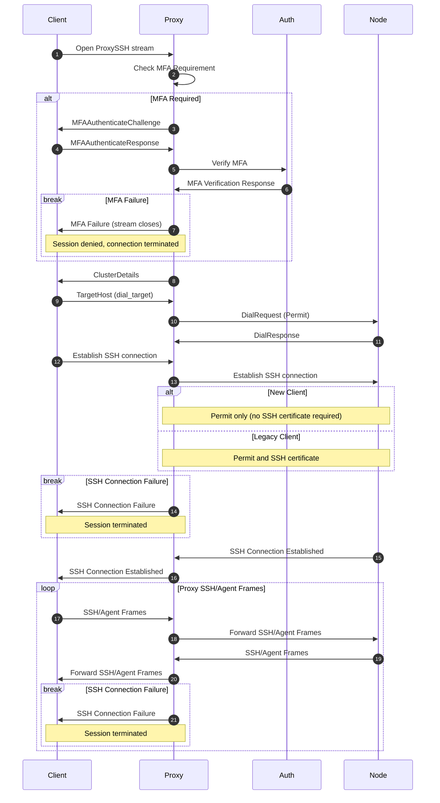

# RFD 0224 - In-Band MFA for SSH Sessions

## Required Approvers

- Engineering: @rosstimothy && @espadolini && @fspmarshall

## What

This RFD proposes centralizing SSH authentication and authorization at the Teleport Proxy service, integrating in-band
multi-factor authentication (MFA) into session establishment. The Proxy will leverage the [Access Control Decision API
(RFD 0024e)](https://github.com/gravitational/Teleport.e/blob/master/rfd/0024e-access-control-decision-api.md) to
consistently enforce policy decisions and MFA requirements for all SSH sessions.

## Why

In the current implementation, authentication and authorization decisions are handled by the Teleport Agent, which has
the following issues:

1. Per-session MFA enforcement flow is performed separately from session creation, which can introduce security gaps.
   For example, in [CVE-2025-49825](https://github.com/gravitational/Teleport/security/advisories/GHSA-8cqv-pj7f-pwpc),
   the MFA policy can be bypassed since an attacker had the ability to forge a certificate attesting that they had
   completed MFA and there was no proper binding between the certificate and the session.
1. Higher latency from multiple round trips between the Teleport Agent, Proxy service, and Auth service for
   authentication and policy decisions.
1. Decentralized access control logic in client code makes policy management and auditing more complex, requiring
   Teleport Agent updates for changes.

By centralizing these responsibilities at the Proxy, the new design directly addresses the above issues:

1. In-band MFA enforcement is tightly integrated with session creation, ensuring that authentication factors are
   directly bound to each session and mitigating the risk of bypasses like those seen in
   [CVE-2025-49825](https://github.com/gravitational/Teleport/security/advisories/GHSA-8cqv-pj7f-pwpc).
1. Latency is reduced by consolidating authentication and authorization flows at the Proxy, eliminating unnecessary
   communication between Teleport Agents and the Auth service.
1. Centralized access control simplifies and strengthens policy enforcement, removing the need to update the Teleport
   Agent for policy changes.

This centralized approach significantly enhances security, reduces latency, and simplifies management while maintaining
strict access controls.

## Details

### Non-Goals/Limitations

1. SSH session certificate renewal and revocation are out of scope. It is assumed that sessions will continue to follow
   the constraints as defined in [Per-session MFA (RFD 14)](0014-session-2FA.md).

### Overview

All SSH traffic destined for target nodes will be proxied through the Proxy service, which will handle authentication,
authorization, and session management. Direct SSH connections to nodes will deprecated and removed after the [transition
period](#backward-compatibility).

The Proxy service will leverage the [Access Control Decision API (RFD
0024e)](https://github.com/gravitational/Teleport.e/blob/master/rfd/0024e-access-control-decision-api.md), which
evaluates both per-role and global policy, to make consistent policy decisions for all SSH sessions. If any role or the
global policy requires session MFA, the Proxy will enforce MFA for the session, following the logic in [RFD
14](0014-session-2FA.md). Upon successful authentication and authorization, the Proxy will establish a connection to the
target Teleport Agent proxy the SSH traffic between the client and the node.

### UX

There will be no changes to the UX as a result of this proposal as all changes are internal to the Teleport
architecture.

### Security

While this proposal aims to strengthen security by centralizing SSH traffic and MFA enforcement at the Proxy, it does
introduce new potential risks, in addition to the risks raised in [Access Control Decision API (RFD
0024e)](https://github.com/gravitational/Teleport.e/blob/master/rfd/0024e-access-control-decision-api.md), of which it
builds upon. By moving the MFA ceremony to the Proxy, the attack surface shifts: the Proxy now becomes responsible for
securely initiating and verifying MFA challenges on behalf of clients. This requires exposing a new RPC on the Auth
service, which, if not properly secured, could be targeted for abuse (e.g., unauthorized invocation, replay attacks,
etc).

To mitigate these risks, the implementation must enforce strict authentication and authorization for the new RPC (only
the Proxy can invoke it), ensure robust rate limiting, and tightly bind MFA challenges and responses to the session
context. Additionally, careful auditing and monitoring of Proxy-initiated MFA flows will be necessary to detect and
respond to any anomalous activity. These changes should be reviewed in the context of the [Access Control Decision API
(RFD 0024e)](https://github.com/gravitational/Teleport.e/blob/master/rfd/0024e-access-control-decision-api.md), as the
overall security posture will depend on the correct and secure integration of these components.

### Proto Specification

A new service called `TransportServiceV2` will be introduced. `TransportServiceV2` will replace the existing
`TransportService`. The `ProxySSH` RPC of `TransportService` will be deprecated in favor of `TransportServiceV2`'s
`ProxySSH` RPC, which provides in-band MFA enforcement during SSH session establishment. The new RPC supports both
MFA-required and MFA-optional flows, allowing clients to dynamically handle MFA challenges as needed.

```proto
// api/proto/teleport/transport/v2/transport_service.proto

// TransportServiceV2 provides methods to proxy connections to various Teleport instances.
//
// All connections operate on top of a bidirectional stream which transports raw payloads from higher level protocols
// (i.e. SSH). This service supports in-band multi-factor authentication (MFA) enforcement. MFA challenges and
// responses are handled directly within the stream as part of the session establishment process. All RPCs support both
// MFA-required and MFA-optional flows, and the client determines if MFA is needed by inspecting the first response from
// the server. After any required MFA and the client's initial request, either side may freely send data in any order
// until the stream is terminated.
service TransportServiceV2 {
  // ProxySSH establishes an SSH connection to the target host over a bidirectional stream. Upon stream establishment,
  // the server will send an MFAAuthenticateChallenge as the first message if MFA is required. If MFA is not required,
  // the server will not send a challenge and the client can send the dial_target directly. All SSH and agent frames are
  // sent as raw bytes and are not interpreted by the proxy.
  rpc ProxySSH(stream ProxySSHRequest) returns (stream ProxySSHResponse);
}

message ProxySSHRequest {
  // Only one of these fields should be set per message.
  // - If MFA is required, client sends MFAAuthenticateResponse after receiving challenge.
  // - If MFA is not required, client sends dial_target directly.
  // - After connection is established, client sends SSH or agent frames as raw bytes.
  //
  // Validation: The server MUST validate that exactly one field in the oneof payload is set per message.
  // If zero or more than one field is set, the server MUST reject the message and terminate the stream with an error.
  oneof payload {
    MFAAuthenticateResponse mfa_response = 1; // Sent by client after receiving MFA challenge (if required)
    TargetHost dial_target = 2;              // Sent by client after successful MFA or if MFA is not required
    Frame ssh = 3;                           // SSH payload
    Frame agent = 4;                         // SSH Agent payload
  }
}

message ProxySSHResponse {
  // Only one of these fields will be set per message.
  // The first message from the server will be:
  // - MFAAuthenticateChallenge if MFA is required (client must respond with MFAAuthenticateResponse)
  // - ClusterDetails if MFA is not required (client can send dial_target immediately)
  // After MFA (or if not required), server sends ClusterDetails and then SSH/agent frames.
  oneof payload {
    MFAAuthenticateChallenge mfa_challenge = 1; // Sent by server as first message if MFA is required
    ClusterDetails details = 2;                 // Sent by server as first message if MFA is not required, and after MFA if required
    Frame ssh = 3;                              // SSH payload
    Frame agent = 4;                            // SSH Agent payload
  }
}
```

#### ProxySSH RPC

The `ProxySSH` RPC establishes a bidirectional stream for SSH session establishment with integrated MFA. When the stream
initializes, the server first checks if MFA is required for the session based on policy.

For sessions where MFA is required, the server begins by sending an MFA challenge as the initial message. The client
must then respond with valid authentication factors before proceeding further. The session can only continue after
successful MFA verification. If the MFA verification fails, the stream is immediately terminated. Similarly, any
connectivity issues with the authentication service result in the session being denied. See
[Per-session MFA (RFD 14)](0014-session-2FA.md) for more details on session termination.

In cases where MFA is optional, or after successful MFA verification, the server sends `ClusterDetails` to the client.
At this point, the client can proceed with their `DialTarget` request, and the server establishes an SSH connection with
the target node.

Once the connection is established, the server functions as a pure proxy, treating both SSH and Agent frames as opaque
raw bytes. No interpretation of the SSH protocol occurs - the frames are simply forwarded as-is. Both SSH and Agent
frames are multiplexed over the same stream. This architectural approach ensures in-band MFA enforcement while
maintaining the proxy's protocol-agnostic nature, which simplifies maintenance and allows for future extensibility.



### SSH Certificate

SSH certificates are not required in the new design except for backwards compatibility with legacy clients. They were
previously used to convey session metadata and enforce MFA at the Teleport Agent. With the new architecture, the Proxy
handles these responsibilities directly.

### Session Enforcement at the Control Plane

The implementation of this RFD will leverage work done in the [Relocate Phase of the Access Control Decision API (RFD
0024e)](https://github.com/gravitational/Teleport.e/blob/master/rfd/0024e-access-control-decision-api.md#relocate-phase)
(see [dependencies](#dependencies)).

The reverse tunnel and proxy peering protocols will have been updated to include the `Permit` from the Decision API
response, which includes relevant session metadata, to be forwarded from Proxy to agent as part of an incoming dial. The
target agent will parse the permit and validate the session context before allowing access to the underlying resource
(i.e., access-control decisions will be made at the control plane before establishing the connection). For backward
compatibility, if an older client is detected, the agent will also validate the SSH certificate as before.

### Backward Compatibility

#### Transition Period

The transition period will last at least 2 major releases to allow clients sufficient time for migration.

#### ProxySSH RPC Deprecation

The `TransportService` and its `ProxySSH` RPC will be deprecated but remain supported during the transition period. To
facilitate migration, any client invoking the deprecated `ProxySSH` RPC will receive a warning message indicating that
`ProxySSH` is deprecated and they will need to upgrade their client in order to continue using SSH features in a future
release.

After the transition period, the deprecated RPC will be removed and clients will be required to use the new
`TransportServiceV2` RPCs exclusively.

#### Direct Server SSH Access Deprecation

Direct SSH access to nodes will be supported during the transition period but will be removed afterwards. During the
transition period, any direct SSH connection attempts to nodes will receive a deprecation notice via the SSH banner
(pre-auth). This notice will inform users that direct SSH access is deprecated and will be removed in a future release,
advising them to use an updated client that connects via the Proxy.

### Audit Events

All audit events for SSH sessions established via in-band MFA will continue to include the MFA device UUID (under
`SessionMetadata.WithMFA`), as required by [Per-session MFA (RFD 14)](0014-session-2FA.md) and [RFD
15](0015-2fa-management.md).

### Observability

The `TransportServiceV2` will follow the established convention of using OpenTelemetry's auto-instrumentation, as this
is already implemented for `TransportService`. No changes to observability patterns are needed.

### Product Usage

No changes in product usage are expected since this is an internal change to an existing service.

### Test Plan

Since SSH access is an existing feature and is already covered in the test plan, no changes are required for the
existing tests.

However, a new test should be added to ensure backward compatibility with the deprecated `TransportService` RPCs. This
test should verify that clients using the old `ProxySSH` RPC can still establish SSH sessions during the transition
period and while receiving appropriate deprecation notices.

### Implementation

#### Dependencies

1. [Access Control Decision API (RFD
   0024e)](https://github.com/gravitational/Teleport.e/blob/master/rfd/0024e-access-control-decision-api.md) refactor
   and relocate implementation

#### Phase 1

1. Create `TransportServiceV2` in `api/proto/teleport/transport/v2/transport_service.proto`.
1. Generate `TransportServiceV2` Go code using `protoc`.
1. Implement `TransportServiceV2` in `lib/srv/transport/transportv2/`.
1. Deprecate `TransportService`'s `ProxySSH` RPC in `api/proto/teleport/transport/v1/transport_service.proto`.
1. Ensure server can handle clients using the deprecated `TransportService` RPCs, while supporting the new
   `TransportServiceV2` RPCs.
1. Update client/tsh code in `api/client/proxy/client.go` to use `TransportServiceV2`. Client should fallback to
   `TransportService` if `TransportServiceV2` is not available.
1. Update clients so they handle MFA challenges and responses as a part of the SSH session establishment process.
1. Add deprecation notices to SSH banner for clients connecting directly.
1. Add tests to verify backward compatibility with the deprecated `TransportService` RPCs.
1. Update documentation to reflect the new architecture and deprecation of direct node access.

#### Phase 2

1. Remove `TransportService`'s `ProxySSH` RPC.
1. Remove direct SSH connections to nodes.
1. Remove SSH certificate verification logic from the agent, as it is no longer required.
1. Update test plan to remove backward compatibility tests for the deprecated `TransportService` and SSH certificate
   handling.

## Future Considerations

1. Extend in-band MFA enforcement and session-bound certificate logic to additional protocols e.g., Kubernetes API
   requests, database connections, desktop access, etc.
