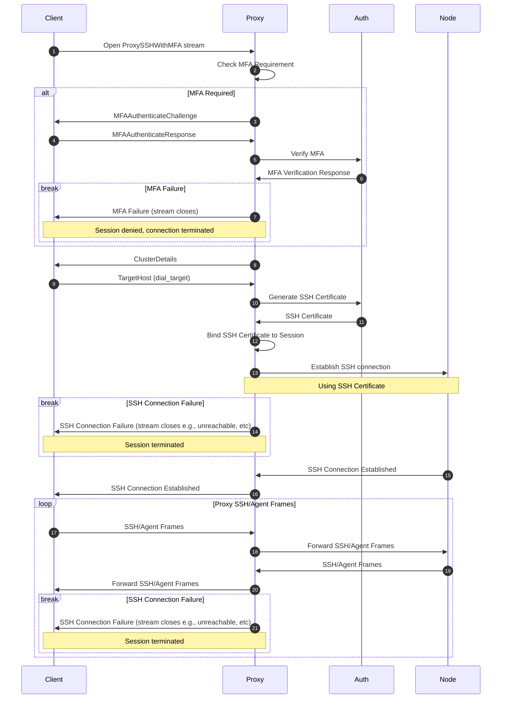

# RFD 0224 - In-Band MFA for SSH Sessions

## Required Approvers

- Engineering: @rosstimothy

TODO: Add more approvers

## What

This RFD proposes centralizing SSH authentication and authorization at the Teleport Proxy service, integrating in-band
multi-factor authentication (MFA) into session establishment. The Proxy will leverage the [Access Control Decision API
(RFD 0024e)](https://github.com/gravitational/Teleport.e/blob/master/rfd/0024e-access-control-decision-api.md) to
consistently enforce policy decisions and MFA requirements for all SSH sessions.

## Why

In the current implementation, authentication and authorization decisions are handled by the Teleport Agent, which has
the following issues:

1. Higher latency from multiple round trips between the Teleport Agent, Proxy service, and Auth service for
   authentication and policy decisions.
1. Complexity in managing and auditing access controls, since much of the logic currently resides in client code rather
   than being enforced server-side. This makes policy updates cumbersome, as changes require updating the Teleport
   Agent.
1. Per-session MFA is performed separately from session creation, which can introduce security gaps. For example, in
   [CVE-2025-49825](https://github.com/gravitational/Teleport/security/advisories/GHSA-8cqv-pj7f-pwpc), the MFA
   challenge was not properly tied to the session, allowing an attacker to bypass it if they forged a certificate
   attesting that they had completed MFA.

Relocating authentication and authorization decisions to the Teleport Proxy service will reduce the number of round
trips required for authentication and policy decisions. It will also enhance security by centralizing policy enforcement
at the proxy level, making it easier to manage and audit access controls. This change aligns with the overall goal of
simplifying the architecture and improving security for SSH access.

By centralizing these responsibilities at the Proxy, the new design directly addresses the above issues:

1. Latency is reduced by consolidating authentication and authorization flows at the Proxy, eliminating unnecessary
   communication between Teleport Agents and the Auth service.
1. Policy enforcement and auditing become simpler and more robust, as access controls are managed server-side and
   updates no longer require changes to Teleport Agents.
1. In-band MFA enforcement is tightly integrated with session creation, ensuring that authentication factors are
   directly bound to each session and mitigating the risk of bypasses like those seen in
   [CVE-2025-49825](https://github.com/gravitational/Teleport/security/advisories/GHSA-8cqv-pj7f-pwpc).

Overall, this approach streamlines SSH access, improves security posture, and simplifies operational management.

## Details

### Non-Goals/Limitations

1. SSH session certificate renewal and revocation are not in scope for this proposal. It is assumed that sessions will
   continue to be short-lived and re-established as needed.

### Overview

All SSH traffic destined for target nodes will be proxied through the Proxy service, which will handle authentication,
authorization, and session establishment. Direct SSH connections to nodes will no longer be allowed.

The Proxy service will leverage the [Access Control Decision API (RFD
0024e)](https://github.com/gravitational/Teleport.e/blob/master/rfd/0024e-access-control-decision-api.md) to make
consistent policy decisions for all SSH sessions. Upon successful authentication and authorization, the Proxy will
establish a connection to the target Teleport Agent using a session-bound SSH certificate and proxy the SSH traffic
between the client and the node.

The Proxy will treat SSH frames as opaque raw bytes, piping them between the client and the target node without being
SSH-aware. This design ensures that the Proxy does not need to interpret or modify SSH protocol details, but simply
forwards the data as received. Both SSH and SSH Agent frames are multiplexed over the stream as raw payloads, allowing
the Proxy to remain protocol-agnostic and simplifying future protocol support.

### UX

There will be no changes to the UX as a result of this proposal as all changes are internal to the Teleport
architecture.

### Security

This proposal introduces no new security risks. Centralizing SSH traffic through the Teleport Proxy strengthens policy
enforcement, improves monitoring, and reduces the attack surface by preventing direct Node access.

### Proto Specification

A new service called `TransportServiceV2` will be introduced. `TransportServiceV2` will include a new RPC called
`ProxySSHWithMFA`. `TransportServiceV2` will replace the existing `TransportService`. The `ProxySSH` RPC will be
deprecated in favor of `ProxySSHWithMFA`.

```proto
service TransportServiceV2 {
   // ProxySSHWithMFA establishes an SSH connection to the target host over a bidirectional stream.
   // Upon stream establishment, the server will send an MFAAuthenticateChallenge as the first message if MFA is required.
   // If MFA is not required, the server will not send a challenge and the client can send the dial_target directly.
   // This RPC supports both MFA-required and MFA-optional flows, and the client determines if MFA is needed by
   // inspecting the first response from the server.
   // All SSH and agent frames are sent as raw bytes and are not interpreted by the proxy.
   rpc ProxySSHWithMFA(stream ProxySSHWithMFARequest) returns (stream ProxySSHWithMFAResponse);
}

message ProxySSHWithMFARequest {
   // Only one of these fields should be set per message.
   // - If MFA is required, client sends MFAAuthenticateResponse after receiving challenge.
   // - If MFA is not required, client sends dial_target directly.
   // - After connection is established, client sends SSH or agent frames as raw bytes.
   oneof payload {
      MFAAuthenticateResponse mfa_response = 1; // Sent by client after receiving MFA challenge (if required)
      TargetHost dial_target = 2;              // Sent by client after successful MFA or if MFA is not required
      Frame ssh = 3;                           // SSH payload
      Frame agent = 4;                         // SSH Agent payload
   }
}

message ProxySSHWithMFAResponse {
   // Only one of these fields should be set per message.
   // The first message from the server will be:
   // - MFAAuthenticateChallenge if MFA is required (client must respond with MFAAuthenticateResponse)
   // - ClusterDetails if MFA is not required (client can send dial_target immediately)
   // After MFA (or if not required), server sends ClusterDetails and then SSH/agent frames.
   oneof payload {
      MFAAuthenticateChallenge mfa_challenge = 1; // Sent by server as first message if MFA is required
      ClusterDetails details = 2;                 // Sent by server as first message if MFA is not required, and after MFA if required
      Frame ssh = 3;                              // SSH payload
      Frame agent = 4;                            // SSH Agent payload
   }
}
```

#### ProxySSHWithMFA RPC

At the beginning of the bidirectional stream, the server will check if MFA is required for the session. If MFA is
required, the server will send a response to the client indicating the requirement and keep the stream open for the MFA
ceremony. The client must then provide the additional authentication factors. Only after successful MFA verification can
the client send the `DialTarget` request and establish the SSH connection.

This approach ensures that access to SSH resources cannot be granted with a client certificate alone and enforces
in-band MFA as part of session creation.


```mermaid
sequenceDiagram
   autoNumber

   participant Client
   participant Proxy
   participant Auth
   participant Node

   Client->>Proxy: Open ProxySSHWithMFA stream

   Proxy->>Proxy: Check MFA Requirement

   alt MFA Required
      Proxy->>Client: MFAAuthenticateChallenge
      Client->>Proxy: MFAAuthenticateResponse
      Proxy->>Auth: Verify MFA
      Auth->>Proxy: MFA Verification Response

      break MFA Failure
         Proxy->>Client: MFA Failure (stream closes)
         Note over Client,Proxy: Session denied, connection terminated
      end
   end

   Proxy->>Client: ClusterDetails
   Client->>Proxy: TargetHost (dial_target)

   Proxy->>Auth: Generate SSH Certificate
   Auth->>Proxy: SSH Certificate
   Proxy->>Proxy: Bind SSH Certificate to Session

   Proxy->>Node: Establish SSH connection
   Note over Proxy,Node: Using SSH Certificate
   break SSH Connection Failure
      Proxy->>Client: SSH Connection Failure (stream closes e.g., unreachable, etc)
      Note over Client,Proxy: Session terminated
   end

   Node->>Proxy: SSH Connection Established
   Proxy->>Client: SSH Connection Established

   loop Proxy SSH/Agent Frames
      Client->>Proxy: SSH/Agent Frames
      Proxy->>Node: Forward SSH/Agent Frames
      Node->>Proxy: SSH/Agent Frames
      Proxy->>Client: Forward SSH/Agent Frames

      break SSH Connection Failure
         Proxy->>Client: SSH Connection Failure (stream closes e.g., unreachable, etc)
         Note over Client,Proxy: Session terminated
      end
   end
```

### Backward Compatibility

The existing `TransportService` and its `ProxySSH` RPC will be deprecated but remain functional to support clients
during the transition period. After the transition period, clients will be required to use the new `TransportServiceV2`
RPCs exclusively. The transition period will last at least 2 major releases.

### Audit Events

No changes to audit events are required as part of this proposal since the existing audit events already capture
relevant information.

### Observability

The `TransportServiceV2` will be instrumented using OpenTelemetry's auto-instrumentation, as already implemented in the
server-side codebase. This enables distributed tracing and monitoring of transport operations for improved
observability.

### Product Usage

No changes in product usage are expected since this is an internal change to an existing service.

### Test Plan

Since SSH access is an existing feature and is already covered in the test plan, no changes are required for the
existing tests.

A new test should be added to ensure backward compatibility with the deprecated `TransportService` RPCs. This test
should verify that clients using the old `ProxySSH` RPC can still establish SSH sessions during the transition period
and receive appropriate deprecation notices.

### Implementation

#### Assumptions

1. Decision service is implemented and available.

#### Phase 1

1. Create `TransportServiceV2` in `api/proto/teleport/transport/v2/transport_service.proto`.
1. Deprecate `TransportService`'s `ProxySSH` RPC in `api/proto/teleport/transport/v1/transport_service.proto`.
1. Implement `TransportServiceV2` in `lib/srv/transport/transportv2/`.
1. Ensure server can handle clients using the deprecated `TransportService` RPCs.
1. Ensure server/node can pin a SSH certificate to a user session.
1. Update client code in `api/client/proxy/client.go` to use `TransportServiceV2`. Client should fallback to
   `TransportService` if `TransportServiceV2` is not available.
1. Update clients so they handle MFA challenges and responses as a part of the SSH session establishment process.
1. Remove the ability to establish direct SSH connections to nodes.

#### Phase 2

1. Delete `TransportService`'s `ProxySSH` RPC after the migration to `TransportServiceV2` is complete.
1. Update test plan to remove tests for the deprecated `TransportService`.

## Future Considerations

1. Propagate architecture changes to the other features e.g. Desktop, Database, etc.
