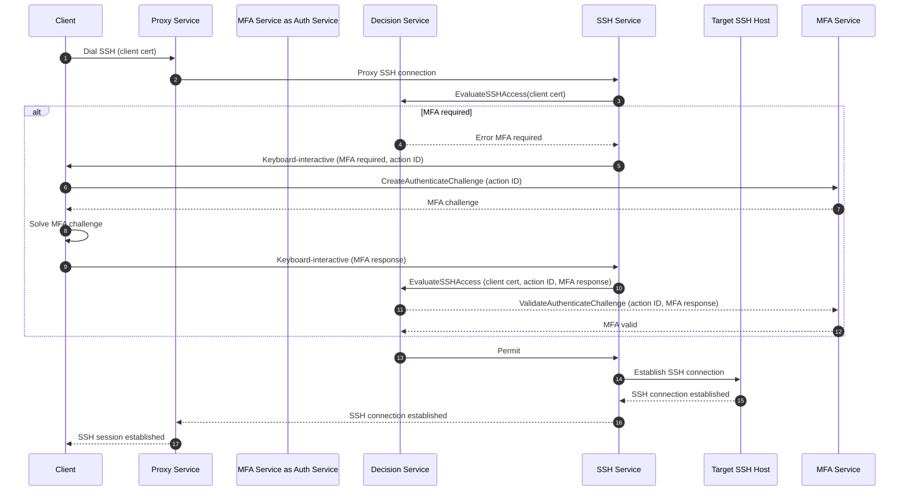

# RFD 0225 - In-Band MFA for SSH Sessions

## Required Approvers

- Engineering: @rosstimothy && @espadolini && @fspmarshall
- Product: @klizhentas
- Security: @rob-picard-teleport

## What

This RFD proposes integrating in-band multi-factor authentication (MFA) into SSH session establishment with the Teleport
SSH service. This change aims to enhance security by ensuring that MFA checks are tightly coupled with session creation,
reducing client complexity, and eliminating the need for per-session MFA SSH certificates.

## Why

Teleport’s current approach to per-session MFA enforcement for SSH access has several architectural and security
shortcomings that this proposal aims to address:

1. Per-session MFA enforcement flow is performed separately from session creation (i.e., out-of-band), which can
   introduce security gaps. For example, in
   [CVE-2025-49825](https://github.com/gravitational/Teleport/security/advisories/GHSA-8cqv-pj7f-pwpc), the MFA
   enforcement policy can be bypassed since an attacker had the ability to forge a certificate attesting that they had
   completed MFA and there was no proper binding between the certificate and the session.
1. MFA complexity is concentrated on the client versus the server. The client is responsible for determining MFA
   requirements, generating an MFA challenge, requesting a per-session MFA certificate and finally dialing a target host
   with the per-session MFA certificate. This complexity increases the risk of implementation errors and inconsistencies
   across different clients (e.g., `tsh`, web terminal, Teleport Connect, etc.).
1. A per-session MFA certificate is a single credential, representing multiple factors of authentication for a user. If
   an attacker were to gain possession, it could be used to bypass all forms of authentication checks, including MFA.

By moving MFA enforcement to the SSH service during session establishment, this new design directly addresses the above
issues by:

1. MFA enforcement is tightly integrated with session creation (i.e., in-band), ensuring that authentication factors are
   directly bound to each session and mitigating the risk of bypasses like those seen in
   [CVE-2025-49825](https://github.com/gravitational/Teleport/security/advisories/GHSA-8cqv-pj7f-pwpc).
1. MFA complexity is moved from clients to the SSH service, so clients only need to connect to the SSH service and
   resolve an MFA challenge only if required, streamlining the session establishment process and reducing the risk of
   implementation errors.
1. Per-session MFA certificates can be completely removed, eliminating a single credential representing multiple factors
   of authentication.

In summary, this RFD proposes a more secure and streamlined approach to MFA enforcement for SSH sessions by integrating
MFA checks directly into the session establishment process, reducing client complexity, and eliminating the need for
per-session MFA certificates.

## Details

### UX

No changes to the UX as all changes are internal to the architecture.

### High-Level Flow

The client will first dial its target SSH host using the Proxy address and its standard Teleport client certificate. The
Proxy will then resolve the target cluster and host, and open a connection to the target host's respective cluster
hosting the SSH service.

The SSH service will authenticate the client using the provided client certificate and evaluate if MFA is required for
the session by invoking the `EvaluateSSHAccess` RPC of the Decision service. If MFA is not required, the
`EvaluateSSHAccess` RPC will return a permit and the SSH service can then proceed to establish the SSH session.

If MFA is required, the Decision service will respond with an error indicating that MFA is needed. The SSH service will
then respond via the keyboard-interactive SSH channel to inform the client that MFA is needed. The first question will
be a protobuf encoded message containing a unique action ID and other relevant metadata. The client must then invoke the
`CreateAuthenticateChallenge` RPC in the new `MFAService`, providing the action ID along with existing request metadata.
The client must solve the MFA challenge and respond to the SSH service with a `MFAAuthenticateResponse` message via the
kept open keyboard-interactive channel to proceed with the SSH session establishment.

Once the MFA challenge response is received, the SSH service will invoke the `EvaluateSSHAccess` RPC again with the
action ID and the MFA challenge response. If the second `EvaluateSSHAccess` RPC confirms that MFA has been satisfied, a
permit is returned and the SSH service will proceed to establish the SSH session with the target host.



### Security

In addition to the risks raised in [Access Control Decision API (RFD
0024e)](https://github.com/gravitational/Teleport.e/blob/master/rfd/0024e-access-control-decision-api.md), there are a
few risks specific to this RFD.

#### Replay Attacks

MFA challenge responses could potentially be captured and replayed by an attacker to gain unauthorized access. Although
this risk has already existed with the previous design using per-session MFA SSH certificates, it is important to
address it in the new design as well.

To mitigate this risk, the following measures will be implemented:

1. Each MFA challenge will include a unique action identifier that ties the challenge to a specific user action.
1. The Auth service will maintain a record of issued challenges and their associated action IDs. Once a challenge has
   been successfully completed or expired, it will be invalidated and cannot be reused.

### Privacy

No changes to privacy are expected.

### Proto Specification

#### Decision Service

The Decision service will be updated to support evaluating SSH access requests with MFA challenge responses. This
follows the existing pattern in Teleport where RPCs accept MFA challenge responses as part of a request to indicate that
MFA has been satisfied and the RPC service must validate the response before granting access.

If the `mfa_response` field is not present, the Decision service will evaluate if MFA is required for the request based
on the user's MFA configuration and the access control policies. If MFA is required, an error indicating that MFA is
required will be returned (e.g., `services.ErrSessionMFARequired`) and access will be denied.

```proto
// EvaluateSSHAccessRequest describes a request to evaluate whether or not a
// given ssh access attempt should be permitted.
message EvaluateSSHAccessRequest {
  // ... existing fields ...

  // MFAAuthenticateResponse is an optional field that contains the MFA challenge response
  // provided by the user. If present, the service must validate the response
  // before granting access.
  MFAAuthenticateResponse mfa_response = 6;
}
```

#### Auth Service

TODO: Add new `MFAService` instead of extending legacy `AuthService`?

The messages for `CreateAuthenticateChallenge` will be updated to include an optional `action_id` field to associate the
MFA challenge with a specific user action. The `action_id` can be used for other Teleport features, not just SSH access.
The service must store the `action_id` along with the MFA challenge so that when the client responds with the MFA
challenge response, it can be correlated with the original challenge.

A new RPC `ValidateAuthenticateChallenge` will be added to validate the MFA challenge response provided by the user.
This RPC will accept the `action_id` and the `MFAAuthenticateResponse` as parameters. The service must verify that the
response matches the original challenge associated with the `action_id` and that the challenge has not expired or been
previously used.

```proto
// ChallengeScope is a scope authorized by an MFA challenge resolution.
enum ChallengeScope {
  // ... existing fields ...

  // CHALLENGE_SCOPE_ACTION indicates that the challenge is tied to a specific user action.
  // The action must be satisfied to proceed with the action.
  CHALLENGE_SCOPE_ACTION = 9;
}

// ChallengeExtensions contains MFA challenge extensions used by Teleport
// during MFA authentication.
message ChallengeExtensions {
  // ... existing fields ...

  // action_id is an optional field that associates the MFA challenge with a specific user action.
  // If provided, the challenge will be tied to the action and must be satisfied to proceed with the action.
  string action_id = 4;
}

// AuthService is authentication/authorization service implementation
service AuthService {
  // ... existing RPCs ...

  // ValidateAuthenticateChallenge validates the MFA challenge response provided by the user.
  rpc ValidateAuthenticateChallenge(ValidateAuthenticateChallengeRequest) returns (ValidateAuthenticateChallengeResponse);
}

message ValidateAuthenticateChallengeRequest {
  // mfa_response contains the MFA challenge response provided by the user.
  MFAAuthenticateResponse mfa_response = 1;

  // user is the username of the user attempting to authenticate.
  string user = 2;

  // ChallengeExtensions are extensions that will be apply to the issued MFA challenge.
  // Required, except for v15 clients and older.
  teleport.mfa.v1.ChallengeExtensions ChallengeExtensions = 3;

    // action_id is an optional unique identifier associated with the MFA challenge.
  // If provided, it ties the response to a specific user action.
  string action_id = 4;
}

message ValidateAuthenticateChallengeResponse {
  // valid indicates whether the MFA challenge response is valid.
  bool valid = 1;
}
```

### Per-session MFA SSH Certificates

Per-session MFA SSH certificates are not required in the new design except for backwards compatibility with legacy
clients and agents. They were previously used to convey session metadata and enforce MFA at the agents. Support for
per-session MFA SSH certificates will initially be retained during the transition period to ensure backwards
compatibility with existing clients and agents (see [Backwards Compatibility](#backwards-compatibility)).

### Backwards Compatibility

#### Transition Period

The transition period will last at least 2 major releases to allow clients sufficient time for migration.

#### SSH Service

The SSH service will continue to support per-session MFA SSH certificate verification during the transition period to
ensure compatibility with clients that have not yet migrated. The SSH service will check for the presence of a
per-session MFA SSH certificate. If present, it will validate the certificate as before. If not present, it will proceed
with the in-band MFA flow as described in this RFD.

After the transition period, the per-session MFA SSH certificate verification logic will be removed and agents will no
longer accept per-session MFA SSH certificates.

### Audit Events

No changes to audit events are needed.

### Observability

No changes to observability patterns are needed.

### Product Usage

No changes in product usage are expected since this is an internal change.

### Test Plan

No changes are needed for existing SSH access tests. Since this RFD does not change the UX, existing end-to-end tests
for `tsh ssh`, `tsh vnet`, and web terminal will continue to provide coverage.

### Implementation

#### Dependencies

The following are assumed to be completed before starting work on this RFD:

1. [Access Control Decision API (RFD
   0024e)](https://github.com/gravitational/Teleport.e/blob/master/rfd/0024e-access-control-decision-api.md) refactor
   and relocate implementation
   1. Decision service has a way for deriving user/session metadata from incoming requests without relying on client
      certificates.
   1. There exists a structured way to determine if MFA is required for a given SSH session based on the Decision API
      response.

#### Phase 1 (Transition Period - at least 2 major releases)

TODO

#### Phase 2 (Post Transition Period - after at least 2 major releases)

TODO

## Alternatives Considered

1. Proxy/Relay facilitates the entire MFA ceremony: In this approach, the Proxy/Relay would handle the entire MFA flow,
   including creating the MFA challenge and validating the response. While this would still simplify the client-side
   implementation, it would potentially introduce security risks by giving Proxy/Relay access to operations that are out
   of its domain scope.
1. A new version of `TransportService` is introduced to handle in-band MFA: This approach would involve creating a new
   service specifically for handling in-band MFA at the control plane level. While this would separate concerns and keep
   the MFA logic isolated, it would add complexity to the architecture and require significant changes to existing
   services.

## Future Considerations

1. Extend in-band MFA enforcement to additional protocols e.g., Kubernetes API requests, database connections, desktop
   access, etc.
