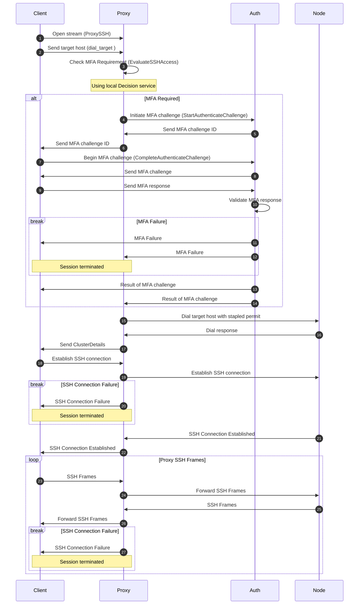

# RFD 0225 - In-Band MFA for SSH Sessions

## Required Approvers

- Engineering: @rosstimothy && @espadolini && @fspmarshall
- Product: @klizhentas
- Security: @rob-picard-teleport

## What

This RFD proposes centralizing SSH authentication and authorization at the Proxy service, integrating in-band
multi-factor authentication (MFA) into session establishment. The Proxy will leverage the [Access Control Decision API
(RFD 0024e)](https://github.com/gravitational/Teleport.e/blob/master/rfd/0024e-access-control-decision-api.md), a v2
`TransportService` and a new [MFA service](#mfa-service) to consistently enforce policy decisions and MFA requirements
for all SSH sessions.

## Why

Teleport’s current approach to SSH session MFA enforcement has several architectural and security shortcomings that this
proposal aims to address:

1. Per-session MFA enforcement flow is performed separately from session creation (i.e., out-of-band), which can
   introduce security gaps. For example, in
   [CVE-2025-49825](https://github.com/gravitational/Teleport/security/advisories/GHSA-8cqv-pj7f-pwpc), the MFA
   enforcement policy can be bypassed since an attacker had the ability to forge a certificate attesting that they had
   completed MFA and there was no proper binding between the certificate and the session.
1. Clients are responsible for determining MFA requirements and establishing a separate connection to the Auth service
   to complete the MFA ceremony, increasing implementation complexity and the risk of errors.
1. Decentralized access control logic in clients makes policy management and auditing more complex, requiring Teleport
   Agent updates for new changes to the access control policies.

By centralizing these responsibilities at the Proxy, the new design directly addresses the above issues:

1. In-band MFA enforcement is tightly integrated with session creation, ensuring that authentication factors are
   directly bound to each session and mitigating the risk of bypasses like those seen in
   [CVE-2025-49825](https://github.com/gravitational/Teleport/security/advisories/GHSA-8cqv-pj7f-pwpc).
1. MFA complexity is moved from clients to the Proxy, so clients only need to connect to the Proxy and resolve an MFA
   challenge only if required, streamlining the session establishment process and reducing the risk of implementation
   errors.
1. Centralized access control simplifies and strengthens policy enforcement, removing the need to update the Teleport
   client for policy changes.

In summary, centralizing authentication, authorization, and MFA enforcement at the Proxy eliminates critical security
gaps, reduces client-side complexity, and enables more robust, auditable, and maintainable access control. This approach
ensures that every SSH session is consistently protected by the latest policies and MFA requirements, improving both
security and operational efficiency across the Teleport platform.

## Details

### UX

No changes to the UX as all changes are internal to the architecture.

### High-Level Flow

The client first invokes the `ProxySSH` RPC in the [TransportService](#transport-service-v2) to establish an SSH session
with the Proxy. The client sends the target host as the first message in the stream. The Proxy evaluates if MFA is
required for the session by invoking the `EvaluateSSHAccess` RPC in the Decision service.

For sessions where MFA is required, the server begins by sending an MFA challenge ID as the initial message. The
`ProxySSH` stream is then paused, and the client must invoke the [MFA service's](#mfa-service)
`CompleteAuthenticateChallenge` RPC with the challenge ID and complete the challenge. Once the client completes the MFA
challenge, the `TransportService` will receive the pass/fail result and `ProxySSH` will unblock and proceed accordingly.

If MFA verification fails, or if the client does not complete the challenge within the specified time frame (e.g., 5
minutes), the stream is terminated and an `AccessDeniedError` is returned. If there are connectivity issues with Proxy
or Auth, an `InternalServerError` is returned. See [Per-session MFA (RFD 14)](0014-session-2FA.md) for details.

In cases where MFA is not required, or after successful MFA verification, the server sends `ClusterDetails` to the
client. The client can then proceed to send SSH frames over the established stream. The Proxy forwards these frames to
the target host, and the target host's responses are relayed back to the client.



### Security

In addition to the risks raised in [Access Control Decision API (RFD
0024e)](https://github.com/gravitational/Teleport.e/blob/master/rfd/0024e-access-control-decision-api.md), there are a
few risks specific to this RFD.

Since new RPCs are being introduced, there are a few new risks:

1. Unauthorized access to the new RPCs could allow attackers to bypass MFA enforcement or impersonate users.
1. An attacker could exploit an unfinished MFA challenge, potentially allowing unauthorized access.
1. An attacker could attempt to flood the system with MFA challenge requests, leading to denial-of-service conditions.
1. An attacker could attempt to downgrade the connection to use the legacy v1 `TransportService` RPCs, which may have
   weaker security controls.

To mitigate these risks, the following measures will be implemented.

#### Unauthorized Access Mitigation

Each RPC introduced in this RFD will enforce strict authorization:

- `ProxySSH` (v2): Maintains the same authentication and authorization checks as the existing v1 RPC. Only authenticated
  clients with valid credentials and appropriate permissions can initiate SSH sessions.
- `StartAuthenticateChallenge`: Only the Proxy service is permitted to invoke this RPC, allowing it to initiate MFA
  challenges on behalf of users. Direct user access to this RPC will be denied.
- `CompleteAuthenticateChallenge`: Only the user for whom the MFA challenge was created is authorized to complete it.
  The service verifies the user's identity and ensures that only the intended recipient can respond to the challenge.

#### Unfinished MFA Challenge Mitigation

MFA challenges initiated by the Proxy must be completed within a specified time frame (e.g., 5 minutes). If the client
fails to do so, the session will be terminated. This limits the window of opportunity for an attacker to exploit an
unfinished MFA challenge.

#### Denial-of-Service Mitigation

MFA challenge creation will be rate-limited per user to prevent abuse. This limits the ability of an attacker to flood
the system with MFA challenge requests.

#### Connection Downgrade Mitigation

System administrators will have the ability to disable support for the legacy v1 `TransportService` RPCs on the Proxy.
This prevents clients from downgrading to the older protocol with weaker security controls.

### Privacy

No changes to privacy are expected.

### Proto Specification

#### Transport Service v2

A new version of `TransportService` will be introduced. `TransportService` v2 will replace the existing
`TransportService` in the v1 package. The `ProxySSH` RPC of the v1 `TransportService` will be deprecated in favor of the
v2 package's `TransportService`'s `ProxySSH` RPC, which provides in-band MFA enforcement during SSH session
establishment. The new RPC supports both MFA-required and MFA-optional flows, allowing clients to dynamically handle MFA
challenges as needed.

During the [transition period](#transition-period), clients can fallback to the v1 `TransportService` if the v2 service
is not available or if the client does not yet support the v2 service.

```proto
// TransportService provides methods to proxy connections to various Teleport instances.
//
// All connections operate on top of a bidirectional stream which transports raw payloads from higher level protocols
// (i.e. SSH). All RPCs support both MFA-required and MFA-optional flows.
service TransportService {
  // ProxySSH establishes an SSH connection to the target host over a bidirectional stream. Upon stream establishment,
  // the client must send a TargetHost (dial_target) as the first message. The server will then evaluate if MFA is
  // required for the requested target. If MFA is required, the server will send a challenge ID as the next message.
  // The client must then complete the MFA challenge with the MFA service in order to continue. If MFA is not required,
  // the server will send ClusterDetails and the client can proceed to send SSH frames. All SSH and
  // are sent as raw bytes and are not interpreted by the server.
  rpc ProxySSH(stream ProxySSHRequest) returns (stream ProxySSHResponse);
}

message ProxySSHRequest {
  // Only one of these fields should be set per message:
  // - Client must send dial_target as the first message.
  // - Once ClusterDetails are received by the client, the client can send SSH frames.
  oneof payload {
    // Sent by client as the first message
    TargetHost dial_target = 1;
    // SSH payload
    Frame ssh = 2;
  }
}

message ProxySSHResponse {
  // Only one of these fields will be set per message:
  // The first message from the server will be:
  // - challenge_id if MFA is required.
  // - ClusterDetails if the MFA challenge is not required.
  // After MFA (or if not required), server sends ClusterDetails and then SSH frames.
  oneof payload {
    // Sent by server if MFA is required
    string challenge_id = 1;
    // Sent by server if MFA is not required, and after MFA if required
    ClusterDetails details = 2;
    // SSH payload
    Frame ssh = 3;
  }
}
```

#### MFA Service

A new MFA service will be introduced to handle MFA challenges and responses instead of continuing to introduce new RPCs
to the legacy AuthService. Existing MFA related RPCs in the Auth service can eventually be migrated to this new MFA
service in a future effort.

```proto
// MFAService is responsible for handling MFA challenges and responses.
service MFAService {
  // StartAuthenticateChallenge initiates an MFA challenge for a user and blocks until the challenge is resolved.
  // The first message from the server will always be a unique challenge ID that the client must use to complete the
  // challenge. Once the MFA challenge is successfully resolved, a response is returned with the result. If the
  // challenge fails, an error is returned.
  rpc StartAuthenticateChallenge(StartAuthenticateChallengeRequest) returns (stream StartAuthenticateChallengeResponse);

  // CompleteAuthenticateChallenge is invoked by the user's client to complete the MFA challenge using the challenge ID
  // provided by StartAuthenticateChallenge. The client must first send the challenge ID and then the server will
  // respond with the MFA challenge. The client must send the MFA response and the server will validate it. The caller
  // of StartAuthenticateChallenge is notified of the result of the MFA challenge.
  rpc CompleteAuthenticateChallenge(stream CompleteAuthenticateChallengeRequest) returns (stream CompleteAuthenticateChallengeResponse);
}

// Request to start an MFA challenge.
message StartAuthenticateChallengeRequest {
  // User for whom the challenge is being initiated.
  string user = 1;
  // challenge_extensions are extensions that will be applied to the issued MFA challenge.
  ChallengeExtensions challenge_extensions = 2;
  // sso_client_redirect_url should be supplied if the client supports SSO MFA checks. If unset, the server will only
  // return non-SSO challenges.
  string sso_client_redirect_url = 3;
  // proxy_address is the proxy address that the user is using to connect to the Proxy. When using SSO MFA, this address
  // is required to determine which URL to redirect the user to when there are multiple options.
  string proxy_address = 4;
}

// Response containing the details of the MFA challenge.
message StartAuthenticateChallengeResponse {
  one of data {
    // Unique challenge ID for the MFA challenge.
    string challenge_id = 1;
    // Final response indicating the result of the MFA challenge.
    bool success = 2;
  }
}

// Request to complete an MFA challenge.
message CompleteAuthenticateChallengeRequest {
  one of data {
    // Unique identifier for the MFA challenge session.
    string challenge_id = 1;
    // MFA response from the client (e.g., OTP, WebAuthn assertion).
    MFAAuthenticateResponse response = 2;
  }
}

// Response indicating the result of the MFA challenge.
message CompleteAuthenticateChallengeResponse {
  one of data {
    // The MFA challenge to be presented to the user.
    MFAAuthenticateChallenge challenge = 1;
  }
}
```

### Teleport Connect and VNet

Since Teleport Connect and the VNet implementation uses the same client libraries as `tsh`, it will be updated to use
the new v2 `TransportService` and `MFAService` for SSH sessions. The per-session MFA SSH certificate generation will be
removed, and the standard client certificate will be used when dialing. Teleport Connect and VNet will fallback to the
v1 `TransportService` if the v2 service is not available.

### Web Terminal

The web terminal does not use the `TransportService` and establishes SSH connections via a different mechanism so it
does not need to be updated to use the new v2 `TransportService`. Instead, it relies on web-based authentication flows
and the Teleport API to manage user sessions and MFA challenges.

However, the web terminal client will be updated to use the `MFAService` for completing MFA challenges as part of the
SSH session establishment process. The per-session MFA SSH certificate generation will be removed, and the standard
client certificate will be used when dialing.

### Per-session MFA SSH Certificates

Per-session MFA SSH certificates are not required in the new design except for backwards compatibility with legacy
clients. They were previously used to convey session metadata and enforce MFA at the Teleport Agent. With the new
architecture, the Proxy and Auth service handle these responsibilities directly. Support for per-session MFA SSH
certificates via `ProxySSH` RPC will initially be retained during the transition period to ensure backward compatibility
with existing clients (see [Backward Compatibility](#backward-compatibility)).

### Session Enforcement at the Control Plane

The implementation of this RFD will leverage work done in the [Relocate Phase of the Access Control Decision API (RFD
0024e)](https://github.com/gravitational/Teleport.e/blob/master/rfd/0024e-access-control-decision-api.md#relocate-phase)
(see [dependencies](#dependencies)).

The reverse tunnel and proxy peering protocols will have to be updated to include the `Permit` from the Decision API
response, which includes relevant session metadata, to be forwarded from Proxy to agent as part of an incoming dial. The
target agent will parse the permit and validate the session context before allowing access to the underlying resource
(i.e., access-control decisions will be made at the control plane before establishing the connection). For backward
compatibility, if a legacy v1 client is detected, the agent will continue to validate the SSH certificate.

### Relay Service

For simplicity, this RFD takes a Proxy centric approach to the design. However, the same principles can be applied to
the Relay service to enable in-band MFA enforcement for SSH sessions established via a Relay. The Relay would need to be
updated to support the v2 `TransportService` and invoke the MFA service as needed, similar to the Proxy. Additionally,
it would need to be authorized to invoke the Decision service's `EvaluateSSHAccess` RPC and MFA service's
`StartAuthenticateChallenge` RPC.

### Backward Compatibility

#### Transition Period

The transition period will last at least 2 major releases to allow clients sufficient time for migration.

#### ProxySSH RPC Deprecation

The `ProxySSH` RPC in the v1 `TransportService` will be deprecated but remain available during the transition period to
ensure backward compatibility. Clients using the deprecated `ProxySSH` RPC will receive a warning message indicating
that this RPC is deprecated and will be removed in a future release. Users will be advised to upgrade their clients to
use the new v2 `TransportService` RPCs to maintain access to SSH features.

After the transition period, support for the deprecated `ProxySSH` RPC will be removed, and only the new v2
`TransportService` RPCs will be supported.

### Audit Events

All MFA challenge initiations, completions, failures, and session establishments will be logged with metadata, including
fields such as `SessionMetadata.WithMFA` to indicate whether MFA was enforced for the session, `user`, `device UUID`,
`challenge ID`, and timestamps. This logging approach follows the conventions established in [RFD 0014 - Session
2FA](0014-session-2FA.md) and [RFD 0024e - Access Control Decision
API](https://github.com/gravitational/Teleport.e/blob/master/rfd/0024e-access-control-decision-api.md).

### Observability

The `TransportService` in the v2 package and the `MFAService` will follow the established convention of using
OpenTelemetry's auto-instrumentation, as this is already implemented for the v1 `TransportService`. No changes to
observability patterns are needed.

### Product Usage

No changes in product usage are expected since this is an internal change.

### Test Plan

#### Existing Tests

No changes are needed for existing SSH access tests. Since this RFD does not change the UX, existing end-to-end tests
for `tsh ssh`, `tsh vnet`, and web terminal will continue to function as before.

#### New Tests

1. Add tests to check backward compatibility: verify that clients using the old `ProxySSH` RPC can still connect during
   the transition period and receive deprecation warnings.
1. Add an integration test to confirm that if a user does not finish the MFA challenge within the allowed time (for
   example, 5 minutes), the session is closed automatically.

### Implementation

#### Dependencies

The following are assumed to be completed before starting work on this RFD:

1. [Access Control Decision API (RFD
   0024e)](https://github.com/gravitational/Teleport.e/blob/master/rfd/0024e-access-control-decision-api.md) refactor
   and relocate implementation
   1. Decision service has a way for deriving user/session metadata from incoming requests without relying on client
      certificates.
   1. Proxy is able to evaluate SSH access requests using the Decision service.
   1. Reverse tunnel and proxy peering protocols are updated to include the `Permit` from the Decision API response to
      be forwarded from Proxy to agent as part of an incoming dial.
   1. There exists a structured way for the Proxy to determine if MFA is required for a given SSH session based on the
      Decision API response.
   1. The Proxy has a way to tell Decision service that MFA has been satisfied for a session.

#### Phase 1 (Transition Period - at least 2 major releases)

1. Create `TransportService` in `api/proto/teleport/transport/v2/transport_service.proto`.
1. Generate `TransportService` Go code using `protoc`.
1. Implement the v2 `TransportService` in `lib/srv/transport/transportv2/`.
1. Deprecate the v1 `TransportService`'s `ProxySSH` RPC in `api/proto/teleport/transport/v1/transport_service.proto`.
1. Ensure server can handle clients using the deprecated v1 `TransportService` RPCs, while supporting the new v2
   `TransportService` RPCs.
1. Add new `MFAService` in `api/proto/teleport/mfa/v1/mfa_service.proto` and implement the service in `lib/auth/mfa/`.
1. Ensure Proxy is authorized to invoke the new `MFAService` RPCs and the `EvaluateSSHAccess` RPC.
1. Update `tsh ssh` client to use the v2 `TransportService` and `MFAService`. Remove per-session MFA certificate
   generation and use standard client certificate when dialing. Client should fallback to the v1 `TransportService` if
   the v2 service is not available.
1. Update `tsh vnet` client to use the v2 `TransportService` and `MFAService`. Remove per-session MFA certificate
   generation and use standard client certificate when dialing. Client should fallback to the v1 `TransportService` if
   the v2 service is not available.
1. Update web terminal client to use the `MFAService`. Remove per-session MFA certificate generation and use standard
   client certificate when dialing. Client should fallback to the v1 `TransportService` if the v2 service is not
   available.
1. Add tests to verify backward compatibility with the deprecated v1 `TransportService` RPCs.
1. Update documentation to reflect the new architecture.
1. Implement `TransportService` v2 support in the Relay service.

#### Phase 2 (Post Transition Period - after at least 2 major releases)

1. Remove v1 `TransportService`'s `ProxySSH` RPC. Remove all related backward compatibility code.
1. Remove per-session MFA SSH certificate verification logic.
1. Remove per-session MFA SSH certificate generation.
1. Update test plan to remove backward compatibility tests for the deprecated `TransportService` and SSH certificate
   handling.

## Alternatives Considered

1. Proxy facilitates the entire MFA ceremony: In this approach, the Proxy would handle the entire MFA flow, including
   creating the MFA challenge and validating the response. While this would still simplify the client-side
   implementation, it would potentially introduce security risks by giving Proxy access to operations that are out of
   its domain scope.

## Future Considerations

1. Extend in-band MFA enforcement to additional protocols e.g., Kubernetes API requests, database connections, desktop
   access, etc.
1. Migrate MFA related RPCs in the Auth service to the new `MFAService`.
1. Unify all clients (tsh, web, etc.) to use the same `MFAService` RPCs for MFA enforcement, reducing code duplication
   and simplifying maintenance. For example, we can follow the pattern as established by [Headless
   Authentication](/rfd/0105-headless-authentication.md) and replace all client-specific MFA handling with the Web UI +
   `MFAService` integration i.e., users will complete all MFA challenges through the Web UI.
