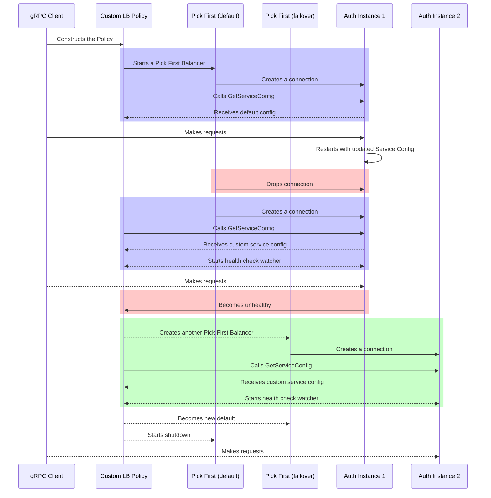

# 0226 - Stranded Connection Recovery

## What
Explore improvements to how Teleport responds to failure scenarios with a focus
on moving connections and requests away from unhealthy services and towards healthy services.

## Why

We’ve identified several failure scenarios where agents can become temporarily
unreachable or unavailable. This risks disrupting customer access. While Teleport
has mechanisms to recover in many cases, there are still gaps where recovery is
slow or requires manual intervention.

Improving reconnect behavior in these scenarios will increase availability and
provide a better customer experience when failures inevitably occur.

## Details

### Current State of Failure Recovery

When a Teleport control plane component (Auth or Proxy) becomes unhealthy, the
agents connected to that component may become unavailable. Recovery in this
situation depends entirely on the specific service instance recovering. There is
no automated mechanism for agents to detect the failure and reconnect elsewhere.
While this may be acceptable in simple deployments, for environments that require
high availability it can result in service interruptions that should be handled
automatically.

Both Auth and Proxy services are considered unhealthy when they are unable to
heartbeat to the backend. When either service is unhealthy it should be taken
out of rotation from service load balancers.

Agents connected to an unhealthy auth service cannot send heartbeats and will
eventually expire from the backend. This makes them undiscoverable and unreachable
by the rest of the cluster.

Agents connected to an unhealthy Proxy service may or may not be available. Proxy
health only reflects an inability to write to the backend, not whether the Proxy
can continue serving agent connectivity. Unhealthy Proxies may still be connected
to and reachable by other Proxy instances.

### Desired State of Failure Recovery

Teleport should automatically detect when control plane components become unhealthy
and recover without manual intervention. Agents should be able to seamlessly
reconnect to healthy services to minimize downtime and prevent situations where
they remain stranded due to single service instance failures.

For Proxy services, ideally we would distinguish between heartbeat failures and
true agent connectivity failures to avoid unnecessary agent reconnects. However
reliably determining whether a Proxy can still service agent connectivity is complex.
As a pragmatic approach, we can base recovery decisions solely on the existing
heartbeat health mechanism.

### Auth Reconnects

#### Health Checking
Agents create a gRPC client connection to Auth. The transport of this connection
could be a direct TCP connection to Auth or a tunneled connection through the
Proxy. The solution should be indifferent to the transport.

We can communicate the health of the Auth instance an agent is connected to using
gRPC health checking[^1]. This is a standardized service API that gRPC servers can implement. Clients that enable health checking can then poll or stream the health
of the service.

This solves half the problem. Agents can enable health checking and can be aware
of when they are connected to an unhealthy Auth service. However the client will
not automatically reconnect in this scenario. Within gRPC client connections are
maintained by load balancing policies[^2].

#### Exploring Client Load Balancing Policies

Evaluating the default `pick_first` policy. It will only create a new connection
when the existing TCP connection is disrupted. When health checking is enabled
the client begins failing requests immediately rather than sending them to the
server but never attempts to reconnect.

Evaluating the `round_robin` policy, a connection is created to each address that
was returned by the resolver. This policy is able to send requests to healthy
connections based on health checks. However this assumes that each address represents
a unique server instance. This is not usually the case. Teleport is typically fronted by one or more layers of load balancers. This means there could be
a single address or connecting to multiple addresses could result in connections
to the same server instance.

In summary, neither the `pick_first` or the `round_robin` load balancing policies
will work for our use case. Other built-in policies are available but they also
do not meet our use case[^3].

#### Defining a Custom Policy Behavior

The solution here is to implement our own load balancing policy. The go-grpc library
conveniently allows you to register custom policies[^2] by implementing the
balancer interface[^4].

Our policy will be called `teleport_pick_healthy`.

The balancer will behave exactly like a `pick_first`balancer by default. It will
do this by wrapping a `pick_first`balancer.

Once the `pick_first` balancer establishes a connection we will make a `GetServiceConfig`
request as defined in the section on [Policy Configuration Discovery](#policy-configuration-discovery)
for more details.

Then based on this response we will enable the following behavior:

1. Use the gRPC health checking API to determine if a connection is connected
to an unhealthy service.

2. Create a new connection if the current connection is unhealthy.

3. Shutdown an unhealthy connection when a healthy connection is established.

It does this by managing underlying `pick_first` balancers and routing requests
based on service health.

The diagram below shows an example of how a client changes behavior over time.

Initially the client receives the default configuration so it continues to behave
like a `pick_first` balancer.
Then after the auth server is restarted it reconnects and discovers a new configuration.
Then it begins health checking and is able to reconnect when the service becomes
unhealthy.



There are a few edge cases for managing RPCs and creating new connections that
are worth calling out. 

1. What do we do with RPCs when we have no healthy connections? RPCs will be sent
over unhealthy connections. This is already what happens with the default
`pick_first` policy. This is important since an unhealthy service may still be able
to handle some RPCs that would otherwise fail immediately client side.

2. What do we do with long running streaming RPCs when shutting down an unhealthy
connection? These will continue over the unhealthy connection until the stream
is closed.

3. What if the old connection becomes healthy again? If the old connection becomes
healthy before we're able to establish a new healthy connection we will stop
attempting new connections and continue using that old connection. Otherwise it
will be shutdown.

#### Policy Configuration Discovery

We will implement a gRPC endpoint which will allow for discovering
new load balancing policies via the connected auth server. This endpoint will be
called immediately after connecting.

For now we will only support reconfiguring the running load balancer policy but
in the future we may choose to support switching between multiple load balance
policies.

A JSON representation of the policy can be configured on an auth server by setting
the environment variable `TELEPORT_UNSTABLE_GRPC_CLIENT_LB_POLICY` to the JSON.
When not specified the configuration will use a default configuration which will
behave exactly like the `pick_first` balancer policy used today.

The default config will use the generated code directly but the JSON
representation is used here for the sake of comparison.


```json
{
    "grpc_client_lb_policy": {
        "loadBalancingConfig": [{"teleport_pick_healthy": {
          "mode": "pick_first",
        }}]
    }
}
```

Config to enable reconnect behavior:

```json
{
    "grpc_client_lb_policy": {
        "loadBalancingConfig": [{"teleport_pick_healthy": {
          "mode": "reconnect",
        }}],
        "healthCheckConfig": {
            "serviceName": ""
        }
    }
}
```

This configuration is then exposed by the service defined below for discovery.

```proto
// ServiceConfigDiscoveryService provides the RPC for clients to discover the
// desired load balancing configuration for a service.
service ServiceConfigDiscoveryService {
  // GetServiceConfig returns the current load balancing configuration for a client.
  // Clients call this on initially connection and do no expect the configuration
  // to change over the lifetime of that connection.
  rpc GetServiceConfig(GetServiceConfigRequest) returns (GetServiceConfigResponse);
}
```

```proto
// DiscoverRequest is the request used by grpc clients to discover a services 
// desired grpc service configuration.
message GetServiceConfigRequest {
}

// DiscoverResponse returns the desired client-side grpc service configuration.
message GetServiceConfigResponse {
  // ServiceConfig contains all grpc-service configuration.
  ServiceConfig config = 1;
}


// ServiceConfig contains all grpc-service configuration.
message ServiceConfig {
  // Each entry represents a different load balance strategy ordered
  // by priority. A client should use the first supported configuration.
  repeated LoadBalancerConfig load_balancing_config = 1;

  HealthCheckConfig health_check_config = 2;
}

// LoadBalancerConfig contains one of the supported load balancing policy
// configurations.
message LoadBalancerConfig {
    oneof config {
      TeleportPickHealthyConfig teleport_pick_healthy = 1;
  }
}

// TeleportPickHealthyConfig represents the teleport_pick_health load balancing
// policy.
message TeleportPickHealthyConfig {
  string mode = 1;
}

// HealthCheckConfig represents a gRPC clients health check configuration.
message HealthCheckConfig {
  // Service name to use in the health-checking request.
  string service_name = 1;
}
```

### Proxy Reconnects

#### Background on Reverse Tunnels

The agent connections we are concerned with for Proxy reconnects are the
reverse tunnel connections. These provide user connectivity to the agent. 
They are long-lived connections that only disconnect when the Proxy 
service itself shuts down or the underlying TCP connection is disrupted.

The reconnect procedure must be graceful as to not disrupt any existing user
connectivity to the agent and it should not decrease agent availability in the process.

Today Proxies will eventually be seen as unhealthy after a Proxy expires from the
backend and the agent tracker's default Proxy expiry is exceeded.

This can take ~13 minutes based on the Proxy ServerAnnounceTTL = 10 minutes and
the tracker.DefaultProxyExpiry = 3 minutes. To put this into perspective this is
roughly equal to the quarterly downtime budget when targeting `99.99` availability.

#### Proposed Improvements

We will continue to use the reverse tunnel server's Proxy discovery requests to communicate Proxy health.

To speed up this process we will support configuring a lower `ServerAnnounceTTL`.

The environment variables `TELEPORT_UNSTABLE_AUTH_ANNOUNCE_TTL` and `TELEPORT_UNSTABLE_PROXY_ANNOUNCE_TTL`
will be used to configure the heartbeat interval used by Teleport auth and proxy services
respectively. We can use these to configure more frequent Proxy and Auth heartbeats
to reduce the time to detect unhealthy instances.

These values will be used by proxy and auth services in place of the `ServerAnnounceTTL`
for configuring the services heartbeat. So if you configure this to be `1m` the 
services resource will be set to expire 1 minute from the time of the last heartbeat
and the heartbeat will be sent at an interval of `1 minute/2 + utils.RandomDuration(1 minute/10)`.

We will also add a `TTL` field to Proxy discovery requests. Agents can
than use this field in favor of the `DefaultProxyExpiry` when its present to expire
proxies from their tracker.

```diff
type Proxy struct {
	Version  string `json:"version"`
	Metadata struct {
		Name string `json:"name"`
	} `json:"metadata"`

	ProxyGroupID         string        `json:"gid,omitempty"`
	ProxyGroupGeneration uint64        `json:"ggen,omitempty"`
+   TTL                  time.Duration `json:"ttl,omitempty"`
}
```

The `TTL` used in discovery requests will be set based on the announce TTL configured
on the proxy sending the discovery request.

Increasing the TTL across a fleet of proxy servers leaves a window where agents
may view newer proxies as expired between their heartbeat intervals.

The behavior results in a suboptimal rollout where an agent may not connect to a
newer proxy generation before the older generation is terminated.

We are accepting this behavior as preventing it adds complexity, the chances of it
occurring are low, and the impact is minimal.

#### Reducing Discovery Request Traffic

Lowering the heartbeat interval for Proxy servers has the negative effect of
increasing the traffic created by Proxy discovery requests.

We can reduce the overall traffic created by Proxy discovery requests by changing
the behavior.

The new behavior will send proxy discovery requests when a Proxy heartbeat is received.
Multiple proxies may be sent in a single discovery request if multiple heartbeats are
received before the proxy is able to send the discovery request. In either case
only the subset of proxies that have heartbeated since the last discovery request
will be sent.

The first discovery request will always contain the full list of unexpired Proxy
servers.

Proxy heartbeats will be detected by looking for changes in the `server.Expiry()`
value when events are received by the `ProxyWatcher *services.GenericWatcher[types.Server, readonly.Server]`.

This behavior is backwards compatible with existing agent Proxy tracking.

If one of the Agents reverse tunnels is connected to an expired Proxy. The agent will
begin creating new connections attempting to reach a non-expired Proxy.

#### Closing Connections

Today the agent never closes reverse tunnel connections. This can lead to more reverse tunnel connections open than expected when proxies become unhealthy and recover. 
To solve this agents will close reverse tunnels based on their configured
desired connection count.

Connections will only be closed if the Proxy is expired or there are excess connections to the desired Proxy set. This avoids disconnecting from proxies during a rollout. We will only consider closing connections after exceeding these conditions for 30 to 60 minutes to mitigate the chances of an agent becoming unreachable.

Enabling agent disconnects will be done through the `ClusterNetworkingConfig.GracefulTunnelClosing: true`. This config is used today to push other changes to agents like the reverse tunnel connection count so adding an additional field is straight forward.

### Additional Thoughts and Considerations

#### Auth HTTP Clients
HTTP client connections to auth need to be handled during failures.

There was discussion on whether we should migrate all auth http endpoints to gRPC
then focus on solving failover for gRPC alone.

To make a decision on this we've taken inventory of the existing auth http endpoints.

We can see there are 19 http endpoints. 15 of which are still in use.

Migrating these would be a large undertaking and would still require an intermediary
solution for http client reconnects in order to deprecate the existing HTTP endpoints
and support backwards compatibility across 1 major version.

|api                       |used |description                                                |
|--------------------------|-----|-----------------------------------------------------------|
|UpsertTunnelConnection    |TRUE |used by leaf cluster reverse tunnel                         |
|GetTunnelConnections      |TRUE |used by remote cluster cache                               |
|GetAllTunnelConnections   |TRUE |used by remote cluster cache and leaf cluster reverse tunnel|
|DeleteTunnelConnection    |TRUE |used by leaf cluster reverse tunnel                         |
|DeleteTunnelConnections   |FALSE|unused except in testing                                   |
|UpsertAuthServer          |FALSE|unused except in testing                                   |
|GetAuthServers            |TRUE |used by tctl and proxy webapi                              |
|UpsertProxy               |TRUE |used by proxy heartbeat                                    |
|GetProxies                |TRUE |used all over                                              |
|DeleteAllProxies          |FALSE|unused except in testing                                   |
|DeleteProxy               |TRUE |used by proxy and tctl                                     |
|ExtendWebSession          |TRUE |used by proxy webapi                                       |
|AuthenticateWebUser       |TRUE |used py proxy webapi                                       |
|AuthenticateSSHUser       |TRUE |used by proxy webapi                                       |
|GetWebSessionInfo         |FALSE|unused except in testing                                   |
|DeleteWebSession          |TRUE |used by proxy webapi                                       |
|ValidateOIDCAuthCallback  |TRUE |used by proxy webapi                                       |
|ValidateSAMLResponse      |TRUE |used by proxy webapi                                       |
|ValidateGithubAuthCallback|TRUE |used by proxy webapi                                       |

For the sake of time and scope of this project we will handle http client reconnects
but it is generally agreed that migrating these endpoints to grpc would be a better
solution.

HTTP reconnects will be enforced server side by setting the `Connection: close`[^12] header
when the auth server is unhealthy. The `TELEPORT_UNSTABLE_HTTP_CLOSE_UNHEALTHY=true`
environment variable must be specified to opt-in to this behavior.

This will be implemented by wrapping the `http.Server.Handler`[^13]. For each response
we can check the state of the auth service and set the `Connection: close`[^12] response
header accordingly. It is expected that service routing will eventually stop
sending new connections to the unhealthy service. During this time if the unhealthy
auth service continues to receive new connections there may be increased new connection
attempts from clients since each connection will send a single request before being
instructed to reconnect.

#### Forceful RPC closing
There was discussion around whether the gRPC load balancer policy should forcefully close streams following the graceful shutdown of a connection.

This would allow old connections to finish draining and reduce the number of
open connections in the system faster.

For now we have decided we are okay accepting the increased number of connections. Our current thought process is `if it ain't broke, don't fix it`.
However we may revisit this if we want to make the gRPC load balancing policy a default behavior for all deployments.

There is some additional work to be done to determine the impact of closing these streams.

We do have a path forward for enforcing this behavior if desired in the future.
This would use a gRPC interceptor to wrap the RPC's context with a cancel context and store the cancel as a value in the context. Then the cancel function can be retrieved in the `balancer.Picker`[^14] and associated
with a specific connection.

#### Periodic Auth Reconnects

> [!NOTE]
> Periodic Auth Reconnects was discussed but no decision was made. We will revisit
> this after implementing [Auth Reconnects](#auth-reconnects) for failover purposes described above.

The custom load balancer policy described in [Auth Reconnects](#auth-reconnects)
could be extended to support periodic auth reconnects. This would help to balance
load across auth server instances and redistribute load after recovering from 
a failure.

There is one long lived stream for cache updates created by the agent
that we do not want to disrupt frequently as it could cause drastic increases
in network traffic. However given gRPC's graceful shutdown process this may not
be an issue. Assuming the streams are not a major contributor to the typical auth
load we see it may be beneficial to periodically move new requests to new connections
while leaving old connections open for long lived streams to continue.

As an alternative approach we could also configure a `MaxConnectionAge` on the server
side. This would force clients to disconnect after the specific age but may be less
graceful than the option described above.

#### Periodic Tunnel Reconnects

> [!NOTE]
> Periodic tunnel reconnects was discussed but no decision was made. We will revisit
> this after implementing [Proxy Reconnects](#proxy-reconnects) as described above.

Reconnecting reverse tunnels during a failure can lead to imbalanced and suboptimal
routing that should be addressed when the Teleport cluster recovers. To address
this we need a way to trigger periodic reconnects. This can be achieved by having
the proxy send reconnects at a specific interval + jitter.

The default behavior will remain the same where periodic reconnects are never sent.
We will add an environment variable `TELEPORT_UNSTABLE_REVERSETUNNEL_RECONNECT_INTERVAL`
that when set on a Proxy will enable the behavior.

Agents should reconnect to a non-expired proxy server before they close a tunnel
connection that received a reconnect signal.

#### Alternative Approaches to Auth Reconnects
Alternative approaches such as closing the agent's connection server side or
using a `HTTP2 GOAWAY` to signal an agent to reconnect were quickly rejected.
Closing the connection server side allows for no graceful draining behavior to
be used. Sending an `HTTP2 GOAWAY` is not exposed by the standard go http/grpc
libraries.

[^1]: https://grpc.io/docs/guides/health-checking/
[^2]: https://grpc.io/docs/guides/custom-load-balancing/
[^3]: https://pkg.go.dev/google.golang.org/grpc/balancer#section-directories
[^4]: https://pkg.go.dev/google.golang.org/grpc/balancer#Balancer
[^5]: https://github.com/grpc/grpc-go/blob/v1.75.1/balancer/pickfirst/pickfirstleaf/pickfirstleaf.go
[^6]: https://grpc.github.io/grpc/core/md_doc_connectivity-semantics-and-api.html
[^7]: https://github.com/gravitational/teleport/blob/4e19f750520d0ccf2c49ed109dc3c94383ec4765/lib/reversetunnel/agent.go#L640
[^8]: https://github.com/gravitational/teleport/blob/4e19f750520d0ccf2c49ed109dc3c94383ec4765/lib/reversetunnel/local_cluster.go#L809
[^9]: https://github.com/gravitational/teleport/blob/4e19f750520d0ccf2c49ed109dc3c94383ec4765/lib/reversetunnel/agent.go#L545-L550
[^10]: https://pkg.go.dev/net/http#RoundTripper
[^11]: https://docs.google.com/spreadsheets/d/1m1FD-xVEqLyc6Boh2XXuJpdjmeLPDwra-ZUDuWxhCOs/edit?gid=0#gid=0
[^12]: https://developer.mozilla.org/en-US/docs/Web/HTTP/Reference/Headers/Connection#close
[^13]: https://pkg.go.dev/net/http#Server:~:text=format.%0A%09Addr%20string-,Handler,-Handler%20//%20handler%20to
[^14]: https://pkg.go.dev/google.golang.org/grpc/balancer#Picker
[^15]: https://pkg.go.dev/google.golang.org/grpc/resolver#Resolver
[^16]: https://pkg.go.dev/google.golang.org/grpc/resolver#State
[^17]: https://pkg.go.dev/google.golang.org/grpc/resolver#ClientConn