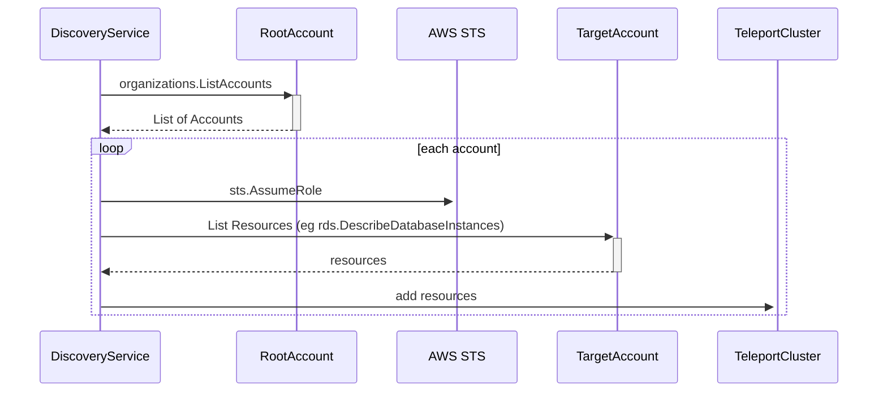

# RFD 227 - AWS Auto Discovery by AWS Organization

## Required Approvers

* Engineering: @r0mant
* Product: @r0mant

## What

Auto enroll all supported AWS resources from multiple AWS Accounts under the same AWS Organization.

Only self-hosted deployments using ambient credentials are being considered in this RFD.
Other configurations (Teleport Cloud and/or the usage of integrations as source of credentials) will be added in the future.

## Why

Teleport supported AWS resources can be auto discovered and accessed from Teleport.

Configuring auto discovery requires a manual set up for each AWS Account.
For deployments with a high volatility of AWS Account IDs, this requires operators to constantly change the configuration.

There's also an UX scale issue, where the same user can have thousands of AWS Account IDs.

Being able to configure the auto discover once, and have it auto discover the accounts and their resources will greatly benefit the UX of this feature.

## Details

Usually, all the accounts in the scope of a deployment are under the same [AWS Organization](https://docs.aws.amazon.com/organizations/latest/userguide/orgs_introduction.html).

Using [AWS Organization API](https://docs.aws.amazon.com/organizations/latest/APIReference/API_ListAccounts.html), the discover flow will be able to enumerate all the AWS Account IDs and run the discover flow on all of them.

Any Teleport Agent, whether that's an EC2 instance running the SSH, Database, Discovery or Kubernetes Services, tries to join the cluster, it will use the [IAM Join Token](https://goteleport.com/docs/enroll-resources/agents/aws-iam/).

Currently, the Auth server either accepts or rejects the join request based on the allowed AWS Account IDs specified in the Token.
This join method will be updated to allow onboarding instances which belong to a given AWS Organization.

### UX

#### User stories

**Self-hosted: Alice manages a multi-account AWS organization and wants to access all EC2 instances from Teleport**

Alice follows the [Server Auto-Discovery for Amazon EC2](https://goteleport.com/docs/enroll-resources/auto-discovery/servers/ec2-discovery/ec2-discovery-manual/) guide to set up SSH access.

When creating the IAM Join Token (step 1), an AWS Organization is defined instead of enumerating all the account ids.
This will allow any Teleport Agent, from an account belonging to that organization, to join the cluster.

```yaml
kind: token
version: v2
metadata:
  name: aws-discovery-iam-token
spec:
  roles: [Node]
  join_method: iam
  allow:
  - aws_organization_id: o-abcde12345
```

In order to validate the organization during the join attempts, the user must provide access to the `organizations.DescribeAccount`.
This adds some requirements:
- Auth Server must be allowed to call the [`organizations.DescribeAccount`](https://docs.aws.amazon.com/organizations/latest/APIReference/API_DescribeAccount.html) API.
- Auth Server must run in the AWS management account or by a member account that is a delegated administrator[^1].

[^1]: this is an AWS requirement for the API `organizations.DescribeAccount`: "This operation can be called only from the organization's management account or by a member account that is a delegated administrator."

<details>
  <summary>IAM Role for Auth Service</summary>

  Policy:
  ```json
    {
        "Version": "2012-10-17",
        "Statement": [
            {
                "Effect": "Allow",
                "Action": [
                    "organizations:DescribeAccount"
                ],
                "Resource": [
                    "*"
                ]
            }
        ]
    }
  ```
  
  Trust Policy:
  ```json
    {
        "Version": "2012-10-17",
        "Statement": [
            {
                "Effect": "Allow",
                "Principal": {
                    "Service": "ec2.amazonaws.com"
                },
                "Action": "sts:AssumeRole"
            }
        ]
    }
  ```
</details>

In step 2, the IAM Role required for the Discovery Service is different and will only require access to list accounts and assume other roles.

The Discovery Service must run in the root account, because it needs access to `organizations.ListAccounts` API, which is only available there[^2].

[^2]: this is an AWS requirement for the API `organizations.ListAccounts`: "This operation can be called only from the organization's management account or by a member account that is a delegated administrator."

<details>
  <summary>IAM Role for Discovery Service</summary>

  Policy:
  ```json
    {
        "Version": "2012-10-17",
        "Statement": [
            {
                "Effect": "Allow",
                "Action": [
                    "organizations:ListAccounts",
                    "sts:AssumeRole"
                ],
                "Resource": [
                    "*"
                ]
            }
        ]
    }
  ```
  
  Trust Policy:
  ```json
    {
        "Version": "2012-10-17",
        "Statement": [
            {
                "Effect": "Allow",
                "Principal": {
                    "Service": "ec2.amazonaws.com"
                },
                "Action": "sts:AssumeRole"
            }
        ]
    }
  ```
</details>

The user also needs to create an IAM Role in each Account, which will be assumed by the Role assigned to the Discovery Service (Role above):

<details>
  <summary>IAM Role to create in every Account</summary>

  Policy:
  ```json
    {
        "Version": "2012-10-17",
        "Statement": [
            {
                "Effect": "Allow",
                "Action": [
                    "ec2:DescribeInstances",
                    "ssm:DescribeInstanceInformation",
                    "ssm:GetCommandInvocation",
                    "ssm:ListCommandInvocations",
                    "ssm:SendCommand"
                ],
                "Resource": [
                    "*"
                ]
            }
        ]
    }
  ```
  
  Trust Policy:
  ```json
    {
        "Version": "2012-10-17",
        "Statement": [
            {
                "Effect": "Allow",
                "Principal": {
                    "AWS": "<Role's ARN assigned to the Discovery Service>"
                },
                "Action": "sts:AssumeRole"
            }
        ]
    }
  ```
</details>

Step 3 is now optional, because Teleport will use the `AWS-RunShellScript` managed SSM Document.

On Step 4 and 5, Alice must deploy a teleport Discovery Service in the organization's management account, with the following configuration:
```yaml
version: v3
# ...
discovery_service:
  enabled: true
  aws:
   - types: ["ec2"]
     account_ids: ["*"] # new field
     regions: ["us-east-1","us-west-1"]
     assume_role:
        role_arn: "arn:aws:iam::*:role/<role that exists in every account>"
        external_id: "<optional>"
     # ...
```

The Discovery Service must run in the Organization's management account or in a member account that is the delegated administrator.
This limitation comes from the [`organization.ListAccounts` API](https://docs.aws.amazon.com/organizations/latest/APIReference/API_ListAccounts.html):
> This operation can be called only from the organization's management account or by a member account that is a delegated administrator.

EC2 instances that exist in the Accounts under the organization specified will join the cluster, and users can access them from Teleport.

**Self-hosted: Alice wants to onboard multiple accounts that live outside the organization**

In this case, the flow would be the same except for the IAM Join Token:

```yaml
kind: token
version: v2
metadata:
  name: aws-discovery-iam-token
spec:
  roles: [Node]
  join_method: iam
  allow:
  - aws_account: "123456789000"
  - aws_account: "123456789001"
  - aws_account: "123456789002"
```

And the Discovery Service matcher:
```yaml
version: v3
# ...
discovery_service:
  enabled: true
  aws:
   - types: ["ec2"]
     account_ids: ["123456789000", "123456789001", "123456789002"] # new field
     regions: ["us-east-1","us-west-1"]
     assume_role:
        role_arn: "arn:aws:iam::*:role/<role that exists in every account>"
        external_id: "<optional>"
     # ...
```

In this case, neither the Auth Service, nor the Discovery Service need to run in the root account because:
- the list of accounts is maintained manually
- the IAM Join Token only accepts account IDs

### Access resources of a given AWS Organization

Two flows must be changed in order to achieve the RFD goal:
- discovery service must be able to enumerate all the account IDs
- IAM Join flow must accept join requests from any Teleport Agent of a given organization

#### Resource Discovery

The Discovery Service must be updated to call the [`organizations.ListAccounts`](https://docs.aws.amazon.com/organizations/latest/APIReference/API_ListAccounts.html) API when the matcher is configured to discover all the resources in a given AWS Organization.

In order to list resources from other accounts, the Discovery Service must assume an IAM Role in the target account.
EC2, RDS and EKS discovery flows support assuming another role.

The Discovery Service will, for each account, assume a Role in that account (it assumes the same Role name can be used), and execute the existing flow.



##### IAM Role to assume

When the Discovery Service iterates over all the target AWS Accounts, it will use the `assume_role_arn` field to generate a valid role ARN, which it will assume.

```yaml
# teleport.yaml
discovery_service:
  enabled: true
  aws:
  - assume_role_arn: "arn:aws:iam::*:role/example-role-name"
    aws_account_ids: ["*"]
    # ...
```

If `aws_account_ids` has a list of accounts, then `organizations.ListAccounts` API call is skipped, and the flow will use those accounts when assuming other roles.

Technically, all the following configurations will behave the same:

**Using wildcard for the Account ID**
Assuming the `organizations.ListAccounts` only returns the `123456789012` account.

```yaml
# teleport.yaml
discovery_service:
  enabled: true
  aws:
  - assume_role_arn: "arn:aws:iam::*:role/example-role-name"
    aws_account_ids: ["*"]
    # ...
```

**Explicit list of AWS Account IDs**
```yaml
# teleport.yaml
discovery_service:
  enabled: true
  aws:
  - assume_role_arn: "arn:aws:iam::*:role/example-role-name"
    aws_account_ids: ["123456789012"]
    # ...
```
In this scenario, the `organizations.ListAccounts` will not be called.

**Without any AWS Account ID**
```yaml
# teleport.yaml
discovery_service:
  enabled: true
  aws:
  - assume_role_arn: "arn:aws:iam::123456789012:role/example-role-name"
    aws_account_ids: [] # or not present at all
    # ...
```
In this scenario, the `organizations.ListAccounts` will not be called.

### Teleport IAM Join based on AWS Organization

In order for an instance to join Teleport using the IAM Join method, the instance signs an `sts.GetCallerIdentity` request and sends it to the Auth service.
The Auth executes the request on behalf of the instance, and validates the returned account ID against the accepted ones on the IAM Join Token.

This RFD aims to add a small change to this flow: allow validation to be based on the AWS Organization.

When the Auth service receives a join attempt, it will execute the `sts.GetCallerIdentity` and obtain the Account ID (eg, `123456789012`).
If the IAM Join Token accepts only an Organization ID, the Auth service calls `organizations.DescribeAccount`:
```HTTP
POST / HTTP/1.1
X-Amz-Target: AWSOrganizationsV20161128.DescribeAccount

{ "AccountId": "123456789012" }

---
HTTP/1.1 200 OK
Content-Type: application/json
{
  "Account": {
    "Id": "123456789012",
    "Arn": "arn:aws:organizations::111111111111:account/o-example/123456789012",
    "Name": "Beta account",
    "Email": "mail@example.com",
    "JoinedMethod": "INVITED",
    "JoinedTimeStamp": 1481756563.134,
    "State": "ACTIVE",
    "Status": "ACTIVE"
  }
}
```

The `Account.Arn` field contains the organization ID, which will be validated against the allowed organization ID defined in the IAM Join Token.

Calling the `organizations.DescribeAccount` API requires the Auth Server to have access to AWS credentials.
If not AWS credentials are present in the Auth Server, the join request will be refused.

This particular API has to be called from the organization's root account.

### EC2 auto discover: SSM Document is now optional
Instead of asking the user to create an SSM Document (see [step 3](https://goteleport.com/docs/enroll-resources/auto-discovery/servers/ec2-discovery/ec2-discovery-manual/#step-37-create-ssm-documents) in the EC2 Server Auto Discover guide), the Discovery Service will start using the `AWS-RunShellScript` managed SSM Document.

This eases the onboarding of new AWS Accounts and regions on those accounts, because it removes the only step required besides creating the IAM Role on the AWS Account.

This document is pre-created by AWS and is accessible in all AWS Accounts and Regions.

Defining a custom SSM Document in the AWS EC2 Matcher must still be possible, to prevent any breaking changes.

However, for new matchers, when the SSM Document is not set, it will default to `AWS-RunShellScript`:
```json
{
  "schemaVersion": "1.2",
  "description": "Run a shell script or specify the commands to run.",
  "parameters": {
    "commands": {
      "type": "StringList",
      "description": "(Required) Specify a shell script or a command to run.",
      "minItems": 1,
      "displayType": "textarea"
    },
    "workingDirectory": {
      "type": "String",
      "default": "",
      "description": "(Optional) The path to the working directory on your instance.",
      "maxChars": 4096
    },
    "executionTimeout": {
      "type": "String",
      "default": "3600",
      "description": "(Optional) The time in seconds for a command to complete before it is considered to have failed. Default is 3600 (1 hour). Maximum is 172800 (48 hours).",
      "allowedPattern": "([1-9][0-9]{0,4})|(1[0-6][0-9]{4})|(17[0-1][0-9]{3})|(172[0-7][0-9]{2})|(172800)"
    }
  },
  "runtimeConfig": {
    "aws:runShellScript": {
      "properties": [
        {
          "id": "0.aws:runShellScript",
          "runCommand": "{{ commands }}",
          "workingDirectory": "{{ workingDirectory }}",
          "timeoutSeconds": "{{ executionTimeout }}"
        }
      ]
    }
  }
}
```

The Discovery Service must be updated to send the installation command in the `commands` parameter.

For clusters with managed updates, the call to `ssm.SendCommand` will be similar to this block:
```go
	script := fmt.Sprintf("curl -s -L https://%s/v1/webapi/scripts/installer/%s | bash -s %s",
		publicProxyAddr,
		req.ScriptName,
		req.TokenName,
	)
	output, err := req.SSM.SendCommand(ctx, &ssm.SendCommandInput{
		DocumentName: aws.String("AWS-RunShellScript"),
		InstanceIds:  validInstanceIDs,
		Parameters: map[string][]string{
			"commands": {script},
		},
	})
```

This method is very similar to what already happens in Azure and GCP server auto discovery.

### Proto Specifications

#### New matcher field for EC2 Auto Discover

```proto
// AWSMatcher matches AWS EC2 instances and AWS Databases
message AWSMatcher {
  // Types are AWS database types to match, "ec2", "rds", "redshift", "elasticache",
  // or "memorydb".
  repeated string Types = 1 [(gogoproto.jsontag) = "types,omitempty"];
  // Regions are AWS regions to query for databases.
  repeated string Regions = 2 [(gogoproto.jsontag) = "regions,omitempty"];
  // AssumeRoleARN is the AWS role to assume for database discovery.
  AssumeRole AssumeRole = 3 [(gogoproto.jsontag) = "assume_role,omitempty"];
  
  // ... other existing fields

  // AccountIDs contain the list of AWS Account IDs to use when assuming an IAM Role.
  // AssumeRole must be present and have the account ID part set to *.
  // Using an wildcard (*) as the account ID will enumerate all the Account IDs within the AWS Organization.
  // The organizations.ListAccounts API must be available to the IAM Role running the discovery service.
  repeated string AccountIDs = 10 [(gogoproto.jsontag) = "account_ids,omitempty"];
}
```

#### IAM Join Token: add organization id as token allow rule

```proto
// TokenRule is a rule that a joining node must match in order to use the
// associated token.
message TokenRule {
  // AWSAccount is the AWS account ID.
  string AWSAccount = 1 [(gogoproto.jsontag) = "aws_account,omitempty"];
  // AWSRegions is used for the EC2 join method and is a list of AWS regions a
  // node is allowed to join from.
  repeated string AWSRegions = 2 [(gogoproto.jsontag) = "aws_regions,omitempty"];
  // AWSRole is used for the EC2 join method and is the ARN of the AWS
  // role that the Auth Service will assume in order to call the ec2 API.
  string AWSRole = 3 [(gogoproto.jsontag) = "aws_role,omitempty"];
  // AWSARN is used for the IAM join method, the AWS identity of joining nodes
  // must match this ARN. Supports wildcards "*" and "?".
  string AWSARN = 4 [(gogoproto.jsontag) = "aws_arn,omitempty"];
  // AWSOrganizationID is used for the IAM join method to validate the
  // Organization of the node that is trying to join the cluster.
  string AWSOrganizationID = 4 [(gogoproto.jsontag) = "aws_organization,omitempty"];
}
```

### Security
The main concern is the new join method: IAM Join method using an Organization.

The agent joining must send a signed `sts.GetCallerIdentity` request.
The call to `organizations.DescribeAccount`, by the Auth Server, only happens if the `sts.GetCallerIdentity` return a valid response and if the IAM Join Token's token rules include an organization.

We don't expect any decrease in security posture, except that when using an Organization ID, there will be an increase of valid EC2 instances that can join the cluster.

To improve security, AWS Assumed Role ARN is also validated, if present.

### Scale

#### UX
The user experience is improved because users no longer need to enumerate all the account IDs.

#### Discover resources
When discovering AWS resources, the Discovery Service will apply the same flow as today.

The only change is that it might bring more resources per iteration but the discovery flows are all paginated and should gracefully handle the increase in the resources.

#### AWS Organization validation in IAM Join method
When an instance tries to join the cluster, it will call the Auth Server and pass the signed request.

After this RFD is implemented the Auth Server will execute that request and, if token rule allows an AWS Organization, also call the `organizations.DescribeAccount`.

The join flow might consume more resources, but this only happens on agent onboarding, usually, once per agent.

If deemed necessary, a cache can be used to map Account IDs to Organization IDs.
This way, multiple calls to the same Account ID will be prevented.

### Backwards Compatibility

**Teleport agent using an older version tries to join the cluster**

The validation only happens on the Auth Server, so the join attempt works for old agents.

### Audit Events

No changes in audit events.

### Test Plan

Include a new testing item in EC2 Discovery section:
- discover ec2 instances in two aws accounts using the same matcher
- discover all instances from the organization's management account

Include a new testing item in IAM Join method:
- join an instance using the organization in the allow rules