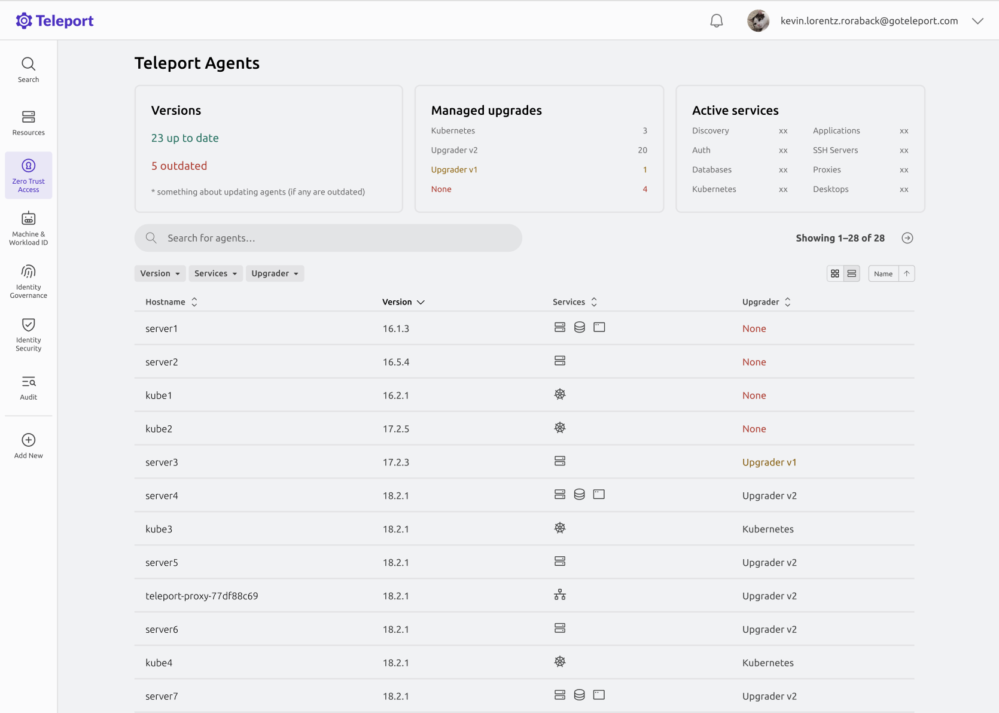

# RFD 0229 - Instances Inventory UI

## Required Approvals

- Engineering: @zmb3 @fspmarshall
- Product: @roraback

## What

A page in the Web UI that lists connected instances along with their details, with options to search and filter through them.

## Why

Currently, the only way to list teleport and bot instances is via two distinct CLI commands: `tctl inventory list` and `tctl bots instances ls`.
This can be quite cumbersome for users and as a result limits the visibility cluster administrators have into their infrastructure. Exposing
this information in the Web UI would greatly improve the user experience and make it easier for cluster administrators to do
things like identify instances still running old versions of Teleport and need to be updated.

## Details

### Implementation

The first version of this feature will primarily focus on adding the existing `tctl inventory` and `tctl bots instances` functionality
to the Web UI and use most of the same underlying backend API. Both teleport and bot instances will be stored in a sorted cache ordered alphabetically
by name. The `name` in this context for instances will be `<hostname>/<instance id>` (or just `instance id` if there is no `hostname`), and `<bot name>/<instance id>` for bot instances.

#### Web Endpoint

A new `/webapi/sites/:site/instances` will be used by the Web UI to fetch a paginated list of instances, this endpoint will support
various query parameters for pagination and filtering, including:

- `search`: Filter by hostname (or bot name for bot instances) or instance ID.
- `query`: Filter by a predicate language expression.
- `services`: Filter to only return instances running the specified service(s).
- `upgraders`: Filter to only return instances using the specified external upgrader(s).
- `updaterGroup`: Filter to only return instances in the specified updater group.
- `type`: Filters to return only teleport instances, bot instances, or both. Default/undefined is both.

The response will be a JSON object containing the page of instances requested.

##### Example response:

```json
{
  "instances": [
    {
      "id": "1",
      "type": "instance",
      "agent": {
        "name": "server1",
        "version": "16.1.3",
        "services": ["ssh", "db", "desktop"],
        "upgrader": {
          "type": "unit",
          "version": "v2",
          "group": "group1"
        }
      }
    },
    {
      "id": "2",
      "type": "instance",
      "agent": {
        "name": "kube1",
        "version": "16.5.4",
        "services": ["kube"],
        "upgrader": {
          "type": "kube",
          "version": "v2",
          "group": "group1"
        }
      }
    },
    {
      "id": "3",
      "type": "bot",
      "bot": {
        "name": "bot1",
        "version": "16.1.3",
        "service": "kubernetes",
        "health": "Unknown"
      }
    },
    {
      "id": "4",
      "type": "instance",
      "agent": {
        "name": "agent1",
        "version": "16.1.3",
        "services": ["kube"],
        "upgrader": {
          "type": "kube",
          "version": "v2",
          "group": "group2"
        }
      }
    }
  ],
  "startKey": ""
}
```

#### RPC Service and Proto messages

```protobuf
service InventoryService {
  // ListUnifiedInstances returns a page of teleport and bot instances. This API will refuse any requests when the cache is unhealthy or not yet
  // fully initialized.
  rpc ListUnifiedInstances(ListUnifiedInstancesRequest) returns (ListUnifiedInstancesResponse);
}

// ListUnifiedInstancesRequest is the request for listing instances.
message ListUnifiedInstancesRequest {
  // page_size is the size of the page to return.
  int32 page_size = 1;
  // page_token is the next_page_token value returned from a previous ListUnifiedInstances request, if any.
  string page_token = 2;
  // filters specify optional search criteria to limit which instances should be returned.
  ListUnifiedInstancesFilter filter = 3;
}

// ListUnifiedInstancesResponse is the response from listing instances.
message ListUnifiedInstancesResponse {
  // items is the list of instances (teleport or bot instances) returned.
  repeated UnifiedInstanceItem items = 1;
  // next_page_token contains the next page token to use as the start key for the next page of instances.
  string next_page_token = 2;
}

// ListUnifiedInstancesFilter provides a mechanism to refine ListUnifiedInstances results.
message ListUnifiedInstancesFilter {
  // search is a basic string search query which will filter results by name (hostname for teleport instances, bot name for bot instances).
  string search = 1;
  // search_keywords is a list of search keywords using predicate language to match against resource field values.
  string search_keywords = 2;
  // instance_types is the types of instances to return. If omitted, both teleport instances and bot instances will be returned.
  repeated string instance_types = 3;
  // services is the list of services to filter instances by. An instance must have one or more of the services here to be returned.
  repeated string services = 4;
  // updater_groups is the list of updater groups to filter instances by.
  repeated string updater_groups = 5;
  // upgraders is the list of upgraders to filter instances by.
  repeated string upgraders = 6;
}

// UnifiedInstanceItem represents either a teleport instance or a bot instance.
message UnifiedInstanceItem {
  oneof instance {
    // teleport_instance is the canonical teleport instance type from the Instance heartbeat system.
    types.InstanceV1 teleport_instance = 1;
    // bot_instance is the canonical bot instance type.
    teleport.machineidv1.BotInstance bot_instance = 2;
  }
}
```

#### Performance

The current implementation of `tctl inventory ls` bypasses the cache entirely and reads the instances directly from the backend.
This was done intentionally because caching instances in the traditional way would nearly double the number of backend reads done
on startup while populating the cache, with insufficient read capacity this could easily lead to issues like degraded performance
throughout the entire cluster, or possibly even break the cluster entirely due to a self-propagating loop of errors where
the cache never gets healthy.

Instances still need to be cached if exposed to the Web UI to maintain performance and prevent constant backend reads, so to
prevent the aforementioned issues, instances will be cached in a separate "lazy" sortcache with rate-limited reads that is
initialized after the primary cache has. This `InventoryCache` sortcache will wait for the primary cache to be ready and healthy, and only
then begin populating itself with the teleport instances and bot instances from the backend. Its reads from the backend will be rate-limited
variably, based on the size of the cluster which will be derived from the size of the primary cache. Larger clusters (which can be assumed
to have more bandwidth) will have more lenient rate-limits in order to prevent it from taking too long to populate.

The cache will hook into the backend events watcher and watch for `instance` and `bot_instance` events and update the cache accordingly whenever
an update is detected (such as an instance no longer being connected). This cache will live in auth and the data will be exposed to
the proxy via a new RPC service with a `ListUnifiedInstances()` method which will build the page of instances by streaming from the
`InventoryCache` sortcache.

Any requests made for instances will be rejected until the `InventoryCache` is initialized and healthy, if not, all requests will be rejected
and there will not be a fallback to the backend.

#### UX


\*The above mockup is not finalized and may differ slightly from the implemented feature.

The new `Instances Inventory` page will be available in the Web UI under the `Zero Trust Access` navigation section.

The list of instances will be a paginated list with infinite scroll support, and contain columns for name,
version, services, and external upgrader (if any). A search bar will be available to use in either basic mode (default)
which searches by hostname/instance ID, or advanced mode using predicate language to perform queries. Where applicable, the predicate
language query functions will be kept consistent with those that can be used on the Bot Instances dashboard.

The `versions` UI filter control will contain 4 preset options:

- `Up-to-date`: Filter for instances running the current version of the cluster (eg. `18.2.4`).
- `Patch available`: Filter for instances running the same major version, but a lower minor version (eg. `>=18.0.0`)
- `Upgrade required`: Filter for instances running 1 major version behind. (eg. `>=17.0.0 && <18.0.0`).
- `Unsupported`: Filter for instances running more than 2 major versions behind, or more than 1 major version ahead. (eg. `<17.0.0 && >=19.0.0`)

There will also be an option for a custom condition, allowing the user to filter for less than, equal to, or greater than the version they type in.

More fine-tuned filtering is also available via a predicate query, by querying for `status.latest_heartbeat.version`, as in the
Bot Instances dashboard.

Filter controls for services, upgrader, updater groups, and type will be dropdowns containing checkbox lists that allow the user to select one
or more options.

Bot instances in the list will also contain a deep link to their dedicated bot instance page in the Bot Instances dashboard (RFD 0222),
this will work by building the URL to the Bot Instances dashboard with a predicate language advanced search query that filters solely
for the specific bot instance's name.

If the page is loaded while the `InventoryCache` is still being initialized, the page will be empty and only show a banner message
with the text "The instance inventory is not yet ready to be displayed, please check back in a few minutes." Users who don't
have `list` or `read` permissions for the `instance` resource kind will see a banner informing them that they need permissions
for `instance.list` and `instance.list`. If a user has `list` and `read` permissions for the `instance` resource, but not
for `bot_instance`, the list will only show teleport instances and not bot instances and the type filter control will be disabled, additionally,
a disclaimer at the top of the page will inform the user of this and why.

#### Security

The proposed changes don't introduce any new potential vulnerabilities, and cluster administrators should be sure to only
allow intended users to have `read` and `list` permissions for `instance` and `bot_instance` resources.

## Stretch goal/future plans

In the future, this unified listing can be exposed to the CLI via a `tsh instances ls` command. This is a stretch goal and not required in V1 of this
feature as all the functionality is already accessible in the CLI via the existing `tctl` commands, with the only notable difference being that you
have to run two separate commands to get `instance`s and `bot_instance`s.
