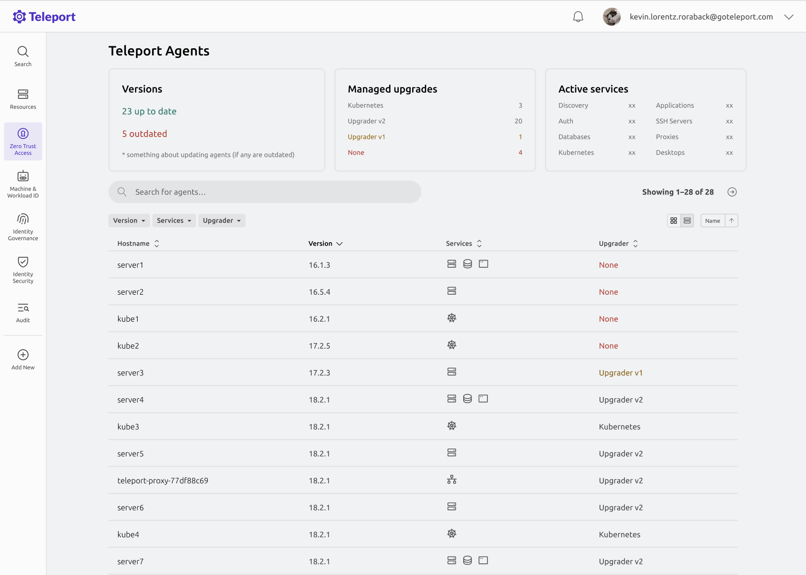

# RFD 0229 - Agent Inventory UI

## Required Approvals

- Engineering: @zmb3 @fspmarshall
- Product: @roraback

## What

A page in the Web UI that lists connected agents and their details, with options to search and filter through them.

## Why

Currently, the only way to list agents is via the `tctl inventory list` CLI command, this can be quite cumbersome for users 
and as a result limits the visibility cluster administrators have into their infrastructure. Exposing this information in the 
Web UI would greatly improve the user experience and make it easier for cluster administrators to do things like identify agents
still running old versions of Teleport and need to be updated.

## Details

### Implementation

The first version of this feature will primarily focus on adding the existing `tctl inventory` functionality to the Web UI and use
most of the same underlying backend API.

#### Web Endpoint

A new `/webapi/sites/:site/inventory` will be used by the Web UI to fetch a paginated list of agents, this endpoint will support 
various query parameters for pagination and filtering, including:

- `search`: Filter by hostname.
- `versions`: Filter to only return agents running the specified Teleport version(s).
- `upgraders`: Filter to only return agents using the specified external upgrader(s).

The response will be a JSON object containing the page of agents requested.

##### Example response:

```json
{
  "agents": [
    {
      "serverId": "1",
      "hostname": "server1",
      "version": "16.1.3",
      "services": ["ssh", "db", "desktop"],
    },
    {
      "serverId": "2",
      "name": "kube1",
      "version": "16.5.4",
      "services": ["kube"],
      "upgrader": "Upgrader v2",
    },
    {
      "serverId": "3",
      "hostname": "server3",
      "version": "16.1.3",
      "services": ["ssh"],
    },
  ],
  "uniqueVersions": ["16.1.3", "16.5.4"],
  "totalCount": 3,
  "startKey": "",
}
```

#### Performance

The current implementation of `tctl inventory ls` bypasses the cache entirely and reads the instances directly from the backend.
This was done intentionally because caching instances in the traditional way would nearly double the number of backend reads done
on startup while populating the cache, with insufficient read capacity this could easily lead to issues like degraded performance
throughout the entire cluster, or possibly even break the cluster entirely due to a self-propagating loop of errors where
the cache never gets healthy.

Instances still need to be cached if exposed to the Web UI to maintain performance and prevent constant backend reads, so to
prevent the aforementioned issues, instances will be cached in a separate "lazy" cache with rate-limited reads that is
initialized after the primary cache has. This `InstancesCache` will wait for the primary cache to be ready and healthy, and only
then begin populating itself with the instances from the backend. Its reads from the backend will be rate-limited variably, 
based on the size of the cluster which will be derived from the size of the primary cache. Larger clusters (which can be assumed
to have more bandwidth) will have more lenient rate-limits in order to prevent it from taking too long to populate.

Aggregate counters such us the total number of up-to-date agents, total number of each service, etc. will be their own separate
fields in the cache and tallied up during initialization, and updated as needed during create/edit/delete operations. All 
the unique version numbers of Teleport found running on agents will also be collected, as this will be to build the version
filtering options in the Web UI.

Any requests made for instances will be rejected until the `InstancesCache` is initialized and healthy.

#### UX


*The above mockup is not finalized and may differ slightly from the implemented feature.

The new `Agent Inventory` page will be available in the Web UI under the `Zero Trust Access` navigation section. Users who don't
have `list` permissions for the `instance` resource kind will not have permission to list instances and won't see the navigation
item.

The top of the page will contain aggregate metrics including the total number of up-to-date and out-of-date agents, number of 
agents using externally managed upgrades and their upgraders, and total active services.

The list of agents will contain columns for hostname, version, services, and external upgrader (if any). Users will be able
to filter agents by version, services, or upgrader. All filter options will be dropdowns containing checkbox lists that allow 
the user can select one or more options. The `versions` filter will be a dropdown containing a checkbox list of 
all the unique versions of Teleport found running on agents, based on the `uniqueVersions` field returned in the web response.

If the page is loaded while the `InstancesCache` is still being initialized, the page will be empty and only show a banner message
with the text "The agent inventory is not yet ready to be displayed, please check back in a few minutes."

#### Security

The proposed changes don't introduce any new potential vulnerabilities, and cluster administrators should be sure to only
allow intended users to have `list` permissions for `instance` resources.