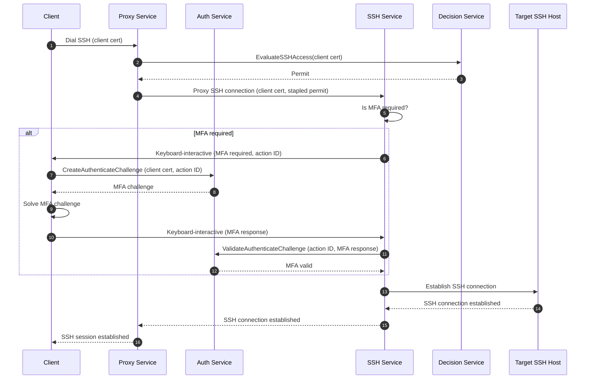
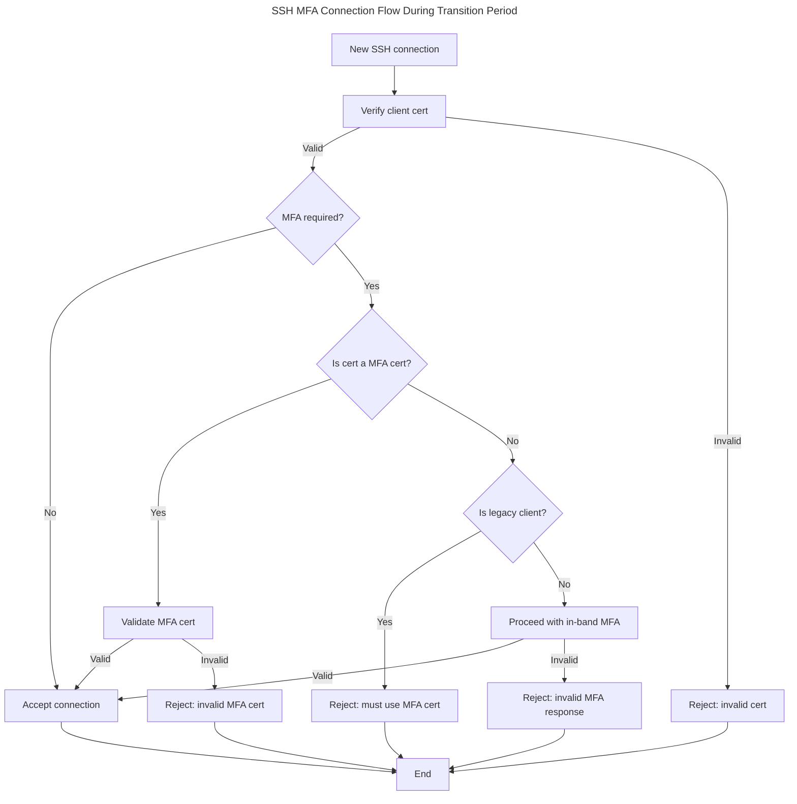

# RFD 0231 - In-Band MFA for SSH Sessions

## Required Approvers

- Engineering: @rosstimothy && @espadolini && @fspmarshall
- Product: @klizhentas
- Security: @rob-picard-teleport

## What

This RFD proposes integrating in-band multi-factor authentication (MFA) into SSH session establishment with the Teleport
SSH service. This change aims to enhance security by ensuring that MFA checks are tightly coupled with session creation,
reducing client complexity, and eliminating the need for per-session MFA SSH certificates.

## Why

Teleport’s current approach to per-session MFA enforcement for SSH access has several architectural and security
shortcomings that this proposal aims to address:

1. Per-session MFA enforcement flow is performed separately from session creation (i.e., out-of-band), which can
   introduce security gaps. For example, in
   [CVE-2025-49825](https://github.com/gravitational/Teleport/security/advisories/GHSA-8cqv-pj7f-pwpc), the MFA
   enforcement policy can be bypassed since an attacker had the ability to forge a certificate attesting that they had
   completed MFA and there was no proper binding between the certificate and the session.
1. MFA complexity is concentrated on the client versus the server. The client is responsible for determining MFA
   requirements, generating an MFA challenge, requesting a per-session MFA certificate and finally dialing a target host
   with the per-session MFA certificate. This complexity increases the risk of implementation errors and inconsistencies
   across different clients (e.g., `tsh`, web terminal, Teleport Connect, etc.).
1. A per-session MFA certificate is a single credential, representing multiple factors of authentication for a user. If
   an attacker were to gain possession, it could be used to bypass all forms of authentication checks, including MFA.

By moving MFA enforcement to the SSH service during session establishment, this new design directly addresses the above
issues by:

1. MFA enforcement is tightly integrated with session creation (i.e., in-band), ensuring that authentication factors are
   directly bound to each session and mitigating the risk of bypasses like those seen in
   [CVE-2025-49825](https://github.com/gravitational/Teleport/security/advisories/GHSA-8cqv-pj7f-pwpc).
1. MFA complexity is moved from clients to the SSH service, so clients only need to connect to the SSH service and
   resolve an MFA challenge only if required, streamlining the session establishment process and reducing the risk of
   implementation errors.
1. Per-session MFA certificates can be completely removed, eliminating a single credential representing multiple factors
   of authentication.

In summary, this RFD proposes a more secure and streamlined approach to MFA enforcement for SSH sessions by integrating
MFA checks directly into the session establishment process, reducing client complexity, and eliminating the need for
per-session MFA certificates.

## Non-Goals

1. This RFD does not propose changes to other Teleport access protocols such as Kubernetes, databases, desktops, etc.
   However, the architecture could be extended to these protocols in the future.
1. This RFD aims to minimize changes so refactoring of existing services is kept to a minimum e.g, creating a new MFA
   service to migrate MFA related RPCs out of the legacy Auth service.

## Details

### UX

No changes are expected since this is an internal change.

### High-Level Flow

The client will first dial its target SSH host using the Proxy and its standard Teleport client certificate. The Proxy
will then resolve the target cluster and host, and invoke the `EvaluateSSHAccess` RPC of the Decision service. Upon
receiving a permit from the Decision service, the Proxy will staple the permit to the connection and open a connection
to the respective cluster's SSH service.

The SSH service will authenticate the client using the provided client certificate and the stapled permit. The SSH
service will then check if MFA is required for the session by examining the permit.

If MFA is _not required_, the SSH service will then proceed to establish the SSH session.

If MFA _is required_, the SSH service will send a JSON-encoded question containing the action ID via the SSH
[keyboard-interactive channel](https://www.rfc-editor.org/rfc/rfc4256) to inform the client that MFA is needed. An
action ID is a unique identifier (UUID v4) that ties the MFA challenge to a specific user action (in this case, SSH
session establishment). In the future, action IDs could be used for other Teleport features beyond SSH access.

The MFA keyboard-interactive question will follow this schema:

```json
{
  // Unique identifier for the MFA action (UUID v4).
  "action_id": "121c49ab-8bc1-414a-b11c-5311bc54eceb",
  // Human-readable message to display to the user.
  "message": "MFA required. Complete the challenge using the provided action ID."
}
```

The client must then invoke the `CreateAuthenticateChallenge` RPC of the Auth service, providing the action ID along
with existing request metadata. The Auth service will respond to the client with a challenge that must be solved. The
client must solve the MFA challenge and send a base64 encoded `MFAAuthenticateResponse` message to the SSH service via
the keyboard-interactive channel. The Protobuf message must be base64 encoded to ensure they can be safely transmitted
over the SSH keyboard-interactive channel.

Once the MFA challenge response is received, the SSH service will invoke the `ValidateAuthenticateChallenge` RPC with
the action ID, the client's MFA challenge response, and any other relevant metadata. If the MFA response is valid, the
SSH service will proceed to establish the SSH session. If the MFA response is invalid, the SSH service will deny the
connection with an `Access Denied: Invalid MFA response` error.

If the client fails to complete the MFA challenge within a specified timeout (e.g., default 1 minute), the SSH service
will terminate the connection with an `Access Denied: MFA verification timed out` error. If the client wishes to retry,
it must initiate a new SSH connection.



### Security

In addition to the risks raised in [Access Control Decision API (RFD
0024e)](https://github.com/gravitational/Teleport.e/blob/master/rfd/0024e-access-control-decision-api.md), there are a
few risks specific to this RFD.

#### Replay Attacks Risk

MFA challenge responses could potentially be captured and replayed by an attacker to gain unauthorized access. Although
this risk has already existed using per-session MFA SSH certificates, it is important to address it in the new design as
well.

Mitigations:

1. Each MFA challenge will include a unique action ID that couples the challenge to a specific user action.
1. The Auth service will maintain a record of issued challenges and their associated action IDs. Once a challenge has
   been successfully completed or expired, it will be invalidated.
1. The MFA challenge is time-bound and will expire after a duration (e.g., 5 minutes).

#### New RPC Attack Surface Risk

This RFD introduces a new RPC `ValidateAuthenticateChallenge` in the Auth service, which could potentially be exploited
by an attacker to DoS the service by flooding it with requests.

Mitigations:

1. Only Teleport instances are authorized to call the `ValidateAuthenticateChallenge` RPC, requests from other sources
   will be rejected.
1. Ensure that the Auth service validates the `MFAAuthenticateResponse` and `action_id` before processing the request to
   avoid unnecessary processing of invalid requests.

### Privacy

No changes to privacy are expected.

### Proto Specification

#### Decision Service

The Decision service will return a new field called `preconditions` in `SSHAccessPermit` to indicate that MFA is a
condition of access. It is up to the SSH service to enforce the MFA requirement during session establishment.

```proto
// SSHAccessPermit describes the parameters/constraints of a permissible SSH
// access attempt.
message SSHAccessPermit {
  // ... existing fields ...

  // Preconditions is a list of conditions that must be satisfied before access is granted.
  repeated Precondition preconditions = 25;
}

// PreconditionKind defines the types of preconditions that can be specified.
enum PreconditionKind {
  // PreconditionPerSessionMFA requires per-session MFA to be completed.
  PRECONDITION_PER_SESSION_MFA = 1;
}

// Precondition represents a condition that must be satisfied before access is granted.
message Precondition {
  // Kind specifies the type of precondition.
  PreconditionKind kind = 1;
}
```

#### Auth Service

A new challenge scope `CHALLENGE_SCOPE_ACTION` will be added to indicate that the MFA challenge is tied to a specific
user action. The action must be satisfied to proceed with the action.

```proto
// ChallengeScope is a scope authorized by an MFA challenge resolution.
enum ChallengeScope {
  // ... existing fields ...

  // CHALLENGE_SCOPE_ACTION indicates that the challenge is tied to a specific user action.
  // The action must be satisfied to proceed with the action.
  CHALLENGE_SCOPE_ACTION = 9;
}
```

The `ChallengeExtensions` message will be updated to include an optional `action_id` field that associates the MFA
challenge with a specific user action. The `action_id` can be used for other Teleport features, not just SSH access.

The Auth service must store the `action_id` along with the MFA challenge so that when the client responds with the MFA
challenge response, it can be correlated with the original challenge.

```proto
// ChallengeExtensions contains MFA challenge extensions used by Teleport
// during MFA authentication.
message ChallengeExtensions {
  // ... existing fields ...

  // action_id is an optional field that associates the MFA challenge with a specific user action.
  // If provided, the challenge will be correlated to the action based on this ID. This field is only applicable when
  // ChallengeScope is set to CHALLENGE_SCOPE_ACTION.
  string action_id = 4;
}
```

A new RPC `ValidateAuthenticateChallenge` will be added to validate the MFA challenge response provided by the user.
This RPC will accept the `action_id` and the `MFAAuthenticateResponse` as parameters. The Auth service must verify that
the response matches the original challenge associated with the `action_id` and that the challenge has not expired or
been previously used.

```proto
// AuthService is authentication/authorization service implementation
service AuthService {
  // ... existing RPCs ...

  // ValidateAuthenticateChallenge validates the MFA challenge response provided by the user.
  rpc ValidateAuthenticateChallenge(ValidateAuthenticateChallengeRequest) returns (ValidateAuthenticateChallengeResponse);
}

message ValidateAuthenticateChallengeRequest {
  // mfa_response contains the MFA challenge response provided by the user.
  MFAAuthenticateResponse mfa_response = 1;

  // user is the username of the user attempting to authenticate.
  string user = 2;

  // ChallengeExtensions are extensions that will be apply to the issued MFA challenge.
  // Required, except for v15 clients and older.
  teleport.mfa.v1.ChallengeExtensions ChallengeExtensions = 3;

  // action_id is an optional unique identifier associated with the MFA challenge.
  // If provided, it ties the response to a specific user action.
  string action_id = 4;
}

message ValidateAuthenticateChallengeResponse {
  // user is the authenticated Teleport User.
  string user = 1;

  // device contains information about the user's MFA device used to authenticate.
  teleport.mfa.v1.MFADevice device = 2;

  // allow_reuse determines whether the MFA challenge response used to authenticate
  // can be reused. AllowReuse responses may be denied for specific actions.
  teleport.mfa.v1.ChallengeAllowReuse allow_reuse = 3;

  // action_id is an optional unique identifier associated with the MFA challenge.
  // If provided, the challenge and response was tied to a specific user action.
  string action_id = 4;
}
```

### Backwards Compatibility

#### Terminology

- Legacy clients: Clients that rely on per-session MFA SSH certificates for MFA enforcement.
- Modern clients: Clients that support in-band MFA enforcement and do not rely on per-session MFA SSH certificates.
- Legacy agents: Agents hosting the SSH service that rely on per-session MFA SSH certificates for MFA enforcement.
- Modern agents: Agents hosting the SSH service that support in-band MFA enforcement and do not rely on per-session MFA
  SSH certificates.

#### Transition Period

The transition period will cover only two consecutive major releases: the current release (N) and the immediately
previous release (N-1). During this period components must support both the legacy per‑session MFA certificate flow and
the new in‑band MFA flow for compatibility between N and N-1. The transition ends with the next major release (N+1),
after which all components must support the in‑band MFA flow exclusively.

Example: if this RFD is implemented in Teleport 20.0.0, the transition period covers releases 20.x and 19.x and will end
with the release of 21.0.0. Starting with 21.0.0, all components must support in‑band MFA enforcement only.

This transition period might be too long for some environments that want to enforce in-band MFA sooner for improved
security. To accommodate these environments, an [opt-out flag](#early-adopters--opt-out-flag) will be provided to allow
early adopters to enable in-band MFA enforcement before the end of the transition period.

#### SSH Service

The SSH service will continue to support legacy clients that rely on per-session MFA SSH certificates during the
transition period, while modern clients will be _required_ to use the in-band MFA flow.

The following diagram depicts the SSH connection flow during the transition period, with a focus on MFA enforcement:



After the transition period, the SSH service will no longer accept per-session MFA SSH certificates and will only
support the in-band MFA flow.

#### Modern Clients and Legacy Agents

Modern clients will support legacy agents that rely on per-session MFA SSH certificates during the transition period.

Modern clients will generate per-session MFA SSH certificates for legacy agents while using the in-band MFA flow for
modern agents.

#### Early Adopters / Opt-Out Flag

Use the environment variable `TELEPORT_UNSTABLE_FORCE_INBAND_MFA` to force exclusive use of the in‑band MFA flow
for testing and early adoption.

For environments deploying a fresh Teleport cluster during the transition period, it is recommended to enable this flag
to ensure that all components use the in‑band MFA flow from the start.

To enable the flag, set the environment variable to `yes`. To disable the flag, unset the environment variable.

When set on modern clients: the client will not request per-session MFA certificates and will use the in‑band
MFA flow.

When set on modern agents: the SSH service will reject per-session MFA certificates and require in‑band MFA for
connections that need MFA. Additionally, clients will no longer be able to request per-session MFA certificates from the
Auth service.

> Warning: intended for testing/early adopters only. Enabling this will break connections from legacy clients or legacy
> agents that still rely on per-session MFA certificates. Remove the flag once the environment has completed migration
> to the in‑band flow.

Once the transition period is over, the flag will be removed and modern clients and agents will exclusively use the
in‑band MFA flow.

### Audit Events

The `CreateAuthenticateChallenge` RPC event will be updated to include the `action_id` in the request metadata.

A `ValidateAuthenticateChallenge` RPC event will be emitted when an MFA challenge response is validated.

### Observability

No changes to observability patterns are needed.

### Product Usage

No changes in product usage are expected since this is an internal change.

### Test Plan

### Existing Tests

Existing tests for SSH access are expected to continue working as this is an internal change and should not have any
impact.

### New Tests

During the transition period, tests will be added to ensure that both legacy and modern clients can connect to both
legacy and modern agents as expected.

After the transition period, tests will be added to ensure that modern clients can connect to modern agents using the
in-band MFA flow and that legacy clients are rejected when attempting to connect to modern agents.

### Implementation

#### Dependencies

The following are assumed to be completed before starting work on this RFD:

1. [Access Control Decision API (RFD
   0024e)](https://github.com/gravitational/Teleport.e/blob/master/rfd/0024e-access-control-decision-api.md) refactor
   and relocate implementation
   1. Decision service has a way for deriving user/session metadata from incoming requests without relying on client
      certificates.
   1. `EvaluateSSHAccess` RPC should no longer return an error if MFA is required but not satisfied. A parameter in the
      permit should indicate whether MFA is required for access.
   1. The Proxy service is updated to staple the permit returned by the Decision service to the proxied SSH connection.

#### Phase 1 (Transition Period - at least 2 major releases)

1. Update the Decision service to return a permit containing a `preconditions` field.
1. Update the Auth service to support creating and validating MFA challenges tied to specific user actions.
1. Update the SSH service to implement the in-band MFA flow during session establishment.
1. Update the SSH service auth handler to use `VerifiedPublicKeyCallback` instead of `PublicKeyCallback` to ensure that
   the client has confirmed possession of the private key associated with the client certificate.
1. Update modern clients to support the in-band MFA flow while still supporting per-session MFA SSH certificates for
   legacy agents.
1. Update modern agents to support the in-band MFA flow while still supporting per-session MFA SSH certificates for
   legacy clients.
1. Add tests to ensure both legacy and modern clients can connect to both legacy and modern agents as expected.

#### Phase 2 (Post Transition Period - after at least 2 major releases)

1. Update the SSH service to no longer accept per-session MFA SSH certificates and only support the in-band MFA flow.
1. Update clients to no longer generate per-session MFA SSH certificates.
1. Update tests to remove support for legacy clients and agents.

## Alternatives Considered

1. Proxy/Relay facilitates the entire MFA ceremony: In this approach, the Proxy/Relay would handle the entire MFA flow,
   including creating the MFA challenge and validating the response. While this would still simplify the client-side
   implementation, it would potentially introduce security risks by giving Proxy/Relay access to operations that are out
   of its domain scope.
1. New version of `TransportService` is introduced to handle in-band MFA at the Proxy/Relay: While this would separate
   concerns and keep the MFA logic isolated, it would add complexity to the architecture, require significant changes to
   existing services, and break domain boundaries.

## Future Considerations

1. Extend in-band MFA enforcement to additional protocols e.g., Kubernetes API requests, database connections, desktop
   access, etc.
