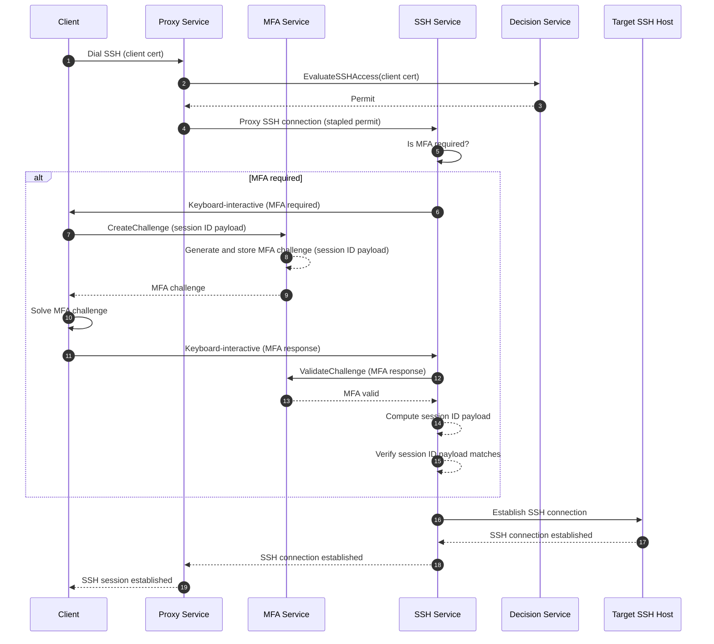

# RFD 0231 - In-Band MFA for SSH Sessions

## Required Approvers

- Engineering: @rosstimothy && @espadolini && @fspmarshall
- Product: @klizhentas
- Security: @rob-picard-teleport

## What

This RFD proposes integrating in-band multi-factor authentication (MFA) into SSH session establishment with the Teleport
SSH service. This change aims to enhance security by ensuring that MFA checks are tightly coupled with session creation,
reducing client complexity, and eliminating the need for per-session MFA SSH certificates.

## Why

Teleport’s current approach to per-session MFA enforcement for SSH access has several architectural and security
shortcomings that this proposal aims to address:

1. Per-session MFA enforcement flow is performed separately from session creation (i.e., out-of-band), which can
   introduce security gaps. For example, in
   [CVE-2025-49825](https://github.com/gravitational/Teleport/security/advisories/GHSA-8cqv-pj7f-pwpc), the MFA
   enforcement policy can be bypassed since an attacker had the ability to forge a certificate attesting that they had
   completed MFA and there was no proper binding between the certificate and the session.
1. MFA complexity is concentrated on the client versus the server. The client is responsible for determining MFA
   requirements, generating an MFA challenge, requesting a per-session MFA certificate and finally dialing a target host
   with the per-session MFA certificate. This complexity increases the risk of implementation errors and inconsistencies
   across different clients (e.g., `tsh`, web terminal, Teleport Connect, etc.).
1. A per-session MFA certificate is a single credential, representing multiple factors of authentication for a user. If
   an attacker were to gain possession, it could be used to bypass all forms of authentication checks, including MFA.

By moving MFA enforcement to the SSH service during session establishment, this new design directly addresses the above
issues by:

1. MFA enforcement is tightly integrated with session creation (i.e., in-band), ensuring that authentication factors are
   directly bound to each session and mitigating the risk of bypasses like those seen in
   [CVE-2025-49825](https://github.com/gravitational/Teleport/security/advisories/GHSA-8cqv-pj7f-pwpc).
1. MFA complexity is moved from clients to the SSH service, so clients only need to connect to the SSH service and
   resolve an MFA challenge only if required, streamlining the session establishment process and reducing the risk of
   implementation errors.
1. Per-session MFA certificates can be completely removed, eliminating a single credential representing multiple factors
   of authentication.

In summary, this RFD proposes a more secure and streamlined approach to MFA enforcement for SSH sessions by integrating
MFA checks directly into the session establishment process, reducing client complexity, and eliminating the need for
per-session MFA certificates.

## Non-Goals

1. This RFD does not propose changes to other Teleport access protocols such as Kubernetes, databases, desktops, etc.
   However, the architecture could be extended to these protocols in the future.

## Details

### UX

No changes are expected since this is an internal change.

### High-Level Flow

The client will first dial its target SSH host using the Proxy and its standard Teleport client certificate. The Proxy
will then resolve the target cluster and host, and invoke the `EvaluateSSHAccess` RPC of the [Decision
service](https://github.com/gravitational/Teleport.e/blob/master/rfd/0024e-access-control-decision-api.md). Upon
receiving a permit from the Decision service, the Proxy will staple the permit to the connection and open a connection
to the respective cluster's SSH service.

The SSH service will authenticate the client using the provided client certificate and the stapled permit. The SSH
service will then check if MFA is required for the session by examining the permit.

If MFA is _not required_, the SSH service will then proceed to establish the SSH session.

If MFA _is required_, the SSH service will send a Protobuf [`MFAPrompt` message](#ssh-keyboard-interactive-messages) via
the SSH [keyboard-interactive channel](https://www.rfc-editor.org/rfc/rfc4256) to inform the client that MFA is needed.

The client must then invoke the `CreateChallenge` RPC of the MFA service, providing a _session identifying payload
(SIP)_ along with any relevant request metadata. The MFA service will respond to the client with a challenge that must
be solved. The client must solve the MFA challenge and send a Protobuf
[`MFAPromptAnswer`](#ssh-keyboard-interactive-messages) message back to the SSH service via the keyboard-interactive
channel.

Once the MFA challenge response is received from the client, the SSH service will invoke the `ValidateChallenge` RPC
with the client's MFA challenge response. If the MFA response is valid, the MFA service will return a response to the
SSH service with the session identifying payload that the challenge was originally created for. If the MFA response is
invalid, the MFA service will return an `Access Denied: Invalid MFA response` error.

Although the SSH service receives a successful response from the MFA service, it still must independently compute the
session identifying payload and ensure it matches the payload in the response from `ValidateChallenge`. This two-step
verification ensures that MFA verification was performed for the same SSH session that it was requested for.

If the session identifying payload does not match, the SSH service will deny access to the client with an `Access
Denied: Invalid MFA response`.

If the client fails to complete the MFA challenge within a specified timeout (e.g., default 1 minute), the SSH service
will terminate the connection with an `Access Denied: MFA verification timed out` error. If the client wishes to retry,
it must initiate a new SSH connection.



### Security

In addition to the risks raised in [Access Control Decision API (RFD
0024e)](https://github.com/gravitational/Teleport.e/blob/master/rfd/0024e-access-control-decision-api.md), there are a
few risks specific to this RFD.

#### Replay Attacks Risk

MFA challenge responses could potentially be captured and replayed by an attacker to gain unauthorized access. Although
this risk has already existed using per-session MFA SSH certificates, it is important to address it in the new design as
well.

Mitigations:

1. MFA challenges and their responses will be single-use only. Once a challenge has been successfully validated, it
   cannot be reused.
1. The MFA challenge is time-bound and will expire after a duration (e.g., 5 minutes).
1. Each MFA challenge will include a session identifying payload that binds the challenge to a specific user session.

#### New RPCs Attack Surface Risk

This RFD introduces two new RPCs `CreateChallenge` and `ValidateChallenge` in the MFA service, which could potentially
be exploited by an attacker to DoS the service by flooding it with requests.

Mitigations:

1. Only authenticated clients are authorized to call the `CreateChallenge` RPC, requests from other sources will be
   rejected.
1. Only Teleport instances are authorized to call the `ValidateChallenge` RPC, requests from other sources will be
   rejected.
1. Ensure that the MFA service validates all inputs before processing the request to avoid unnecessary processing of
   invalid requests.

### Privacy

No changes to privacy are expected.

### Proto Specification

#### Decision Service

The Decision service will return a new field called `preconditions` in `SSHAccessPermit` to indicate that MFA is a
condition of access. It is up to the SSH service to enforce the MFA requirement during session establishment.

```proto
// SSHAccessPermit describes the parameters/constraints of a permissible SSH access attempt.
message SSHAccessPermit {
  // ... existing fields ...

  // Preconditions is a list of conditions that must be satisfied before access is granted.
 repeated Precondition preconditions = 26;
}

// Precondition represents a condition that must be satisfied before access is granted.
message Precondition {
  // Kind specifies the type of precondition.
  PreconditionKind kind = 1;
}

// PreconditionKind defines the types of preconditions that can be specified.
enum PreconditionKind {
  // PreconditionKindUnspecified is an unspecified precondition. This value has no effect.
  PRECONDITION_KIND_UNSPECIFIED = 0;
  // PreconditionKindPerSessionMFA requires per-session MFA to be completed.
  PRECONDITION_KIND_PER_SESSION_MFA = 1;
}
```

#### SSH Keyboard-Interactive Authentication

An additional authentication layer will be built on top of the SSH keyboard-interactive authentication channel to
facilitate MFA prompts and responses. Later this can be extended to support other types of prompts or checks.

The [keyboard-interactive channel](https://www.rfc-editor.org/rfc/rfc4256) requires UTF-8 encoded strings for prompts
and responses. Because of such, these Protobuf messages will be JSON encoded prior to being sent over the
keyboard-interactive channel using [protojson](https://pkg.go.dev/google.golang.org/protobuf/encoding/protojson).

```proto
// AuthPrompt is shown to the user during SSH keyboard-interactive authentication.
message AuthPrompt {
  oneof prompt {
    MFAPrompt mfa_prompt = 1;
  }
}

// MFAPrompt indicates MFA is required for SSH keyboard-interactive authentication.
message MFAPrompt {
  // Message to display to the user.
  string message = 1;
}

// MFAPromptAnswer is the user's answer to an MFA prompt.
message MFAPromptAnswer {
  // User's response to the MFA challenge.
  teleport.mfa.v1.AuthenticateResponse mfa_response = 1;
}

// SessionPayload contains identification information about an SSH session.
message SessionPayload {
  // version is the version of the payload structure. Currently supports "v1". To extend, add new fields and bump the
  // version.
  string version = 1;
  // session_id is the SSH session hash computed from SSH session state. For example, in Go this would be the value from
  // crypto/ssh#ConnMetadata.SessionID().
  bytes session_id = 2;
}
```

#### MFA Service

A new gRPC service `MFAService` will be created to encapsulate MFA-related RPCs, separating them from the legacy
`AuthService`. In the future, all new MFA-related RPCs should be added to this service and existing MFA-related RPCs in
the `AuthService` should be gradually migrated to `MFAService`.

A new service was opted to be created instead of extending/adding new RPCs to the existing `AuthService` to maintain
clear separation of concerns and to avoid continuing to bloat the `AuthService` with more responsibilities and
complexity. Additionally, the RPCs defined in this new service are specifically focused on MFA challenges for user
sessions, instead of further expanding the existing `CreateAuthenticateChallenge` RPC which is more general-purpose.

It will implement the following RPC and messages for creating and validating MFA challenges tied to specific user
sessions:

```proto
// MFAService defines the Multi-Factor Authentication (MFA) service. New MFA related RPCs should be added here instead
// of the AuthService.
service MFAService {
  // CreateChallenge creates an MFA challenge that is tied to a user session.
  rpc CreateChallenge(CreateChallengeRequest) returns (CreateChallengeResponse);
  // ValidateChallenge validates the MFA challenge response for a user session. The client must verify the returned
  // payload matches the expected payload to ensure the response is tied to the correct session.
  rpc ValidateChallenge(ValidateChallengeRequest) returns (ValidateChallengeResponse);
}

// CreateChallengeRequest is the request message for CreateChallenge.
message CreateChallengeRequest {
  // payload is a value that uniquely identifies the user's session. It should be a versioned, encoded blob (e.g.,
  // protobuf, JSON, etc.) computed by the client. The server will store this as ancillary data and return it in
  // ValidateChallengeResponse. It WILL NOT be interpreted by the server. For SSH sessions, this would be the protobuf
  // encoding of teleport.ssh.v1.SessionPayload.
  bytes payload = 1;
  // sso_client_redirect_url should be supplied if the client supports SSO MFA checks. If unset, the server will only
  // return non-SSO challenges.
  string sso_client_redirect_url = 2;
  // proxy_address is the proxy address that the user is using to connect to the Proxy. When using SSO MFA, this address
  // is required to determine which URL to redirect the user to when there are multiple options.
  string proxy_address = 3;
}

// CreateChallengeResponse is the response message for CreateChallenge.
message CreateChallengeResponse {
  // name is the unique resource name for the issued challenge generated by the server. This value should be treated as
  // an opaque identifier and used as-is in subsequent API calls.
  string name = 1;
  // mfa_challenge contains the MFA challenge that the user must respond to.
  AuthenticateChallenge mfa_challenge = 2;
}

// ValidateChallengeRequest is the request message for ValidateChallenge.
message ValidateChallengeRequest {
  // name is the resource name for the issued challenge.
  // This must match the 'name' returned in CreateChallengeResponse to tie the validation to the correct challenge.
  string name = 1;
  // mfa_response contains the MFA challenge response provided by the user.
  AuthenticateResponse mfa_response = 2;
}

// ValidateChallengeResponse is the response message for ValidateChallenge.
message ValidateChallengeResponse {
  // payload is a value that uniquely identifies the user's session. The client calling ValidateChallenge MUST
  // independently compute this value from session state to verify it matches in order to verify the response is tied to
  // the correct user session. For SSH sessions, this would be the protobuf encoding of teleport.ssh.v1.SessionPayload.
  bytes payload = 1;
  // device contains information about the user's MFA device used to authenticate.
  types.MFADevice device = 2;
}

// AuthenticateChallenge is a challenge for all MFA devices registered for a user.
message AuthenticateChallenge {
  // webauthn_challenge contains a Webauthn credential assertion used for login/authentication ceremonies. Credential
  // assertions hold, among other information, a list of allowed credentials for the ceremony (one for each U2F or
  // Webauthn device registered by the user).
  webauthn.CredentialAssertion webauthn_challenge = 1;
  // sso_challenge is an SSO MFA challenge. If set, the client can go to the IdP redirect URL to perform an MFA check in
  // the IdP and obtain an MFA token. This token paired with the request id can then be used as MFA verification.
  SSOChallenge sso_challenge = 2;
}

// AuthenticateResponse is a response to AuthenticateChallenge using one of the MFA devices registered for a user.
message AuthenticateResponse {
  oneof response {
    // webauthn is a response to a Webauthn challenge.
    webauthn.CredentialAssertionResponse webauthn = 1;
    // sso is a response to an SSO challenge.
    SSOChallengeResponse sso = 2;
  }
}

// SSOChallenge contains SSO auth request details to perform an SSO MFA check.
message SSOChallenge {
  // request_id is the ID of an SSO auth request.
  string request_id = 1;
  // redirect_url is an IdP redirect URL to initiate the SSO MFA flow.
  string redirect_url = 2;
  // device is the SSO device corresponding to the challenge.
  types.SSOMFADevice device = 3;
}

// SSOChallengeResponse is a response to SSOChallenge.
message SSOChallengeResponse {
  // request_id is the ID of an SSO auth request.
  string request_id = 1;
  // token is a secret token used to verify the user's SSO MFA session.
  string token = 2;
}
```

##### Storing Session Identifying Payloads

The existing session data models for WebAuthn and SSO MFA will be extended to store the SIP as optional ancillary data.
These changes are expected to be backwards compatible since the SIP is optional and existing clients will not be
affected.

```go
// SessionData is a clone of [webauthn.SessionData], materialized here to keep a
// stable JSON marshal/unmarshal representation and add extensions.
type SessionData struct {
  // ... existing fields ...

  // Payload is an optional session identifying value that uniquely identifies the user's session.
  Payload []byte `json:"payload,omitempty"`
}
```

```go
// SSOMFASessionData SSO MFA Session data.
type SSOMFASessionData struct {
  // ... existing fields ...

  // Payload is an optional session identifying value that uniquely identifies the user's session.
  Payload []byte `json:"payload,omitempty"`
}
```

### Backwards Compatibility

#### Terminology

- Legacy clients: Clients that rely on per-session MFA SSH certificates for MFA enforcement.
- Modern clients: Clients that support in-band MFA enforcement and do not rely on per-session MFA SSH certificates.
- Legacy agents: Agents hosting the SSH service that rely on per-session MFA SSH certificates for MFA enforcement.
- Modern agents: Agents hosting the SSH service that support in-band MFA enforcement and do not rely on per-session MFA
  SSH certificates.

#### Transition Period

The transition period will cover only two consecutive major releases: the current release (N) and the immediately
previous release (N-1). During this period components must support both the legacy per‑session MFA certificate flow and
the new in‑band MFA flow for compatibility between N and N-1. The transition ends with the next major release (N+1),
after which all components must support the in‑band MFA flow exclusively.

Example: if this RFD is implemented in Teleport 20.0.0, the transition period covers releases 20.x and 19.x and will end
with the release of 21.0.0. Starting with 21.0.0, all components must support in‑band MFA enforcement only.

This transition period might be too long for some environments that want to enforce in-band MFA sooner for improved
security. To accommodate these environments, an [opt-out flag](#early-adopters--opt-out-flag) will be provided to allow
early adopters to enable in-band MFA enforcement before the end of the transition period.

#### SSH Service

The SSH service will continue to support legacy clients that rely on per-session MFA SSH certificates during the
transition period, while modern clients will be _required_ to use the in-band MFA flow.

The following diagram depicts the SSH connection flow during the transition period, with a focus on MFA enforcement:


After the transition period, the SSH service will no longer accept per-session MFA SSH certificates and will only
support the in-band MFA flow.

#### Modern Clients and Legacy Agents

Modern clients will support legacy agents that rely on per-session MFA SSH certificates during the transition period.

Modern clients will generate per-session MFA SSH certificates for legacy agents while using the in-band MFA flow for
modern agents.

#### Early Adopters / Opt-Out Flag

Use the environment variable `TELEPORT_UNSTABLE_FORCE_INBAND_MFA` to force exclusive use of the in‑band MFA flow for
testing and early adoption.

For environments deploying a fresh Teleport cluster during the transition period, it is recommended to enable this flag
to ensure that all components use the in‑band MFA flow from the start.

To enable the flag, set the environment variable to `yes`. To disable the flag, unset the environment variable.

When set on modern clients: the client will not request per-session MFA certificates and will use the in‑band MFA flow.

When set on modern agents: the SSH service will reject per-session MFA certificates and require in‑band MFA for
connections that need MFA. Additionally, clients will no longer be able to request per-session MFA certificates from the
Auth service.

> Warning: intended for testing/early adopters only. Enabling this will break connections from legacy clients or legacy
> agents that still rely on per-session MFA certificates. Remove the flag once the environment has completed migration
> to the in‑band flow.

Once the transition period is over, the flag will be removed and modern clients and agents will exclusively use the
in‑band MFA flow.

### Audit Events

No changes to audit events are needed.

### Observability

No changes to observability patterns are needed.

### Product Usage

No changes in product usage are expected since this is an internal change.

### Test Plan

### Existing Tests

Existing tests for SSH access are expected to continue working as this is an internal change and should not have any
impact.

### New Tests

During the transition period, tests will be added to ensure that both legacy and modern clients can connect to both
legacy and modern agents as expected.

After the transition period, tests will be added to ensure that modern clients can connect to modern agents using the
in-band MFA flow and that legacy clients are rejected when attempting to connect to modern agents.

### Implementation

#### Dependencies

The following are assumed to be completed before starting work on this RFD:

1. [Access Control Decision API (RFD
   0024e)](https://github.com/gravitational/Teleport.e/blob/master/rfd/0024e-access-control-decision-api.md) refactor
   and relocate implementation
   1. Decision service has a way for deriving user/session metadata from incoming requests without relying on client
      certificates.
   1. `EvaluateSSHAccess` RPC should no longer return an error if MFA is required but not satisfied. A parameter in the
      permit should indicate whether MFA is required for access.
   1. The Proxy service is updated to staple the permit returned by the Decision service to the proxied SSH connection.

#### Phase 1 (Transition Period - at least 2 major releases)

1. Update the Decision service to return a permit containing a `preconditions` field.
1. Add `MFAService` to support creating and validating MFA challenges tied to specific user sessions.
1. Update the SSH service to implement the in-band MFA flow during session establishment.
1. Update the SSH service auth handler to use `VerifiedPublicKeyCallback` instead of `PublicKeyCallback` to ensure that
   the client has confirmed possession of the private key associated with the client certificate.
1. Update modern clients to support the in-band MFA flow while still supporting per-session MFA SSH certificates for
   legacy agents.
1. Update modern agents to support the in-band MFA flow while still supporting per-session MFA SSH certificates for
   legacy clients.
1. Add tests to ensure both legacy and modern clients can connect to both legacy and modern agents as expected.

#### Phase 2 (Post Transition Period - after at least 2 major releases)

1. Update the SSH service to no longer accept per-session MFA SSH certificates and only support the in-band MFA flow.
1. Update clients to no longer generate per-session MFA SSH certificates.
1. Update tests to remove support for legacy clients and agents.

## Alternatives Considered

1. Proxy/Relay facilitates the entire MFA ceremony: In this approach, the Proxy/Relay would handle the entire MFA flow,
   including creating the MFA challenge and validating the response. While this would still simplify the client-side
   implementation, it would potentially introduce security risks by giving Proxy/Relay access to operations that are out
   of its domain scope.
1. New version of `TransportService` is introduced to handle in-band MFA at the Proxy/Relay: While this would separate
   concerns and keep the MFA logic isolated, it would add complexity to the architecture, require significant changes to
   existing services, and break domain boundaries.

## Future Considerations

1. Extend in-band MFA enforcement to additional protocols e.g., Kubernetes API requests, database connections, desktop
   access, etc.
