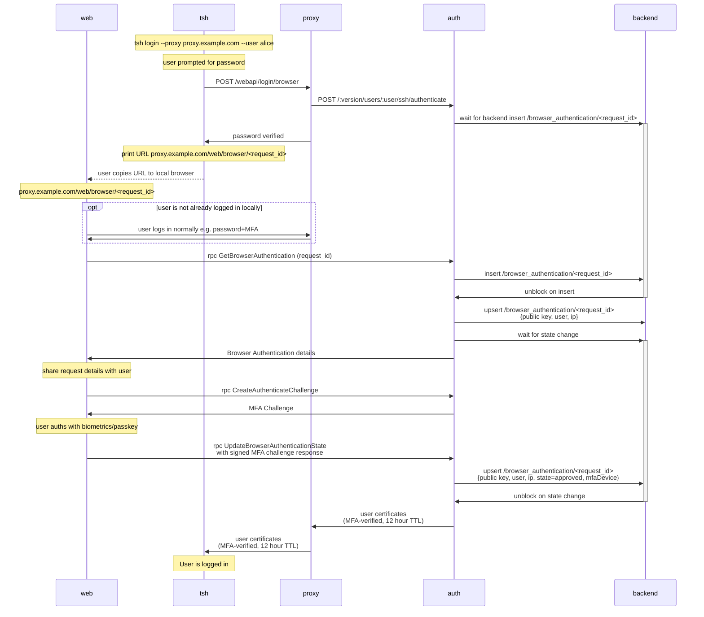

# RFD 233 - `tsh` Browser MFA

## Required Approvers

* Engineering: @zmb3 && (@codingllama || @Joerger)
* Security:
* Product:

## What

This RFD proposes a new method for users of `tsh` to be able to authenticate
themselves using their browser-based MFA.

## Why

We encourage our users to use the strongest methods of MFA when signing up for
an account through the web UI, such as passkeys and hardware keys. However,
some types of passkeys (namely Apple TouchID) don't transfer from the browser
to `tsh`. As a result users who set up Touch ID are unable to authenticate
with `tsh` unless they first add another MFA method (like TOTP).

This RFD aims to describe how we can allow `tsh` to delegate its MFA checks to
the web UI to enable easier access to biometrics and passkeys from both browsers
and password managers. We will also be one step closer to the ultimate goal of
removing support for TOTP in Teleport.

## Details

### UX

#### User stories

**Alice logs in to their cluster using `tsh`**

Alice is a new user who has created her account with a passkey as her second
factor. She would like to log in to her cluster using `tsh`. She runs the
following command:

```
tsh login --proxy teleport.example.com --user alice
```

She is asked for her password, which is then sent to Teleport. Teleport verifies
her username and password, and checks for valid methods of second factor
authentication. It finds her passkey returns a URL which `tsh` opens in the
default browser for her to complete the challenge. If a browser cannot be opened
the URL is printed out for her to click.

The browser will open to a page that contains a modal prompting her to verify it
is her by completing the MFA check. Once this is completed, the browser will
redirect back to `tsh`.

Alice is now authenticated and able to interact with resources on that cluster.

**Alice connects to a resource that requires per-session MFA**

Alice is already authenticated with her cluster, but wants to access a resource
that requires per-session MFA. She runs the following command:

```
tsh ssh alice@node
```

She is then redirected to the browser, or given a URL, to authenticate with her
MFA. Upon success, she is redirected back and the ssh session can continue.

### Design

#### Login process

This flow will be followed when a user first logs in to their cluster using
`tsh`. It follows the [headless authentication](0105-headless-authentication.md)
flow very closely as it is a proven method that achieves something very similar.



##### Login Flow

The flow can be broken down in to three sections:
1. `tsh` initiating a browser login flow
1. The user verifying their MFA through the browser
1. `tsh` receiving certificates 

##### `tsh` initiating a browser login flow

When the user performs a `tsh login`, it will check for either an explicit
`--mfa-mode=browser` flag or it will default to browser authentication if there
are no other MFA methods available. The user will be prompted for their
password. `tsh` will send a request to the proxy, which verifies the password.
If the password is wrong, return a failure message to `tsh`. If successful, the
proxy will send a request to the auth service and return a success message to
`tsh` to let it know it can generate and show the browser authentication URL.

The auth service will generate a Request ID that it will store on the backend
under `/browser_authentication/<request_id>`. Using the same method as [headless
authentication](0105-headless-authentication.md), the Request ID will be a UUID
derived from the client's public key to prevent an attacker intercepting the
browser login. The record will have a short TTL of 5 minutes. The auth server
waits for a decision from the user by using a resource watcher.

##### The user verifying their MFA through the browser

When `tsh` generates the MFA URL, it will attempt to open the user's default
browser. If that fails, it will print the URL for the user to click. 

Once in the browser, their login session will be used to connect to the auth
server. If the user is not already logged in, they will be prompted to do so.

When authenticated, the user can view the details of the request and either
approve or deny it. If the user approves, they will verify using their MFA
method. If the user denies the request, it will be marked as such on the
backend.

If the request is approved, the record is approved on the backend.

##### `tsh` receiving certificates

If the browser authentication is successful, the auth server will unblock the
request and `tsh` will receive its certificates. These will be the standard
12 hour certificates.

#### Per-session MFA

### Security

### Scale

### Backward Compatibility

### Test Plan