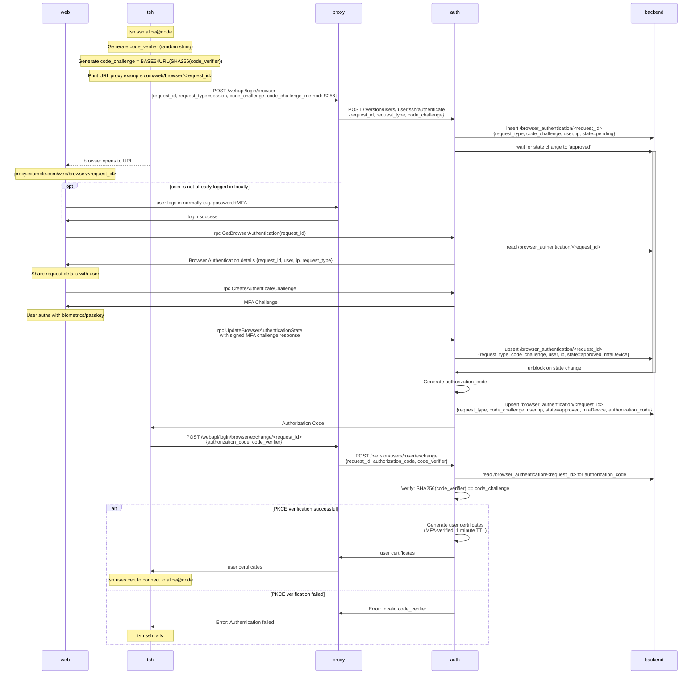

# RFD 233 - `tsh` Browser MFA

## Required Approvers

* Engineering: @zmb3 && (@codingllama || @Joerger)
* Security: @rob-picard-teleport

## What

This RFD proposes a new method for users of `tsh` to be able to authenticate
themselves using their browser-based MFA.

## Why

We encourage our users to use the strongest methods of MFA when signing up for
an account through the web UI, such as passkeys and hardware keys. However,
some types of passkeys (namely Apple TouchID) don't transfer from the browser
to `tsh`. As a result users who set up Touch ID are unable to authenticate
with `tsh` unless they first add another MFA method (like TOTP).

This RFD aims to describe how we can allow `tsh` to delegate its MFA checks to
the web UI to enable easier access to biometrics and passkeys from both browsers
and password managers. We will also be one step closer to the ultimate goal of
removing support for TOTP in Teleport.

## Details

### UX

#### User stories

**Alice logs in to their cluster using `tsh`**

Alice is a new user who has created her account with a passkey as her second
factor. She would like to log in to her cluster using `tsh`. She runs the
following command:

```
tsh login --proxy teleport.example.com --user alice
```

She is asked for her password, which is then sent to Teleport. Teleport verifies
her username and password, and checks for valid methods of second factor
authentication. It finds her passkey and returns a URL which `tsh` prints and
attempts to open in the default browser for her to complete the challenge.

The browser will open to a page that contains a modal prompting her to verify it
is her by completing the MFA check. Once this is completed, the browser will
redirect back to `tsh`.

Alice is now authenticated and able to interact with resources on that cluster.

**Alice connects to a resource that requires per-session MFA**

Alice is already authenticated with her cluster, but wants to access a resource
that requires per-session MFA. She runs the following command:

```
tsh ssh alice@node
```
The MFA URL is printed and `tsh` attempts to open her browser, to authenticate
with her MFA. Upon success, she is redirected back and the ssh session can
continue.

### Design

#### Login process

This flow will be followed when a user first logs in to their cluster using
`tsh`. It follows the [headless authentication](0105-headless-authentication.md)
flow very closely as it is a proven method that achieves something very similar.


##### Login Flow

The flow can be broken down in to three sections:
1. `tsh` initiating a browser login flow
1. The user verifying their MFA through the browser
1. `tsh` receiving certificates 

##### `tsh` initiating a browser login flow

When the user performs a `tsh login`, it will check for either an explicit
`--auth=browser` flag or it will error if there are no other MFA methods
available. This error will be changed to prompt the user to try browser
authentication.

`tsh` will send a unauthenticated request to `POST /webapi/login/headless` that
will remain open until the request is approved, denied, or times out. It will
send the client's SSH public key, proxy address, and the authentication type
etc. The Proxy fowards these details to the Auth server using
`POST /:version/users/:user/ssh/authenticate`. The security of this
unauthenticated endpoint will be discussed in the
[security section](#unauthenticated-webapiloginbrowser-endpoint).

The auth service will store the Request ID on the backend under
`/browser_authentication/<request_id>`. The record will have a short TTL of 5
minutes. It will contain the authentication type, user, ip, and the
current state (pending). The auth server waits for a decision from the user by
using a resource watcher.

##### The user verifying their MFA through the browser

When `tsh` generates the MFA URL, it will print the URL and attempt to open the
user's default browser.

Once in the browser, their login session will be used to connect to the auth
server. If the user is not already logged in, they will be prompted to do so.

When authenticated, the browser will make an
`rpc GetHeadlessAuthentication(request_id)` call to obtain the details of the
request. The user can view the details of the request and either
approve or deny it. The request details are as follows:
- user
- ip
- request_type (login or per-session MFA)
- request_id

The user will be reminded this request was generated from a `tsh login` attempt
and that they should check the above details to ensure they match what they
expect to see. If the user approves, they will verify using their MFA method. If
the user denies the request, it will be marked as such on the backend. If the
request is approved, the record is approved on the backend.

##### `tsh` receiving certificates

If the browser authentication is successful, the
`/headless_authentication/<request_id>` object will be upserted with an approved
state and which MFA device was used. The auth server will unblock the request
and certificates with the standard user TTL will be generated and returned to
`tsh`. If verification fails, an error will be returned.

#### Per-session MFA (TBD)

This flow will be followed when a user needs to reauthenticate before accessing
a protected resource.



The flow is similar to the [login flow](#login-flow) except for a few key
changes:
1. The flow is started when a user connects to a per-session MFA protected
   resource.
1. The certificate that `tsh` receives is stored in memory and has a TTL of 1
   minute, to allow the user to connect to the resource and nothing more.

### Security

#### Unauthenticated `/webapi/login/browser` endpoint

The endpoint that the unauthenticated `tsh` client will make a request to will
need to be unauthenticated. This exposes the proxy to the risk of DoS attacks.

To mitigate this risk, the endpoint will be rate limited and the
`BrowserAuthentication` object will be unique per user. The 
A `BrowserAuthentication` resource needs to be created on the backend to store
information about the request. Instead of creating the resource when the
unauthenticated `tsh` client sends a request, it will be created when the
authenticated user calls `rpc GetBrowserAuthentication`, which is called during
the browser authentication flow. Initially, `GetBrowserAuthentication` creates
an empty `BrowserAuthentication`, if it doesn't already exist. The details are
then updated by the auth service once it detects that the resource has been
created.

#### IP restrictions

The login flow creates a 12 hour certificate that is saved to disk, if stolen,
an attacker would have access for up to 12 hours. To mitigate this, the IP
address of `tsh` client and the browser session will be compared to check they
are the same. This ensures that users don't inadvertently create credentials on
a remote machine that may be shared,
[headless authentication](0105-headless-authentication.md) should be used in
this case. It also reduces the risk that a user is phished in to approving an
attacker's `tsh login` request because it is unlikely that the IP addresses will
match.

### Scale

This will increase load on auth servers with watchers that are waiting for
the `BrowserAuthentication` object on the backend to be created when an
unauthenticated `tsh` client initiates a login request. To limit the impact of
this, the watcher will be only be created once per client as described [above](#unauthenticated-webapiloginbrowser-endpoint). The watcher will also timeout
after 5 minutes, the same TTL as the user has to authenticate their request.

### Backward Compatibility

`tsh` will ping the proxy and determine its version before attempting browser
authentication. If the proxy is new enough, `tsh` will proceed with browser
authentication. If not, it will fallback to existing methods.

### Test Plan

Add a step to test that browser authentication works for logging in and for
per-session MFA.

### Audit Events

Events will be logged when:

1. `tsh` makes its initial unauthenticated request, which logs:
    - IP address
    - Client public key
    - Request type
1. a user approves/denies an authentication event, which logs:
    - IP address
    - Client public key
    - Request type
    - Request outcome
    - User
1. a certificate is generated upon a approval