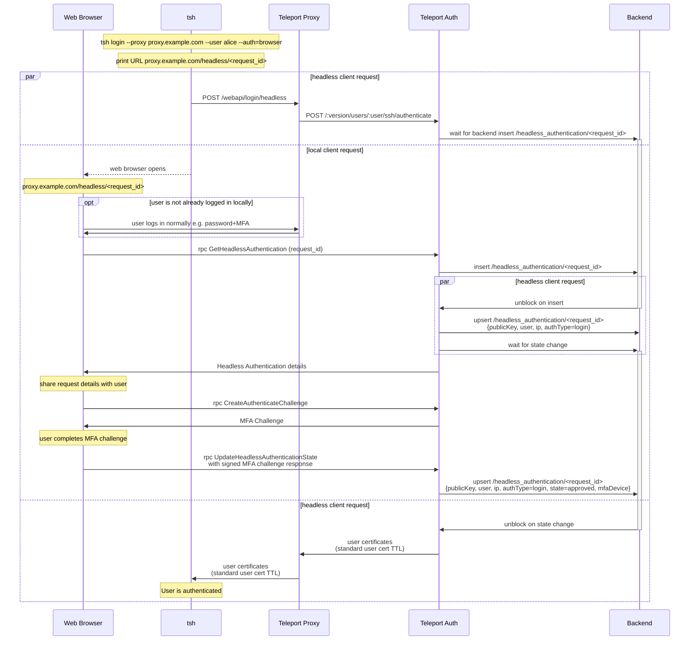
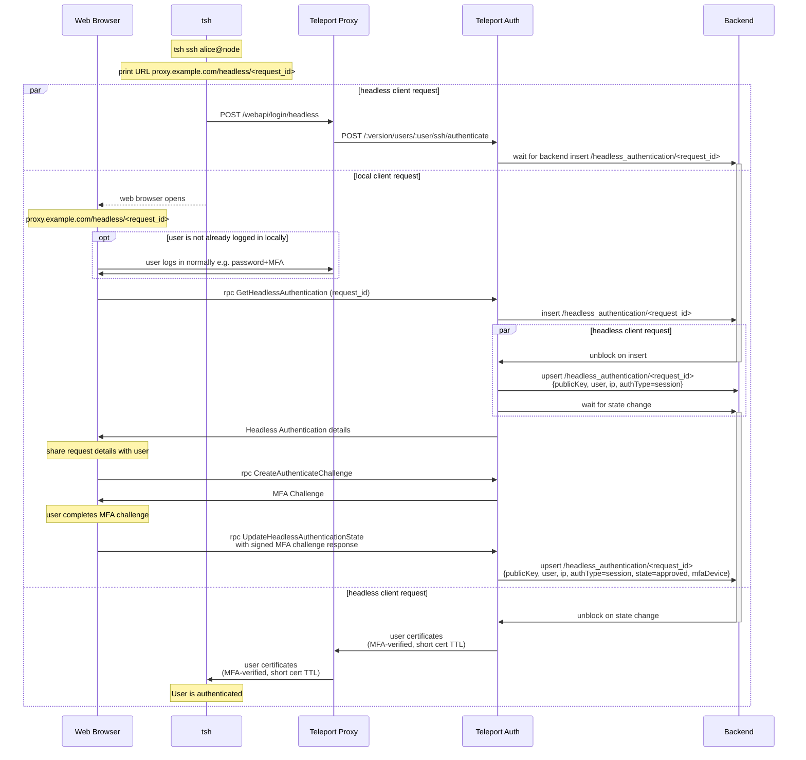

# RFD 233 - `tsh` Browser MFA

## Required Approvers

* Engineering: @zmb3 && (@codingllama || @Joerger)
* Security: @rob-picard-teleport

## What

This RFD proposes a new method for users of `tsh` to be able to authenticate
themselves using their browser-based MFA.

## Why

We encourage our users to use the strongest methods of MFA when signing up for
an account through the web UI, such as passkeys and hardware keys. However,
some types of passkeys (namely Apple TouchID) don't transfer from the browser
to `tsh`. As a result users who set up Touch ID are unable to authenticate
with `tsh` unless they first add another MFA method (like TOTP).

This RFD aims to describe how we can allow `tsh` to delegate its MFA checks to
the web UI to enable easier access to biometrics and passkeys from both browsers
and password managers. We will also be one step closer to the ultimate goal of
removing support for TOTP in Teleport.

## Details

### UX

#### User stories

**Alice logs in to their cluster using `tsh`**

Alice is a new user who has created her account with a passkey as her second
factor. She would like to log in to her cluster using `tsh`. She runs the
following command:

```
tsh login --proxy teleport.example.com --user alice
```

She is asked for her password, which is then sent to Teleport. Teleport verifies
her username and password, and checks for valid methods of second factor
authentication. Available methods of MFA are returned and `tsh` determines that
no security keys are present, so `tsh` catches the error and prints a URL and
attempts to open it in the default browser for her to complete the challenge.

The browser will open to a page that contains a modal prompting her to verify it
is her by completing the MFA check. Once this is completed, `tsh` will receive
its certificates from the proxy.

Alice is now authenticated and able to interact with resources on that cluster.

**Alice explicitly uses browser authentication**

Alice has multiple MFA methods configured (TOTP and a passkey), but prefers
to use their passkey through the browser. They run the following command:

```
tsh login --proxy teleport.example.com --user alice --auth=browser
```

By explicitly specifying `--auth=browser`, Alice tells `tsh` to use browser-based
authentication from the start, skipping any checks for local hardware keys or
TOTP. `tsh` prints the MFA URL and opens Alice's default browser. If Alice isn't
already authenticated, she is prompted to login, she is then prompted to
complete the MFA check with her passkey. After successful authentication, `tsh`
will receive its certificates from the proxy.

**Alice connects to a resource that requires per-session MFA**

Alice is already authenticated with her cluster, but wants to access a resource
that requires per-session MFA. She runs the following command:

```
tsh ssh alice@node
```

`tsh` queries the cluster for available methods of MFA and checks for local
hardware keys and SSO config that can be used for MFA. If none are found, `tsh`
falls back to browser-based MFA. The MFA URL is printed and `tsh` attempts to
open her browser, to authenticate with her MFA. Upon successful MFA, `tsh`
receives short-lived, MFA-verified certificates to connect to the resource.

### Design

#### Login process

This flow will be followed when a user first logs in to their cluster using
`tsh`. It uses the [headless authentication](0105-headless-authentication.md)
flow to authenticate the user with some modifications to the certificate that is
returned.



##### Login Flow

The flow can be broken down in to three sections:
1. `tsh` initiating a headless login flow
1. The user verifying their MFA through the browser
1. `tsh` receiving certificates 

##### `tsh` initiating a headless login flow

When the user performs a `tsh login`, it will check for either an explicit
`--auth=browser` flag or it will error if there are no other MFA methods
available. This error is caught and the user is prompted to try attempt
authentication through the browser.

`tsh` will send an unauthenticated request to `POST /webapi/login/headless` that
will remain open until the request is approved, denied, or times out. It will
send the client's SSH public key, proxy address, and the authentication type
etc. The Proxy forwards these details to the Auth server using
`POST /:version/users/:user/ssh/authenticate`. The security of this
unauthenticated endpoint will be discussed in the
[security section](#unauthenticated-webapiloginbrowser-endpoint).

The auth service will store the Request ID on the backend under
`/headless_authentication/<request_id>`. The record will have a short TTL of 5
minutes. It will contain the authentication type, user, ip, and the
current state (pending). The auth server waits for a decision from the user by
using a resource watcher on the headless authentication object.

##### The user verifying their MFA through the browser

When `tsh` generates the MFA URL, it will print the URL and attempt to open the
user's default browser.

Once in the browser, their login session will be used to connect to the auth
server. If the user is not already logged in, they will be prompted to do so.

When authenticated, the browser will make an
`rpc GetHeadlessAuthentication(request_id)` call to obtain the details of the
request. The user can view the details of the request and either
approve or deny it. The request details are as follows:
- user
- ip
- request_type (login or per-session MFA)
- request_id

The user will be reminded this request was generated from a `tsh login` attempt
and that they should check the above details to ensure they match what they
expect to see. If the user approves, they will verify using their MFA method. If
the user denies the request, it will be marked as such on the backend. If the
request is approved, the record is approved on the backend.

##### `tsh` receiving certificates

If the browser authentication is successful, the
`/headless_authentication/<request_id>` object will be upserted with an approved
state and which MFA device was used. The auth server will unblock the request
and certificates with the standard user TTL will be generated and returned to
`tsh`. If verification fails, an error will be returned.

#### Per-session MFA

This flow will be followed when a user wants to connect to a resource that
requires per-session MFA.



The flow is similar to the [login flow](#login-flow) except for two key
changes:
1. The flow is started when a user connects to a per-session MFA protected
   resource.
1. The certificate that `tsh` receives is a short-lived "session" certificate,
   which is kept in-memory

### Security

#### Unauthenticated `/webapi/login/headless` endpoint

The initial unauthenticated call from `tsh` to the proxy uses the existing
[endpoint](0105-headless-authentication.md#unauthenticated-headless-login-endpoint)
that was introduced by the headless authentication method. This feature doesn't
expand on this part of the flow.

#### IP restrictions

The login flow creates a 12 hour certificate that is saved to disk, if stolen,
an attacker would have access for up to 12 hours. To mitigate this, the IP
address of `tsh` client and the browser session will be compared to check they
are the same. This ensures that users don't inadvertently create credentials on
a remote machine that may be shared,
[headless authentication](0105-headless-authentication.md) should be used in
this case. It also reduces the risk that a user is phished in to approving an
attacker's `tsh login` request because it is unlikely that the IP addresses will
match.

### Scale

This will increase load on auth servers with watchers that are waiting for
the `HeadlessAuthentication` object on the backend to be created when an
unauthenticated `tsh` client initiates a login request. To limit the impact of
this, the watcher will be only be created once per client as described
[above](0105-headless-authentication.md#unauthenticated-headless-login-endpoint).
The watcher will also timeout after 5 minutes, the same TTL the user has to
authenticate their request.

When initiating a command that requires per-session MFA, a call to retrieve
authentication settings will need to be made to determine if browser MFA is
available. If this request hit the auth server every time, this would add a lot
of load. TBD how this impact will be lessened. 

### Backward Compatibility

`tsh` will `GET /webapi/ping` to get the authentication settings supported by
the cluster. If `AllowBrowser` is present and `true`, `tsh` will proceed with
browser authentication. If the field isn't present or it is set to false, 
browser authentication will not be attempted.

### Test Plan

Add steps to test that browser authentication works for logging in and for
per-session MFA.

### Audit Events

Events will be logged when:

1. `tsh` makes its initial unauthenticated request, which logs:
    - **Remote IP address** - `addr.remote` (`string`)
    - **Request type** - `method` (`string`)
    - **Request ID** - `uid` (`string`)
1. a user approves/denies an authentication event, which logs:
    - **Remote IP address** - `addr.remote` (`string`)
    - **Request type** - `method` (`string`)
    - **Request ID** - `uid` (`string`)
    - **Request outcome** - `success` (`boolean`)
    - **User** - `user` (`string`)

### Protobuf Definitions

```proto
package types;

message AuthPreferencesV2 {
    ...

    // AllowBrowser enables/disables tsh authentication via browser.
    // Browser authentication requires Webauthn to work.
    // Defaults to true if the Webauthn is configured, defaults to false
    // otherwise.
    BoolValue AllowBrowser = 23 [
        (gogoproto.nullable) = true,
        (gogoproto.jsontag) = "allow_browser,omitempty",
        (gogoproto.customtype) = "BoolOption"
    ];
}

message HeadlessAuthentication {
    ...

    // HeadlessAuthenticationType is the type of request that was initiated
    HeadlessAuthenticationType type = 9;
}

// HeadlessAuthenticationType is the type of authentication event
enum HeadlessAuthenticationType {
    HEADLESS_AUTHENTICATION_TYPE_UNSPECIFIED = 0;

    // headless login attempt
    HEADLESS_AUTHENTICATION_TYPE_HEADLESS = 1;

    // browser login attempt
    HEADLESS_AUTHENTICATION_TYPE_BROWSER = 2;

    // per-session MFA attempt
    HEADLESS_AUTHENTICATION_TYPE_SESSION = 3;
}
```

```proto
package events;
message UserLogin {
    ...

    // RequestID is a UUID used to correlate events from a single login flow that
    // spans multiple contexts
    string RequestID = 11 [(gogoproto.jsontag) = "request_id,omitempty];
}
```