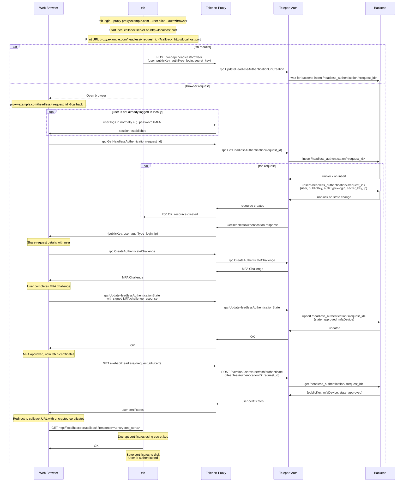

# RFD 233 - `tsh` Browser MFA

## Required Approvers

* Engineering: @zmb3 && (@codingllama || @Joerger)
* Security: @rob-picard-teleport

## What

This RFD proposes a new method for users of `tsh` to be able to authenticate
themselves using their browser-based MFA.

## Why

We encourage our users to use the strongest methods of MFA when signing up for
an account through the web UI, such as passkeys and hardware keys. However,
some types of passkeys (namely Apple TouchID) don't transfer from the browser
to `tsh`. As a result users who set up Touch ID are unable to authenticate
with `tsh` unless they first add another MFA method (like TOTP).

This RFD aims to describe how we can allow `tsh` to delegate its MFA checks to
the web UI to enable easier access to biometrics and passkeys from both browsers
and password managers. We will also be one step closer to the ultimate goal of
removing support for TOTP in Teleport.

## Details

### UX

#### User stories

**Alice logs in to their cluster using `tsh`**

Alice is a new user who has created her account with a passkey as her second
factor. She would like to log in to her cluster using `tsh`. She runs the
following command:

```
tsh login --proxy teleport.example.com --user alice
```

She is asked for her password, which is then sent to Teleport. Teleport verifies
her username and password, and checks for valid methods of second factor
authentication. Available methods of MFA are returned and `tsh` determines that
no security keys are present, so `tsh` catches the error and prints a URL and
attempts to open it in the default browser for her to complete the challenge.

The browser will open to a page that contains a modal prompting her to verify it
is her by completing the MFA check. Once this is completed, `tsh` will receive
its certificates from the proxy.

Alice is now authenticated and able to interact with resources on that cluster.

**Alice explicitly uses browser authentication**

Alice has multiple MFA methods configured (TOTP and a passkey), but prefers
to use their passkey through the browser. They run the following command:

```
tsh login --proxy teleport.example.com --user alice --auth=browser
```

By explicitly specifying `--auth=browser`, Alice tells `tsh` to use browser-based
authentication from the start, skipping any checks for local hardware keys or
TOTP. `tsh` prints the MFA URL and opens Alice's default browser. If Alice isn't
already authenticated, she is prompted to login, she is then prompted to
complete the MFA check with her passkey. After successful authentication, `tsh`
will receive its certificates from the proxy.

**Alice connects to a resource that requires per-session MFA**

Alice is already authenticated with her cluster, but wants to access a resource
that requires per-session MFA. She runs the following command:

```
tsh ssh alice@node
```

`tsh` queries the cluster for available methods of MFA and checks for local
hardware keys and SSO config that can be used for MFA. If none are found, `tsh`
falls back to browser-based MFA. The MFA URL is printed and `tsh` attempts to
open her browser, to authenticate with her MFA. Upon successful MFA, `tsh`
receives short-lived, MFA-verified certificates to connect to the resource.

**Alice uses a passwordless login**

Alice wants to login to her cluster using the passwordless flow, but she doesn't
have an MFA device registered that has passwordless capabilities (e.g. can't
verify the user using biometrics or PIN). She runs the following command to
login.

```
tsh login --proxy teleport.example.com --user alice --auth=passwordless
```

`tsh` detects that there are no TouchID keys, it then fallsback to FIDO2 keys
and finds none are present. These errors are caught and Browser MFA is
attempted. A URL is printed and her browser opens to Teleport's login page (if
she isn't already logged in), she authenticates and is asked if she wants to
approve this `tsh` login attempt. She approves, verifies using her
non-user-verified MFA, and her `tsh` session is authenticated. If a user isn't
specified, then an error will be shown prompting the user to try again with the
user flag. 

### Design

#### Login process

This flow will be followed when a user first logs in to their cluster using
`tsh`. It uses some of the
[headless authentication](0105-headless-authentication.md) flow to authenticate
the user with some modifications:
- There will be a new endpoint `/webapi/headless/browser` endpoint for `tsh` to
  hit which will solely deal with login events.
- A new gRPC UpdateHeadlessAuthenticationOnCreation on the auth server for the
  proxy to call which will fill in details when the HA object is created.
- The returned certificate is a typical user certificate with the standard TTL
  and is returned to the web browser instead of directly to `tsh` to mitigate
  phishing attacks.



##### Login Flow

The flow can be broken down in to three sections:
1. `tsh` initiating a headless login flow
1. The user verifying their MFA through the browser
1. `tsh` receiving certificates 

##### `tsh` initiating a headless login flow

When the user performs a `tsh login`, it will check for either an explicit
`--auth=browser` flag or it will error if there are no other MFA methods
available. This error is caught and the user is prompted to try attempt
authentication through the browser.

`tsh` will send an unauthenticated request to `POST /webapi/headless/browser`
that will remain open until the Headless Authentication object is created. It
will send the client's SSH public key, proxy address, and the authentication
type, secret key etc. The Proxy forwards these details to the Auth server using
a new endpoint `rpc UpdateHeadlessAuthenticationOnCreation`. The security of
this unauthenticated flow will be discussed in the
[security section](#unauthenticated-webapiheadlessbrowser-endpoint).

The auth service will store the Request ID on the backend under
`/headless_authentication/<request_id>`. The record will have a short TTL of 5
minutes. It will contain the authentication type, user, ip, and the
current state (pending). The auth server waits for the Headless Authentication
object to be created on the backend before it fills in the information it was
passed by `tsh`.

##### The user verifying their MFA through the browser

When `tsh` generates the MFA URL, it will print the URL and attempt to open the
user's default browser.

Once in the browser, their login session will be used to connect to the auth
server. If the user is not already logged in, they will be prompted to do so.

When authenticated, the browser will make an
`rpc GetHeadlessAuthentication(request_id)` call to obtain the details of the
request. The user can view the details of the request and either
approve or deny it. The request details are as follows:
- user
- ip
- request_type (login or per-session MFA)
- request_id

The user will be reminded this request was generated from a `tsh login` attempt
and that they should check the above details to ensure they match what they
expect to see. If the user approves, they will verify using their MFA method. If
the user denies the request, it will be marked as such on the backend. If the
request is approved, the record is approved on the backend.

##### `tsh` receiving certificates

To receive certificates, `tsh` creates a callback server for the browser to
communicate with.  If the browser authentication is successful, the
`/headless_authentication/<request_id>` object will be upserted with an approved
state and which MFA device was used. The browser will make a call to a new
endpoint (`GET /webapi/headless/<request_id>/certs`), which will check the
status of the Headless Authentication request, and generate certificates if it
was approved. The certificates will be encrypted using the secret key provided
by the initial `tsh` request and sent back to the browser. The browser will
send the payload to the callback server. If verification fails, won't request
certificates and will communicate that the callback server.

Upon `tsh` receiving the encrypted certificates, it will decrypt them and store
them on disk. These certificates will have the standard user TTL. If `tsh`
receives a failure message instead, it will show the user and they will remain
unauthenticated.

#### Per-session MFA

When a user connects to a resource that requires per-session MFA (e.g.,
`tsh db connect example-db`), `tsh` follows the same headless authentication flow
described in the [login process](#login-process) with the following differences:

1. **Endpoint**: `tsh` makes an authenticated request to
   `/webapi/headless/session`.
1. **Authentication type**: The `HeadlessAuthentication` object is created with
   `authType=session`.
1. **Certificates**: Upon successful MFA verification, `tsh` receives
   short-lived, MFA-verified certificates with a short TTL, which are kept
   in-memory.

The browser-based MFA ceremony proceeds identically to the login flow, with the
user approving the request and completing the MFA challenge in their browser.
The request details shown to the user will indicate this is a per-session MFA
request rather than a login request.

#### In-band per-session MFA

For resources and clusters that support it, in-band per-session MFA will be
used. As of the time of writing, this is only `ssh` resources. A similar flow
will be followed as described in the [Per-session MFA](#per-session-mfa), but
with the following differences:

1. **Authentication type**: The `HeadlessAuthentication` object is created with
   `authType=in-band`.
1. **RPC Calls**: Instead of using the `CreateAuthenticateChallenge`,
   `CreateSessionChallenge` and `ValidateSessionChallenge` will be used.
1. **Authentication method**: Instead of the browser receiving certificates, it
   will receive a challenge name from the In-band MFA Service. This will be sent
   to `tsh` through the callback server, if the verification process is
   successful.

### Security

#### Unauthenticated `/webapi/headless/browser` endpoint

The initial unauthenticated call from `tsh` to the proxy uses a new endpoint
similar to the existing headless
[endpoint](0105-headless-authentication.md#unauthenticated-headless-login-endpoint)
that was introduced by the headless authentication method. The security of this
endpoint is explained in more detail in the linked documentation, but in short,
it is a rate limited endpoint that will only write resources to the backend once
a matching authenticated request is made from an authenticated user's browser.
This new endpoint will only accept requests from the browser login flow and
return certificates for a browser login request.

### Scale

This will increase load on auth servers with watchers that are waiting for
the `HeadlessAuthentication` object on the backend to be created when an
unauthenticated `tsh` client initiates a login request. To limit the impact of
this, the watcher will be only be created once per client as described
[above](0105-headless-authentication.md#unauthenticated-headless-login-endpoint).
The watcher will also timeout after 5 minutes, the same TTL the user has to
authenticate their request.

When initiating a command that requires per-session MFA, a call to retrieve
authentication settings will need to be made to determine if browser MFA is
available. If this request hit the auth server every time, this would add a lot
of load. TBD how this impact will be lessened. 

### Backward Compatibility

`tsh` will `GET /webapi/ping` to get the authentication settings supported by
the cluster. If `AllowBrowser` is present and `true`, `tsh` will proceed with
browser authentication. If the field isn't present or it is set to false, 
browser authentication will not be attempted.

### Test Plan

Add steps to test that browser authentication works for logging in and for
per-session MFA.

### Audit Events

Events will be logged when:

1. `tsh` makes its initial unauthenticated request, which logs:
    - **Remote IP address** - `addr.remote` (`string`)
    - **Request type** - `method` (`string`)
    - **Request ID** - `uid` (`string`)
1. a user approves/denies an authentication event, which logs:
    - **Remote IP address** - `addr.remote` (`string`)
    - **Request type** - `method` (`string`)
    - **Request ID** - `uid` (`string`)
    - **Request outcome** - `success` (`boolean`)
    - **User** - `user` (`string`)

### Protobuf Definitions

```proto
package types;

message AuthPreferencesV2 {
    ...

    // AllowBrowser enables/disables tsh authentication via browser.
    // Browser authentication requires Webauthn to work.
    // Defaults to true if the Webauthn is configured, defaults to false
    // otherwise.
    BoolValue AllowBrowser = 23 [
        (gogoproto.nullable) = true,
        (gogoproto.jsontag) = "allow_browser,omitempty",
        (gogoproto.customtype) = "BoolOption"
    ];
}

message HeadlessAuthentication {
    ...

    // Type is the type of request that was initiated
    HeadlessAuthenticationType type = 9;

    // SecretKey is the symmetric key used to encrypt callback responses to tsh
    string secret_key = 10;
}

// HeadlessAuthenticationType is the type of authentication event
enum HeadlessAuthenticationType {
    HEADLESS_AUTHENTICATION_TYPE_UNSPECIFIED = 0;

    // headless login attempt
    HEADLESS_AUTHENTICATION_TYPE_HEADLESS_LOGIN = 1;

    // browser login attempt
    HEADLESS_AUTHENTICATION_TYPE_BROWSER_LOGIN = 2;

    // per-session MFA attempt
    HEADLESS_AUTHENTICATION_TYPE_BROWSER_SESSION = 3;

    // in-band per-session MFA attempt
    HEADLESS_AUTHENTICATION_TYPE_BROWSER_IN_BAND_SESSION = 4;
}
```

```proto
package events;

message UserLogin {
    ...

    // RequestID is a UUID used to correlate events from a single login flow
    // that spans multiple contexts
    string RequestID = 11 [(gogoproto.jsontag) = "request_id,omitempty];
}
```

```proto
package proto;

// UpdateHeadlessAuthenticationOnCreationRequest is the request messsage for
// UpdateHeadlessAuthenticationOnCreation
message UpdateHeadlessAuthenticationOnCreationRequest {
    // User is the teleport user requesting authentication
    string user = 1;
    
    // PublicKey is the client's SSH public key
    bytes public_key = 2;
    
    // Type is the authentication type (login, session, or in-band session)
    types.HeadlessAuthenticationType type = 3;
    
    // SecretKey is the symmetric key used to encrypt callback responses to tsh
    string secret_key = 4;
}

service AuthService {
    ...

    // UpdateHeadlessAuthenticationOnCreation 
    rpc UpdateHeadlessAuthenticationOnCreation(UpdateHeadlessAuthenticationOnCreationRequest) returns (google.protobuf.Empty);
}
```

### Proxy changes

#### `POST /webapi/headless/browser`

This will be a new unauthenticated endpoint for `tsh` to initiate a browser
login. The call that will hang until the Headless Authentication object is
created or until a three-minute timeout is reached. The security of this
endpoint is discussed in the
[security section](#unauthenticated-webapiheadlessbrowser-endpoint).

**Request Payload:**

```json
{
  "user": "alice",
  "public_key": "<base64-encoded SSH public key>",
  "auth_type": "login",
  "secret_key": "<symmetric encryption key>"
}
```

**Response:**

- `200 OK`: The `HeadlessAuthentication` resource has been created on the backend
- `400 Bad Request`: Invalid request payload with error message
- `429 Too Many Requests`: Rate limiting has been triggered

#### `POST /webapi/headless/session`

This will be a new authenticated endpoint for `tsh` to initiate a session or
in-band session request. The call that will hang until the Headless
Authentication object is created or until a three-minute timeout is reached.

**Request Payload:**

```json
{
  "user": "alice",
  "public_key": "<base64-encoded SSH public key>", // Used for session only
  "auth_type": "[session|in-band-session]",
  "secret_key": "<symmetric encryption key>"
}
```

**Response:**

- `200 OK`: The `HeadlessAuthentication` resource has been created on the backend
- `400 Bad Request`: Invalid request payload with error message
- `429 Too Many Requests`: Rate limiting has been triggered

#### `GET /webapi/headless/<request_id>/certs`

This authenticated endpoint will be called from the browser once the headless
request has been approved and MFA has been verified in order to create the
certificates required for login and session requests. Upon successful
certificate generation, the Headless Authentication object will be deleted to
prevent subsequent requests generating more certificates.

**Response:**

- `200 OK`: The endpoint will return an encrypted `SSHLoginResponse` object for
  a successful request.
- `400 Bad Request`: Invalid request payload with error message
- `429 Too Many Requests`: Rate limiting has been triggered
