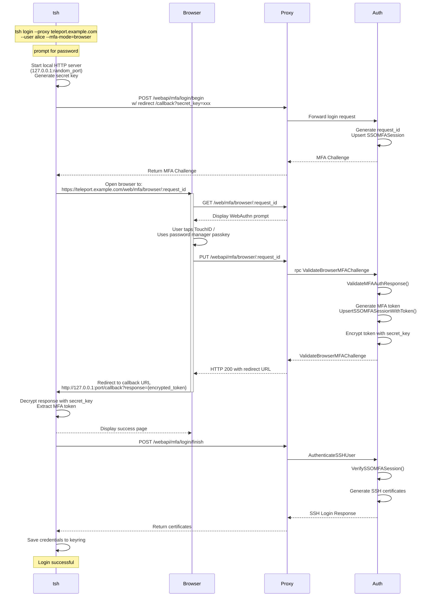

# RFD 233 - `tsh` Browser MFA

## Required Approvers

* Engineering: @zmb3 && (@codingllama || @Joerger)
* Security: @rob-picard-teleport

## What

This RFD proposes a new method for users of `tsh` to be able to solve MFA
challenges via the browser.

## Why

We encourage our users to use the strongest methods of MFA when signing up for
an account through the web UI, such as passkeys and hardware keys. However,
some types of passkeys (namely Apple TouchID) don't transfer from the browser
to `tsh`. As a result users who set up Touch ID are unable to authenticate
with `tsh` unless they first add another MFA method (like TOTP).

This RFD aims to describe how we can allow `tsh` to delegate its MFA checks to
the web UI to enable easier access to biometrics and passkeys from both browsers
and password managers. We will also be one step closer to the ultimate goal of
removing support for TOTP in Teleport.

## Details

### UX

#### User stories

**Alice logs in to their cluster using `tsh`**

Alice is a new user who has created her account with a passkey as her second
factor. She would like to log in to her cluster using `tsh`. She runs the
following command:

```
tsh login --proxy teleport.example.com --user alice
```

She is asked for her password, which is then sent to Teleport. Teleport verifies
her username and password, and checks for valid methods of second factor
authentication. Available methods of MFA are returned and `tsh` determines that
no security keys are present, so `tsh` catches the error and switches to browser
MFA, which prints a URL and attempts to open it in the default browser for her
to complete the challenge.

The browser will open to a page that contains a modal prompting her to verify it
is her by completing the MFA check. Once this is completed, `tsh` will receive
its certificates from the proxy.

Alice is now authenticated and able to interact with resources on that cluster.

**Alice connects to a resource that requires per-session MFA**

Alice is already authenticated with her cluster, but wants to access a resource
that requires per-session MFA. She runs the following command:

```
tsh ssh alice@node
```

`tsh` queries the cluster for available methods of MFA and checks for local
hardware keys and SSO config that can be used for MFA. If none are found, `tsh`
falls back to browser-based MFA. The MFA URL is printed and `tsh` attempts to
open her browser, to authenticate with her MFA. Upon successful MFA, `tsh`
receives short-lived, MFA-verified certificates through a callback to connect to
the resource.

### Design

#### Login MFA process



##### Login MFA Flow

The flow can be broken down in to three sections:

##### `tsh` initiating a login flow

When the user performs a `tsh login` and enters their password, `tsh` starts a
local HTTP callback server and generates a client redirect URL containing a
secret key. It then calls `CreateAuthenticateChallenge` with this redirect URL
included in the request. The auth server processes the request and returns an
MFA challenge containing all applicable authentication methods for the user. If
the user has browser MFA available, the server calls `BeginSSOMFAChallenge` to
generate a request ID, stores an `SSOMFASession` object in the backend, and
includes a browser challenge in the response. This browser challenge contains
the request ID and a redirect URL pointing to `/web/mfa/browser/:request_id`.

Once `tsh` receives the challenge response with available MFA methods, it
determines which method to use. If the user specified an explicit
`--mfa-mode=browser` flag, browser-based MFA will be used. Otherwise, `tsh` will
attempt to use available methods in the order:
1. WebAuthn+TOTP (if both available)
1. WebAuthn
1. SSO
1. Browser
1. TOTP
e.g:

```shell
❯ ./tsh login --proxy teleport.example.com --user alice
Enter password for Teleport user alice:
Available MFA methods [WEBAUTHN, SSO, BROWSER]. Continuing with WEBAUTHN.
If you wish to perform MFA with another method, specify with flag --mfa-mode=<webauthn,sso,browser> or environment variable TELEPORT_MFA_MODE=<webauthn,sso,browser>.

ERROR: no security keys found
Falling back to Browser
```

##### The user verifying their MFA through the browser

When `tsh` receives the MFA challenge from the auth server, it will open the
user's default browser to the MFA URL that was returned.

Once in the browser, their login session will be used to connect to the auth
server. If the user is not already logged in, they will be prompted to do so.

When authenticated, the user will be prompted to verify their MFA. Once they've
done so, a request to `/webapi/mfa/browser/:request_id` will take the challenge response
and verify it through `rpc ValidateBrowserMFAChallenge`. If the response
is valid, the auth server will generate an MFA token and upsert it in to the
backend `SSOMFASession` resource, encrypt it, and append it to the callback URL
to be returned back to the browser.

##### `tsh` receiving certificates

The browser receives the redirect URL with encrypted secret and redirects to it.
`tsh`'s callback server receives the request and extracts the encrypted
response. It decrypts the MFA token with the secret key and calls
`POST /webapi/mfa/login/finish` with the MFA token. The proxy calls
`AuthenticateSSHUser` to exchange the MFA token for certificates, which `tsh`
then saves to disk.

#### Per-session MFA

For per-session MFA, the MFA verification flow is the same (verify through
browser and receive result to callback), but the initialization and certificate
retrieval is different:

1. Instead of initiating the flow by calling `POST /webapi/mfa/login/begin`,
   `tsh` will call `rpc CreateAuthenticateChallenge` with `SCOPE_USER_SESSION`.
   Which will then open the browser to `/web/mfa/browser/:request_id` and
   continue as per the login flow.
1. Once the MFA token is received through the callback server,
   `rpc GenerateUserCerts` is called to exchange the token for certificates,
   instead of `POST /webapi/mfa/login/finish`.

#### In-band MFA

For resources and clusters that support it, in-band per-session MFA will be
used. As of the time of writing, this is only `ssh` resources. As above, this
follows a similar flow to the login process, but with the following changes:

1. The trigger to get a MFA Challenge from the server is started by dialing an
   ssh target. If `tsh` gets an "MFA required" message, it will call
   `rpc CreateSessionChallenge` which will return an MFA Challenge.
   Which will then open the browser to `/web/mfa/browser/:request_id` and
   continue as per the login flow.
1. Once the challenge is solved and the MFA token is sent back to `tsh`, instead
   of verifying the SSO MFA session to get certificates, the MFA token is sent
   to the MFA service using `rpc ValidateSessionChallenge`. After which, the ssh
   session is allowed to continue its connection

More context on the in-band flow can be found in
[RFD 234](0234-in-band-mfa-ssh-sessions.md#local-cluster-flow).

### Configuration

Browser MFA will be enabled by default for all clusters, providing an automatic
fallback option when hardware keys are not available. This ensures users who
configure passkeys through the web UI (such as TouchID) can still authenticate
via `tsh` without additional setup.

Administrators can control browser MFA availability through the cluster's
authentication preference configuration:

```yaml
kind: cluster_auth_preference
version: v2
metadata:
  name: cluster-auth-preference
spec:
  # Whether browser authentication is enabled for this cluster
  # Default: true
  allow_browser_authentication: true
```

When `allow_browser_authentication: false`, the auth server will not return a
`BrowserChallenge` in MFA challenge responses, and users attempting to use
`--mfa-mode=browser` will receive an error indicating the feature isn't
available.

### Security

#### `rpc ValidateBrowserMFAChallenge`

The RPC endpoint is restricted to the proxy service only via builtin role
authorization, verifying the caller has the `RoleProxy` builtin role before
processing requests. When validating the MFA response, the implementation uses
the username stored in the `SSOMFASession` (created during the initial login
request) rather than the caller's identity, ensuring the MFA challenge is
validated against the correct user and preventing session confusion attacks.
After successful validation, a unique token is generated and stored in the
`SSOMFASession`, which can only be used once when exchanged for certificates to
prevent replay attacks.

The MFA token is encrypted with a secret key generated by `tsh` and included in
the client redirect URL. This ensures that even if the redirect URL is
intercepted, the token cannot be read without the secret key. The request ID
must correspond to a valid `SSOMFASession` in the backend and should be
generated using cryptographically secure random number generation to prevent
enumeration attacks. `SSOMFASession` resources have a short time-to-live
(5 minutes) to limit the window during which an MFA challenge can be completed.

#### `PUT /webapi/mfa/browser/:request_id`

The HTTP endpoint requires authentication via the proxy's session context. The
endpoint validates that the request ID in the URL matches an existing
SSOMFASession on the backend before forwarding the MFA response to the auth
server. The MFA challenge response must be correctly formatted and match the
expected challenge stored in the SSOMFASession, with invalid or malformed
responses rejected with appropriate error codes.

### Scale

This feature will result in an `SSOMFASession` being created on the backend
when a user attempts to login, per-session, or perform an admin action. This is
an acceptable trade-off for the improved UX.

### Backward Compatibility

#### Newer `tsh` client, older server

If a newer client sends a request to initiate an MFA challenge to an older
server, it won't return a `BrowserChallenge` field. If the user has specifically
requested `--mfa-mode=browser`, we can show an error saying browser MFA isn't
available. Which will also be done if the cluster has browser MFA disabled.

#### Older `tsh` client, newer server

If an older `tsh` client sends a request to initiate an MFA challenge, the newer
server will respond with a `BrowserChallenge` as an option for the user to MFA.
The older client won't have knowledge of this field and won't consider it as an
option for the user to MFA.

### Test Plan

Add steps to test that browser MFA works for logging in and per-session MFA.

### Audit Events

Audit events do not need to be modified. It will be shown that a user used
browser authentication in the `MFA Authentication Success` audit event:

```json
{
    ...

    "mfa_device": {
        // The name of the device used to MFA in the browser
        "mfa_device_name": "1Password",
        "mfa_device_type": "browser",
        // The UUID of the device used to MFA in the browser
        "mfa_device_uuid": "aec27285-dcfd-4c19-92ad-9241624c264f",
    },
}
```

### Protobuf Definitions

```proto
package proto;

// MFAAuthenticateChallenge is a challenge for all MFA devices registered for a
// user.
message MFAAuthenticateChallenge {
  ...

  // Browser Challenge is MFA challenge that the user solves in the browser.
  BrowserChallenge BrowserChallenge = 6;
}

// BrowserChallenge contains browser auth request details to perform a browser MFA check.
message BrowserChallenge {
  // request_id is the ID of a browser auth request.
  string request_id = 1;
  // redirect_url is a redirect URL to initiate the browser MFA flow.
  string redirect_url = 2;
  // Device is the SSO device corresponding to the challenge.
  types.SSOMFADevice device = 3;
}

// BrowserResponse is a response to BrowserChallenge.
message BrowserResponse {
  // request_id is the ID of a browser auth request.
  string request_id = 1;
  // Token is a secret token used to verify the user's browser MFA session.
  string token = 2;
}

// ValidateBrowserMFAChallengeRequest is used to validate an MFA response
// during a browser-based MFA authentication flow.
message ValidateBrowserMFAChallengeRequest {
  string request_id = 1 [(gogoproto.jsontag) = "request_id,omitempty"];
  MFAAuthenticateResponse mfa_authenticate_response = 2 [(gogoproto.jsontag) = "mfa_authenticate_response,omitempty"];
}

// ValidateBrowserMFAChallengeResponse contains the redirect URL to send
// the user back to after successfully completing browser-based MFA authentication.
message ValidateBrowserMFAChallengeResponse {
  // client_redirect_url is the callback URL to tsh's local HTTP server with the encrypted MFA token.
  // Format: http://127.0.0.1:[random_port]/callback?response={encrypted_token}
  string client_redirect_url = 1 [(gogoproto.jsontag) = "client_redirect_url,omitempty"];
}

// AuthService is authentication/authorization service implementation
service AuthService {
  ...

  // ValidateBrowserMFAChallenge validates browser MFA challenge responses and
  // generates a single-use MFA token. This endpoint is restricted to proxy service only via
  // builtin role authorization. The MFA response is validated against the SSOMFASession
  // identified by the request_id, ensuring it matches the expected user and hasn't been
  // used previously. The generated MFA token can only be used once to prevent replay attacks.
  rpc ValidateBrowserMFAChallenge(ValidateBrowserMFAChallengeRequest) returns (ValidateBrowserMFAChallengeResponse);
}

// CreateAuthenticateChallengeRequest is a request for creating MFA authentication challenges for a
// users mfa devices.
message CreateAuthenticateChallengeRequest {
  ...

  // browser_mfa_client_redirect_url should be supplied if the client supports Browser MFA checks.
  string browser_mfa_client_redirect_url = 9 [(gogoproto.jsontag) = "browser_mfa_client_redirect_url,omitempty"];
}
```

```proto
package teleport.mfa.v1;

// AuthenticateChallenge is a challenge for all MFA devices registered for a user.
message AuthenticateChallenge {
  ...

  // Browser challenge allows a user to MFA in the browser,
  // to get an MFA token that is returned to the client to be used for verification.
  BrowserChallenge browser_challenge = 4;
}

// AuthenticateResponse is a response to AuthenticateChallenge using one of the MFA devices registered for a user.
message AuthenticateResponse {
  ...
  oneof response {
    ...

    // Response to a browser challenge.
    BrowserResponse browser = 4;
  }
}

// CreateSessionChallengeRequest is the request message for CreateSessionChallenge.
message CreateSessionChallengeRequest {
  ...

  // Used to construct the redirect URL for browser-based MFA flows. If the client supports browser MFA, this field
  // should be set to the URL where the browser should redirect after completing the MFA challenge.
  string browser_mfa_client_redirect_url = 5;
}

// BrowserChallenge contains browser auth request details to perform a browser MFA check.
message BrowserChallenge {
  // ID of a browser auth request.
  string request_id = 1;
  // Redirect URL to initiate the browser MFA flow.
  string redirect_url = 2;
  // SSO device corresponding to the challenge.
  types.SSOMFADevice device = 3;
}

// BrowserResponse is a response to BrowserChallenge.
message BrowserResponse {
  // ID of a browser auth request.
  string request_id = 1;
  // Secret token used to verify the user's browser MFA session.
  string token = 2;
}
```

```proto
package teleport.lib.teleterm.v1;

// Request for PromptMFA.
message PromptMFARequest {
  ...

  BrowserChallenge browser = 8;
}

// BrowserChallenge contains browser challenge details.
message BrowserChallenge {
  string redirect_url = 1;
}
```

### Proxy changes

#### `PUT /webapi/mfa/browser/:request_id`

This endpoint will be called by the browser to verify the user's MFA challenge
response and, if successful, generates a callback URL with an encrypted response
containing the MFA token.

**Request Payload:**

```json
{
  "SSO": {
    "request_id": "abc123-def456-ghi789",
    "token": "eyJhbGciOiJIUzI1NiIsInR5cCI6IkpXVCJ9..."
  }
}
```

**Response:**

- `200 OK`: Returns redirect URL with encrypted MFA token
- `400 Bad Request`: Invalid body | Empty MFA
- `403 Forbidden`: Invalid/expired token

## Stretch Goals

### `tsh` passwordless login

The UX of a user logging in to their cluster via `tsh` could be simplified
further by allowing them to use their browser-based passkey. The proposed flow
is described in the following user story:

**Alice uses a passwordless login**

Alice wants to login to her cluster using the passwordless flow, but she doesn't
have an MFA device registered that has passwordless capabilities (e.g. can't
verify the user using biometrics or PIN). She runs the following command to
login.

```
tsh login --proxy teleport.example.com --user alice --auth=browser
```

`tsh` detects that there are no TouchID keys, it then falls back to FIDO2 keys
and finds none are present. These errors are caught and browser authentication
is attempted. A URL is printed and her browser opens to Teleport's login page
(if she isn't already logged in), she authenticates and is asked if she wants to
approve this `tsh` login attempt. She approves, verifies using her Passkey
(biometric or PIN), and her `tsh` session is authenticated.

### Browser MFA without Re-authentication

When a user is already authenticated via `tsh` but needs to complete an MFA
challenge (such as for per-session MFA), requiring them to also be logged in
to the browser creates friction. This is especially problematic when
the user may not have an active browser session or uses different browser
profiles for different accounts.

**Alice completes per-session MFA without browser login**

Alice is already authenticated to her cluster via `tsh` and wants to access a
resource that requires per-session MFA. She runs:

```
tsh ssh alice@node
```

`tsh` determines that browser MFA is needed and makes a request to generates a
temporary, single-use MFA challenge URL. When Alice opens this URL in her
browser, instead of being redirected to the login page, she is immediately
presented with the MFA prompt. She completes the MFA challenge with her passkey,
and `tsh` receives the MFA token to continue the connection.
