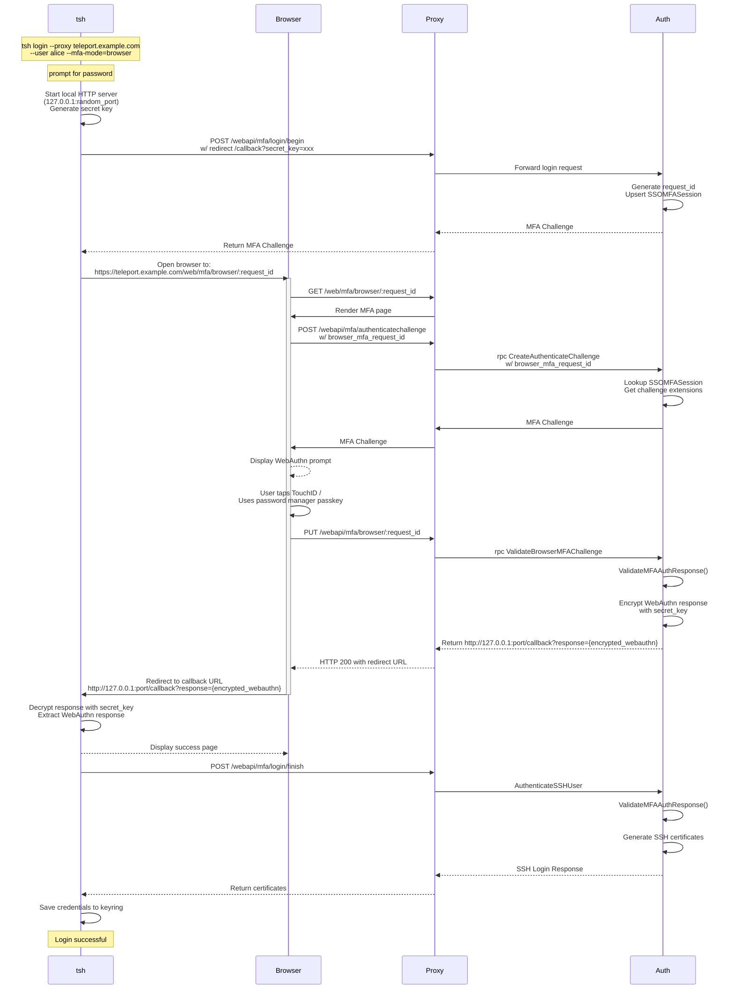

# RFD 233 - `tsh` Browser MFA

## Required Approvers

* Engineering: @zmb3 && (@codingllama || @Joerger)
* Security: @rob-picard-teleport

## What

This RFD proposes a new method for users of `tsh` to be able to solve MFA
challenges via the browser.

## Why

We encourage our users to use the strongest methods of MFA when signing up for
an account through the web UI, such as passkeys and hardware keys. However,
some types of passkeys (namely Apple TouchID) don't transfer from the browser
to `tsh`. As a result users who set up Touch ID are unable to authenticate
with `tsh` unless they first add another MFA method (like TOTP).

This RFD aims to describe how we can allow `tsh` to delegate its MFA checks to
the web UI to enable easier access to biometrics and passkeys from both browsers
and password managers. We will also be one step closer to the ultimate goal of
removing support for TOTP in Teleport.

This approach is taken over using OS-native APIs due to inconsistencies in
implementation and platform limitations, more details can be found in
[Other Considerations](#other-considerations).

## Details

### UX

#### User stories

**Alice logs in to their cluster using `tsh`**

Alice is a new user who has created her account with a passkey as her second
factor. She would like to log in to her cluster using `tsh`. She runs the
following command:

```
tsh login --proxy teleport.example.com --user alice
```

She is asked for her password, which is then sent to Teleport. Teleport verifies
her username and password, and checks for valid methods of second factor
authentication. Available methods of MFA are returned and `tsh` determines that
no security keys are present, so `tsh` catches the error and switches to browser
MFA, which prints a URL and attempts to open it in the default browser for her
to complete the challenge.

The browser will open to a page that contains a modal prompting her to verify it
is her by completing the MFA check. Once this is completed, `tsh` will receive
its certificates from the proxy.

Alice is now authenticated and able to interact with resources on that cluster.

**Alice connects to a resource that requires per-session MFA**

Alice is already authenticated with her cluster, but wants to access a resource
that requires per-session MFA. She runs the following command:

```
tsh ssh alice@node
```

`tsh` queries the cluster for available methods of MFA and checks for local
hardware keys and SSO config that can be used for MFA. If none are found, `tsh`
falls back to browser-based MFA. The MFA URL is printed and `tsh` attempts to
open her browser, to authenticate with her MFA. Upon successful MFA, `tsh`
receives short-lived, MFA-verified certificates through a callback to connect to
the resource.

### Design

The design of this process follows the flow of [SSO MFA](0180-sso-mfa.md). More
details on the underlying features can be found in that RFD.

#### Login MFA process



##### Login MFA Flow

The flow can be broken down in to three sections:

##### `tsh` initiating a login flow

When the user performs a `tsh login` and enters their password, `tsh` starts a
local HTTP callback server and generates a client redirect URL containing a
secret key. It then calls `CreateAuthenticateChallenge` with this redirect URL
included in the request. The auth server processes the request and returns an
MFA challenge containing all applicable authentication methods for the user. If
the user has browser MFA available, the server calls `BeginSSOMFAChallenge` to
generate a request ID, stores an `SSOMFASession` object in the backend, and
includes a browser challenge in the response. This browser challenge contains
the request ID and a redirect URL pointing to `/web/mfa/browser/:request_id`.

Once `tsh` receives the challenge response with available MFA methods, it
determines which method to use. If the user specified an explicit
`--mfa-mode=browser` flag, browser-based MFA will be used. Otherwise, `tsh` will
attempt to use available methods in the order:
1. WebAuthn+TOTP (if both available)
1. WebAuthn
1. SSO
1. Browser
1. TOTP

For all methods, expect TOTP, the client will silently fallback through each of
the above methods until it finds one that can be completed by the client. For
example, WebAuthn is silently skipped if no keys are available, SSO and Browser
are silently skipped if no URL was returned. It cannot be determined if the user
has access to their TOTP code, so that cannot be skipped silently. The user will
still be made aware that they can specify a `--mfa-mode` if they didn't
explicitly choose one.

##### The user verifying their MFA through the browser

When `tsh` receives the MFA challenge from the auth server, it will open the
user's default browser to the MFA URL that was returned.

Once in the browser, their login session will be used to connect to the auth
server. If the user is not already logged in, they will be prompted to do so.

When authenticated, a `POST /webapi/mfa/authenticatechallenge` request is made
with the `browser_mfa_request_id` from the URL. The auth server looks up the
`SSOMFASession` to retrieve the challenge extensions and generates an MFA
challenge accordingly. The user will then solve the MFA challenge. Once they've
done so, a request to
`PUT /webapi/mfa/browser/:request_id` will take the WebAuthn challenge response
and verify it through `rpc ValidateBrowserMFAChallenge`. If the response is
valid, the auth server will encrypt the WebAuthn response using the secret key
from the client redirect URL and return it in the callback URL.

##### `tsh` receiving certificates

The browser receives the redirect URL with encrypted WebAuthn response and
redirects to it. `tsh`'s callback server receives the request and extracts the
encrypted response. It decrypts the WebAuthn response with the secret key and
calls `POST /webapi/mfa/login/finish` with the WebAuthn response. The proxy
calls `AuthenticateSSHUser`, which validates the WebAuthn response again and
generates certificates, which `tsh` then saves to disk.

#### Per-session MFA

For per-session MFA, the MFA verification flow is the same (verify through
browser and receive result to callback), but the initialization and certificate
retrieval is different:

1. Instead of initiating the flow by calling `POST /webapi/mfa/login/begin`,
   `tsh` will call `rpc CreateAuthenticateChallenge` with `SCOPE_USER_SESSION`.
   Which will then open the browser to `/web/mfa/browser/:request_id` and
   continue as per the login flow.
1. Once the WebAuthn response is received through the callback server,
   `rpc GenerateUserCerts` is called with the WebAuthn response to obtain
   certificates, instead of `POST /webapi/mfa/login/finish`.

#### In-band MFA

For resources and clusters that support it, in-band per-session MFA will be
used. As of the time of writing, this is only `ssh` resources. This follows a
similar flow to the login process, but with the following changes:

1. The trigger to get a MFA Challenge from the server is started by dialing an
   ssh target. If `tsh` gets an "MFA required" message, it will call
   `rpc CreateSessionChallenge` which will return an MFA Challenge.
   Which will then open the browser to `/web/mfa/browser/:request_id` and
   continue as per the login flow.
1. Once the challenge is solved and the WebAuthn response is sent back to `tsh`,
   the WebAuthn response is sent to the MFA service using
   `rpc ValidateSessionChallenge`. After which, the ssh session is allowed to
   continue its connection

More context on the in-band flow can be found in
[RFD 234](0234-in-band-mfa-ssh-sessions.md#local-cluster-flow).

### Configuration

Browser MFA will be enabled by default for all clusters, providing an automatic
fallback option when hardware keys are not available. This ensures users who
configure passkeys through the web UI (such as TouchID) can still authenticate
via `tsh` without additional setup.

Administrators can control browser MFA availability through the cluster's
authentication preference configuration:

```yaml
kind: cluster_auth_preference
version: v2
metadata:
  name: cluster-auth-preference
spec:
  # Whether browser authentication is enabled for this cluster
  # Default: true
  allow_browser_authentication: true
```

When `allow_browser_authentication: false`, the auth server will not return a
`BrowserMFAChallenge` in MFA challenge responses, and users attempting to use
`--mfa-mode=browser` will receive an error indicating the feature isn't
available.

#### Platform-Specific Behavior

On Windows, `tsh` uses `WebAuthn.dll` for WebAuthn support, which provides
native access to all types of security keys including Windows Hello. This means
Windows users can already access biometric authentication directly through `tsh`
without needing to delegate to the browser.

Given this native capability, browser MFA will not be automatically selected as
a fallback on Windows when WebAuthn devices are unavailable. Users can still
explicitly request browser MFA using `--mfa-mode=browser` if desired, but the
automatic fallback behavior will skip browser MFA on Windows platforms.

### Security

#### `rpc ValidateBrowserMFAChallenge`

The RPC endpoint is restricted to the proxy service only via builtin role
authorization, verifying the caller has the `RoleProxy` builtin role before
processing requests. When validating the MFA response, the implementation uses
the username stored in the `SSOMFASession` (created during `tsh`'s initial login
request to `POST /webapi/mfa/login/begin`) rather than the caller's identity,
ensuring the MFA challenge is validated against the correct user and preventing
session confusion attacks. `/web/mfa/browser/:request_id` will verify that the
intended user is the one completing MFA request.

After successful validation, the WebAuthn response is encrypted with the secret
key from the client redirect URL and returned to be sent to `tsh`. The
`SSOMFASession` is deleted to prevent reuse attacks. Browser MFA
challenges support challenge reuse as described in
[RFD 155](0155-scoped-webauthn-credentials.md#reuse), where the challenge is not
deleted after validation if created with `AllowReuse=true`, allowing multiple
WebAuthn responses to be validated against the same challenge within its
validity window. However, each WebAuthn response is cryptographically bound to
specific challenge bytes, so if a new challenge is generated, previously issued
responses cannot be used with it.

The encrypted WebAuthn response is protected by a secret key generated by `tsh`
and included in the client redirect URL. This ensures that even if the redirect
URL is intercepted, the WebAuthn response cannot be read without the secret key.
The request ID must correspond to a valid `SSOMFASession` in the backend and
should be generated using cryptographically secure random number generation to
prevent enumeration attacks. `SSOMFASession` resources have a short time-to-live
(5 minutes) to limit the window during which an MFA challenge can be completed.

#### `PUT /webapi/mfa/browser/:request_id`

The HTTP endpoint requires authentication via the proxy's session context. The
endpoint validates that the request ID in the URL matches an existing
`SSOMFASession` on the backend before forwarding the MFA response to the auth
server. The MFA challenge response must be correctly formatted and match the
expected challenge stored in the `SSOMFASession`, with invalid or malformed
responses rejected with appropriate error codes. If the owner of the request
doesn't match that of the discovered `SSOMFASession`, a 404 will be returned to
prevent enumeration.

#### Browser MFA Challenge Generation

When the browser needs to generate an MFA challenge for browser MFA, it calls
`POST /webapi/mfa/authenticatechallenge` with the `browser_mfa_request_id` from
the URL. The auth server's `CreateAuthenticateChallenge` implementation looks up
the `SSOMFASession` using this request ID, validates that the requesting user
matches the session owner, retrieves the stored challenge extensions, and
generates the MFA challenge accordingly. If the session is not found or the user
doesn't match, an error is returned to prevent enumeration.

### Scale

This feature will result in an `SSOMFASession` being created on the backend
when a user attempts to login, per-session, or perform an admin action. This is
an acceptable trade-off for the improved UX.

### Backward Compatibility

#### Newer `tsh` client, older server

If a newer client sends a request to initiate an MFA challenge to an older
server, it won't return a `BrowserMFAChallenge` field. If the user has
specifically requested `--mfa-mode=browser`, we can show an error saying browser
MFA isn't available. Which will also be done if the cluster has browser MFA
disabled.

#### Older `tsh` client, newer server

If an older `tsh` client sends a request to initiate an MFA challenge, the newer
server will respond with a `BrowserMFAChallenge` as an option for the user to
MFA. The older client won't have knowledge of this field and won't consider it
as an option for the user to MFA.

### Test Plan

Add steps to the test plan to test:
- Browser MFA works for initial login with various MFA device types (TouchID,
  passkeys from password managers, hardware keys)
- Browser MFA works for per-session MFA when accessing resources
- Browser MFA works for in-band MFA with SSH sessions
- `tsh` automatically falls back to browser MFA when WebAuthn devices are not available
- Explicit `--mfa-mode=browser` flag successfully triggers browser MFA
- Browser MFA blocked when disabled via `allow_browser_authentication: false`

### Audit Events

Audit events do not need to be modified. It will be shown that a user used
browser authentication in the `MFA Authentication Success` audit event:

```json
{
    ...

    "mfa_device": {
        // The name of the device used to MFA in the browser
        "mfa_device_name": "1Password",
        "mfa_device_type": "browser",
        // The UUID of the device used to MFA in the browser
        "mfa_device_uuid": "aec27285-dcfd-4c19-92ad-9241624c264f",
    },
}
```

### Protobuf Definitions

```proto
package proto;

// MFAAuthenticateChallenge is a challenge for all MFA devices registered for a
// user.
message MFAAuthenticateChallenge {
  ...

  // Browser Challenge is MFA challenge that the user solves in the browser.
  BrowserMFAChallenge BrowserMFAChallenge = 6;
}

// MFAAuthenticateResponse is a response to MFAAuthenticateChallenge using one
// of the MFA devices registered for a user.
message MFAAuthenticateResponse {
  oneof Response {
    ...

    BrowserMFAResponse Browser = 5;
  }
}

// BrowserMFAChallenge contains browser auth request details to perform a browser MFA check.
message BrowserMFAChallenge {
  // request_id is the ID of a browser auth request. This is used to construct
  // the client's browser redirect URL
  string request_id = 1;
}

// BrowserMFAResponse is a response to BrowserMFAChallenge.
message BrowserMFAResponse {
  // request_id is the ID of a browser auth request.
  string request_id = 1;
  // webauthn_response contains the WebAuthn response.
  webauthn.CredentialAssertionResponse webauthn_response = 2;
}

// ValidateBrowserMFAChallengeRequest is used to validate an MFA response
// during a browser-based MFA authentication flow.
message ValidateBrowserMFAChallengeRequest {
  BrowserMFAResponse browser_mfa_response = 1;
}

// ValidateBrowserMFAChallengeResponse contains the redirect URL to send
// the user back to after successfully completing browser-based MFA authentication.
message ValidateBrowserMFAChallengeResponse {
  // tsh_redirect_url is the callback URL to tsh's local HTTP server with the encrypted WebAuthn response.
  // Format: http://127.0.0.1:[random_port]/callback?response={encrypted_webauthn_response}
  string tsh_redirect_url = 1;
}

// AuthService is authentication/authorization service implementation
service AuthService {
  ...

  // ValidateBrowserMFAChallenge validates browser MFA challenge responses and returns an encrypted redirect URL.
  // This endpoint is restricted to proxy service only via builtin role authorization. The MFA WebAuthn response
  // from the request is encrypted using a secret key extracted from the SSOMFASession's redirect URL and
  // embedded as a query parameter in the returned redirect URL.
  rpc ValidateBrowserMFAChallenge(ValidateBrowserMFAChallengeRequest) returns (ValidateBrowserMFAChallengeResponse);
}

// CreateAuthenticateChallengeRequest is a request for creating MFA authentication challenges for a
// users mfa devices.
message CreateAuthenticateChallengeRequest {
  ...

  // browser_mfa_tsh_redirect_url should be supplied if the client supports Browser MFA checks.
  // This is used by tsh to provide the tsh callback URL for browser MFA flows.
  string browser_mfa_tsh_redirect_url = 9 [(gogoproto.jsontag) = "browser_mfa_tsh_redirect_url,omitempty"];

  // browser_mfa_request_id should be supplied when the browser is generating an MFA challenge
  // for browser MFA. The auth server will look up the SSOMFASession with this ID to retrieve
  // the challenge extensions and validate the requesting user matches the session owner.
  string browser_mfa_request_id = 10 [(gogoproto.jsontag) = "browser_mfa_request_id,omitempty"];
}
```

```proto
package teleport.mfa.v1;

// AuthenticateChallenge is a challenge for all MFA devices registered for a user.
message AuthenticateChallenge {
  ...

  // Browser challenge allows a user to MFA in the browser,
  // to get an MFA token that is returned to the client to be used for verification.
  BrowserMFAChallenge browser_challenge = 4;
}

// AuthenticateResponse is a response to AuthenticateChallenge using one of the MFA devices registered for a user.
message AuthenticateResponse {
  ...
  oneof response {
    ...

    // Response to a browser challenge.
    BrowserMFAResponse browser = 4;
  }
}

// CreateSessionChallengeRequest is the request message for CreateSessionChallenge.
message CreateSessionChallengeRequest {
  ...

  // Used to construct the redirect URL for browser-based MFA flows. If the client supports browser MFA, this field
  // should be set to the URL where the browser should redirect after completing the MFA challenge.
  string browser_mfa_tsh_redirect_url = 5;
}

// BrowserMFAChallenge contains browser auth request details to perform a browser MFA check.
message BrowserMFAChallenge {
  // RequestId is the ID of a browser auth request.
  string request_id = 1;
  // ClientRedirectUrl is a redirect URL to initiate the browser MFA flow in the browser.
  string client_redirect_url = 2;
}

// BrowserMFAResponse is a response to BrowserMFAChallenge.
message BrowserMFAResponse {
  // RequestId is the ID of a browser auth request.
  string request_id = 1;
  // WebauthnResponse is the WebAuthn credential assertion response from the browser MFA flow.
  webauthn.CredentialAssertionResponse webauthn_response = 2;
}
```

```proto
package teleport.lib.teleterm.v1;

// Request for PromptMFA.
message PromptMFARequest {
  ...

  BrowserMFAChallenge browser = 8;
}

// BrowserMFAChallenge contains browser challenge details.
message BrowserMFAChallenge {
  // client_redirect_url is the browser URL that the user will be sent to MFA
  string client_redirect_url = 1;
}
```

### Proxy changes

#### `PUT /webapi/mfa/browser/:request_id`

This endpoint will be called by the browser to verify the user's MFA challenge
response and, if successful, generates a callback URL with an encrypted response
containing the MFA token.

**Request Payload:**

```json
{
  "browser_response": {
    "requestId": "83f5b0ed-82e9-42cb-9571-68b5209186ea",
    "webauthnResponse": {
      "id": "credential_id_base64",
      "response": {
        "authenticatorData": "auth_data_base64",
        "clientDataJSON": "client_data_base64",
        "signature": "signature_base64"
      }
  }
}
```

**Response:**

- `200 OK`: Returns redirect URL with encrypted MFA token
- `400 Bad Request`: Invalid body | Empty MFA
- `403 Forbidden`: Invalid/expired token

#### `POST /webapi/mfa/login/begin`

This existing endpoint will be updated to optionally take details for a
Browser MFA request. The extra field is `browser_mfa_tsh_redirect_url` for
the client to send along `tsh`'s local web server address for redirection later.

**Request Payload:**

```json
{
  "user": "alice",
  "pass": "hunter2",
  "browser_mfa_tsh_redirect_url": "http://127.0.0.1:54321/callback?secret_key=abc123def456"
}
```

**Response:**

- `200 OK`: Returns MFA challenge with available authentication methods, including Browser challenge if applicable
  ```json
  {
    "webauthn_challenge": {...},
    "totp_challenge": true,
    "browser_challenge": {
      "request_id": "83f5b0ed-82e9-42cb-9571-68b5209186ea",
    }
  }
  ```
- `400 Bad Request`: Malformed request body
- `401 Unauthorized`: Invalid username or password

#### `POST /webapi/mfa/login/finish`

Another existing endpoint that will be modified to accept a `BrowserMFAResponse`
object which will contain a `RequestID` and the WebAuthn response to complete
its MFA flow. The response remains the same, the user receives their certificates.

**Request Payload:**

```json
{
  "user": "alice",
  "pass": "hunter2",
  "browser_response": {
    "requestId": "83f5b0ed-82e9-42cb-9571-68b5209186ea",
    "webauthn_response": {
      "id": "credential_id_base64",
      "response": {
        "authenticatorData": "auth_data_base64",
        "clientDataJSON": "client_data_base64",
        "signature": "signature_base64"
      }
    }
  }
}
```

**Response:**

- `200 OK`: Returns SSH certificates and login credentials
  ```json
  {
    "username": "alice",
    "cert": "...",
    "tls_cert": "...",
  }
  ```
- `400 Bad Request`: Malformed request body | Invalid WebAuthn response
- `401 Unauthorized`: Invalid username or password
- `403 Forbidden`: WebAuthn response validation failed | Challenge mismatch

## Stretch Goals

### `tsh` passwordless login

The UX of a user logging in to their cluster via `tsh` could be simplified
further by allowing them to use their browser-based passkey. The proposed flow
is described in the following user story:

**Alice uses a passwordless login**

Alice wants to login to her cluster using the passwordless flow, but she doesn't
have an MFA device registered that has passwordless capabilities (e.g. can't
verify the user using biometrics or PIN). She runs the following command to
login.

```
tsh login --proxy teleport.example.com --user alice --auth=browser
```

`tsh` detects that there are no TouchID keys, it then falls back to FIDO2 keys
and finds none are present. These errors are caught and browser authentication
is attempted. A URL is printed and her browser opens to Teleport's login page
(if she isn't already logged in), she authenticates and is asked if she wants to
approve this `tsh` login attempt. She approves, verifies using a Passkey that
requires user verification (biometric or PIN), and her `tsh` session is
authenticated.

### Browser MFA without Re-authentication

When a user is already authenticated via `tsh` but needs to complete an MFA
challenge (such as for per-session MFA), requiring them to also be logged in
to the browser creates friction. This is especially problematic when
the user may not have an active browser session or uses different browser
profiles for different accounts.

**Alice completes per-session MFA without browser login**

Alice is already authenticated to her cluster via `tsh` and wants to access a
resource that requires per-session MFA. She runs:

```
tsh ssh alice@node
```

`tsh` determines that browser MFA is needed and makes a request to generates a
temporary, single-use MFA challenge URL. When Alice opens this URL in her
browser, instead of being redirected to the login page, she is immediately
presented with the MFA prompt. She completes the MFA challenge with her passkey,
and `tsh` receives the MFA token to continue the connection.

## Other Considerations

### Use OS Native WebAuthn APIs

An alternative approach to browser-based MFA would be to integrate `tsh`
directly with OS-native WebAuthn APIs, eliminating the need for browser
delegation entirely. This would provide a more seamless experience by allowing
users to authenticate with passkeys directly from the CLI without switching
contexts. However, as outlined below, the current state of native API support
varies significantly across platforms, with some already integrated,
others blocked by platform constraints, and others lacking viable APIs
altogether.

Each major platform provides different levels of native WebAuthn support:

- **macOS**: The [Authentication Services API](https://developer.apple.com/documentation/authenticationservices)
  provides access to passkeys stored in the iCloud Keychain, allowing
  applications to use the same passkeys that are available in Safari and other
  browsers. However, this API requires an
  [associated domain](https://developer.apple.com/documentation/xcode/supporting-associated-domains#Add-the-associated-domain-file-to-your-website)
  to be configured, which involves hosting an `apple-app-site-association`
  file at the domain that includes an Apple Team ID. This creates a
  strong impediment for self-hosted customers, as each customer would need to
  configure this association for their own domain. While it could work for
  Teleport Cloud (where we control the domain), this only partly solves the
  problem and leaves self-hosted deployments without native passkey support.

- **Windows**: The WebAuthn API (`WebAuthn.dll`) provides native access to
  Windows Hello and other authenticators. `tsh` already has access to this API,
  meaning Windows users can already authenticate with platform credentials
  directly through `tsh` without browser delegation.

- **Linux**: `tsh` already uses `libfido2` for FIDO2/WebAuthn support on Linux.
  However, `libfido2` is designed to communicate with external FIDO devices
  over USB or NFC — it does not provide access to platform authenticators such
  as TPM-based passkeys. This means Linux users can use hardware security keys
  through `tsh`, but browser-based passkeys (such as those stored in password
  managers like 1Password) are not accessible through `libfido2`.

Given these platform-specific constraints — particularly the associated domain
requirement on macOS and the lack of platform authenticator support in
`libfido2` on Linux — native API integration is not a complete solution.
Additionally, differences in OS versions may require different implementations
on the `tsh` side, with some versions not supporting these APIs at all.

Browser-based MFA abstracts all of these OS-specific details away. The browser
already handles the complexities of platform authenticator access, associated
domain verification, and credential management across all platforms. This gives
users immediate access to their browser-based passkeys while maintaining
consistent feature parity regardless of OS or OS version, without requiring
platform-specific development work.
