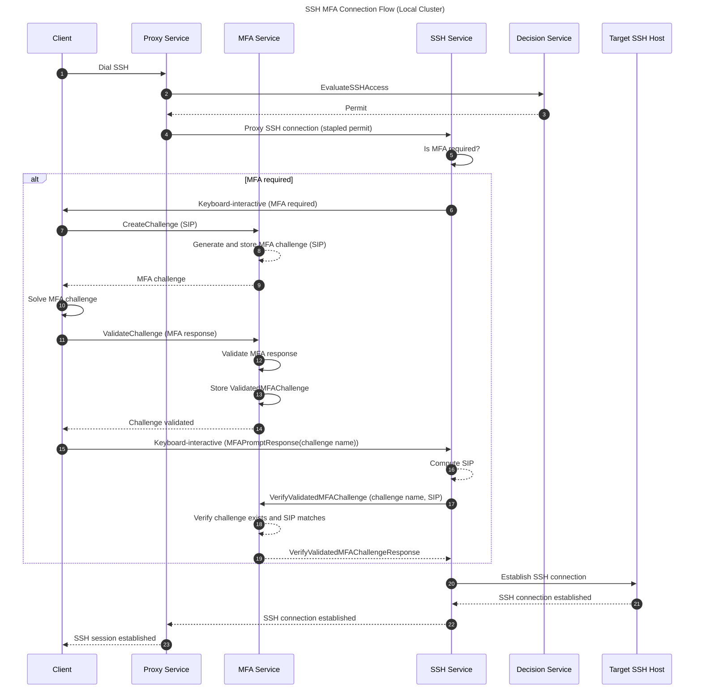
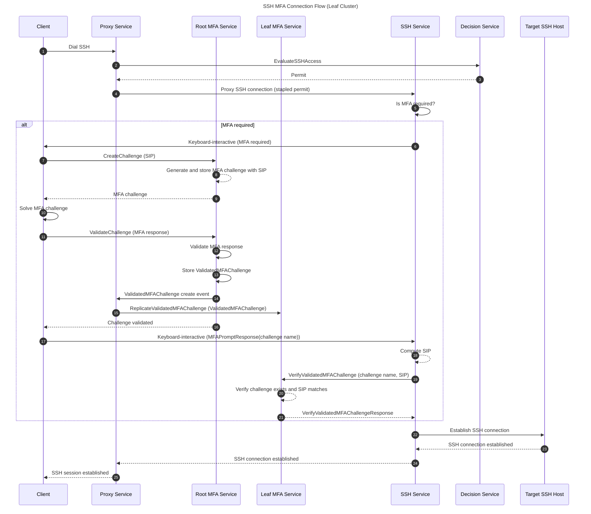
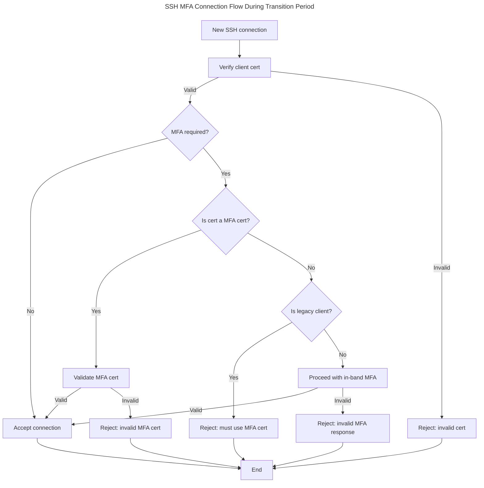

# RFD 0234 - In-Band MFA for SSH Sessions

## Required Approvers

- Engineering: @rosstimothy && @espadolini && @fspmarshall
- Product: @klizhentas
- Security: @rob-picard-teleport

## What

This RFD proposes integrating in-band multi-factor authentication (MFA) into SSH session establishment with the Teleport
SSH service. This change aims to enhance security by ensuring that MFA checks are tightly coupled with session creation,
reducing client complexity, and eliminating the need for per-session MFA SSH certificates.

## Why

Teleport’s current approach to per-session MFA enforcement for SSH access has several architectural and security
shortcomings that this proposal aims to address:

1. Per-session MFA enforcement flow is performed separately from session creation (i.e., out-of-band), which can
   introduce security gaps. For example, in
   [CVE-2025-49825](https://github.com/gravitational/Teleport/security/advisories/GHSA-8cqv-pj7f-pwpc), the MFA
   enforcement policy can be bypassed since an attacker had the ability to forge a certificate attesting that they had
   completed MFA and there was no proper binding between the certificate and the session.
1. MFA complexity is concentrated on the client versus the server. The client is responsible for determining MFA
   requirements, generating an MFA challenge, requesting a per-session MFA certificate and finally dialing a target host
   with the per-session MFA certificate. This complexity increases the risk of implementation errors and inconsistencies
   across different clients (e.g., `tsh`, web terminal, Teleport Connect, etc.).
1. A per-session MFA certificate is a single credential, representing multiple factors of authentication for a user. If
   an attacker were to gain possession, it could be used to bypass all forms of authentication checks, including MFA.

By moving MFA enforcement to the SSH service during session establishment, this new design directly addresses the above
issues by:

1. MFA enforcement is tightly integrated with session creation (i.e., in-band), ensuring that authentication factors are
   directly bound to each session and mitigating the risk of bypasses like those seen in
   [CVE-2025-49825](https://github.com/gravitational/Teleport/security/advisories/GHSA-8cqv-pj7f-pwpc).
1. MFA complexity is moved from clients to the SSH service, so clients only need to connect to the SSH service and
   resolve an MFA challenge only if required, streamlining the session establishment process and reducing the risk of
   implementation errors.
1. Per-session MFA certificates can be completely removed, eliminating a single credential representing multiple factors
   of authentication.

In summary, this RFD proposes a more secure and streamlined approach to MFA enforcement for SSH sessions by integrating
MFA checks directly into the session establishment process, reducing client complexity, and eliminating the need for
per-session MFA certificates.

## Non-Goals

1. This RFD does not propose changes to other Teleport access protocols such as Kubernetes, databases, desktops, etc.
   However, the RFD does make considerations for these protocols in the design to ensure future extensibility.

## Details

### UX

No changes are expected since this is an internal change.

### High-Level Flow

The client will first dial its target SSH host using the Proxy and its standard Teleport client certificate. The Proxy
will then resolve the target cluster and host, and invoke the `EvaluateSSHAccess` RPC of the [Decision
service](https://github.com/gravitational/Teleport.e/blob/master/rfd/0024e-access-control-decision-api.md). Upon
receiving a permit from the Decision service, the Proxy will staple the permit to the connection and open a connection
to the respective cluster's SSH service.

The SSH service will authenticate the client using the provided client certificate and the stapled permit. The SSH
service will then check if MFA is required for the session by examining the permit.

If MFA is _not required_, the SSH service will then proceed to establish the SSH session.

If MFA _is required_, the SSH service will send a [`MFAPrompt` message](#ssh-keyboard-interactive-authentication) as a
Question via the SSH [keyboard-interactive authentication](https://www.rfc-editor.org/rfc/rfc4256) method to inform the
client that MFA is needed. The client must then call the `CreateChallenge` RPC on the MFA service, providing a _Session
Identifying Payload (SIP)_ and any relevant metadata. The SIP is an SSH session hash computed from SSH session state and
is used to bind the MFA challenge to the specific session. Both the SSH client and the SSH server can independently
compute the SIP from session state.

The MFA service will [store the Session Identifying Payload (SIP)](#storing-session-identifying-payloads) and respond
with an MFA challenge for the client to solve.

Next, the client solves the MFA challenge and calls `ValidateChallenge` with the MFA response. The MFA service validates
the MFA response and stores the [ValidatedMFAChallenge](#storing-validated-mfa-responses) resource to the local backend.

If the target cluster is a leaf cluster, the reverse tunnel server watches for new `ValidatedMFAChallenge` resources
created in the root cluster. When it sees a new challenge intended for a leaf cluster, it uses the
`ReplicateValidatedMFAChallenge` RPC to copy that challenge from the root cluster's MFA service to the appropriate leaf
cluster's MFA service.

This ensures that validated MFA challenges are available in the appropriate cluster for retrieval during SSH session
establishment.

If validation is successful, the MFA service responds to the client with a confirmation that the challenge has been
validated. If validation fails, the MFA service responds with an `Access Denied: Invalid MFA response` error.

The client then sends a [`MFAPromptResponse`](#ssh-keyboard-interactive-authentication) message to the SSH service,
instructing it to verify the validated challenge with the MFA service.

The SSH service will then call the MFA service's (e.g., `VerifyValidatedMFAChallenge`) RPC with the challenge name and
SIP as parameters. The MFA service will verify that the validated challenge exists and that the SIP matches the one
stored earlier.

If validation succeeds, the SSH session is established. If not, access is denied with an `Access Denied: Invalid MFA
response` error. If the client does not complete MFA within a specified timeout (e.g., 3 minutes), the SSH service
terminates the connection with an `Access Denied: MFA verification timed out` error. To retry, the client must start a
new SSH connection.

#### Local Cluster Flow





### Security

In addition to the control plane compromise risk raised in [Access Control Decision API (RFD
0024e)](https://github.com/gravitational/Teleport.e/blob/master/rfd/0024e-access-control-decision-api.md), there are a
few risks specific to this RFD.

#### Replay Attacks Risk

MFA challenge responses could potentially be captured and replayed by an attacker to gain unauthorized access. Although
this risk has already existed using per-session MFA SSH certificates, it is important to address it in the new design as
well.

Mitigations:

1. MFA challenges and their responses will be single-use only. Once a challenge has been successfully validated, it
   cannot be reused.
1. The MFA challenge is time-bound and will expire after a duration (e.g., 5 minutes).
1. Each MFA challenge will include a SIP that binds the challenge to a specific user session.

#### New RPCs Attack Surface Risk

This RFD introduces an MFA service which exposes four RPCs: `CreateChallenge`, `ValidateChallenge`,
`ReplicateValidatedMFAChallenge` and `VerifyValidatedMFAChallenge`. These could potentially be exploited by an attacker
to DoS the service by flooding it with requests.

Mitigations:

1. Only authenticated end user clients are authorized to call the `CreateChallenge` and `ValidateChallenge` RPCs,
   requests from other sources will be rejected.
1. Only the Teleport Proxy is authorized to call the `ReplicateValidatedMFAChallenge` RPC, requests from other sources
   will be rejected.
1. Only the Teleport SSH service is authorized to call the `VerifyValidatedMFAChallenge` RPC on the MFA service within
   its own cluster. Requests from other sources will be rejected.
1. Ensure that the MFA service validates all inputs before processing the request to avoid unnecessary processing of
   invalid requests.

### Privacy

No changes to privacy are expected.

### Proto Specification

#### Decision Service

The Decision service will return a new field called `preconditions` in `SSHAccessPermit` to indicate that MFA is a
condition of access. It is up to the SSH service to enforce the MFA requirement during session establishment.

```proto
package teleport.decision.v1alpha1;

// SSHAccessPermit describes the parameters/constraints of a permissible SSH access attempt.
message SSHAccessPermit {
  // ... existing fields ...

  // Preconditions is a list of conditions that must be satisfied before access is granted.
  // If any precondition is not satisfied, access must be denied.
  repeated Precondition preconditions = 26;
}

// Precondition represents a condition that must be satisfied before access is granted.
message Precondition {
  // Kind specifies the type of precondition.
  PreconditionKind kind = 1;
}

// PreconditionKind defines the types of preconditions that can be specified.
enum PreconditionKind {
  // PreconditionKindUnspecified is the default value and indicates that no precondition is specified.
  // This value should be treated as an error if encountered in required contexts.
  PRECONDITION_KIND_UNSPECIFIED = 0;
  // PreconditionKindInBandMFA requires in-band MFA to be completed.
  PRECONDITION_KIND_IN_BAND_MFA = 1;
}
```

#### SSH Keyboard-Interactive Authentication

An additional authentication layer will be built on top of the SSH keyboard-interactive authentication channel to
facilitate MFA prompts and responses. Later this can be extended to support other types of prompts or checks.

The [keyboard-interactive channel](https://www.rfc-editor.org/rfc/rfc4256) requires UTF-8 encoded strings for prompts
and responses. Because of such, these Protobuf messages will be JSON encoded prior to being sent over as a
keyboard-interactive Question using [protojson](https://pkg.go.dev/google.golang.org/protobuf/encoding/protojson).

```proto
package teleport.ssh.v1;

// AuthPrompt is shown to the user during SSH keyboard-interactive authentication.
message AuthPrompt {
  oneof prompt {
    MFAPrompt mfa_prompt = 1;
  }
}

// MFAPrompt indicates MFA is required for SSH keyboard-interactive authentication.
message MFAPrompt {
  // Message to display to the user.
  string message = 1;
}

// MFAPromptResponse is the user's response to an MFA prompt.
message MFAPromptResponse {
  oneof response {
    MFAPromptResponseReference reference = 1;
  }
}

// MFAPromptResponseReference instructs the SSH service to retrieve the MFA response from the MFA service.
message MFAPromptResponseReference {
  // challenge_name is the name of the MFA challenge created by the client.
  string challenge_name = 1;
}
```

#### MFA Service

A new gRPC service `MFAService` will be created to encapsulate MFA-related RPCs, separating them from the legacy
`AuthService`. In the future, all new MFA-related RPCs should be added to this service and existing MFA-related RPCs in
the `AuthService` should be gradually migrated to `MFAService`.

A new service was opted to be created instead of extending/adding new RPCs to the existing `AuthService` to maintain
clear separation of concerns and to avoid continuing to bloat the `AuthService` with more responsibilities and
complexity. Additionally, the RPCs defined in this new service are specifically focused on MFA challenges for user
sessions, instead of further expanding the existing `CreateAuthenticateChallenge` RPC which is more general-purpose.

The RPCs will mirror the existing headless authentication flow. Like `GetHeadlessAuthentication`, the
`VerifyValidatedMFAChallenge` method will create a watcher with a timeout to wait for the [ValidatedMFAChallenge
resource](#storing-validated-mfa-responses) to exist in the backend, rather than requiring the client to poll repeatedly
until the resource exists in the local backend or for replication to complete to the leaf backend.

```proto
package teleport.mfa.v1;

// MFAService defines the Multi-Factor Authentication (MFA) service. While this service is currently focused on
// user sessions, new MFA related RPCs should be added here instead of the AuthService, to maintain a clear separation
// of concerns instead of further bloating the AuthService.
service MFAService {
  // CreateChallenge creates an MFA challenge that is tied to a user session.
  rpc CreateChallenge(CreateChallengeRequest) returns (CreateChallengeResponse);
  // ValidateChallenge validates the MFA challenge response for a user session and stores the validated response in the
  // backend.
  rpc ValidateChallenge(ValidateChallengeRequest) returns (ValidateChallengeResponse);
  // ReplicateValidatedMFAChallenge replicates a validated MFA challenge to a leaf cluster for retrieval during SSH session
  // establishment. It is a NOOP when used in the root cluster. It is called by the reverse tunnel server when a
  // validated challenge is created for a leaf cluster.
  rpc ReplicateValidatedMFAChallenge(ReplicateValidatedMFAChallengeRequest) returns (ReplicateValidatedMFAChallengeResponse);
  // VerifyValidatedMFAChallenge verifies a previously validated MFA challenge response for a user session.
  // If the challenge does not yet exist, this method will block until the resource appears or until the timeout is
  // reached. The payload is used to verify the challenge is tied to the correct user session. If the verification is
  // successful, the MFA device used for authentication is returned. If the verification fails, an error is returned.
  rpc VerifyValidatedMFAChallenge(VerifyValidatedMFAChallengeRequest) returns (VerifyValidatedMFAChallengeResponse);
}

// SessionIdentifyingPayload contains a value that uniquely identifies a user's session.
// It must be computed by the client from session state and is used to bind MFA challenges to specific sessions.
message SessionIdentifyingPayload {
  oneof payload {
    // session_id is the SSH session hash computed from SSH session state. For example, in Go this would be the value from
    // crypto/ssh#ConnMetadata.SessionID().
    bytes ssh_session_id = 1;
  }
}

// CreateChallengeRequest is the request message for CreateChallenge.
message CreateChallengeRequest {
  // payload is a value that uniquely identifies the user's session. When VerifyValidatedMFAChallenge is called, the
  // server will verify it matches the payload supplied to CreateChallengeRequest.
  SessionIdentifyingPayload payload = 1;
  // target_cluster is the name of the target cluster where the SSH session is being established. If unset, the server
  // assumes the challenge is for the local cluster. This is used to determine where the validated challenge should be
  // replicated to for leaf clusters. It is required when the SSH session is being established in a leaf cluster.
  string target_cluster = 2;
  // sso_client_redirect_url should be supplied if the client supports SSO MFA checks. If unset, the server will only
  // return non-SSO challenges.
  string sso_client_redirect_url = 3;
  // proxy_address_for_sso is the proxy address that the user is using to connect to the Proxy. When using SSO MFA, this
  // address is required to determine which URL to redirect the user to when there are multiple options.
  string proxy_address_for_sso = 4;
}

// CreateChallengeResponse is the response message for CreateChallenge.
message CreateChallengeResponse {
  // name is the unique resource name for the issued challenge generated by the server. This value should be treated as
  // an opaque identifier and used as-is in subsequent API calls.
  string name = 1;
  // mfa_challenge contains the MFA challenge that the user must respond to.
  AuthenticateChallenge mfa_challenge = 2;
}

// ValidateChallengeRequest is the request message for ValidateChallenge.
message ValidateChallengeRequest {
  // name is the resource name for the issued challenge.
  // This must match the 'name' returned in CreateChallengeResponse to tie the validation to the correct challenge.
  string name = 1;
  // mfa_response contains the MFA challenge response provided by the user.
  AuthenticateResponse mfa_response = 2;
}

// ValidateChallengeResponse is the response message for ValidateChallenge.
message ValidateChallengeResponse {}

// ReplicateValidatedMFAChallengeRequest is the request message for ReplicateValidatedMFAChallenge.
message ReplicateValidatedMFAChallengeRequest {
  // name is the resource name for the issued challenge.
  // This must match the 'name' returned in CreateChallengeResponse to tie the upsert to the correct challenge.
  string name = 1;
  // payload is a value that uniquely identifies the user's session. This should match the payload in
  // CreateChallengeRequest.
  SessionIdentifyingPayload payload = 2;
  // device contains information about the user's MFA device used to authenticate.
  types.MFADevice device = 3;
  // source_cluster is the name of the cluster where the validated challenge originated.
  string source_cluster = 4;
  // target_cluster is the name of the destination cluster where the validated challenge should be replicated to.
  string target_cluster = 5;
}

// ReplicateValidatedMFAChallengeResponse is the response message for ReplicateValidatedMFAChallenge.
message ReplicateValidatedMFAChallengeResponse {
  // replicated_challenge is the validated MFA challenge that was replicated.
  ValidatedMFAChallenge replicated_challenge = 1;
}

// VerifyValidatedMFAChallengeRequest is the request message for VerifyValidatedMFAChallenge.
message VerifyValidatedMFAChallengeRequest {
  // name is the resource name for the issued challenge.
  // This must match the 'name' returned in CreateChallengeResponse to tie the retrieval to the correct challenge.
  string name = 1;
  // payload is a value that uniquely identifies the user's session. The client calling VerifyValidatedMFAChallenge MUST
  // independently compute this value from session state. The server will verify it matches the payload supplied in
  // CreateChallengeRequest to ensure the challenge is tied to the correct session.
  SessionIdentifyingPayload payload = 2;
  // source_cluster is the name of the cluster where the validated challenge originated.
  string source_cluster = 3;
}

// VerifyValidatedMFAChallengeResponse is the response message for VerifyValidatedMFAChallenge.
message VerifyValidatedMFAChallengeResponse {
  // device contains information about the user's MFA device used to authenticate.
  types.MFADevice device = 1;
}

// AuthenticateChallenge is a challenge for all MFA devices registered for a user.
message AuthenticateChallenge {
  // webauthn_challenge contains a Webauthn credential assertion used for login/authentication ceremonies. Credential
  // assertions hold, among other information, a list of allowed credentials for the ceremony (one for each U2F or
  // Webauthn device registered by the user).
  webauthn.CredentialAssertion webauthn_challenge = 1;
  // sso_challenge is an SSO MFA challenge. If set, the client can go to the IdP redirect URL to perform an MFA check in
  // the IdP and obtain an MFA token. This token paired with the request id can then be used as MFA verification.
  SSOChallenge sso_challenge = 2;
}

// AuthenticateResponse is a response to AuthenticateChallenge using one of the MFA devices registered for a user.
message AuthenticateResponse {
  oneof response {
    // webauthn is a response to a Webauthn challenge.
    webauthn.CredentialAssertionResponse webauthn = 1;
    // sso is a response to an SSO challenge.
    SSOChallengeResponse sso = 2;
  }
}

// SSOChallenge contains SSO auth request details to perform an SSO MFA check.
message SSOChallenge {
  // request_id is the ID of an SSO auth request.
  string request_id = 1;
  // redirect_url is an IdP redirect URL to initiate the SSO MFA flow.
  string redirect_url = 2;
  // device is the SSO device corresponding to the challenge.
  types.SSOMFADevice device = 3;
}

// SSOChallengeResponse is a response to SSOChallenge.
message SSOChallengeResponse {
  // request_id is the ID of an SSO auth request.
  string request_id = 1;
  // token is a secret token used to verify the user's SSO MFA session.
  string token = 2;
}
```

##### Storing Session Identifying Payloads

The existing session data models for WebAuthn and SSO MFA will be extended to store the SIP as optional ancillary data.
These changes are expected to be backwards compatible since the SIP is optional and existing clients will not be
affected.

After the MFA challenge has expired, the items will be removed in the backend.

```go
// SessionData is a clone of [webauthn.SessionData], materialized here to keep a
// stable JSON marshal/unmarshal representation and add extensions.
type SessionData struct {
  // ... existing fields ...

  // Payload is an optional session identifying value that uniquely identifies the user's session.
  Payload []byte `json:"payload,omitempty"`
}
```

```go
// SSOMFASessionData SSO MFA Session data.
type SSOMFASessionData struct {
  // ... existing fields ...

  // Payload is an optional session identifying value that uniquely identifies the user's session.
  Payload []byte `json:"payload,omitempty"`
}
```

##### Storing Validated MFA Responses

Validated MFA responses and SIPs will be temporarily stored in the MFA service for the SSH service to retrieve during
session establishment. For local clusters, this storage is local to the same cluster. For leaf clusters, the root MFA
service forwards the validated challenge to the leaf cluster's MFA service for storage.

A new backend resource `ValidatedMFAChallenge` will be created following the [resource
guidelines](/rfd/0153-resource-guidelines.md). The only operations supported by this resource are: retrieval via
`VerifyValidatedMFAChallenge` and replication to leaf clusters via `ReplicateValidatedMFAChallenge`. The resource will
be automatically deleted after expiration.

```proto
package teleport.mfa.v1;

// ValidatedMFAChallenge represents a validated MFA challenge tied to a user session.
message ValidatedMFAChallenge {
  // The kind of resource represented.
  string kind = 1;
  // Differentiates variations of the same kind. All resources should
  // contain one, even if it is never populated.
  string sub_kind = 2;
  // The version of the resource being represented.
  string version = 3;
  // Common metadata that all resources share.
  teleport.header.v1.Metadata metadata = 4;
  // The validated challenge specification.
  ValidatedMFAChallengeSpec spec = 5;
}

// ValidatedMFAChallengeSpec contains the validated challenge data that is set once
// during creation and never modified.
message ValidatedMFAChallengeSpec {
  // payload is a value that uniquely identifies the user's session. It is the value that was supplied in
  // CreateChallengeRequest.
  SessionIdentifyingPayload payload = 1;
  // device contains information about the user's MFA device used to authenticate.
  types.MFADevice device = 2;
  // source_cluster is the name of the cluster where the validated challenge originated.
  string source_cluster = 3;
  // target_cluster is the name of the cluster where the SSH session is being established and this resource is intended
  // for.
  string target_cluster = 4;
}
```

###### Leaf Cluster Resource Stream Handling

A parser will be defined in order to decode `ValidatedMFAChallenge` resources received over the resource stream. The
function in `lib/services/local/events.go` will be updated to instantiate the new parser.

```go
func newValidatedMFAChallengeParser() *ValidatedMFAChallengeParser {
  return &ValidatedMFAChallengeParser{
    baseParser: newBaseParser(backend.Key(ValidatedMFAChallengePrefix)),
  }
}

type ValidatedMFAChallengeParser struct {
  baseParser
}

func (p *ValidatedMFAChallengeParser) parse(event backend.Event) (types.Resource, error) {
  // Placeholder for parsing logic for the ValidatedMFAChallenge resource here.
}
```

Additionally, a filter will be defined to allow querying `ValidatedMFAChallenge` resources by target cluster name.

```go
// ValidatedMFAChallengeFilter is a filter for ValidatedMFAChallenge resources.
type ValidatedMFAChallengeFilter struct {
  // ClusterName is the name of the cluster to filter by.
  ClusterName string
}
```

### Backwards Compatibility

#### Terminology

- Legacy clients: Clients that rely on per-session MFA SSH certificates for MFA enforcement.
- Modern clients: Clients that support in-band MFA enforcement and do not rely on per-session MFA SSH certificates.
- Legacy agents: Agents hosting the SSH service that rely on per-session MFA SSH certificates for MFA enforcement.
- Modern agents: Agents hosting the SSH service that support in-band MFA enforcement and do not rely on per-session MFA
  SSH certificates.

#### Transition Period

The transition period will cover only two consecutive major releases: the current release (N) and the immediately
previous release (N-1). During this period components must support both the legacy per‑session MFA certificate flow and
the new in‑band MFA flow for compatibility between N and N-1. The transition ends with the next major release (N+1),
after which all components must support the in‑band MFA flow exclusively.

Example: if this RFD is implemented in Teleport 20.0.0, the transition period covers releases 20.x and 19.x and will end
with the release of 21.0.0. Starting with 21.0.0, all components must support in‑band MFA enforcement only.

#### SSH Service

The SSH service will continue to support legacy clients that rely on per-session MFA SSH certificates during the
transition period, while modern clients will be _required_ to use the in-band MFA flow.

The following diagram depicts the SSH connection flow during the transition period, with a focus on MFA enforcement:



After the transition period, the SSH service will no longer accept per-session MFA SSH certificates and will only
support the in-band MFA flow.

#### Modern Clients and Legacy Agents

Modern clients will support legacy agents that rely on per-session MFA SSH certificates during the transition period.

Modern clients will generate per-session MFA SSH certificates for legacy agents while using the in-band MFA flow for
modern agents.

A modern client can differentiate between legacy and modern agents by checking if after authentication with public key
authentication whether the SSH service sends a keyboard-interactive prompt indicating that MFA is required. If an SSH
authentication error is received, the client can assume it is connecting to a legacy agent and must generate a
per-session MFA SSH certificate in order to complete MFA verification.

### Audit Events

The existing SSH session audit events will be updated to include a field indicating the type of MFA flow used (in-band
flow, per-session MFA certificate, or unspecified). This will help with tracking the rollout of the new in-band MFA flow
during the transition period and provide flexibility for future MFA flow types.

Audit events will not be added for the `ReplicateValidatedMFAChallenge` and `VerifyValidatedMFAChallenge` because these
RPCs are internal to the SSH session establishment process and do not represent user actions.

```proto
package events;

// CreateMFAAuthChallenge records the creation of an MFA auth challenge.
message CreateMFAAuthChallenge {
  // ... existing fields ...

  // mfa_flow_type indicates the type of MFA flow used for the challenge.
  MFAFlowType mfa_flow_type = 5 [(gogoproto.jsontag) = "mfa_flow_type,omitempty"];
}

// ValidateMFAAuthResponse records the validation of an MFA auth challenge response.
message ValidateMFAAuthResponse {
  // ... existing fields ...

  // mfa_flow_type indicates the type of MFA flow used for the validation.
  MFAFlowType mfa_flow_type = 7 [(gogoproto.jsontag) = "mfa_flow_type,omitempty"];
}

// MFAFlowType defines the type of MFA flow used for authentication.
enum MFAFlowType {
  // MFA_FLOW_TYPE_UNSPECIFIED is the default value when the flow type is not specified.
  MFA_FLOW_TYPE_UNSPECIFIED = 0;
  // MFA_FLOW_TYPE_PER_SESSION_CERTIFICATE indicates that MFA was completed using
  // a per-session MFA certificate (legacy flow).
  MFA_FLOW_TYPE_PER_SESSION_CERTIFICATE = 1;
  // MFA_FLOW_TYPE_IN_BAND indicates that MFA was completed using the in-band flow
  // during session establishment.
  MFA_FLOW_TYPE_IN_BAND = 2;
}
```

### Observability

No changes to observability patterns are needed.

### Product Usage

No changes in product usage are expected since this is an internal change.

### Test Plan

### Existing Tests

Existing tests for SSH access are expected to continue working as this is an internal change and should not have any
impact.

### New Tests

During the transition period, tests will be added to ensure that both legacy and modern clients can connect to both
legacy and modern agents as expected.

After the transition period, tests will be added to ensure that modern clients can connect to modern agents using the
in-band MFA flow and that legacy clients are rejected when attempting to connect to modern agents.

### Implementation

#### Dependencies

The following are assumed to be completed before starting work on this RFD:

1. [Access Control Decision API (RFD
   0024e)](https://github.com/gravitational/Teleport.e/blob/master/rfd/0024e-access-control-decision-api.md) refactor
   and relocate implementation
   1. Decision service has a way for deriving user/session metadata from incoming requests without relying on client
      certificates.
   1. If MFA is required, the Decision service will return a permit containing a `preconditions` field signaling this
      requirement.
   1. `EvaluateSSHAccess` RPC should no longer return an error if MFA is required but not satisfied. A parameter in the
      permit should indicate whether MFA is required for access.
   1. The Proxy service is updated to staple the permit returned by the Decision service to the proxied SSH connection.

#### Phase 1 (Transition Period - at least 2 major releases)

1. Add the `ValidatedMFAChallenge` backend resource to store validated MFA responses tied to user sessions.
1. Add `MFAService` to support creating, validating, replicating and verifying MFA challenges tied to specific user
   sessions.
1. Update the SSH service to implement the in-band MFA flow during session establishment.
1. Update the SSH service auth handler to use `VerifiedPublicKeyCallback` instead of `PublicKeyCallback` to ensure that
   the client has confirmed possession of the private key associated with the client certificate.
1. Update modern clients to support the in-band MFA flow while still supporting per-session MFA SSH certificates for
   legacy agents.
1. Update modern agents to support the in-band MFA flow while still supporting per-session MFA SSH certificates for
   legacy clients.
1. Add tests to ensure both legacy and modern clients can connect to both legacy and modern agents as expected.
1. Update audit events to indicate whether MFA was completed via the in-band flow or per-session MFA certificate.

#### Phase 2 (Post Transition Period - after at least 2 major releases)

1. Update the SSH service to no longer accept per-session MFA SSH certificates and only support the in-band MFA flow.
1. Update clients to no longer generate per-session MFA SSH certificates.
1. Update tests to remove support for legacy clients and agents.

## Alternatives Considered

1. Proxy/Relay facilitates the entire MFA ceremony: In this approach, the Proxy/Relay would handle the entire MFA flow,
   including creating the MFA challenge and validating the response. While this would still simplify the client-side
   implementation, it would potentially introduce security risks by giving Proxy/Relay access to operations that are out
   of its domain scope.
1. New version of `TransportService` is introduced to handle in-band MFA at the Proxy/Relay: While this would separate
   concerns and keep the MFA logic isolated, it would add complexity to the architecture, require significant changes to
   existing services, and break domain boundaries.
1. Use a JWT to signal that MFA verification has been completed: This approach would involve issuing a JWT after MFA
   verification, which the client would present during SSH session establishment. However, this would introduce
   additional complexity in token management and validation, and could potentially expose security vulnerabilities if
   not implemented correctly. It also does not add significant benefits over the proposed in-band MFA flow as it is just
   a different way of conveying the same information.

## Future Considerations

1. Extend in-band MFA enforcement to additional protocols e.g., Kubernetes API requests, database connections, desktop
   access, etc.
1. The transition period might be too long for some environments that want to enforce in-band MFA sooner. A
   configuration option and environment variable to shorten the transition period on a per-cluster basis was considered,
   but deferred for future exploration.
