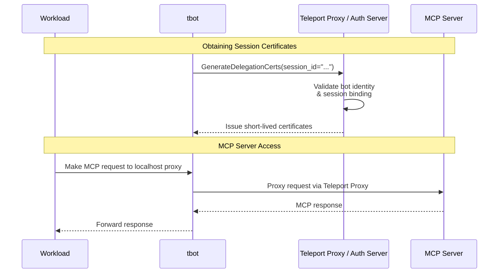
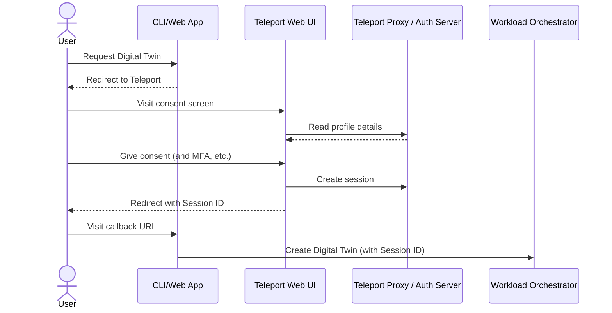

# RFD 0238 - Delegating Access to AI Workloads

## Required Approvers

- Engineering: @strideynet && @greedy52
- Product: @klizhentas

## What

Enabling a user to "lend" their access to a remote AI workload, to allow it to
autonomously take actions on the user's behalf. Attributing these actions to
both the user and workload in the audit log.

The following are out of scope for this RFD:

- Agents running on the user's own device (e.g. Claude Desktop)
- Agents that are not associated with an end-user

## Why

Teleport currently provides a clear separation between human and non-human
identity and access.

With human access, the user logs in and accesses resources (databases, remote
desktops, and now MCP servers) from their own device, and actions are attributed
to them personally. This suits local clients such as Claude Desktop or Cursor
well, but is not an option for agents that are running anywhere other than the
end-user's own device.

With non-human access, an automated process (bot) accesses resources from a
remote server or CI/CD platform, and actions are attributed to the bot rather
than any particular end-user. This suits fully-autonomous AI workloads, but
isn't appropriate for workloads that can be controlled by an end-user as it
creates a surface for privilege escalation attacks (e.g. talking the bot into
doing something you don't personally have permission to do).

There is an emerging need for a third category: autonomous workloads, running
remotely, taking actions on an end-user's behalf. Our design partner has such a
use-case where they want employees to be able to create a "Digital Twin" to
complete currently-manual "ClickOps" tasks for them. Employees would run a CLI
command or click a button on a website and an ephemeral "Digital Twin" would be
provisioned in their data center, taking on a subset of the employee's
privileges to complete the given task.

## Goals and Constraints

Our design partner has shared the following constraints and guidelines:

- Each "Digital Twin" will likely be deployed as a separate Kubernetes pod
  rather than being served by one long-running/multitenant process
- The "Digital Twin" must have a **subset** of the end-user's privileges
- It's acceptable for the end-user to see a Teleport-hosted screen where they
  give their explicit consent to the "Digital Twin" acting on their behalf

Our design goals:

- Our design partner's primary use-case is accessing MCP servers, but it would
  be beneficial (not a hard requirement) if what we built also worked for other
  kinds of resources too
- Our solution should not rely on secrets, and as far as is possible should
  integrate with open standards such as SPIFFE and our existing Workload
  Identity features
- Although our design partner's current requirement is for the "Digital Twin" to
  have only a subset of end-user privileges, our solution should be able to
  integrate with privilege-escalating features such as Access Requests

## Proposed Design

### Delegation Sessions

Users will be able to create a "Delegation Session" which allows either a
Teleport Bot or (eventually) a SPIFFE Workload Identity to access certain chosen
resources on their behalf, for a limited amount of time.

The session will not carry over the user's standing privileges. Instead, it
will be a "blank slate" (deny all by default) to which you can add access to
specific resources using the identifier format introduced by
[Resource Access Requests](https://goteleport.com/docs/identity-governance/access-requests/resource-requests/).

Example:

```
/test.teleport.sh/mcp/mcp-server-1/tools/read_user_profile
```

In the first instance, it will not be possible to create a session with
privileges greater than the user has themselves, but in the future we could
integrate with Access Requests to automatically request any missing privileges.

Bots or Workloads will prove their identity to Teleport and receive short-lived
x509 certificates that can be used to authenticate with the Teleport Proxy.
These certificates will contain the user identity, bot/workload identity, and
the associated session identifier.

Users will have the option to terminate a session, and immediately remove the
bot/workload's ability to act on their behalf, using `tctl` or the Web UI. They
will also be able to see the audit log of actions taken on their behalf during
a given session.

### Delegation Profiles

Given the rapidly growing capabilities and changing architectural patterns in
this space, it's likely that over time a "Digital Twin"'s access requirements
will change, and its implementation will be split into many smaller workloads
or "sub-agents".

It may therefore become too unwieldy for the client to have to enumerate all of
the agent's required resources and workload identities (e.g. SPIFFE IDs) when
creating a session.

Instead, we will allow the workload "owner" to maintain a "Delegation Profile",
conceptually similar to registering an OAuth2 application with Google or GitHub.
This profile will also give the workload owner an opportunity to customize the
messaging on the consent screen.

Example:

```yaml
kind: delegation_profile
version: v1
metadata:
  name: onboarding-agent
  labels:
    team: customer-operations
spec:
  required_resources:
    - "/test.teleport.sh/mcp/mcp-server-1/tools/*"
    - "/test.teleport.sh/mcp/mcp-server-2/tools/write_user_profile"
  authorized_users:
    - type: bot
      bot_name: onboarding-agent
    - type: bot
      bot_name: account-creator
    - type: spiffe-workload
      spiffe_id: "spiffe://test.teleport.sh/sub-agent/billing-scheduler"
  consent:
    title: "Onboarding Agent"
    description: "This agent is responsible for creating the user's account, scheduling billing, etc."
    allowed_redirect_urls:
      - "https://my.internal.site/digital-twin/callback"
  default_session_length: 8h
```

#### Access Controls

Delegation profiles will be little more than sets of pre-selected values for
the "required resources" and "authorized users" properties of a session. They
will not implement any access controls or give the user access to resources
they cannot already access.

They will however still be subject to basic label-based RBAC, so a user will
need a role with matching `allow.delegation_profile_labels` in order to use a
profile, but the user could still delegate access to the same resources by
manually providing session parameters instead of using the profile.

```yaml
# Allow the user to use the profile.
kind: role
version: v8
metadata:
  name: profile-user
spec:
  allow:
    delegation_profile_labels:
      team: customer-operations
```

You will also be able to use standard RBAC resource rules to control who can
manage the profile.

```yaml
# Allow the workload owner to manage the profile.
kind: role
version: v8
metadata:
  name: workload-owner
spec:
  allow:
    rules:
      - resources: [delegation_profile]
        verbs: ['*']
        where: 'contains(user.spec.traits["teams"] , labels["team"])'
```

We do not currently plan to restrict access to the delegation feature using
roles. See "Abandoned Ideas" for more information.

## End-User Experience

This section details the experience an end-user will have when delegating their
access to an AI workload.

### Starting a session from `tsh`

In the simplest case, if the user has `tsh` installed and configured, they could
create a session like so:

```shell
$ tsh delegate-access \
  --bot "onboarding-agent" \
  --resource "/test.teleport.sh/mcp/mcp-server-1/tools/.*" \
  --resource "/test.teleport.sh/mcp/mcp-server-2/tools/write_user_profile" \
  --ttl 8h \
  --output json

STDERR: Tap any security key to approve

{"session_id": "01188ff4-f686-4d43-87ae-1cd873472c01"}
```

Or:

```shell
$ tsh delegate-access \
  --profile "onboarding-agent" \
  --output json
```

`tsh` will call the auth server to create the session. It will [require MFA](https://goteleport.com/docs/zero-trust-access/authentication/mfa-for-admin-actions),
and if Device Trust is configured, `tsh` to be running on an enrolled device.
It will then print out the Session ID to be passed on to the workload.

The `--output json` flag will enable you to call `tsh` as a sub-process from a
CLI or shell script and easily parse the output.

### Starting a session from a CLI or Web App

If the user does not have `tsh` installed, or if they are delegating access from
a web application, we will expose a route in the Teleport Web UI for creating
sessions.

Our design partner's CLI or web application will redirect the user to a
well-known URL with querystring parameters including the `profile` or
`bot`/`spiffe_id`, `resources`, and `ttl`, as well as a `redirect_url`.

```
https://<TELEPORT PROXY>/web/delegation/new-session?profile=<PROFILE>&redirect_url=<REDIRECT URL>&state=<STATE>
```

Or:

```
https://<TELEPORT PROXY>/web/delegation/new-session?bot=<BOT NAME>&resources=<RESOURCES>&ttl=<TTL>&redirect_url=<REDIRECT URL>&state=<STATE>
```

This page will explicitly ask for the user's consent, enforce any MFA or Device
Trust requirements, create the session, and redirect the user back to the given
`redirect_url`. If the user confirmed their consent, the Session ID will be
passed back in the `session_id` querystring parameter.

**Note:** Although the Session ID itself is *not* a secret (the workload must
authenticate with Teleport in order to use it), for CLI or SPA clients, we may
still need to implement something like PKCE to prevent an attacker from
intercepting and using it to trick the (authenticated) workload into doing
something unintended - see Security Considerations.

## Agent Developer Experience

This section details the experience an agent developer will have when accessing
MCP servers and other resources on behalf of the end-user.

### Using a session via `tbot`

RFD 0028e discusses how `tbot` could be extended to support proxying of MCP
traffic, allowing developers to use the remote MCP server as if it were running
on localhost without authentication. We will build on this to allow you to use
a delegation session by passing a Session ID in your `tbot` configuration:

```yaml
services:
  - type: mcp-tunnel
    server: my-mcp-server
    listen: tcp://localhost:8080
    delegation:
      session_id: 01188ff4-f686-4d43-87ae-1cd873472c01
```

Or for workloads that perform MCP calls on behalf of many end-users, we will
extend this proxy to support passing the Session ID as a header in each HTTP
request instead.

In Kubernetes, you will deploy a `tbot` sidecar container in each Digital Twin
pod.

### Using a session via SPIFFE (Future Work)

If you are already using Teleport's Workload Identity feature or another SPIFFE
identity provider, we could allow your workloads to authenticate with Teleport
using their x509 SVID as an mTLS client certificate.

This would provide a feature, conceptually similar to AWS Roles Anywhere, where
you could in-effect "exchange" your workload identity for session credentials.

For workloads written in Go, we could have our SDK expose an `http.RoundTripper`
that does this transparently for you:

```go
svidSource, err := workloadidentity.NewX509Source(ctx)
if err != nil {
	return err
}

transport, err := client.NewDelegatedAccessTransport(ctx, svidSource, client.DelegatedAccessConfig{
	ProxyAddress:    "test.teleport.sh:443",
	SessionID:       "01a74863-611f-401f-a391-0a5d108f2e1d",
	ApplicationName: "mcp-server-1",
})
if err != nil {
	return err
}
defer transport.Close()

httpClient := &http.Client{Transport: transport}
```

As we've found that many other languages offer poorer support for TLS features
such as ALPN, we could also provide a proxy binary that you can run as a sidecar
alongside your workload (similar to `tbot`) instead:

```shell
$ export SPIFFE_ENDPOINT_SOCKET=unix:///path/to/spiffe.sock

$ workload-mcp-proxy \
  --listen "tcp://localhost:8080" \
  --session-id "01188ff4-f686-4d43-87ae-1cd873472c01" \
  --app mcp-server-1 \
  --teleport-proxy-addr "test.teleport.sh:443"
```

As with the `tbot` example above, the Session ID here is provided as a command
line flag, so the entire proxy would be bound to a single session, but we could
make the proxy "multi tenant" by accepting the Session ID on each request as an
HTTP header.

### Identifying the end-user from the MCP server

Although authentication and authorization will be handled entirely by Teleport,
it can be useful for the MCP server to know who the end-user is. As with
Application Access, we will send their username in all HTTP requests proxied to
the MCP server via the `Teleport-Jwt-Assertion`
[header](https://goteleport.com/docs/enroll-resources/application-access/jwt/introduction).

## Security Considerations

### Bot Instance Pinning

It may be desirable to "pin" the session to a specific instance of a Bot. We
could support this by either allowing you to specify the instance identifier
when creating the session, or by automatically pinning to the first bot instance
that attempts to use the session.

### PKCE (Proof Key for Code Exchange)

When starting a session by redirecting the user to the Teleport Web UI, it would
be prudent to implement a protection like [PKCE](https://oauth.net/2/pkce/) to
prevent an attacker from intercepting the `session_id` querystring parameter and
using it to "trick" the authenticated workload into doing something unintended.

The `session_id` itself is not a secret, and can only be used by the workload or
bot explicitly bound to the session, after they have authenticated with Teleport.

However, if the attacker also has the ability to trigger workloads (e.g. is a
process running on the same host as the CLI with access to make API calls to the
"Digital Twin Orchestrator") they could theoretically use the `session_id` to
make the (authenticated) workload do something other the user's intended action.

Following PKCE's example, we could have the client generate a secret key ("code
verifier") which it hashes (to create a "code challenge") and includes as a
querystring parameter when redirecting to Teleport. Then, the session would only
be usable if you are also in possession of the original secret ("code verifier").

An attacker could still theoretically intercept the call to the orchestrator and
steal both the `session_id` and "code verifier" but it's far less likely.

## Implementation





This section covers the implementation of the first version (delegating a
**subset** of user privileges only). It does not go into detail about how we
will later integrate with Access Requests to support privilege escalation.

### Access Control

Delegation will be built on the foundation established by Resource Access
Requests. This feature works by extending user certificates with a list of
`AllowedResourceIDs` which **narrows down** the access provided by roles to just
a specific set of resources.

Resource IDs are path-like strings in the form: `/TELEPORT_CLUSTER/KIND/NAME/SUB_RESOURCE_NAME`.
They typically refer to a single resource (e.g. node, database, or application)
but can refer to many Kubernetes resources using wildcards or regular
expressions.

Examples:

```
/test.teleport.sh/node/b1168402-9340-421a-a344-af66a6675738
/test.teleport.sh/app/my-app
/test.teleport.sh/kube:ns:pods/mycluster/*/^nginx-[a-z0-9-]+$
```

On their own, `AllowedResourceIDs` do not give you access to the resources, they
simply act as a filter, removing unneeded ambient privileges provided by the
certificate's role set. When creating a Resource Access Request, the auth server
determines which roles, available in the user's `search_as_roles`, would provide
access to the resources, and should be requested.

Delegation session certificates will include all of the user's static roles, and
use the `AllowedResourceIDs` field to "jail" the session to permitted resources.

We do not strictly *need* to check the user has permission to access the
requested resources when creating a delegation session, as this will be enforced
at time-of-use by the RBAC engine. It's also difficult to know this ahead of
time for Kubernetes resources, as the Resource IDs can contain wildcards and
regular expressions. However, for a better user experience, we will check if the
user at least has access to the Teleport resource (i.e. the Kubernetes cluster),
so we can surface obvious permission issues while the end-user is still "in the
loop".

### MCP Resource IDs

It is currently only possible to request access to an MCP Server "application"
as a whole, not specific tools or resources. We will either follow the example
set by Kubernetes resources by using the `SUB_RESOURCE_NAME` section of the
Resource ID to allow you to target tools and resources using a regular expression:

```
/test.teleport.sh/mcp/mcp-server-1/tools/read_(.*)
```

Or if the projects' respective timelines allow, we'll integrate with the scoping
mechanism discussed in [RFD 0228: Resource-Scoped Constraints in Access Requests](https://github.com/gravitational/teleport/pull/59288).

### Session Termination

In order for the user to quickly revoke the AI agent's access if they discover
it is misbehaving, we will allow them to "terminate" the session. Under the
hood, this will create a lock which targets the Delegation Session ID.

### Existing Impersonation Support

Teleport already supports taking on somebody else's identity via
[impersonation](https://goteleport.com/docs/zero-trust-access/authentication/impersonation/),
which is conceptually similar to the access delegation described in this RFD.
It's also the underlying mechanism by which `tbot` avoids its renewable internal
identity certificate having any privileges of its own, making it less useful to
an attacker.

While the core "plumbing" of impersonation, such as encoding the impersonator
into a certificate extension and including it in audit logs, is useful - we will
not reuse the actual implementation in the `GenerateUserCerts` RPC.

This RPC is both highly security-sensitive and already very complex because it
handles many other concerns related to generating user certificates, which are
not relevant to our use-case. Instead, we will introduce a new RPC which calls
the same lower-level `Server.generateUserCert` method directly.

### API Endpoints

#### Delegation Profile CRUD

The gRPC service for managing delegation profiles will contain the usual
endpoints for creating, reading, updating, and deleting resources. For brevity,
these are not discussed in detail here.

The `GetDelegationProfile` endpoint will accept an `authorization_mode`
parameter, which controls whether we authorize the caller as an end-user trying
to "use" the profile (i.e. check they have access to the profile's resources),
or as an administrator viewing the profile details.

#### `CreateDelegationSession`

This endpoint will be called when a user clicks the "Authorize" button on the
consent screen, or runs `tsh delegate-access` on the command line. It will be
exposed to the Web UI via HTTP at: `POST /webapi/sites/:site/delegation/sessions`.

Similar to the `GetDelegationProfile` endpoint, it will perform a best-effort
check that the user has access to the requested resources via their static roles,
to surface permission issues early.

Given the security-sensitive nature of delegation, we will use the
`AuthorizeAdminAction` method to prompt the user for MFA before creating the
session.

As well as the session parameters (i.e. profile name, or required resources)
this endpoint will accept the consent screen `redirect_url`, `state`, and (PKCE
inspired) `challenge`. It will validate the `redirect_url` against the profile's
allow-list and store the `challenge` so it can later be compared to the `verifier`
parameter in the `GenerateDelegationCerts` RPC.

```proto
message CreateDelegationSessionRequest {
  oneof from {
    // Profile the session will be created from.
    string profile_name = 1;

    // Parameters the session will be created from, when manually creating the
    // session using `tsh delegate-access --resource XXX`.
    DelegationSessionParameters parameters = 2;
  }
}

message DelegationSessionParameters {
  // Resources that are required by users of this session.
  repeated ResourceID required_resources = 1;

  // Users (i.e. bots or workloads) that will be allowed to use this session.
  repeated AllowedUser allowed_users = 2;

  // How long the session will last.
  google.protobuf.Duration session_length = 3;

  // Consent screen parameters (e.g. redirect_url).
  optional ConsentScreenParameters consent_screen = 3;
}

message ConsentScreenParameters {
  // Callback URL, where the user should be redirected after the session is
  // created. Will be checked against the profile's allow-list.
  string redirect_url = 1;

  // Used to pass state (e.g. CSRF tokens) between consent screen and callback.
  optional string state = 2;

  // Inspired by PKCE's `code_challenge`. Will be compared to the
  // GenerateUserCerts's hashed `verifier` parameter.
  optional string challenge = 3;
}
```

We will log an `delegation.session.create` audit event after the session has
been created.

#### `TerminateDelegationSession`

This endpoint will simply check the given session belongs to the caller, and
create a lock targeting the Delegation Session ID. The lock object will expire
at the same time as (or shortly after) the session.

We will log an `delegation.session.terminate` audit event after the lock has
been created.

#### `GenerateDelegationCerts`

This endpoint will be called by `tbot` (or perhaps eventually a different SPIFFE
authenticated client) to obtain x509 and SSH certificates that can be used to
access resources, on the user's behalf, via the Teleport proxy.

It will authorize the request by comparing the caller's bot name (taken from
their x509 certificate) to the session's `allowed_users`.

For ease of use by existing clients (i.e. `tbot`) it will accept many of the
same parameters as the auth server's `GenerateUserCerts` RPC, including the
`RouteToApp`, `RouteToDatabase`, etc. although this may not be necessary for
MCP access. It will also accept the Delegation Session ID.

If the session creator provided a PKCE-style "challenge", the caller of this
endpoint must provide the matching "verifier" otherwise the request will be
rejected with a `PermissionDenied` error.

We will load the end-user's static roles afresh from the backend, so that if
any role has been removed, it will be reflected it the delegation certificate.

If the caller provided a `RouteToApp` we will create an application/web session
using the `Server.CreateAppSessionFromReq` method, which is a pre-requisite to
using Application Access.

The resulting x509 and SSH certificates will contain the end-user's username,
static roles, the bot name and instance identifier, allowed resources, and
the delegation session identifier.

It is not yet clear whether we should also set the "impersonator" field because
it may have unexpected authorization semantics.

### `tbot` changes

Many of `tbot`'s services request a certificate as the first step of generating
an output or initializing a proxy. They do so by using the `identity.Generator`
type, which accepts a set of `GenerateOption` parameters, used to configure
various aspects of the certificate (e.g. roles, or cluster name).

We will add a new option that, when provided, causes the generator to use the
new `GenerateDelegationCerts` RPC.

```go
// WithDelegation uses the given Delegation Session ID and verifier to access
// resources on an end-user's behalf, rather than the bot itself. This option is
// mutually-exclusive with `WithRoles` because it is not possible to customize a
// delegation session's roles.
func WithDelegation(sessionID string, challengeVerifier string) GenerateOption
```

### Audit Log

We will extend relevant audit events to include a `DelegationMetadata` field
which is populated with data from the certificate.

```proto
message DelegationMetadata {
  string SessionID = 1 [(gogoproto.jsontag) = "delegation_session_id"];
}
```

## Future Work

- **Privilege escalation:** allowing a user to request access to required
  resources from the consent screen (using `search_as_roles`)
- **Sub-delegation:** allowing a workload to "pass on" the session to another
  workload, perhaps even scoping the attached privileges down further
- **Scopes:** integrating with the upcoming ["scopes" feature](https://github.com/gravitational/teleport/pull/58518)
  to allow a user to delegate access to all of the resources in a given scope
- **Audit log view:** allowing a user to view the audit logs generated during a
  session, to see in real-time what the workload is doing on their behalf

## Abandoned Ideas

### Restricting use of the delegation feature with RBAC

An earlier version of this RFD included a role option called `delegation_allowed`
which could be used to control which users are permitted to use the delegation
feature at all. We decided to remove this from scope because it introduces more
subtle complexity than value.

For example, an administrator might reasonably assume that `delegation_allowed`
controls whether the role itself can be delegated. If we supported this feature,
we'd need to decide how to safely "drop" roles that cannot be delegated, which
is hugely risky due to privilege-restricting role features such as `deny` rules.

Other potential solutions include requiring that *all* of a user's roles allow
delegation (i.e. least permissive value wins), or allowing the administrator to
mark a role as "safely droppable".

However, because delegation doesn't fundamentally give the user access they do
not already have, and is more of a convenient way to share a *limited subset* of
their privileges, we do not feel it warrants its own access control.

We may still want to enable administrators to enable/disable delegation as a
cluster-wide setting in `ClusterAuthPreference`, though.
