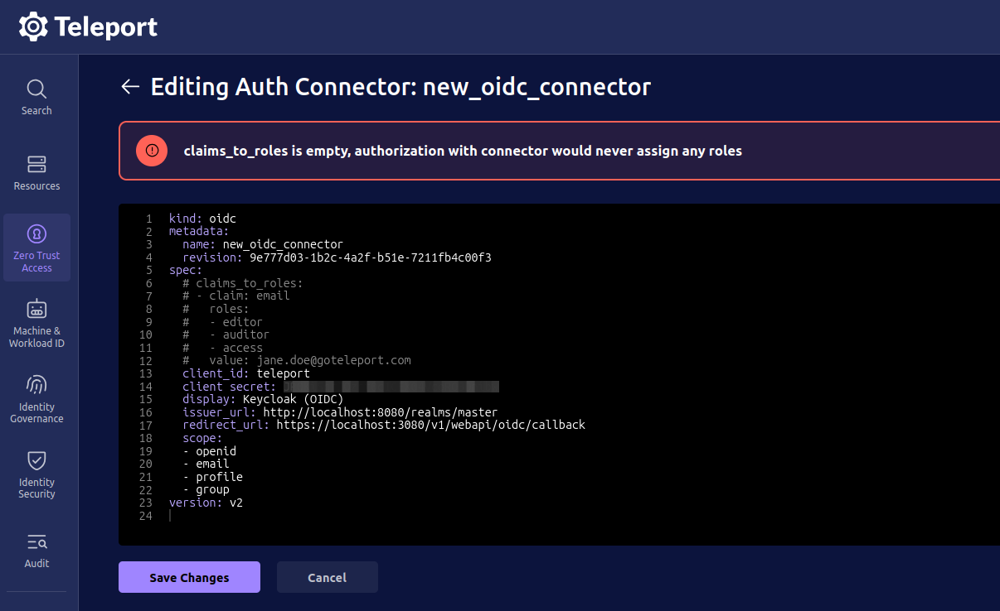
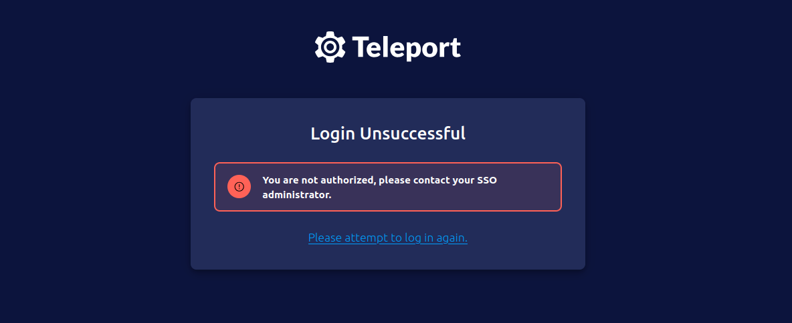
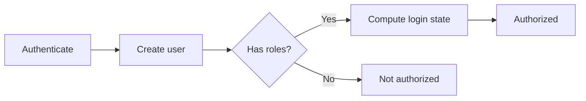
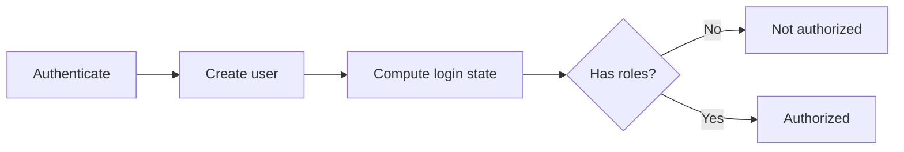

# RFD 0248 - Allow creation of auth connectors without role mappings

## Required Approvers

- Engineering: @smallinsky && @r0mant
- Product: @r0mant

## What

Allow creation of auth connectors without role mapping fields.

## Why

A role mapping field (such as `attributes_to_roles`, `claims_to_roles`, or `teams_to_roles`) on an auth connector is used to map some attribute of the authenticated user from the auth provider to a role in Teleport, for example mapping all users in the Okta `Admin` group to the `access`, `editor` and `auditor` Teleport roles.

Currently, creating an auth connector requires at least one role mapping, and users must have at least one role mapped via the connector to login (see: [How it currently works](#how-it-currently-works)).

Admins would like to create auth connectors without role mapping fields and allow users to login without any roles mapped to them via the connector so that they can use Teleport access lists as the sole source of role assignments (see: https://github.com/gravitational/teleport/issues/59079).

## Details

### How it currently works

#### Creating an auth connector

When an admin creates an auth connector, they are required to provide at least one role mapping field. This applies to CLI, Terraform, and YAML. If no role mapping field is provided, then the auth connector is not created, for example:

**via CLI**
```bash
$ tctl sso configure saml --name="Test Connector"
# ... snipped for brevity ...
ERROR: required flag --attributes-to-roles/-r not provided
```

**via Web UI YAML**


**via Terraform**
```bash
# ... snipped for brevity ...
teleport_oidc_connector.oidc_connector: Creating...
╷
│ Error: Error setting OIDCConnector defaults
│
│   with teleport_oidc_connector.oidc_connector,
│   on main.tf line 17, in resource "teleport_oidc_connector" "oidc_connector":
│   17: resource "teleport_oidc_connector" "oidc_connector" {
│
│ claims_to_roles is empty, authorization with connector would never assign any roles
╵
```

#### Authenticating using an auth connector

When a user authenticates using an auth connector, Teleport checks if any roles have been mapped to the user as a result of the role mapping fields on the connector. If no roles have been mapped, the user is unable to login.



Note: this applies even if they have roles assigned within Teleport itself, since the user's full login state (including access list and Teleport-assigned roles) isn't known until later in the flow. 



### Proposed

 - Validation of auth connectors will be updated to make role mapping fields optional so that admins can create auth connectors with or without role mappings.
 - Authorization of users will be moved from immediately after auth connector role mapping to after the user's login state is computed so that Teleport-assigned roles are considered when determining whether a user is authorized.

#### UX

##### `tctl` CLI

The CLI will be the same as it is currently, except that the role mapping flag will not be required, e.g. the following will create a SAML connector with no 'attributes to roles' mapping:

```bash
$ tctl sso configure saml --name="Test Connector"

# Note absence of --attributes-to-roles flag.
```

##### Terraform

The Terraform modules will be the same as they are currently, except that the role mapping arguments will not be required, e.g. the following will create an OIDC connector with no 'claims to roles' mapping:

```hcl
resource "teleport_oidc_connector" "oidc_connector" {
  version = "v3"

  metadata = {
    name    = "oidc_connector"
  }

  spec = {
    client_id     = "<client-id>"
    client_secret = "<client-secret>"
    issuer_url = "http://localhost:8080/realms/master"
    redirect_url = ["https://localhost:3080/v1/webapi/oidc/callback"]
  }
}

# Note absence of teleport_oidc_connector.oidc_connector.spec.claims_to_roles section.
```

##### YAML

The YAML will be the same as it is currently, except that the role mapping arguments will not be required, e.g. the following will create a GitHub connector with no 'teams to roles' mapping:

```yaml
kind: github
version: v3
metadata:
  name: github
spec:
  api_endpoint_url: https://api.github.com
  client_id: <client-id>
  client_secret: <client-secret>
  display: GitHub
  endpoint_url: https://github.com
  redirect_url: https://localhost:3080/v1/webapi/github/callback

# Note absence of spec.teams_to_roles section.
```

#### Validation

The zero-length checks on connector-mapped roles will be removed from connector validation.

The `--attributes-to-roles`, `--claims-to-roles`, and `--teams-to-roles` flags will have `.Required()` removed.

#### Role evaluation

Evaluation of roles will be moved from `calculateXxxUser` (where only connector-mapped roles are available) to after `GetUserOrLoginState` is called in the validate functions. At this point, the user's full login state has been computed, including roles granted via access lists.



A user with no roles from any source will still be denied access.

##### Session TTL

Session TTL is currently computed in `calculateXxxUser` using only connector-mapped roles. The roles' `MaxSessionTTL` are used to constrain the session TTL. In the case where there are no connector-mapped roles, this is set to `MaxCertDuration`. For users with no connector-mapped roles, the `SessionTTL` will be recomputed after the full login state is available to ensure it's constrained down from `MaxCertDuration` to min from assigned roles.

#### gRPC/Protobufs

No changes should be needed to protobufs, since the fields are `repeated` types, we just end up with an empty slice on the Go side (addressed by [Validation](#validation) above).

#### Backwards compatibility

Auth connectors created with role mapping fields will continue to work as they currently do.

Auth connectors created without role mapping fields **will not** work with versions of Teleport prior to these proposed changes. Teleport will reject them as covered in [How it currently works](#how-it-currently-works).

#### Test plan

The following test plan areas will need to be updated to test auth connectors created without role mappings.

- [`tctl sso` family of commands](https://github.com/gravitational/teleport/blob/master/.github/ISSUE_TEMPLATE/testplan.md#tctl-sso-family-of-commands)
- [GitHub External SSO](https://github.com/gravitational/teleport/blob/master/.github/ISSUE_TEMPLATE/testplan.md#github-external-sso)
- [Teleport with SSO Providers](https://github.com/gravitational/teleport/blob/master/.github/ISSUE_TEMPLATE/testplan.md#tctl-sso-family-of-commands)

## Alternatives

 - Automatically map a role via the connector and assign all users that role, for example a no-op role that has no permissions to do anything. This is similar to how Entra ID currently works, albeit using the `requester` role (see: https://github.com/gravitational/teleport.e/blob/master/lib/web/plugindescriptor_entraid.go#L77-L83).
 - Remove the 'early' error return for users without a role mapped via the connector. This would enable users to login without any roles mapped via the connector, but doesn't remove the requirement of at least one role mapping to be present on the connector, whether that is a 'real' or no-op mapping (see: https://github.com/gravitational/teleport.e/pull/8055/changes).
 - A combination of the above, e.g. automatically map a no-op role via the connector but remove the requirement for a user to be assigned that role to login.

**Example no-op role and mapping:**
```yaml
---
kind: role
version: v7
metadata:
  name: noop
spec: {}

---
kind: oidc
version: v2
metadata:
  name: oidc
spec:
  claims_to_roles:
  - claim: ""
    value: ""
    roles:
    - noop
```

However, the alternatives work around the existing limitation rather than addressing it, introducing unnecessary complexity and maintenance burden for a constraint that doesn't need to exist.
