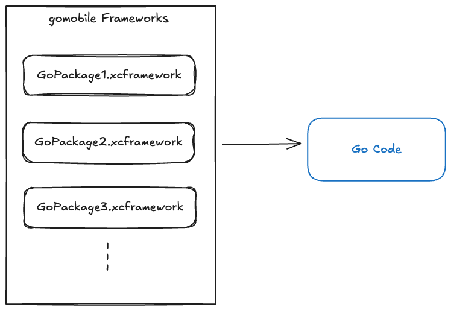
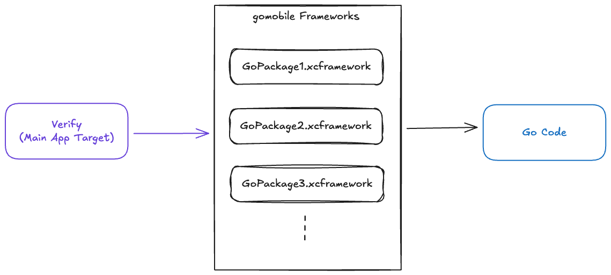
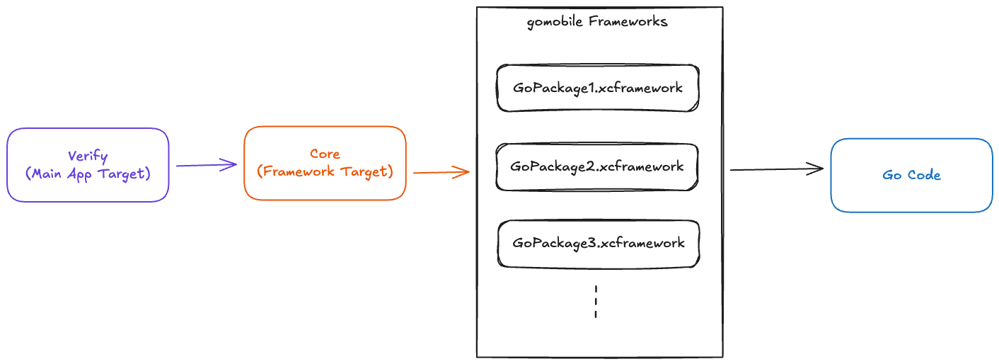
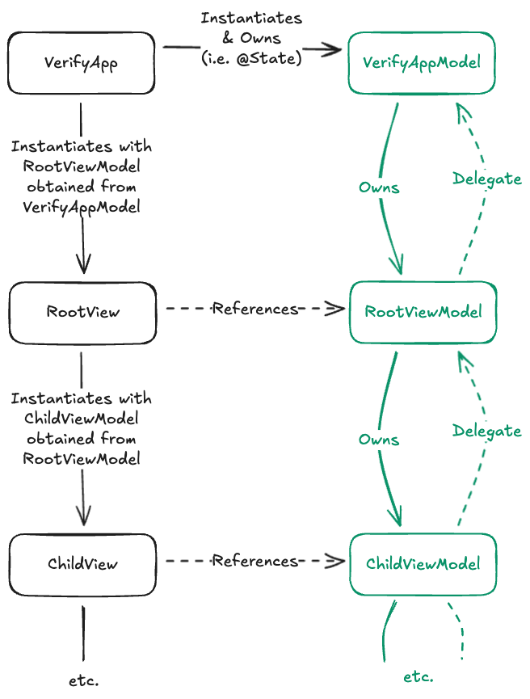

# RFD 0248 - Teleport Verify iOS App Architecture

## What

This RFD describes the high level architecture of the Teleport Verify iOS app, both in terms of the
code modules and how they connect, as well as how code is structured within those modules.

## Why

Suppose you're given the wonderful opportunity to design your own home. You decide where the front
door goes, the windows, walls, everything. The catch is that you're given a bunch of furniture that
you _have_ to fit inside the house. What's more is that you'll regularly get new furniture
deliveries, and those too must go in your house. Eventually you'll need to tear down walls or make
additions to the home, but you want to try your best to make your initial design last as long as
possible.

This is, in my mind, more or less what it means to design the architecture for an app. All of the
code for the features you want has to _exist_. Your networking code has to live somewhere, your
dependencies need entryways into your code, and so on. The question about architecture is _where do
I put it_. For the rest of this document, I'll use the verbs like "organize", "architect", and "put
this code somewhere" interchangeably.

If you think about it this way, designing an app architecture is a deeply _human_ problem. No two
people like their house laid out the exact same way. However, instituting a well thought out system
that addresses the most immediate concerns of those involved, is something that just about anyone
can appreciate. I won't claim to get all the details right on the first go around, but I'll be
trying my best to create a system that makes sense so anyone can contribute.

## Details

My proposed design has two main pieces:

1. How our code is broken up into modules
2. How the code within our modules is structured

### 1. Module Breakdown

Many iOS apps lean heavily into modularization, making sure that there are strict separation of
concerns. This is a generally reasonable thing to do, however I've found that doing this prematurely
forces arbitrary restrictions that don't solve real problems. It just becomes kind of a chore to
maintain.

I'm opting to break things down here in a way that solves the problems we have today and doesn't
preclude us from breaking things apart further in the future.

#### Calling Go Code From Swift

Critical to the design of our module architecture is understanding how some of our code _must_
interact. We have a bunch of Go code that already does important work, and we'd love to be able to
reuse it if possible. Go provides us a tool called `gomobile` that can build static libraries from
Go packages that are consumable from the iOS-side. These libraries are called XCFrameworks and they
are the main mechanism by which Swift code can call directly into Go code. Though it's not
_precisely_ correct to visualize it like this, for the purposes of discussion it's sufficient to
think about the XCFrameworks as the boundary layer between Swift and Go.



From here, we can begin to think about our Swift code and where it should live, but before we do it
will be useful to establish a little build system terminology.

> [!IMPORTANT] target _n._ — A set of inputs and instructions for producing a single build artifact.
> 
> iOS apps can produce lots of different outputs from varying subsets of the overall set of inputs.
> For example, you'll have a target for your main app's executable, that contains all the source
> code for your app, but you might _also_ have a target for running tests, which contains the source
> code for your app _and also_ the source code for your tests. There are many more examples of this
> (like widgets and app intents) but for the purposes of this RFD, you can just thing of a target
> using the definition above.

When deciding how to architect our Swift code, you _could_ theoretically just have one large target
(our main app target) containing everything, and have it depend directly on the `gomobile`-generated
frameworks. It would look like this:



This architecture violates an important tenet of software development: _if you want your code to be
testable, you need to control your dependencies_. Though we _do_ control the code inside the
XCFrameworks, that code is going off and reaching into your real network, or your real file system,
even generating real pseudorandom numbers—all things that prevent us from reliably testing any of
our code.

As with many things in computer science, we can solve this problem with a layer of indirection. I
propose we add a second target to our app in the form of a framework that wraps the generated
XCFrameworks in a clear, idiomatic Swift that will formalize this relationship as a dependency we
need to control. Using the popular
[swift-dependencies](https://github.com/pointfreeco/swift-dependencies) library, we'll be able to
easily stub out any behaviors we wish for for testing (or even for overriding at runtime). We'll
call it the "Core" framework (since it's the bridge to the core of Teleport) and with it in place,
our final architecture would look like this.

 #### Future Directions

As I mentioned earlier, we could absolutely break apart the Verify target even further. However the
value proposition there will only reveal itself as the app grows. Every app and every organization
is different, and it's as yet unclear where the boundary lines for new modules will form. Until
then, simplicity is best.

### 2. Code Structure

Despite not breaking down the Verify target further into more modules, we can still organize our
code with care and discipline. The code that makes up most iOS apps can roughly be broken down into
three categories:

1. View code
2. Business-logic adjacent code that powers your views
3. Subsystems that contain your business logic or complex control of on-device systems

You may recognize a common client-side pattern here; Model-View-ViewModel (MVVM) is a common
architecture for client-side apps. The three layers are described as above where (1) is
self-evident, (2) is the view model that powers the view, and (3) is the model layer that describe
more complex subsystems whose data we are displaying and interacting with.

For us, most of (3) is handled by the XCFrameworks we're generating with `gomobile`. We might have
some more complex client-side subsystems (e.g. a QR code scanner feature for use with Device Trust)
but overall we can think of these as subsystems that house data we need to interact with and whose
internal architecture will be bespoke as far as the iOS app is concerned.

Regarding (1) and (2), I have seen many different approaches to building the view+view model layers
in MVVM. So many approaches, in fact, that the term "view model" has functionally lost all meaning
to me except to say that it's definitely _not_ view code. 

#### View Layer

For our apps on iOS, the View layer will be comprised almost entirely of native SwiftUI code, using
UIKit only wherever necessary. For the uninitiated, SwiftUI is a relatively young UI framework,
having been released at WWDC 2019 (while UIKit has been around since the earliest days of the iOS
SDK released in 2008). Despite its youth, Apple has demonstrated that SwiftUI is where they are
spending the _vast_ majority of their development time and resources. They consistently portray
SwiftUI as the way most people should be building apps and are closing gaps in functionality between
SwiftUI and UIKit every year.

I've worked at places that use _only_ UIKit, others that predominantly use SwiftUI, and others still
that use only AppKit (Apple's macOS UI framework). From these experiences I can confidently say that
this approach of "mostly SwiftUI, UIKit where necessary" provides an excellent balance of developer
velocity, flexibility, and maintainability. In the interest of brevity (in an already long RFD) I'll
defer further discussion and leave the door open to changing our stance as the app grows.

#### View Model Layer

The more interesting part of this discussion is how to handle the code that _powers_ our views.
There are many approaches with many acronyms (MVVM, MVC, VIPER, TCA, etc.) and they all have
opinions about how things should be structured. I've always preferred simplicity wherever possible.
Complexity arises naturally when you try to build interesting apps and features, and our
architecture should endeavor to manage that complexity by staying as simple as possible.

That said, we're not managing data in a vacuum; the view model layer sits between two boundary
layers we have to manage. In a previous section, we talked about the establishment of a "Core" layer
that serves as the intermediary between Swift code and Go code. The "Swift" code that we referred to
in that discussion is this view model layer. Code in the view models should feel free to reach out
to Core functionality because everything exposed from Core will be a client that can be stubbed out
and tested.

On the other side we need to understand how the view models interact with our views. In SwiftUI,
views have a semantic lifecycle. Once they are loaded into memory, they can hold onto objects for
us. When the system deems the view is no longer needed, those views are freed from memory and any
objects they were holding onto go with them. While in memory, views can read data from those objects
and fire events to those objects. It may seem reasonable then that, as our view tree grows, we let
each view create and own its own view model object. This, theoretically, makes it so that each view
is really well encapsulated and object lifecycles are managed automatically.

In practice, however, you run into limitations with this approach really quickly. It turns out that
complex apps involve different pieces of the codebase talking to each other. If your views
initialize and own their own view models, the view models don't necessarily know about each other
and can't talk to each other. You end up doing one of the following:

- Creating backchannels for view models to communicate with each other, increasing cognitive
  load/complexity
- Passing around references to your view models, muddying the ownership model and making it less
  clear when object lifetimes end (since object lifetimes in Swift are directly tied to who has
  references to those objects)
- Making giant view models that encompass way more functionality that they should so that the
  various conceptually independent pieces of your app live in the same place and can talk to each
  other directly

So in an effort to reduce complexity, you might actually _increase_ it as this model makes contact
with reality. Instead, we'll accept this cross-app-communication as a necessary fact, and design a
model that works _with_ it. Conveniently for us, we can borrow a really common concept from UIKit
(that's right, UIKit, not SwiftUI) that will help us: delegates. 

#### Delegates, SwiftUI, and You

Here's a rough diagram of the architecture which we'll use for the rest of the discussion.



We begin at the top left with a type called `VerifyApp`. Every app has an entry point and this is
ours. It's a type that conforms to SwiftUI's `App` protocol and its lifetime is the lifetime of the
whole application.

From `VerifyApp`, we will initialize and own an instance of a type called `VerifyAppModel`. This
will form the root of a view model _tree_. When `VerifyAppModel` is initialized, it will also
initialize any child view models as appropriate. In this particular case, the `RootViewModel` would
be initialized immediately so we can create our `RootView`. From there, whenever it's appropriate,
we can initialize child view models further down that chain and use _their existence_ to drive the
UI. SwiftUI has some built-in tools for this, and libraries like
[swift-navigation](https://github.com/pointfreeco/swift-navigation) provide even more.

So far I hope that I've convinced you that this design is possible, but I haven't yet convinced you
that it's good. To do so, let's take a look at what a `RootViewModel` class might look like:

```swift
final class RootViewModel { // 1
	protocol Delegate: AnyObject { // 2
		func rootViewModel(_ viewModel: RootViewModel, didAcceptAlert response: Bool)
	}

	weak var delegate: Delegate? // 3
	
	func showGlobalAlert() { // 4
		// ... set some state to show the alert in the UI
	}
	
	func userDidRespondToAlert(with response: Bool) { // 5
		// ... set some state to dismiss the alert in the UI
		delegate?.rootViewModel(self, didAcceptAlert: response)
	}
}
```

There's a fair bit going on here, especially if you're not deeply familiar with Swift. Let's go
through it together:

1. We define our view models as classes. This means they are heap-allocated reference types and can
   outlive the scope in which they are defined. Objects in Swift participate in a process called
   [reference counting](https://en.wikipedia.org/wiki/Reference_counting), which is how the Swift
   runtime knows to deallocate an object. If the number of **strong** references to an object
   (references are strong unless declared otherwise) drops to zero, the object can be safely
   deallocated. This will matter in just a moment.
2. We declare a protocol inside of `RootViewModel` called `Delegate`. The `Delegate` protocol
   describes any events another class may be interested in subscribing to. By convention, delegate
   methods are designed to read like a sentence in English, but the first parameter is always an
   unlabeled instance of the object who's doing the delegation.
3. An interested object can subscribe to these events by conforming to the protocol and assigning
   themselves to this object's `delegate` property. For example:

   ```swift
   final class VerifyAppModel {
	   private(set) rootViewModel: RootViewModel
	   init() {
		   rootViewModel = RootViewModel()
		   rootViewModel.delegate = self
	   }
   }
   
   extension VerifyAppModel: RootViewModel.Delegate {
	   func rootViewModel(_ viewModel: RootViewModel, didAcceptAlert response: Bool) {
		   // ...
	   }
   }
   ```
   
   Note that the `delegate` property in `RootViewModel` is declared as `weak`. This means that this
   reference _does not contribute to the delegate object's reference count_. If it did, we'd have a
   [retain cycle](https://en.wikipedia.org/wiki/Reference_counting#Dealing_with_reference_cycles)
   and neither of these objects would ever be deallocated. It's a common source of memory leaks.
4. If `VerifyAppModel` ever needs to communicate downwards to `RootViewModel`, it simply calls a
   function on it like `rootViewModel.showGlobalAlert()`; this is just traditional object-oriented
   programming where communication follows the flow of ownership.
5. If `RootViewModel` ever needs to communicate _upward_ (i.e. against the flow of ownership), it
   simply calls functions on its `delegate`.

With this setup, the view models are free to implement just the parts of a feature that make sense
for where they are in the app's hierarchy. They won't box themselves in because of an inability to
    communicate with other parts of the app.

#### The Downsides

There are a couple downsides to this approach. Most noticeable among them is that it requires a fair
bit of boilerplate. The delegation pattern on iOS is _not_ known from being terse.  It's also a
pattern that's predominantly a UIKit concept, so some might argue that it seems foreign in a
SwiftUI-first codebase. In my opinion, for the flexibility this pattern gives you, boilerplate and
oddity are minor tradeoffs.

The main functional tradeoff is that there's no explicit support for out-of-band communication.
Consider a scenario where your app has bifurcated into two distinct view model subtrees (which will
almost assuredly happen). Suppose further that some feature you're writing requires sending some
message from one subtree to another. Then this architecture states that you must send that message
upward via a series of delegate calls until you find a common ancestor, and then communicate back
down the other subtree. This can result in a significant amount of "plumbing" for any feature with a
wide surface area.

I would argue that this downside actually has a really positive quality: the extreme lack of
mystery. For any feature, any change of state in your app, you can _always_ trace it via a series of
function calls, regardless of whether those calls to "up" the tree via delegates or "down" the tree
via regular function calls. There are no layers of indirection hidden at runtime. The added benefit
here is that coding agents tend to parse this kind of structure extremely well because their
exploration and code search tools are typically excellent.

## TL;DR

This was a long one so I figured I'd summarize everything into just a couple of sentences. Here's
the architecture in a nutshell:

1. Use modules to control dependencies, and apply them judiciously. To begin, we need only a single
   extra module beyond those required by our tech stack: a "Core" module that serves as the boundary
   layer between Swift and Go.
2. Use SwiftUI for as much UI work as possible, using UIKit only when some desired experience is
   impossible or unduly onerous in SwiftUI.
3. Use an MVVM variant where the "model" is, functionally, anything that happens on the Go side, and
   we have view & view model trees that roughly mirror each other.
4. Use the delegate pattern to communicate against the flow of ownership wherever necessary.

## Thanks!

Thank you for reading this RFD and I'm extremely curious to hear your thoughts. In particular, as
someone who focuses on developing native apps for Apple platforms, you (the reader) and I (the
author) may not have much shared context. Here are some questions to 

- Did I make any logical leaps that didn't track for you? This may mean I'm off base, but it could
  also mean I've left out some important assumption that I just didn't think to mention.
- Are there any patterns in Go development that may be helpful to adopt in this architecture? It's
  ok if they're incongruous with some aspects of the design; bringing them up may reveal some middle
  ground.
- Which aspects of the architecture do you think present a lot of value, and which aspects seem
  superfluous?
- Are there any important problems that this architecture does not solve?
