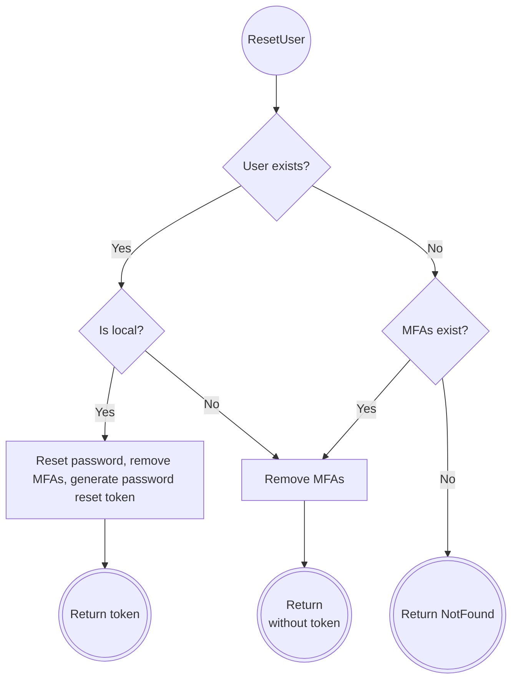

# RFD 251 — Resetting MFA Devices for SSO Users

## Required Approvers

- Engineering: @codingllama @avatus

## What

Allow admin users to remove all MFA devices from SSO users, both those that
have a corresponding user resource in the backend, as well as those with
expired resources.

## Why

SSO users don't need MFA devices for logging in to Teleport, but they may need
them for performing per-session MFA and admin action MFA. The problem arises
when the user needs to remove their last MFA device and SSO MFA is not allowed.
Teleport doesn't allow removing the last device. It also doesn't support
resetting MFA devices for SSO users, as this procedure is currently tightly
coupled to the password reset flow, which doesn't make sense for SSO accounts.

Currently, the only way to perform this is by deleting the user itself;
however, this needs to be performed before the user resource expires from the
database. It may pose problems, especially in cases where the user's role makes
their record short-lived and the IT support works in a different time zone.

## Details

We will extend the `tctl users reset` command to support resetting MFA devices
for SSO users. There will be no additional parameters; the usual `tctl users
reset <user-name>` command will do the right thing depending on the situation.
The built-in help text will be changed accordingly.

### UX

Example interaction:
- For an existing SSO user or a deleted user who still had MFA devices:
  ```
  $ tctl users reset bl-nero
  SSO user "bl-nero" has been reset. Removed all MFA devices.
  ```
- For a deleted user without MFA devices:
  ```
  $ tctl users reset bl-nero
  ERROR: "user" "bl-nero" does not exist
  ```

#### AI Agents

We expect this change to improve the agentic workflow by improving consistency
of the `tctl users reset` command and making it less reliant on user
intervention. The AI agents are expected to discover the new capability of
`tctl` using one of the following channels:

- `tctl help users reset` command
- [`tctl` command reference](https://goteleport.com/docs/reference/cli/tctl/#tctl-users-reset)
- ["Managing Users And Roles With IaC" guide](https://goteleport.com/docs/zero-trust-access/infrastructure-as-code/managing-resources/user-and-role/)

All of these resources will be updated to reflect the newly implemented
capabilities.

Since the feature is not complex enough (if anything, it makes the existing
flow simpler), there's no need for introducing a new agent skill.

#### SSO MFA

This feature will not in any way interact with SSO MFA, as its configuration is
global to the cluster and the auth connector; the SSO MFA "device" is synthetic
and is not represented by a `/users/<name>/mfa/<id>` resource in the backend.

### Changes to the API and `tctl`

To achieve this, we will extend the users service with an additional RPC endpoint:

```proto
import "teleport/legacy/types/types.proto";

service UsersService {
  // ...

  // ResetUser resets users current password (if applicable) and MFA devices.
  //
  // For local users, it creates a password reset token that can be then used
  // to set up new credentials.
  //
  // For SSO users, only MFA devices are removed; they are also removed if the
  // user has been deleted/expired from the backend. No password reset token is
  // returned.
  rpc ResetUser(ResetUserRequest) returns (ResetUserResponse);
}

// ResetUserRequest is a request to reset user's authentication credentials.
message ResetUserRequest {
  // Name is the user name.
  string name = 1;
  // Type is a token type.
  string type = 2;
  // Ttl specifies how long the generated token is valid for.
  int64 ttl = 3;
}

// ResetUserResponse is a response to resetting user's authentication
// credentials.
message ResetUserResponse {
  // PasswordResetToken carries a token that can be used to set up new
  // authentication credentials for the user. This field is not present if the
  // user whose credentials were reset is an SSO user.
  types.UserTokenV3 password_reset_token = 1;
}
```

The `ResetUser` call will replace `AuthService.CreateResetPasswordToken`. The
latter endpoint will be deprecated and removed after all clients are migrated
to `ResetUser`. When called, it will inspect the user and proceed accordingly:

- Local users get reset as per CreateResetPasswordToken. The reset token is
  returned.
- SSO users and inexistent/expired users get their MFA devices removed, no
  reset token is returned.



Note that `ResetUserRequest` carries data identical to
`CreateResetPasswordTokenRequest`, but we deliberately make it a separate
message; this will later allow a clean removal of the deprecated
`CreateResetPasswordToken` call.

Although the process spans multiple database calls, the risk of race condition
is acceptable because:

1. The user can't change from a SSO user into a local one or vice versa.
2. If the user expires (is deleted) or gets recreated (logs in again) after
   `CreateResetPasswordToken` returns appropriate error code, the only
   difference in behavior is the message shown to the user.
3. The only scenario where things can go wrong is when a local user with the
   same name as an expired SSO user gets created exactly between checking if
   the user exists and removing all MFAs, in which case the newly created local
   user may end up without their MFAs. This is highly unlikely, though, and can
   be fixed by resetting the credentials once again.

### Security

Nothing will change in what permissions are required for resetting the user
credentials — i.e, the admin account will have to bear an `update` permission
for the `user` resources. As it is for `CreateResetPasswordToken`, the
`ResetUser` call will be protected by an admin action MFA with MFA reuse
allowed.

### Privacy

The reset procedure will return different values depending on the kind of the
user being reset. To make sure it can't be used for retrieving information on
whether the user is local or not, this decision point needs to take place after
the admin user has been authorized.

### Backward Compatibility

This change adds new functionality that will be only available for the
consumers of the new API endpoint. The existing `CreateResetPasswordToken`
endpoint will not be affected, though we intend to migrate all its consumers to
`ResetUser`. In the second major release after we get rid of all references to
the old endpoint, it will be removed.

### Audit Events

The current flow emits a `reset_password_token.create` event. The new one is
going to keep this event for cases when the password reset token has been
actually created, but in any successful case, will also emit a new `user.reset`
event.

```proto
message UserReset {
  Metadata Metadata = 1;
  // Resource identifies the user that is the object of operation.
  ResourceMetadata Resource = 2;
  // User identifies the admin user.
  UserMetadata User = 3;
}
```

### Observability

Since the feature is interactive, it will immediately be obvious if it fails
from what `tctl` prints. There's no need to add any new observability metrics.

### Test Plan

The following steps will be added to the main test plan:

- Reset another local user's password and MFA devices (note: there's already a
  test item in the web test plan, but it doesn't cover `tctl`).
- Reset another active SSO user's MFA devices.
- Reset an expired SSO user's MFA devices (use target user role's
  `spec.options.max_session_ttl` field to control the TTL).

## Alternatives Considered

- Simply allow SSO users to remove their last MFA device: while it will also
  address a part of the problem, and it can be done independently, it doesn't
  address a situation where the user lost their last MFA device. This creates a
  catch-22 situation where the user can't delete a device without
  authenticating with it. They could authenticate with another one, but they
  would have to add it first — which requires authenticating with the one they
  lost.
- Extend `tctl rm` instead of `tctl users reset`. In particular, place the
  additional logic in the `DeleteUser` RPC endpoint. There are two main
  problems with this approach. First, it's much less intuitive to maintain this
  hack and promote it as an official solution; resetting is a more natural
  choice from the UX perspective. Second, it's no longer obvious when such
  endpoint should return a `NotFound` error. It would either mean that it's
  impossible to detect whether the function actually did something or we'd have
  to subtly alter the `NotFound` scenario, breaking symmetry between delete and
  get calls. This could lead to breaking API consumers that may rely on this
  symmetry.