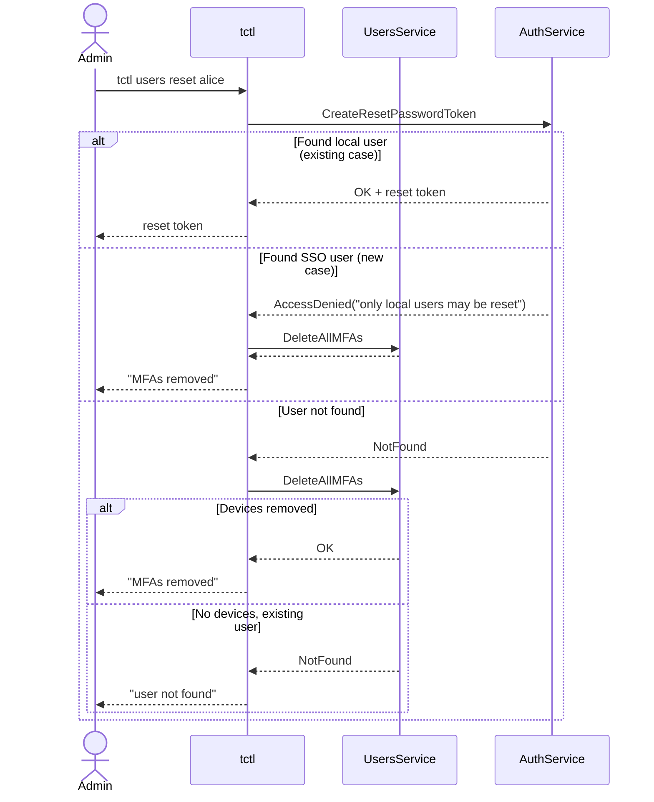

# RFD 250 — Resetting MFA Devices for SSO Users

## Required Approvers

- Engineering: @codingllama @avatus

## What

Allow admin users to remove all MFA devices from SSO users, both those that
have a corresponding user resource in the backend, as well as those with
expired resources.

## Why

SSO users don't need MFA devices for logging in to Teleport, but they may need
them for performing per-session MFA and admin action MFA. The problem arises
when the user needs to remove their last MFA device. Teleport doesn't allow
removing the last device. It also doesn't support resetting MFA devices for SSO
users, as this procedure is currently tightly coupled to the password reset
flow, which doesn't make sense for SSO accounts.

Currently, the only way to perform this is by deleting the user itself;
however, this needs to be performed before the user resource expires from the
database. It may pose problems, especially in cases where the user's role makes
their record short-lived and the IT support works in a different time zone.

## Details

We will extend the `tctl users reset` command to support resetting MFA devices
for SSO users. There will be no additional parameters; the usual `tctl users
reset <user-name>` command will do the right thing depending on the situation.

### UX
Example interaction:
- For an existing SSO user or a deleted user who still had MFA devices:
  ```
  $ tctl users reset bl-nero
  MFA devices for SSO user "bl-nero" have been removed.
  ```
- For a deleted user without MFA devices:
  ```
  $ tctl users reset bl-nero
  ERROR: "user" "bl-nero" does not exist
  ```

### Changes to the API and `tctl`

To achieve this, we will extend the users service with an additional RPC endpoint:

```proto
service UsersService {
  // ...
  
  // DeleteAllMFAs removes all user MFAs, even if the original user has been
  // deleted or expired.
  rpc DeleteAllMFAs(DeleteAllMFAsRequest) returns (DeleteAllMFAsResponse);
}
```

To reset user's credentials, `tctl` will first call `CreateResetPasswordToken`, as usual, and then, depending on the outcome, it will either print the reset token, or proceed to `DeleteAllMFAs`:



Although the process spans two RPC calls, there is no risk of race condition
involved because:

1. The user can't change from a SSO user into a local one or vice versa.
2. If the user expires (is deleted) or gets recreated (logs in again) after
   `CreateResetPasswordToken` returns appropriate error code, the only
   difference in behavior is the message shown to the user.

## Alternatives Considered

- Simply allow SSO users to remove their last MFA device: while it will also
  address a part of the problem, and it can be done independently, it doesn't
  address a situation where the user lost their last MFA device. This creates a
  catch-22 situation where the user can't delete a device without
  authenticating with it. They could authenticate with another one, but they
  would have to add it first — which requires authenticating with the one they
  lost.
- Extend `tctl rm` instead of `tctl users reset`. In particular, place the
  additional logic i a `DeleteUser` RPC endpoint. There are two main problems
  with this approach. First, it's much less intuitive to maintain this hack and
  promote it as an official solution; resetting is a more natural choice from
  the UX perspective. Second, it's no longer obvious when such endpoint should
  return a `NotFound` error. It would either mean that it's impossible to
  detect whether the function actually did something or we'd have to subtly
  alter the `NotFound` scenario, breaking symmetry between delete and get
  calls. This could lead to breaking API consumers that may rely on this
  symmetry.