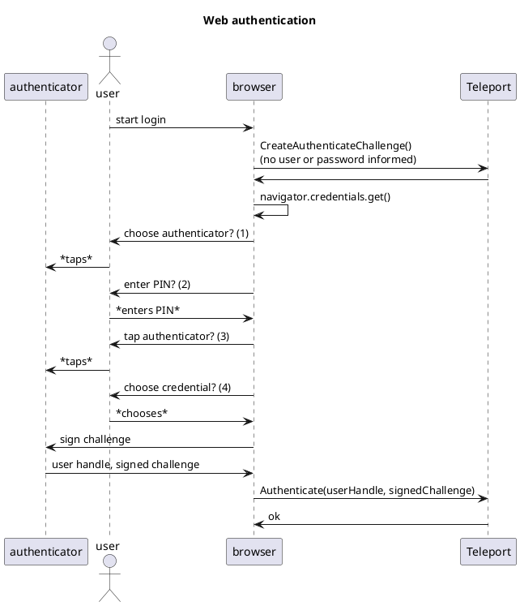
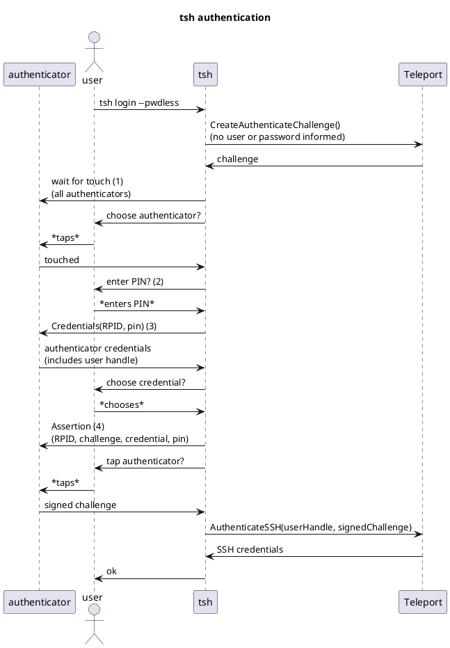
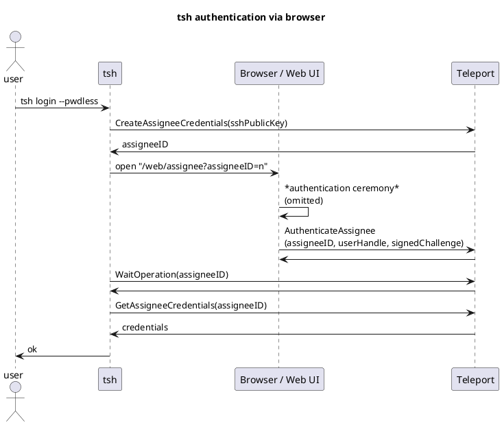

# RFD 9999 - Passwordless for FIDO2 clients

## What

Passwordless support for FIDO2 clients, including Web and CLI.

This RFD discusses "standard" FIDO2 clients - specialized/native APIs are
covered by accompanying designs.

This is a part of the [Passwordless RFD][passwordless rfd].

## Why

See the [Passwordless RFD][passwordless rfd].

## Details

### Browser-based clients

Browser-based clients are the simplest to discuss: they rely on the
[CredentialsContainer](https://developer.mozilla.org/en-US/docs/Web/API/CredentialsContainer)
API - that's it.

The flow is similar to a "regular" MFA/WebAuthn login, with the exception that
the interface doesn't need to ask for user/password; instead it should ask the
server for a passwordless challenge.

```
                                               Web authentication

                                ┌─┐
                                ║"│
                                └┬┘
                                ┌┼┐
     ┌─────────────┐             │                     ┌───────┐                                  ┌────────┐
     │authenticator│            ┌┴┐                    │browser│                                  │Teleport│
     └──────┬──────┘           user                    └───┬───┘                                  └───┬────┘
            │                   │        start login       │                                          │
            │                   │ ─────────────────────────>                                          │
            │                   │                          │                                          │
            │                   │                          │      CreateAuthenticateChallenge()       │
            │                   │                          │      (no user or password informed)      │
            │                   │                          │ ─────────────────────────────────────────>
            │                   │                          │                                          │
            │                   │                          │                                          │
            │                   │                          │ <─────────────────────────────────────────
            │                   │                          │                                          │
            │                   │                          │────┐                                     │
            │                   │                          │    │ navigator.credentials.get()         │
            │                   │                          │<───┘                                     │
            │                   │                          │                                          │
            │                   │ choose authenticator? (1)│                                          │
            │                   │ <─────────────────────────                                          │
            │                   │                          │                                          │
            │      *taps*       │                          │                                          │
            │<──────────────────│                          │                                          │
            │                   │                          │                                          │
            │                   │      enter PIN? (2)      │                                          │
            │                   │ <─────────────────────────                                          │
            │                   │                          │                                          │
            │                   │       *enters PIN*       │                                          │
            │                   │ ─────────────────────────>                                          │
            │                   │                          │                                          │
            │                   │  tap authenticator? (3)  │                                          │
            │                   │ <─────────────────────────                                          │
            │                   │                          │                                          │
            │      *taps*       │                          │                                          │
            │<──────────────────│                          │                                          │
            │                   │                          │                                          │
            │                   │  choose credential? (4)  │                                          │
            │                   │ <─────────────────────────                                          │
            │                   │                          │                                          │
            │                   │         *chooses*        │                                          │
            │                   │ ─────────────────────────>                                          │
            │                   │                          │                                          │
            │               sign challenge                 │                                          │
            │<─────────────────────────────────────────────│                                          │
            │                   │                          │                                          │
            │        user handle, signed challenge         │                                          │
            │─────────────────────────────────────────────>│                                          │
            │                   │                          │                                          │
            │                   │                          │ Authenticate(userHandle, signedChallenge)│
            │                   │                          │ ─────────────────────────────────────────>
            │                   │                          │                                          │
            │                   │                          │                    ok                    │
            │                   │                          │ <─────────────────────────────────────────
     ┌──────┴──────┐           user                    ┌───┴───┐                                  ┌───┴────┐
     │authenticator│            ┌─┐                    │browser│                                  │Teleport│
     └─────────────┘            ║"│                    └───────┘                                  └────────┘
                                └┬┘
                                ┌┼┐
                                 │
                                ┌┴┐
```

(Simplified Web authentication diagram.)

All user<->browser interaction steps depend on the browser implementation. The
observations below are meant to inform RFD readers on the status quo at the time
of writing.

(1) may be skipped if there is only a single authenticator present in the
machine. In case of ambiguity (more than one authenticator), then the user is
prompted to pick their authenticator of choice by tapping it.

(2) and (3) may be skipped for biometric authenticators - the initial tap is
sufficient for both verification and presence checks.

(4) may also be skipped if there is a single resident key for the RPID (Relying
Party ID) in the authenticator, otherwise a menu with options shows up.

### CLI clients (aka `tsh`)

There are essentially two options for CLI clients / `tsh`:

1. Leverage browsers and delegate FIDO2 authentication to them; or
2. Write CLI-native FIDO authentication.

(1) is attractive enough to merit discussion. Its main downside is that we can't
get a purely CLI-based flow, a browser needs to pop up. The upside is that we
get to benefit from the work browsers do for authentication and security. This
option means we get support for FIDO2 and native biometrics in a single stroke,
without having to deal with the delicate issues they pose ourselves.

(2) is the current approach used by Teleport, as it brings characteristics that
are important to our users. Unfortunately, it forces us to tackle some of the
difficult problems already solved by browsers, which often require
platform-specific work as well.

A compromise between both approaches is possible. For example, `tsh` could rely
on browsers in most cases (1), but implement a best-effort CLI-native solution
(2). This takes pressure out of the CLI implementation and allows it to focus in
the more impactful use-cases, instead of having to provide full functionality.

For the moment, the RFD chooses the CLI-native approach (2). A possible design
for [browser-based CLI authentication](#browser-based-cli-authentication) is
present in the "alternatives considered" section.

#### CLI-native authentication

CLI-native passwordless relies on
[libfido2](https://github.com/Yubico/libfido2), a C library that allows
interaction with FIDO2 resident keys. (The official Go wrapper is
[github.com/keys-pub/go-libfido2](https://github.com/keys-pub/go-libfido2/).)

One of the issues for passwordless interaction is that the client (`tsh`) gets
no information about registered credentials. The usual tactic of attempting an
assertion on all hardware keys falls short, as an authenticator may hold
multiple keys for the same Relying Party - in this case, the authenticator picks
the account, not the user!

The solution is similar to the one used by browsers - we make all hardware keys
blink and ask the user to choose the desired key by touching it. Authentication
proceeds by enumerating the credentials from that key and letting the user,
again, pick the desired one. (See libfido2's [examples/select.c](
https://github.com/Yubico/libfido2/blob/master/examples/select.c).)

Authentication diagram below:

```
                                               tsh authentication

                                ┌─┐
                                ║"│
                                └┬┘
                                ┌┼┐
     ┌─────────────┐             │                   ┌───┐                                       ┌────────┐
     │authenticator│            ┌┴┐                  │tsh│                                       │Teleport│
     └──────┬──────┘           user                  └─┬─┘                                       └───┬────┘
            │                   │  tsh login --pwdless │                                             │
            │                   │ ─────────────────────>                                             │
            │                   │                      │                                             │
            │                   │                      │        CreateAuthenticateChallenge()        │
            │                   │                      │        (no user or password informed)       │
            │                   │                      │ ────────────────────────────────────────────>
            │                   │                      │                                             │
            │                   │                      │                  challenge                  │
            │                   │                      │ <────────────────────────────────────────────
            │                   │                      │                                             │
            │          wait for touch (1)              │                                             │
            │          (all authenticators)            │                                             │
            │<─────────────────────────────────────────│                                             │
            │                   │                      │                                             │
            │                   │ choose authenticator?│                                             │
            │                   │ <─────────────────────                                             │
            │                   │                      │                                             │
            │      *taps*       │                      │                                             │
            │<──────────────────│                      │                                             │
            │                   │                      │                                             │
            │                 touched                  │                                             │
            │─────────────────────────────────────────>│                                             │
            │                   │                      │                                             │
            │                   │    enter PIN? (2)    │                                             │
            │                   │ <─────────────────────                                             │
            │                   │                      │                                             │
            │                   │     *enters PIN*     │                                             │
            │                   │ ─────────────────────>                                             │
            │                   │                      │                                             │
            │       Credentials(RPID, pin) (3)         │                                             │
            │<─────────────────────────────────────────│                                             │
            │                   │                      │                                             │
            │        authenticator credentials         │                                             │
            │        (includes user handle)            │                                             │
            │─────────────────────────────────────────>│                                             │
            │                   │                      │                                             │
            │                   │  choose credential?  │                                             │
            │                   │ <─────────────────────                                             │
            │                   │                      │                                             │
            │                   │       *chooses*      │                                             │
            │                   │ ─────────────────────>                                             │
            │                   │                      │                                             │
            │   Assertion (4)   │                      │                                             │
            │   (RPID, challenge, credential, pin)     │                                             │
            │<─────────────────────────────────────────│                                             │
            │                   │                      │                                             │
            │                   │  tap authenticator?  │                                             │
            │                   │ <─────────────────────                                             │
            │                   │                      │                                             │
            │      *taps*       │                      │                                             │
            │<──────────────────│                      │                                             │
            │                   │                      │                                             │
            │            signed challenge              │                                             │
            │─────────────────────────────────────────>│                                             │
            │                   │                      │                                             │
            │                   │                      │ AuthenticateSSH(userHandle, signedChallenge)│
            │                   │                      │ ────────────────────────────────────────────>
            │                   │                      │                                             │
            │                   │                      │               SSH credentials               │
            │                   │                      │ <────────────────────────────────────────────
            │                   │                      │                                             │
            │                   │          ok          │                                             │
            │                   │ <─────────────────────                                             │
     ┌──────┴──────┐           user                  ┌─┴─┐                                       ┌───┴────┐
     │authenticator│            ┌─┐                  │tsh│                                       │Teleport│
     └─────────────┘            ║"│                  └───┘                                       └────────┘
                                └┬┘
                                ┌┼┐
                                 │
                                ┌┴┐
```

(As a side note, it's interesting to note the differences in interaction between
Web and `tsh` and how it may provide clues as to how browsers work.)

(1) is the "key selection" step explained above, requiring one touch\* from the
user to choose the desired authenticator.

(2) is the PIN-entering step. For biometric authenticators, we can "merge" steps
(1), (2) and (3) by using [Credentials](
https://github.com/keys-pub/go-libfido2/blob/9246c0bee502c5f2c2495557f07fa5f45da8cd1c/fido2.go#L770)
as the method to choose the authenticator. This technique requires one user
touch/verification and avoids the need for PINs with biometric authenticators.

(3) is when we enumerate resident keys for the {authenticator, RPID} pair. We
can skip user interaction if only a single key exists.

(4) is the assertion step, where the authenticator signs the challenge. This
step requires a final touch/verification from the user.

\* currently go-libfido2 doesn't expose operations equivalent to
[fido_dev_touch_begin](https://developers.yubico.com/libfido2/Manuals/fido_dev_get_touch_begin.html)/[
fido_dev_touch_status](https://developers.yubico.com/libfido2/Manuals/fido_dev_get_touch_status.html),
but we can make do by attempting an [Assertion](
https://github.com/keys-pub/go-libfido2/blob/9246c0bee502c5f2c2495557f07fa5f45da8cd1c/fido2.go#L639).
(We could fork it and add it ourselves; I have a local patch that does just
that, but I'd rather keep light on forking if possible.)

#### libfido2 and Teleport

[libfido2](https://github.com/Yubico/libfido2) adds a native dependency to
Teleport. Its Go wrapper,
[go-libfido2](https://github.com/keys-pub/go-libfido2/), does little to
alleviate the pains of dealing with a native dependency (in fact, as a wrapper,
there is little it could do).

libfido2 itself depends on [libcbor](https://github.com/pjk/libcbor), OpenSSL
1.1 or newer, [zlib](https://zlib.net/) and libudev (Linux only, part of
systemd).

Care must be taken to produce deterministic (and equivalent!) builds for the
various supported operating systems - as a last resort, building libcbor and
libfido2 from source may be necessary (pulling the more complex, less sensitive
libraries from package managers).

Linking for go-libfido2 varies depending on OS - it defaults to
[static for macOS](
https://github.com/keys-pub/go-libfido2/blob/master/fido2_static.go) (with an
embedded libcbor binary) and [dynamic for Linux and Windows](
https://github.com/keys-pub/go-libfido2/blob/master/fido2_other.go#L6) (with
various embedded binaries for Windows). We should consider replacing those
during build, or once again forking go-libfido2 in order to standardize building
and linking strategies. (Static linking seems to be the best option for `tsh`.)

During development, the libfido2-aware code in Teleport is to be protected by a
`libfido2` build tag - said tag could be kept in the final product if dealing
with the library proves to be a hassle.

### Security

Security considerations are largely unchanged in relation to the
[Passwordless RFD][passwordless rfd].

It's important to note that CLI applications with hardware key access are
particularly dangerous, as they are not subject to the security measures
we've come to expect from browsers (in fact, _any_ untrusted application that
interacts with hardware keys should be used with caution).
Those concerns are not exclusive to WebAuthn, but are made more delicate in face
of passwordless credentials.

`tsh` does its best to be well-behaved and mitigates hardware key access
concerns by being open source, providing signed binaries and its own Cloud
solution.

(Security considerations for the [browser-based CLI authentication](
#browser-based-cli-authentication) alternative section are contained within it.)

### UX

UX is discussed throughout the design.

## Alternatives considered

### Browser-based CLI authentication

The diagram below exemplifies a new login method: the assignee based login.
In this method a third-party, the assignee, performs the authentication ceremony
on behalf of different entity (ie, Web UI authenticates on behalf of tsh).

The design is largely based in a new set of RPCs and removes the need for
communication between the source and assignee, apart from the initial stimulus.

```
                                           tsh authentication via browser

       ┌─┐
       ║"│
       └┬┘
       ┌┼┐
        │                 ┌───┐                        ┌────────────────┐                             ┌────────┐
       ┌┴┐                │tsh│                        │Browser / Web UI│                             │Teleport│
      user                └─┬─┘                        └───────┬────────┘                             └───┬────┘
       │ tsh login --pwdless│                                  │                                          │
       │ ───────────────────>                                  │                                          │
       │                    │                                  │                                          │
       │                    │                   CreateAssigneeCredentials(sshPublicKey)                   │
       │                    │ ────────────────────────────────────────────────────────────────────────────>
       │                    │                                  │                                          │
       │                    │                                  assigneeID                                 │
       │                    │ <────────────────────────────────────────────────────────────────────────────
       │                    │                                  │                                          │
       │                    │ open "/web/assignee?assigneeID=n"│                                          │
       │                    │ ─────────────────────────────────>                                          │
       │                    │                                  │                                          │
       │                    │                                  │────┐                                     │
       │                    │                                  │    │ *authentication ceremony*           │
       │                    │                                  │<───┘ (omitted)                           │
       │                    │                                  │                                          │
       │                    │                                  │                                          │
       │                    │                                  │ AuthenticateAssignee                     │
       │                    │                                  │ (assigneeID, userHandle, signedChallenge)│
       │                    │                                  │ ─────────────────────────────────────────>
       │                    │                                  │                                          │
       │                    │                                  │                                          │
       │                    │                                  │ <─────────────────────────────────────────
       │                    │                                  │                                          │
       │                    │                          WaitOperation(assigneeID)                          │
       │                    │ ────────────────────────────────────────────────────────────────────────────>
       │                    │                                  │                                          │
       │                    │                                  │                                          │
       │                    │ <────────────────────────────────────────────────────────────────────────────
       │                    │                                  │                                          │
       │                    │                      GetAssigneeCredentials(assigneeID)                     │
       │                    │ ────────────────────────────────────────────────────────────────────────────>
       │                    │                                  │                                          │
       │                    │                                 credentials                                 │
       │                    │ <────────────────────────────────────────────────────────────────────────────
       │                    │                                  │                                          │
       │         ok         │                                  │                                          │
       │ <───────────────────                                  │                                          │
      user                ┌─┴─┐                        ┌───────┴────────┐                             ┌───┴────┐
       ┌─┐                │tsh│                        │Browser / Web UI│                             │Teleport│
       ║"│                └───┘                        └────────────────┘                             └────────┘
       └┬┘
       ┌┼┐
        │
       ┌┴┐
```

`tsh` starts authentication by registering a new assignee login in Teleport,
including the public key to be signed. The resulting assignee ID is sent to the
browser / Web UI, who performs the authentication ceremony on `tsh`'s behalf.
Once the ceremony is complete `tsh` retrieves the credentials from Teleport.

CreateAssigneeCredentials may be used to capture information that helps the user
to identify and authorize the login in the Web UI, such as the application
requesting login ("tsh") and the originating IP.

[WaitOperation](
https://github.com/googleapis/googleapis/blob/master/google/longrunning/operations.proto#L113)
refers to the corresponding method in gRPC's [Operations service](
https://github.com/googleapis/googleapis/blob/master/google/longrunning/operations.proto#L54).
It could be replaced by its' non-blocking sibling, [GetOperation](
https://github.com/googleapis/googleapis/blob/master/google/longrunning/operations.proto#L77).

The design above is open-ended enough to be applicable to other "assignee"-type
authentication ceremonies, such as SSO logins or Teleport Terminal (possibly by
iframing the Web UI in the interface).

The RPCs suggested this section add untrusted surface to APIs and should be
considered carefully. They must take the same precautions other untrusted RPCs
take. In addition to that, potential for abuse is mitigated by various design
decisions, such as:

* Only public keys are exchanged in the ceremony, similarly to other Teleport
  credential creation methods
* The public key to be signed is registered by `tsh` at the start of the
  ceremony
* Minimal information is shared between `tsh` and browsers (only the assignee ID
  is necessary)
* Using hard-to-guess IDs / UUIDv4 (minimizes guessing/spamming in various RPCs)

### Pure Go FIDO2 library

An alternative to the pains of libfido2 (and shortcomings of go-libfido2) is to
write our own, pure Go, FIDO2 library.

The flynn/u2f library is backed by the necessary HID interfaces and has a parked
[webauthn](https://github.com/flynn/u2f/tree/webauthn) branch that could be used
as a starting point.

The alternative seems a bit extreme, at least for the moment, so it wasn't
explored much further.

<!-- Links -->

[passwordless rfd]: https://github.com/gravitational/teleport/blob/master/rfd/9999-passwordless.md

<!-- Plant UML diagrams -->
<!--







-->
