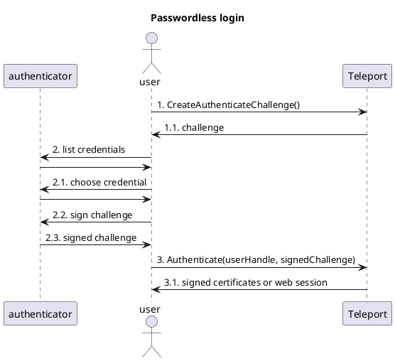

# RFD 9999 - Passwordless

## What

Passwordless and usernameless authentication for Teleport.

Passwordless refers to authentication without passwords, using procedures that
are as secure or better than password-based flows (for example, using a
biometric proof of identity in conjunction with a proof of presence).

Usernameless refers to authentication where the user doesn't have to identify
themselves for the procedure to start. It is a common property of passwordless
flows, but not necessary to achieve them. In the context of this RFD,
passwordless is employed to mean both passwordless and usernameless.

This RFD deals with general concepts and server-side changes, see the following
documents for client-side aspects of the design:

* [Passwordless for FIDO2 clients](
  https://github.com/gravitational/teleport/blob/master/rfd/9999-passwordless-fido2.md)
* TODO(codingllama): Passwordless for macOS CLI (aka Touch ID)
* TODO(codingllama): Passwordless for Windows CLI (aka plain FIDO2, Hello
                     out-of-scope for now)
* TODO(codingllama): Passwordless for SSO

## Why

Passwords are a pain for users and a liability for both users and service
providers.

Passwordless aims to do away with the need for passwords for day-to-day
authentication, while providing better usability (eg: fingerprint scanner vs
password) and better security (public-key based authn vs passwords).

## Details

Passwordless refers to the ability to authenticate without passwords, but not
necessarily a complete absence of passwords in the system. Passwords are
replaced by public-key based authentication, backed by the WebAuthn
specification. Specifically, we rely on both [user verification and user
presence](https://developers.yubico.com/WebAuthn/WebAuthn_Developer_Guide/User_Presence_vs_User_Verification.html)
to do away with passwords.

In a typical multi-factor authentication flow, user verification is performed
via password and user presence is performed by entering an OTP or tapping a
hardware key. In a passwordless flow, checks are likely pushed to a single
device (eg, hardware key using a PIN and a finger tap) and sometimes even
conflated to a single gesture, depending on hardware capabilities (eg,
fingerprint scanner).

We make no distinction between PINs and biometrics, as both fulfill the promise
of removing server-side passwords. See the [PINs](#pins) and
[device restrictions](#device-restrictions) sections for in-depth explanations.

### PINs

PINs, in the context of the RFD, refer to [FIDO2 PINs used by hardware keys](
https://fidoalliance.org/specs/fido-v2.1-ps-20210615/fido-client-to-authenticator-protocol-v2.1-ps-20210615.html#authnrClientPin-pin-composition).
Notably, they have the following characteristics:

* PINs are alphanumeric values of at least 4 characters, with a generous max
  length (eg, [Yubico supports up to 128 alphanumeric characters](
  https://support.yubico.com/hc/en-us/articles/4402836718866-Understanding-YubiKey-PINs))
* PINs are stored on hardware keys with the same, or better, security guarantees
  of private keys
* PINs, unlike passwords, are not sent to or verified by servers - they are
  verified by authenticators and never leave the users' system

PIN are essentially a shift from server-side to client-side passwords. They
arguably provide better security (it is harder to remotely compromise a hardware
key) but have a rather similar user experience.

While we may elect to restrict passwordless use to biometric-capable devices,
the reality is that even those devices have PIN fallbacks\*, so PINs aren't
truly absent in a passwordless system.

\* YubiKey Bio requires a PIN on setup.
   macOS allows the user password to be used in place of biometrics, effectively
   making the user password a PIN.

### Resident keys

[Resident keys](
https://developers.yubico.com/WebAuthn/WebAuthn_Developer_Guide/Resident_Keys.html)
are the final component for passwordless.

During a regular WebAuthn flow [no key material is kept in the authenticator](
https://developers.yubico.com/U2F/Protocol_details/Key_generation.html#_limited_storage_on_device).
In order to make passwordless viable, the authenticator needs to actually store
the key, which is achieved via the resident key (aka discoverable credential)
WebAuthn feature.

Creation and management of resident keys is commonly PIN protected and enforced
by the authenticators themselves.

### Death of passwords?

Unfortunately, we are still a few technology leaps away from the complete death
of passwords. While we can remove passwords from most of the day-to-day
activities, they still remain useful as a backup authentication method\*.

There are various situations where hardware keys may be lost or broken - even
with redundancy, there is a non-zero chance that multiple keys may become
unavailable. The same goes for platform-bound keys (eg, Touch ID is siloed
_per browser_ in macOS versions prior to 12/Monterey).

Solutions like [Apple's Passkeys](
https://developer.apple.com/documentation/authenticationservices/public-private_key_authentication/supporting_passkeys?language=objc)
mark a significant leap in the right direction, but they remain siloed to a
certain platform (unless we can get a Windows/Linux/Android/etc authenticated
with Passkeys).

While we intend to adopt passwordless quickly, a transitory period seems
necessary until we can be sure that passwords are ripe for full removal.

\* There is something to be said about recovery codes as a mechanism for
   sporadic logins and account recovery. A combination of recovery codes with
   ubiquitous authn methods like Passkeys may be powerful enough to bring forth
   the death of passwords.

### Authentication

A passwordless login flow is exemplified below:

```
                                     Passwordless login

                                   ┌─┐
                                   ║"│
                                   └┬┘
                                   ┌┼┐
     ┌─────────────┐                │                                        ┌────────┐
     │authenticator│               ┌┴┐                                       │Teleport│
     └──────┬──────┘              user                                       └───┬────┘
            │                      │       1. CreateAuthenticateChallenge()      │
            │                      │ ────────────────────────────────────────────>
            │                      │                                             │
            │                      │                1.1. challenge               │
            │                      │ <────────────────────────────────────────────
            │                      │                                             │
            │ 2. list credentials  │                                             │
            │<──────────────────────                                             │
            │                      │                                             │
            │                      │                                             │
            │──────────────────────>                                             │
            │                      │                                             │
            │2.1. choose credential│                                             │
            │<──────────────────────                                             │
            │                      │                                             │
            │                      │                                             │
            │──────────────────────>                                             │
            │                      │                                             │
            │ 2.2. sign challenge  │                                             │
            │<──────────────────────                                             │
            │                      │                                             │
            │2.3. signed challenge │                                             │
            │──────────────────────>                                             │
            │                      │                                             │
            │                      │ 3. Authenticate(userHandle, signedChallenge)│
            │                      │ ────────────────────────────────────────────>
            │                      │                                             │
            │                      │   3.1. signed certificates or web session   │
            │                      │ <────────────────────────────────────────────
     ┌──────┴──────┐              user                                       ┌───┴────┐
     │authenticator│               ┌─┐                                       │Teleport│
     └─────────────┘               ║"│                                       └────────┘
                                   └┬┘
                                   ┌┼┐
                                    │
                                   ┌┴┐
```

Authentication looks similar to our well-known challenge/response protocols,
with the exception that the initial challenge is created _without_ knowledge of
the user identity. This is a departure from the current authn model where
[challenge generation is gated on username and password](
https://github.com/gravitational/teleport/blob/f423f7fedc088b97cb666c13dcdcf54bd289b1bf/api/client/proto/authservice.proto#L1331).

Because the user is unknown when the challenge is generated (1), the server has
no knowledge of registered devices, nor it can safely supply any user
information (as the user is untrusted at this point). In practice, this means
that the choice to attempt a passwordless login depends on the user (once the
first login is done we can use local storage to record whether they are
passwordless-capable).

In regards to authenticator interactions (2), it is important to note that the
user may have multiple credentials attached to an RPID/Teleport.

Finally, in the last step of the authentication (3) we require the WebAuthn
[user handle](
https://developers.yubico.com/WebAuthn/WebAuthn_Developer_Guide/User_Handle.html)
to be informed along with the signed challenged, as recommended by the standard.

#### User handles

The following user handle properties are specially important for passwordless:

* User handles are globally unique (we already use UUIDs, but uniqueness is now
  enforced by storage as well)
* Users are efficiently queryable via user handle

Those reflect the necessities of usernameless logins, where the user handle is
supplied by the user, alongside the signed challenge.

A storage key `/webauthn/users/{user_handle}` is added for each WebAuthn-capable
user, where `{user_handle}` is the user handle UUID and the value is a
`webauthn.User` proto (defined below). The new key space effectively constitutes
a hand-written index, but since all values are immutable after the first write
it shouldn't pose a maintenance burden.

```proto
package webauthn;

message User {
  // ID is the Teleport user ID.
  string id = 1;
}
```

The scheme above makes it trivial to query users by their handles and is easy
implement, given our varied storage backends.

Changes are also made to the `WebauthnDevice` proto, so it is possible to
identify if the user has passwordless-capable credentials:

[WebauthnDevice](
https://github.com/gravitational/teleport/blob/f423f7fedc088b97cb666c13dcdcf54bd289b1bf/api/types/types.proto#L1857):

```proto
package types;

// WebauthnDevice holds Webauthn-specific fields of MFADevice.
message WebauthnDevice {
  // (existing fields omitted)

  // Authenticator data returned during registration.
  // Stored for audit and migration purposes.
  // May be absent in legacy entries (Teleport 9.x or earlier).
  bytes authenticator_data = 6;

  // True if the device is the result of a requested resident key
  // (ie, it is passwordless-capable).
  bool resident_key = 7;
```

#### User verification

[User verification](
https://www.w3.org/TR/webauthn-2/#enumdef-userverificationrequirement) is set to
`required` for passwordless logins, it remains `discouraged` otherwise.

#### Challenge/SessionData storage

WebAuthn challenge storage is currently [scoped per-user](
https://github.com/gravitational/teleport/blob/f423f7fedc088b97cb666c13dcdcf54bd289b1bf/rfd/0040-webauthn-support.md#webauthn-challenge-storage).
For passwordless we require a global challenge storage, since challenges may be
issued to an anonymous user. For simplicity, the global challenge storage will
replace the current per-user storage.

The new key space for challenges is `/webauthn/sessionData/{scope}/{id}`, where
`{scope}` is either `login` or `registration` and `{id}` is the base64 raw URL
encoding of the challenge. As in the current implementation, challenges are
deleted as soon as they are "spent" by a user.

The  [SessionData](
https://github.com/gravitational/teleport/blob/f423f7fedc088b97cb666c13dcdcf54bd289b1bf/api/types/webauthn/webauthn.proto#L45)
proto is modified as below:

```proto
message SessionData {
  // (existing fields omitted)

  // True if resident keys were required.
  bool resident_key = 4;

  // Requested user verification requirement, either "discouraged" or
  // "required".
  // An empty value is treated equivalently to "discouraged".
  string user_verification = 5;
}
```

Note that, for challenges issues to authenticated users ("regular" MFA or
registration), the backend will both set and check the `user_id` field
accordingly.

#### Authentication API changes

[CreateAuthenticateChallenge](https://github.com/gravitational/teleport/blob/f423f7fedc088b97cb666c13dcdcf54bd289b1bf/api/client/proto/authservice.proto#L1588),
or more specifically, its Web API counterpart (`/webapi/mfa/login/begin`), now
allows for unauthenticated requests without user and password. Requests are
modified as follows:

```go
package lib.client

type MFAChallengeRequest struct {
  User string `json:"user"`
  Pass string `json:"pass"`

  // Passwordless instructs the backend to ignore User and Pass and issue a
  // passwordless challenge instead.
  Passwordless bool `json:"passwordless"`
}
```

```proto
package proto; // api/client/proto

message CreateAuthenticateChallengeRequest {
  message ContextUser {}
  message Passwordless {}

  oneof Request {
    // (existing fields omitted)

    // Issues a challenge for the currently-authenticated user.
    // (Added so it can be made into an explicit choice, lack of a Request still
    // defaults to this option.)
    ContextUser context_user = 3;

    // Issues a passwordless challenge (no authenticated user required).
    Passwordless passwordless = 4;
  }
}
```

Passwordless SessionData is stored with an empty user ID but with
`resident_key = true` and `user_verification = "required"`, challenge responses
are checked accordingly.

No further request or response message changes are necessary, but it's important
to note that the user handle in [CredentialAssertionResponse](
https://github.com/gravitational/teleport/blob/f423f7fedc088b97cb666c13dcdcf54bd289b1bf/api/types/webauthn/webauthn.proto#L81)
is required for passwordless logins.

Finally, un-authenticated login endpoints are now subject to IP-based rate
limiting, as it seems wise to further safeguard system resources from anonymous
access.

### Registration

Registration requires us to know whether the user intends use to the device for
passwordless, so we can request a resident key and ask for the appropriate user
verification requirements.

Requesting resident keys is a delicate decision, as most FIDO2 devices have
limited capacity for resident keys (eg, [25 keys for Yubico FIDO2](
https://support.yubico.com/hc/en-us/articles/360013790319-How-many-credentials-can-I-program-on-my-YubiKey-)).
Users may want to pick and choose depending on how many accounts they have.
Platform authenticators may provide limits large enough to make it a non-issue,
so defaulting to passwordless/resident keys on them may be an easier decision.

<!--
TODO(codingllama): Sources needed for platform resident key limits.
-->

The backend makes no assumptions and lets the clients/UI decide, as they are
better equipped to do so.

The following changes are made to registration messages:

<!--
CreateRegisterChallenge: https://github.com/gravitational/teleport/blob/f423f7fedc088b97cb666c13dcdcf54bd289b1bf/api/client/proto/authservice.proto#L1354

AddMFADeviceRequestInit: https://github.com/gravitational/teleport/blob/f423f7fedc088b97cb666c13dcdcf54bd289b1bf/api/client/proto/authservice.proto#L878
-->

```proto
package proto; // api/client/proto

enum DeviceUsage {
  DEVICE_USAGE_UNSPECIFIED = 0;

  // Device intended for MFA use, but not for passwordless.
  // Allows both FIDO and FIDO2 devices.
  // Resident keys not required.
  DEVICE_USAGE_MFA = 1;

  // Device intended for both MFA and passwordless.
  // Requires a FIDO2 device and a resident key slot.
  DEVICE_USAGE_PASSWORDLESS = 2;
}

message CreateRegisterChallengeRequest {
  // (existing fields omitted)

  // Requested usage for the device.
  // Defaults to DEVICE_USAGE_MFA.
  DeviceUsage device_usage = 3;
}

message AddMFADeviceRequestInit {
  // (existing fields omitted)

  // Requested usage for the device.
  // Defaults to DEVICE_USAGE_MFA.
  DeviceUsage device_usage = 4;
}
```

#### Device restrictions

Passwordless device restrictions can be attained through [attestation](
https://github.com/gravitational/teleport/blob/f423f7fedc088b97cb666c13dcdcf54bd289b1bf/rfd/0040-webauthn-support.md#attestation).

Teleport may choose to ship with canned set of allowed passwordless roots. An
example of said roots could include:

* [Apple WebAuthn Root CA](https://www.apple.com/certificateauthority/private/)
  (allows Touch and Face ID)
* Yubikey Bio Series (both regular and Enterprise Profile)
  (attestation roots available at the [FIDO Metadata Service](
  https://fidoalliance.org/metadata/))

(Roots retrieval, if dynamic and not canned, should warn of any changes in the
CAs, detecting potential PKI attacks.)

It is important to consider the tradeoffs of a fixed set of passwordless roots
and its interaction with existing WebAuthn attestation settings.

A fixed set of roots, specially one in the form of an allow list, is likely to
become obsolete over time (requiring maintenance and Teleport updates).
Interactions with existing attestation allow/deny lists also provides its
challenges, as it forces us to either:

* Ignore admin settings (always using the fixed roots for passwordless); or
* Apply both attestation lists, with the potential to create lists that are
  impossible to satisfy.

Due to the above, the design makes the following suggestions, in order of
preference:

1. Do not implicitly restrict passwordless devices; or
2. Drop implicit passwordless restrictions if any attestation settings are
   provided by admins.

(1) is tied to the observation that there is little benefit in restricting
PIN-based devices from passwordless - attack vectors are essentially the same,
since devices fall back to PINs. This keeps the implementation uniform and
without hidden behaviors.

(2) allows Teleport to ship with a canned set of roots, but ditches those in
favor of admin choices whenever they are present. It aims to keep system
behavior simple and honors admin decisions.

### Security

The overall security of passwordless authentication bases itself on WebAuthn and
its mechanisms of user verification, user presence and origin validation.
The system is arguably made better by replacing server-side password checking
with public-key crypto.

No new server-side endpoints are added; modified endpoint remains largely the
same (Web API authentication already starts from untrusted users). An
interesting change is the ability for untrusted users to generate WebAuthn
challenges, an operation previously gated by user/password. In order to mitigate
a potential source of DoS and storage space attacks, the design recommends
adding rate-limiting for those endpoints (a possibly overdue change).

A circular in-memory buffer (or similar solution) to storage challenges may also
be advisable, in order to mitigate storage bloat of potentially-malicious
challenge creation sprees. <!-- As noted by Alexey, this may require digging
into the Teleport caching system to make it work in HA mode). -->

(Note that "entropy attacks" are
[not really](https://www.2uo.de/myths-about-urandom/#what-about-entropy-running-low)
[a concern](https://blog.cr.yp.to/20140205-entropy.html).)

PINs are discussed [in their own section](#pins).

### UX

UX is discussed throughout the design.

<!-- Plant UML diagrams -->
<!--



-->
