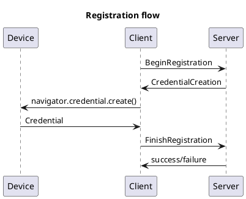
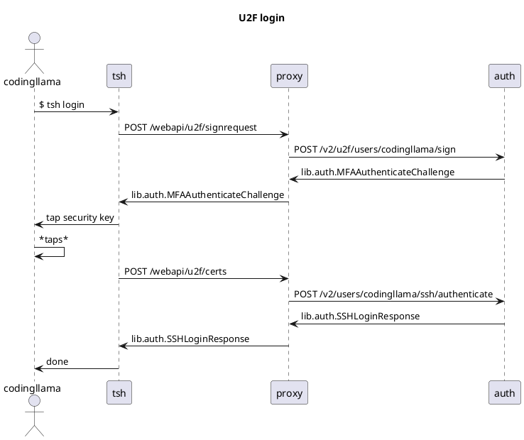
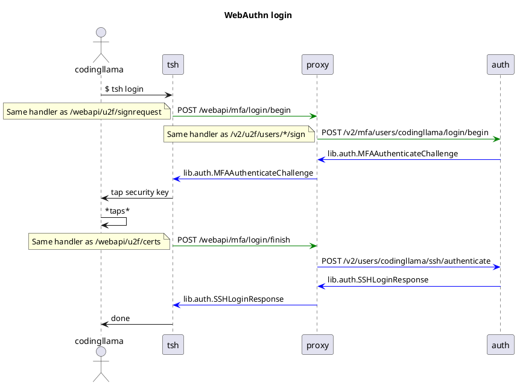

# RFD 9999 - WebAuthn Support

## What

Provide WebAuthn support for Teleport, both server- and client-side.

## Why

(Quoting issue [#6478](https://github.com/gravitational/teleport/issues/6478).)

_"FIDO 2 and WebAuthn are intended to replace U2F. Also, WebAuthn allows using
non-USB key backends from browsers (like Touch ID or Windows Hello)._

_WebAuthn is already better supported in browsers compared to U2F. For example,
Safari supports WebAuthn but not U2F. Going forward, WebAuthn will be more
ubiquitous than U2F."_

## Details

### WebAuthn overview

WebAuthn support involves an implementation similar to U2F. There are two
different flows that need be supported: Registration and Authentication.

Registration is the process of registering a new device. A simplified explanation
is: A client, typically a browser, begins registration by asking the server (aka
Relying Party or RP) for a
[CredentialCreation](https://pkg.go.dev/github.com/duo-labs/webauthn/protocol#CredentialCreation),
containing a challenge for it to sign (among various other options). The client
signs the challenge, typically by calling
[navigator.credentials.create()](https://developer.mozilla.org/en-US/docs/Web/API/CredentialsContainer/create),
and sends a
[CredentialCreationResponse](https://pkg.go.dev/github.com/duo-labs/webauthn/protocol#CredentialCreationResponse)
to the server with the signed challenge. Assuming all is well this completes the
registration process.

```
                          Registration flow                     
                                                                
     ┌──────┐                       ┌──────┐            ┌──────┐
     │Device│                       │Client│            │Server│
     └──┬───┘                       └──┬───┘            └──┬───┘
        │                              │ BeginRegistration │    
        │                              │ ──────────────────>    
        │                              │                   │    
        │                              │ CredentialCreation│    
        │                              │ <──────────────────    
        │                              │                   │    
        │ navigator.credential.create()│                   │    
        │ <─────────────────────────────                   │    
        │                              │                   │    
        │          Credential          │                   │    
        │ ─────────────────────────────>                   │    
        │                              │                   │    
        │                              │ FinishRegistration│    
        │                              │ ──────────────────>    
        │                              │                   │    
        │                              │  success/failure  │    
        │                              │ <──────────────────    
     ┌──┴───┐                       ┌──┴───┐            ┌──┴───┐
     │Device│                       │Client│            │Server│
     └──────┘                       └──────┘            └──────┘
```

Authentication (also referred simply as Login) follows a similar "challenge ->
sign -> verify" protocol. In simple terms, the client requests a 
[CredentialAssertion](https://pkg.go.dev/github.com/duo-labs/webauthn/protocol#CredentialAssertion)
from the server, signs it by calling
[navigartor.credentials.get()](https://developer.mozilla.org/en-US/docs/Web/API/CredentialsContainer/get),
and replies with a
[CredentialAssertionResponse](https://pkg.go.dev/github.com/duo-labs/webauthn/protocol#CredentialAssertionResponse).
Once again, assuming all is well, login is complete.

See https://webauthn.io/ and https://webauthn.guide/ for starter references.

### U2F/WebAuthn compatibility

WebAuthn is backwards compatible with U2F, but it's important to examine what
this sentence actually means.

U2F, as the current register/login protocol implemented by Teleport, is not
forward compatible with WebAuthn - WebAuthn messages differ from its
predecessor, including various options that didn't exist before. Browser support
is implemented via the
[navigator.credentials](https://developer.mozilla.org/en-US/docs/Web/API/CredentialsContainer)
object, which is WebAuthn-exclusive and
[distinct from the U2F APIs in use](https://github.com/google/u2f-ref-code#reference-code-for-u2f-specifications).

WebAuthn is backwards compatible with U2F in the sense that FIDO/CTAP1 devices,
ie U2F-capable devices, are still supported. The main difference in
implementations lies in the definition of the App ID / Relying Party ID (ie,
"https://example.com:3080" vs "example.com"). The "appid" extension is the
solution for this problem and seems to be well-supported for browsers
(__TODO(codingllama):__ Verify for Firefox and Safari).

Unfortunately, the appid extension is not without its issues.
[As the standard itself says in item 2](https://www.w3.org/TR/webauthn/#sctn-appid-extension),
_"When verifying the assertion, expect that the rpIdHash MAY be the hash of the
AppID instead of the RP ID."_ This advice
[wasn't followed by github.com/duo-labs/webauthn](https://github.com/duo-labs/webauthn/blob/9f1b88ef44cc0e4f5ddf511ed12a3aa468f972d7/protocol/assertion.go#L117),
but in the short-term may be circumvented by creating a secondary
[WebAuthn object](https://pkg.go.dev/github.com/duo-labs/webauthn/webauthn#WebAuthn)
with RPID = AppID, used exclusively to validate legacy requests (identified by
the presence of the "incorrect" rpIdHash).

### UX and configuration

WebAuthn support is designed to be as seamless as the U2F experience. Users
enabling MFA for the first time may register their devices via `tsh mfa add` and
use `tsh login` as usual. Users migrating from U2F to WebAuthn retain their
previously-registered devices and keep their workflow unchanged.

Migration from U2F to WebAuthn is achieved simply by changing the second_factor
option from "u2f" to "webauthn". The WebAuthn backend sends challenges for all
previously-registered U2F devices, in addition to any WebAuthn-registered
devices, so migration is a seamless process - no re-registration required.

If the second factor setting is "on", then the backend sends both U2F and
WebAuthn challenges. In this case user-facing interfaces, such as `tsh` and the
Proxy UI, should favor replying to WebAuthn challenges (instead of U2F).

Additions to configuration/`teleport.yaml` are as follows:

```yaml
auth_service:
  authentication:
    type: local
    second_factor: webauthn # "on" allows all MFA options
    webauthn:
      # ID of the Relying Party.
      # Device keys are scoped by the RPID, so similarly to the U2F app_id, if
      # this value changes all existing registrations are "lost" and devices
      # must re-register.
      # If unset the host of u2f.app_id is used instead.
      # Recommended.
      rp_id: ""
      # Attestation is explained in a following section.
      # If both attestation_allowed_cas and attestation_denied_cas are unset,
      # defaults to u2f.device_attestation_cas.
      # Optional.
      attestation_allowed_cas: []
      # Optional.
      attestation_denied_cas:  []
```

Changes to the `cluster_auth_preference` resource follow suite (no new resources
or version increments required):

```yaml
kind: cluster_auth_preference
version: v2
spec:
  type: local
  second_factor: webauthn # same as teleport.yaml
  webauthn: {}            # same as teleport.yaml
```

The general philosophy for configuration is that we provide the minimum set of
configurations necessary and automatically choose the more secure/usable options
ourselves.

The following defaults are assumed, by the system, for the underlying WebAuthn
settings:

```go
	web, _ := webauthn.New(&webauthn.Config{
		RPID: "example.com",       // See section below.
		RPOrigin: "<varies>",      // See section below.
		RPDisplayName: "Teleport", // fixed
		RPIcon: "",                // fixed, may use the icon from webassets

		// Either "none" or "direct" depending on attestation settings.
		AttestationPreference: "none",

		AuthenticatorSelection: protocol.AuthenticatorSelection{
			// Unset - both "platform" and "cross-platform" allowed.
			// User presence is what we're aiming at, which both provide.
			AuthenticatorAttachment: "",
			// Not aiming at "usernameless"/"first-factor" authentication _yet_.
			RequireResidentKey: false,
			// User presence is what we're aiming at, verification is a bonus.
			UserVerification: "preferred",
		},

		// General timeout for flows, defaults to 60s.
		Timeout: 60000,
	})
```

### U2F phase out

U2F phase out is planned as follows:

* Teleport v+1 (major): "webauthn" mode released, "u2f" mode unchanged for
  compatibility purposes
* Teleport v+2 (major): "u2f" mode aliased to "webauthn". U2F is effectively
  replaced by "webauthn" in both functionality and documentation.
* Teleport v+3 (major): "u2f" mode removed

### Relying Party ID, Origin and U2F App ID

Proper functioning of WebAuthn depends on a correct and stable RPID (Relying
Party ID). The RPID is used by authenticators to scope the credentials,
therefore if the RPID changes all existing credentials are "lost" (ie, they
won't match the new ID). A typical RPID is a domain or hostname, such as
"localhost" or "example.com".

In an effort to make migration to WebAuthn simpler, if the RPID is unset in
configurations but the U2F app_id is set, the host of the U2F app_id is used as
the RPID. The U2F app_id is required for all existing second_factor
configurations apart from "off" and "otp", which makes it guaranteed to exist in
installations where WebAuthn is applicable.

For newer installations we will refrain from guessing the RPID, instead asking
users to supply it. The rationale behind this is that guessing the RPID is not
always reliable and may lead users to configurations that are incorrect.
(Note: we may elect to change this in the future.)

An important detail to note about the RPID is that it must match the origin
domain for browser-based registration and login. Browser-based communication
with WebAuthn endpoints __must__ happen through that domain. The RPID should be
set to the Teleport installation domain, with the underlying assumption that
this domain is used to access Teleport from both Web UI and CLI tools, in
particular for login and MFA operations.

Another important setting for WebAuthn is the RPOrigin. The origin is similar to
a U2F facet, but it must share the RPID domain. A typical origin is
"https://localhost:3080" or "https://example.com:80".

Teleport allows any origin that could conceivably be addressing either a Proxy
or Auth Server, simplifying this particular configuration by assembling the
required WebAuthn configuration on the fly. A simple implementation checks the
origin against the RPID, while a more evolved implementation checks the origin
against all possible Proxy and Auth Server public addresses as well.

Finally, backwards compatibility with U2F requires the U2F app_id to remain set
in the configuration. The U2F app_id is currently mandatory for most
second_factor modes, so this shouldn't be an issue.

### Attestation

Attestation support is provided in a similar manner to U2F attestation, by means
of user-provided lists of CA certificates in PEM form.

Both an allow and deny list of attestation CAs may be provided by the user.
Organizations that allow a wide variety of authenticators may use the
easier-to-maintain deny list to prohibit troublesome or unsupported
devices, while organizations that want stronger control over the supported
models may opt for the allow list instead.

If both lists are present, then the attested certificate needs to pass both
tests. This allows for a broad attestation CA to be used while removing support
for specific models or batches.

The attestation preference is set to "direct" if one of the lists is present,
otherwise it is set to "none" (ie, the backend won't require attestation data
unless it intends to make use of it).

Configuration is as follows:

```yaml
auth_service:
  authentication:
    type: local
    second_factor: webauthn # or "on"
    webauthn:
      attestation_allowed_cas:
      - /path/to/attestation/ca.pem
      - |-
        -----BEGIN CERTIFICATE-----
        ...
        -----END CERTIFICATE-----

      attestation_denied_cas: []
```

Note 1: WebAuthn [attestation statements come in various formats](
https://www.w3.org/TR/webauthn-2/#sctn-defined-attestation-formats), which means
this feature may require eventual work to be kept up-to-date with newer
authenticator offerings.

Note 2: duo-labs/webauthn [doesn't do much for attestation](
https://github.com/duo-labs/webauthn/blob/9f1b88ef44cc0e4f5ddf511ed12a3aa468f972d7/protocol/credential.go#L131).
As for U2F, most of the logic will be written by us. (The sources do provide
an attestation checklist that is a good starting point.)

### Proxy UI + WebAuthn

WebAuthn support is implemented through the
[navigator.credentials](https://developer.mozilla.org/en-US/docs/Web/API/CredentialsContainer)
object.

The login APIs proposed preserve much of the inputs and outputs of
[github.com/duo-labs/webauthn](https://github.com/duo-labs/webauthn), therefore
providing easy integration with the browser's CredentialsContainer.

Registration is gRPC-based and currently only supported via `tsh mfa`, but its
design also preserves much of the standard messages.

### `tsh` + WebAuthn

WebAuthn/FIDO2 support for client-side libraries is currently sparse - the main
Go client-side library being
[github.com/keys-pub/go-libfido2](https://github.com/keys-pub/go-libfido2),
which focuses on USB devices (excluding platform authenticators such as Touch
ID). As such, the proposal is for a set of incremental changes in `tsh` (not
necessarily in this order):

* Support for U2F/CTAP1 USB devices (same as present), but using WebAuthn-based
  endpoints
* Support for WebAuthn/CTAP2 USB devices (likely via `libfido2`)
* Support for Apple biometric authenticators (aka Touch ID, more in following
  sections)
* Further support TBD (Windows Hello, NFC, etc)

Notes:
  CTAP1 USB+WebAuthn is certain (I have a working PoC for it).
  CTAP2 USB doesn't seem pressing (for example, most Yubikeys still ship with
  U2F support).
  Apple biometrics may warrant a small RFD for itself.

#### Touch ID in the world

Native Touch ID implementations for WebAuthn are mainly found in browsers,
varying depending on the browser. Firefox, at the time of writing, [doesn't
support Touch ID](https://bugzilla.mozilla.org/show_bug.cgi?id=1536482).
Chrome and Safari appear to have similar implementations, with some features
being exclusive to Apple (more below).

Chrome's implementation leverages Touch ID as
the means to gate access to Apple's [Secure Enclave](
https://support.apple.com/guide/security/secure-enclave-sec59b0b31ff/web), which
is used in a manner akin to a secure token: keys are created, kept and managed
by the Enclave; only public keys may be copied out of it. Chromium's
[MakeCredentialOperation](https://github.com/chromium/chromium/blob/842d8a96578db838d9260debe64f559758891a3d/device/fido/mac/make_credential_operation.h#L23)
provides a good overview of the exact process used.

The current status of browser implementations causes a few side effects in the
system. Unlike secure tokens, Touch ID registrations are tied to the application
using the Enclave. This is because keys are scoped by access group, thus
different applications have their own keys. The practical effect is that Touch
ID, unlike a secure token, needs to be registered separately by every
application that intends to use it (Apple passkeys mean to address this problem,
more below).

Attestation varies depending on the implementor. Chrome (and derived browsers)
do self-attestation when using Touch ID, making attestation allow lists
impossible to use. Safari does attestation using Apple's external attestation
CA and provides its own [apple attestation format](
https://www.w3.org/TR/webauthn-2/#sctn-apple-anonymous-attestation).

macOS Monterey promises support for passwordless authentication via passkeys,
essentially public keys distributed via iCloud Keychain. Monterey brings what
appears to be first-party native support for WebAuthn APIs via the
[AuthenticationServices](https://developer.apple.com/documentation/authenticationservices/public-private_key_authentication?language=objc)
framework.

On a side note, the [App Attestation Service](
https://developer.apple.com/documentation/devicecheck/dcappattestservice?language=objc)
borrows much from WebAuthn, although having a slightly different purpose. It
provides operations that match WebAuthn flows (attestKey = registration,
generateAssertion = login), returns WebAuthn payloads and supports attestation
(although it has [its own RPID definition](
https://developer.apple.com/documentation/devicecheck/validating_apps_that_connect_to_your_server?language=objc#3576643)).
Unfortunately, it appears that DCAppAttestService is [only available for iOS](
https://developer.apple.com/documentation/devicecheck/dcappattestservice/3573915-supported?language=objc#discussion).

#### Touch ID on `tsh`

The following avenues for native support seem possible:

* [Biometric-protected Keychain keys](
  https://developer.apple.com/documentation/localauthentication/accessing_keychain_items_with_face_id_or_touch_id?language=objc) (macOS 10+, weaker than a secure token, no notarization required)
* [Biometric-protected Secure Enclave keys](
  https://developer.apple.com/documentation/security/certificate_key_and_trust_services/keys/storing_keys_in_the_secure_enclave?language=objc) (macOS 10+, aka Chrome's solution)
* macOS Monterey APIs (macOS 12+, currently in beta, requires PoC)
* Touch ID support is delayed or not implemented natively at all, being instead
  delegated to browsers or a native app

A few parting notes about Touch ID on `tsh`:

Regardless of the native option selected, `tsh` needs to know if Touch ID was
already successfully registered for use in the current device. This is because
we can't poll for biometrics "silently" as we do for secure keys and we can only
query biometric-protected keys (keychain or Enclave) _after_ the user takes
action. Thus, a successful Touch ID registration requires at the very least a
flag to be stored in ~/.tsh or some other permanent store. (Passkeys provide a
similar problem, although it may be alleviated by their APIs or via server-side
signals.)

Finally, the recommendation of the proposal is to select one (or more) options
that seem adequate to our strategy and move from designing to prototyping, given
that the viability of it has been established.

### Server-side changes

#### Login API changes

This is the current flow of the login API:

```
                                                      U2F login                                                  
                                                                                                                 
          ┌─┐                                                                                                    
          ║"│                                                                                                    
          └┬┘                                                                                                    
          ┌┼┐                                                                                                    
           │                ┌───┐                             ┌─────┐                                      ┌────┐
          ┌┴┐               │tsh│                             │proxy│                                      │auth│
      codingllama           └─┬─┘                             └──┬──┘                                      └─┬──┘
           │   $ tsh login    │                                  │                                           │   
           │─────────────────>│                                  │                                           │   
           │                  │                                  │                                           │   
           │                  │  POST /webapi/u2f/signrequest    │                                           │   
           │                  │─────────────────────────────────>│                                           │   
           │                  │                                  │                                           │   
           │                  │                                  │    POST /v2/u2f/users/codingllama/sign    │   
           │                  │                                  │───────────────────────────────────────────>   
           │                  │                                  │                                           │   
           │                  │                                  │     lib.auth.MFAAuthenticateChallenge     │   
           │                  │                                  │<───────────────────────────────────────────   
           │                  │                                  │                                           │   
           │                  │lib.auth.MFAAuthenticateChallenge │                                           │   
           │                  │<─────────────────────────────────│                                           │   
           │                  │                                  │                                           │   
           │tap security key  │                                  │                                           │   
           │<─────────────────│                                  │                                           │   
           │                  │                                  │                                           │   
           ────┐              │                                  │                                           │   
               │ *taps*       │                                  │                                           │   
           <───┘              │                                  │                                           │   
           │                  │                                  │                                           │   
           │                  │     POST /webapi/u2f/certs       │                                           │   
           │                  │─────────────────────────────────>│                                           │   
           │                  │                                  │                                           │   
           │                  │                                  │POST /v2/users/codingllama/ssh/authenticate│   
           │                  │                                  │───────────────────────────────────────────>   
           │                  │                                  │                                           │   
           │                  │                                  │         lib.auth.SSHLoginResponse         │   
           │                  │                                  │<───────────────────────────────────────────   
           │                  │                                  │                                           │   
           │                  │    lib.auth.SSHLoginResponse     │                                           │   
           │                  │<─────────────────────────────────│                                           │   
           │                  │                                  │                                           │   
           │      done        │                                  │                                           │   
           │<─────────────────│                                  │                                           │   
      codingllama           ┌─┴─┐                             ┌──┴──┐                                      ┌─┴──┐
          ┌─┐               │tsh│                             │proxy│                                      │auth│
          ║"│               └───┘                             └─────┘                                      └────┘
          └┬┘                                                                                                    
          ┌┼┐                                                                                                    
           │                                                                                                     
          ┌┴┐                                                                                                    
```

The proposed changes are twofold:

1. Aliasing the current U2F-centric endpoints to more generic MFA-named
   counterparts

2. Modifying existing messages to support WebAuthn as a login method

Endpoint changes are:

* `/webapi/u2f/signrequest` is aliased to `/webapi/mfa/login/begin`
* `/v2/u2f/users/*/sign` is aliased to `/v2/mfa/users/*/login/begin`
* `/webapi/u2f/certs` is aliased to `/webapi/mfa/login/finish`
* `/v2/users/*/ssh/authenticate` remains as the final step (unchanged)

Existing messages are modified to contain the necessary WebAuthn data, as
described below:

__lib.auth.MFAAuthenticateChallenge__, the reply from `*/login/begin` endpoints,
is modified to contain a
[CredentialAssertion](https://pkg.go.dev/github.com/duo-labs/webauthn/protocol#CredentialAssertion).

A challenge is generated for each registered U2F and WebAuthn device. For U2F
devices, the system takes care to 1. inform the u2f_app_id using the `appid`
extension, 2. use the U2F key handle as the credential ID and 3. correctly
encode the device public key using the CBOR2 format (see
[github.com/fxamacker/cbor/v2](https://github.com/fxamacker/cbor/v2)).

__lib.client.CreateSSHCertWithMFAReq__ and __lib.auth.AuthenticateSSHRequest__,
the inputs for `/v2/mfa/users/*/login/begin` and `/v2/users/*/ssh/authenticate`,
are modified to contain a
[CredentialAssertionResponse](https://pkg.go.dev/github.com/duo-labs/webauthn/protocol#CredentialAssertionResponse).

__lib.auth.SSHLoginResponse__ needs no changes.

#### Registration API changes

Registration is performed by the
[AddMFADevice](https://github.com/gravitational/teleport/blob/e842fbc762e246d7c9973571b97e6d542f020f0d/api/client/proto/authservice.proto#L1118)
streaming RPC. Unlike the REST-based login flow, no interface changes are
suggested, only changes to existing messages to accommodate WebAuthn challenges
are required.

__MFAAuthenticateChallenge__ and __MFAAuthenticateResponse__ must change to
accomodate, respectivelly, a CredentialAssertion and
CredentialAssertionResponse (modeled as protos).

__MFARegisterChallenge__ and __MFARegisterResponse__, similarly to their
authenticate counterparts, must change to accomodate a
[CredentialCreation](https://pkg.go.dev/github.com/duo-labs/webauthn/protocol#CredentialCreation)
and a
[CredentialCreationResponse](https://pkg.go.dev/github.com/duo-labs/webauthn/protocol#CredentialCreationResponse)
(modeled as protos).

All relevant AuthService RPCs (or the methods they rely on) are to be modified
to support WebAuthn (AddMFADevice, DeleteMFADevice, GenerateUserSingleUseCerts).

#### Backwards compatibility

At the API level (Proxy API, Auth API), backwards compatibility is achieved by
keeping the old endpoints in place. Additions to existing messages are unknown
by legacy code, thus ignored by older Proxy and `tsh` versions.

The server version returned by `/webapi/ping` is used to determine if the Proxy
supports the new /mfa/ endpoints (with the assumption, by the Proxy, that the
Auth server also supports the new endpoints). This allows newer `tsh` versions
to safely talk to older Proxies (at least for a few releases).

gRPC backwards compatibility is not a concern.

#### WebAuthn user handle

WebAuthn requires the server to return a user handle (aka user ID) along with
both registration and login challenges. The user handle is used by the
authenticator as a way to scope the credential (along with the RPID).
Servers should rely on the user handle to identify the user as well (instead of
displayName or other information).

It is recommended for the user handle to be [a random array of 64 bytes](
https://www.w3.org/TR/webauthn-2/#sctn-user-handle-privacy), a recommendation we
shall follow.

User handles are assigned to users in the following situations:

* During new user creation
* During login, before challenges are generated, if the user lacks a handle
* During registration, before challenges are generated, if the user lacks a
  handle

User handles are stored within LocalAuthSecrets (messages below):

```proto
message LocalAuthSecrets {
  // ...
  WebauthnLocalAuth Webauthn = 6 [
    (gogoproto.jsontag) = "webauthn_settings,omitempty"
  ];
}

message WebauthnLocalAuth {
  // UserID is the random user handle generated for the user.
  // See https://www.w3.org/TR/webauthn-2/#sctn-user-handle-privacy.
  bytes UserID = 1 [(gogoproto.jsontag) = "user_id,omitempty"];
}
```

#### WebAuthn challenge storage

Device storage uses the existing \*MFADevice\* methods in
[Identity](https://github.com/gravitational/teleport/blob/185e5fda35f3b8fb6debd46acd847cb8250b8f86/lib/services/identity.go#L124),
no changes required - the system already supports multiple
[device types](https://github.com/gravitational/teleport/blob/185e5fda35f3b8fb6debd46acd847cb8250b8f86/api/types/types.proto#L1599).
WebAuthn simply adds a WebAuthnDevice to MFADevice (taking care to notice, in
documentation, the differences in public key encoding between U2F and WebAuthn.)

WebAuthn requires the persistence of SessionData between challenge attempts
(for both login and registration). The following additions are proposed:

```go
type Identity interface {
	// UpsertWebauthnSessionData upserts WebAuthn SessionData for the purposes
	// of verifying a later authentication challenge.
	// Upserted session data expires according to backend settings.
	UpsertWebauthnSessionData(user, sessionID string, sd *SessionData) error

	// GetWebauthnSessionData retrieves a previously-stored session data by ID,
	// if it exists and has not expired.
	GetWebauthnSessionData(user, sessionID string) (*SessionData, error)

	// DeleteWebauthnSessionData deletes session data by ID, if it exists and has
	// not expired.
	DeleteWebauthnSessionData(user, sessionID string) error
}
```

The key space is `web/users/{user_id}/webauthnsessiondata/{session_id}`.
Implementation may choose to use hard-coded session IDs for login and
registration, limiting the possibility of concurrent attempts, or pick distinct
IDs, as appropriate.

Note that registration, as presently implemented, doesn't require persistent
storage for challenges, as they may be kept in memory for the duration of the
RPC stream.

## References

* [CTAP1](https://fidoalliance.org/specs/fido-u2f-v1.0-ps-20141009/fido-u2f-raw-message-formats-ps-20141009.html)
  and
  [CTAP1.2](https://fidoalliance.org/specs/fido-u2f-v1.2-ps-20170411/fido-u2f-raw-message-formats-v1.2-ps-20170411.html)
  standards (aka FIDO-U2F)

* [CTAP2](https://fidoalliance.org/specs/fido-v2.1-ps-20210615/fido-client-to-authenticator-protocol-v2.1-ps-20210615.html)
  standard (aka FIDO2) - in particular
  [getAssertion](https://fidoalliance.org/specs/fido-v2.1-ps-20210615/fido-client-to-authenticator-protocol-v2.1-ps-20210615.html#u2f-authenticatorGetAssertion-interoperability)
  and
  [makeCredential](https://fidoalliance.org/specs/fido-v2.1-ps-20210615/fido-client-to-authenticator-protocol-v2.1-ps-20210615.html#fig-u2f-compat-makeCredential)
  compat sessions

* [WebAuthn Level 2 specification](https://www.w3.org/TR/webauthn-2/)

* [Yubico WebAuthn Developer Guide](
  https://developers.yubico.com/WebAuthn/WebAuthn_Developer_Guide/) - a good
  overview for various aspects of the spec, readable by humans

* [Touch ID prompts](
  https://developer.apple.com/documentation/localauthentication/lacontext?language=objc),
  [biometric-protected Keychain keys](
  https://developer.apple.com/documentation/localauthentication/accessing_keychain_items_with_face_id_or_touch_id?language=objc)
  and [biometric-protected Secure Enclave keys](
  https://developer.apple.com/documentation/security/certificate_key_and_trust_services/keys/storing_keys_in_the_secure_enclave?language=objc)

* macOS Monterey ["Move beyond passwords"](
  https://developer.apple.com/videos/play/wwdc2021/10106/?time=808) presentation
  and [Authentication Services beta API](
  https://developer.apple.com/documentation/authenticationservices/public-private_key_authentication?language=objc)

* [Apple Private Root Certificates](
  https://www.apple.com/certificateauthority/private/)


<!-- Plant UML diagrams -->
<!--







-->
