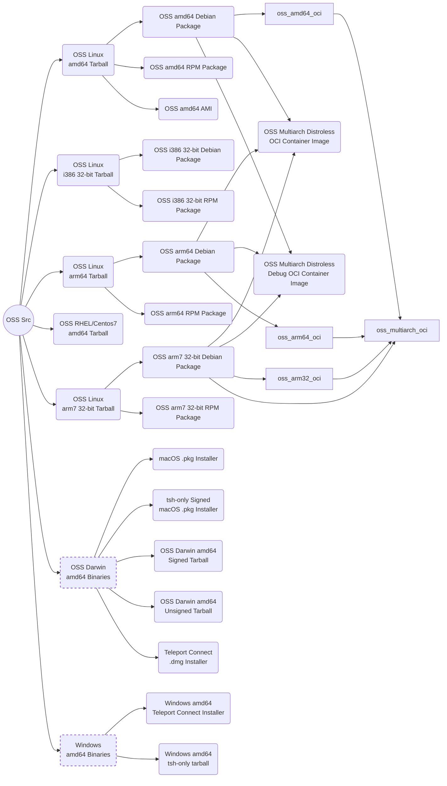
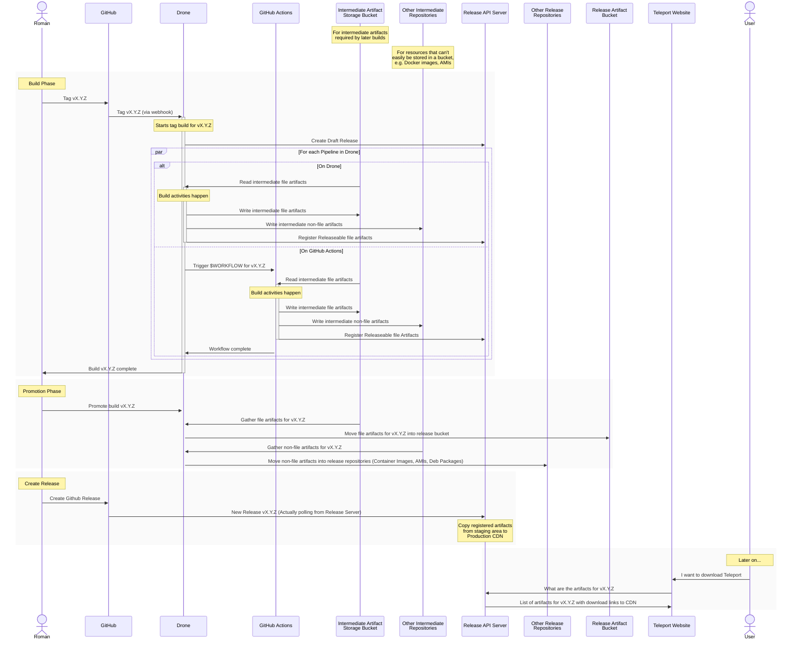

# RFD 0XXX - Teleport Release Engineering

# Required Approvers
* Engineering: @r0mant
* Cloud: ???
* Security: (@reedloden && @jentfoo)
* Product: (@xinding33 || @klizhentas)

## Glossary

To avoid ambiuguity (thankyou, English!), I'm going to use the following
definitions in the document.

 * *Artefact* (n): Any concrete product of the _Delivery_ process. A Debian 
   package, a tarball, a Docker image.
 * *Delivery*, *Delivery process* (n): The process for turning a given
   revision of our source code into a collection of consumer-visible artefacts.
 * *Promotion* (n): The last step of _Delivery_, triggered manually once the
   Release Engineer is happy that the _artefacts_ produced by the _delivery
   process_ are fit for purpose. Officially publishes the _release_. 
 * *Release* (n): The finished product of the delivery process for a given
   version of our source code, e.g. all the artefacts Teleport v12.1.2.

## What

Release Engineering is the process of taking source code and turning it into a
finished, releasable product that can be used by a customer. In our case, this
means building Teleport from source and packaging it in the various ways our 
customers expect to receive it - source tarballs, binary Debian packages, 
Windows setup programs, VM-ready machine images on AWS and everything in 
between.

This RFD has three goals: 

 1. To start a conversation about the aims, principles and structres we want 
    to apply to our release process, 
 2. To record the outcome of that discussion, and
 3. To record some the deliberations of the discussion, so that in the future 
    we can understand _**why**_ we do what we do, and have enough context to know 
    when changing what we do is appropriate.

The scope of this document is not just to record actions to be taken at the 
time of release. We will also need to consider things like CI processes, developer
builds, local testing and so on. Essentially, any task downstream from an engineer
typing code into an editor must be considered to some extent, because all of these
tasks have such a substantial overlap with release actiovities that to try and 
construct any sort of release process without considering them will produce an
unworkable solution.

## Why

The Teleport delivery process and its associated tooling has evolved largely 
organically, and there are no over-arching principles that we adhere to when
making Release Engineering decisions. This makes it increasingly difficult
to either change the release system, or to assess the impact of a proposed
change.

## A limited survey of our build artifacts

It may be useful to begin with a brief tour of the artifacts we currently
build. Below is a trace for the OSS subset of the artifacts we produce for
each release build - it does not include
 * Enterprise builds, 
 * FIPS-compliant builds, plugins, 
 * documentation & website builds,
 * Teleport Labs images, etc
 
It also doesn't attempt to capture the differing requirements for storing and/or publishing the various artefacts as they are built and promoted.

Every single solid-line box in the above diagram is a release artefact
that is available to customers. For every build. Across 3 active release
branches, plus `master`. (The dashed-line boxes are partial-build artifacts
that are not public, but are a useful internal ad/or logical grouping.) 

> I originally wanted to include a full trace of *all* of our artifacts, but
the diagram became quickly too confusing to be useful. The actual number of
artifacts *at least* 2.5x that shown above.

Hopefully this gives you an idea of the scale our release engineering
effort needs to deal with. 

## Technical Details

### Current State of Play

#### **High-Level tools**

The current build and release process uses a suite of tools of tools that can be
thought of as adding more complex layers of automation. In a very loose order of complexity, our current toolset looks something like this:
  
  - **Compilers** - (`gcc`, Go `compile`, `rustc`) - Lowest level of automation 
  - **Language tooling** (e.g. `go`, `cargo`) - intra-language dependency management required to build individial parts of the Teleport bundle.
  - **GNU make** - extra-language dependency management & build ordering required to build teleport binaries.
  - **Build orchestrator** - e.g. Drone / GitHub Actions. Tools tha decide *when* to run the build, what, to run, where and so on. Our current primary tool is `Drone`, 
  but we are crurrently in the process of migrating towards `GitHub Actions`.

#### **Custom Tooling**

 - `dronegen`: managing Drone's `yaml` configuration directly has proven unwieldy, 
   so we created a Go to make it more manageable.Essentially a custom DSL for Drone in Go. Source is in `./dronegen`
 - `tooling` package: A suite of small Go programs to automate build tasks to
   complex to be reliable captured and maintained by a bash script.
   See `./build.assets/tooling`.

#### **Assets**

In addition to the above tooling, there are several other places a CI or Release 
build will draw assets from.

  - `./build.assets` - a grab bag directory containing most build and/or realease
    assets, incluing:
    - Code generation scripts
    - a `Makefile` automating the construction of buildboxes, and executing
      builds inside them
    - Dockerfile sorces for buildboxes (multiple dockerfiles & multiple images)
    - Dockerfile sources for OCI Container Images
    - Sources for the Teleport PAM modules
    - Sources for various packaging tools (Debian, RPM, macOS)
    - Unix shells scripts for automating build tasks
    - Powershell scripts for building Teleport on Windows
  - `./examples` - indended to show examples of configuring and running Teleport,
    some examples serve double duty
    - `etcd` keys and config used during CI
    - `charts` providing sources for publiushed helm charts
    - Scripts and resources for testing Kubernetes cluster

#### **Current Release Process**

If a build were to be done today, the process would look like this:

Note: As far as I can figure out, the contents of the `Release Artifact
Bucket` are never actually read from anything. Release artifacts are served
from the `Release API Server`'s CloudFront-backed CDN. 

This bucket _may_ be required for build tracability, but could just as easily
exist for legacy reasons (i.e. no-one wanted to delete it incase it broke
something).

#### **Infrastructure**

Drone is entirely self hosted, we (Teleport) need to manage it ourselves. 

GHA, on the other hand, is largely managed for us by GitHub, although we
do use pools of ephemeral, self-hosted runners for specific tasks. 

We currently manage, as part of our CI/CD/Release system:
 - AWS EKS cluster running `Drone` (see `./drone` in the `ops` repository)
 - **Drone runners:**
    - 3x (one per actively supported major Teleport Version) AWS EC2 AMD64
      instances for Windows Builds
    - Intel MacMini in Macstadium
 - **Self-Hosted GHA Runners**
    - Ephemeral AWS EC2 arm64 boxes for arm64 linux builds. Pool has a max of 10
    instances
    - Ephemeral EC2 instance with a persistent volume for building `deb` 
    and `rpm` packages.
    
### Goals of a Release Process

At a a high level, we want a release process that is:  
  * *Consistent* - we want to provide a stable framwork for delivering 
    releases reliably from source,
  * *Agile* - we want to be able to quickly integrate new delvery channels
    or products without having to redesign everything. 
  * *Identifiable* - we can identify all the tools and components used
    to deliver a release, in order to mitigate supply chain attacks

We also want some functional requirements:

 1. An engineer *must* be able to at least construct the `teleport`, `tsh`, and `tctl` binaries
    for their current operating system with a minimum of fuss.
 2. An engineer *must* be able to run close to 100% of all tests at their desk
    with a minimum of fuss 
 3. The release envirionment should be as close as practical to the CI 
    environment, ideally the same. We don't want surprises come release time. 
 4. An engineer should be able to cut a debug or testing release at any time 
    using the proper release procedure and tooling. Especially if that release
    will travel outside the Teleport organisation.

Non-functional requirements:

### Suggestions

#### **Draw some boundaries**

One cause of the complexity in our build system is that we have not (in the
last 2 years at least) collectively sat down and thought about what we want
our Delivery system to *be*. What is its *purpose*, and what boundaries can
we put on it.

Some open questions are:

 - What tasks should an engineer be able to do at their desk?
   - Build binaries
   - Run Tests
 - Where is the boundary between
   - Desk/CI
   - Desk/Delivery
   - Using make vs Go vs GHA workflow (see below)
 - How much should we exercise the release system in CI?

#### **Buildbox management**

Whole separate RFD. General principles are:

  1. Stop rebuilding buildbox on every build. Rebuild on change to buildbox 
     content.
  2. All buildbox revisions are immutable and versioned. 
  3. All build automation must refer to expected buildbox unambiguously, so
     that rebuilds can happen in the context of the original build, not
     something that may ahve been subsequently altered.
  4. Build scripts must opt-in to updated buildboxes. No change will be thrust
     upon a build script.
  5. While we're dreaming, one multiarch buildbox for both CI and Delivery
     for any given revision of Teleport

#### **Prefer writing Go to any other method**

If at all possible, any even slightly complex task for either CI or 
the Delivery pipeline should be written in Go. Go is much less esoteric than
`bash` or `make`, and less prone to subtle bugs. 

Go also avoid locking us into a vendor's build ourchestration system. We have
put a _lot_ of smarts about how to build a Teleport release into GitHub
workflows. What happens when the GHA outages become too much, or GHA somehow
becomes a liability rather than an asset?

#### **Examine creating a Release Engineering repo**

All of our GHA tooling currently lives in `teleport.e`. All of our Drone
tooling and Go release tooling lives in `teleport`. 

We chose `teleport.e` for GHA workflows because it was private, making it
harder to leak secrets though CI/CD, but those workflows exist there only
as an accident of history, not because that's the best place for them.

Even if we *don't* separate our worklws and trooling out into a separate 
repo, we should definitely think about a common pattern we can use to make
sure that everyone takes a consistent approach.

#### Separate CI, Delivery and test resources

Each resource should have exactly one purpose, so that changing it has
no unforeseen consquences.

#### CI/CD Overlap
