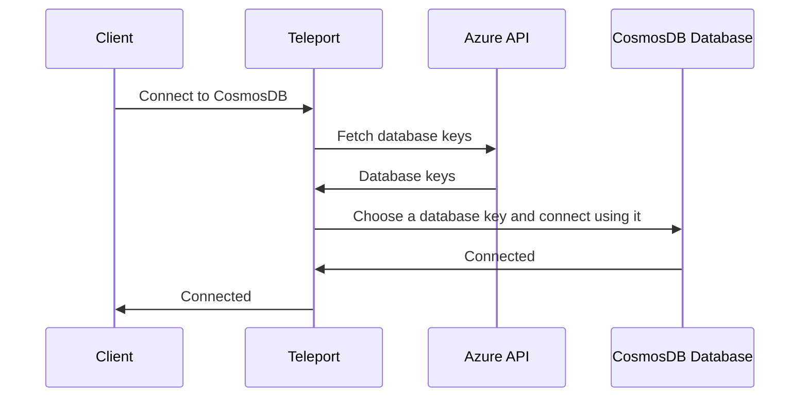

# RFD xxxx - Azure CosmosDB integration

## Required approvers

* Engineering: @smallinsky && @r0mant
* Product: @xinding33

## What

CosmosDB for MongoDB and Cassandra integration in Teleport Database Access.

## Why

Users will be able to access their CosmosDB databases accounts (MongoDB and
Cassandra APIs) with Teleport Database Access taking advantage of it like an
audit logging and access controls.

## Details

### Authentication

Teleport already supports MongoDB and Cassandra protocols. The only necessary
change is in the authentication options.

To connect to CosmosDB, it has database account keys, which are used as
password when connecting to the database.

**Note:** The database address, port, and username are the same for any of those
keys.

The connection is made using Basic Authentication, where the username is the
database name and password is one of the account keys.

During the connection process, Teleport will use Azure API to fetch the password
and then build the proper connection configuration to authenticate using it:



This implies that Teleport has permission to fetch database account keys
`Microsoft.DocumentDB/databaseAccounts/listKeys/action`.

#### Database key selection
Teleport needs to select which key to use. The keys can give different permissions
to the database. Currently, there are only two levels of permissions: Read-Only
and Read-Write (as known as Master).

The selection is made based on the database username the client provides, where:
* `readonly` user: Uses the Read-Only key.
* `readwrite` user: Uses the Read-Write key.

Anything different from those users will return a connection error.

This will give the users the ability to have different access levels to the
database and even limit them on Teleport RBAC if they need to:

```bash
# Connect using readonly user will prevent users from running any write command.
$ teleport db connect --db-user=readonly mongodb
> db.example.insert({test: true})
Uncaught:
MongoServerError: Error=13, Details='Response status code does not indicate success: Unauthorized (401); ...
> db.example.find({})
[
  { _id: ObjectId("63b30f8ac9af5c4c2a0ef2e3"), test: true }
]
```

They're also able to create RBAC to limit access by limiting `db_users` and
attach it to users to restrict their access:

```yaml
kind: role
version: v5
metadata:
  name: cosmosdb-readonly-access
spec:
  allow:
    db_users: ['readonly']
    db_labels:
      'cosmosdb': 'true'
```

#### Implementation
We can rely on Teleport [Cloud-managed users](https://github.com/gravitational/teleport/blob/master/lib/srv/db/cloud/users/user.go#L31)
where we're going to implement the `GetPassword` to use Azure API to retrieve
the database key. Placing all four keys as different users, using their [kind](https://pkg.go.dev/github.com/Azure/azure-sdk-for-go/sdk/resourcemanager/cosmos/armcosmos#KeyKind)
(`KeyKindPrimary`, `KeyKindPrimaryReadonly`, `KeyKindSecondary`,
`KeyKindSecondaryReadonly`) as identifier.

On MongoDB and Cassandra connection setup, we use the [`GetPassword`](https://github.com/gravitational/teleport/blob/master/lib/srv/db/cloud/users/users.go#L120)
using the proper username to fetch the password. After getting the password,
the engine will define the correct authentication configuration.

### Key Rotation
CosmosAPI has an API to rotate database keys. As described in Azure guides the
key rotation can take minutes to multiple hours, depending on database size.

During the rotation, connecting with the old/new key is unstable, meaning that
connections can fail due to an "invalid key" during this rotation, even with the
key. There is no mechanism to define if the rotation is complete. Azure
recommends having consistent connections with the newly generated keys before
considering the rotation complete.

Due to this design, we should rely on the other pair of keys when rotating. For
example, if we're rotating the primary keys, we should use secondary ones during
this period, and vice-versa.

**Note:** After key rotation is complete, connections established using the
previous key will start to get authentication errors and should be remade.

## Alternatives

### MongoDB RBAC
Recently Azure added support for [MongoDB RBAC](https://learn.microsoft.com/en-us/azure/cosmos-db/mongodb/how-to-setup-rbac).
This feature enables it to manage MongoDB users, defining their passwords
(access tokens) and permissions. The connection is still made through basic
authentication, but the username/password is the MongoDB user in this case.

We've implemented a PoC similar to the GCP Postgres/MySQL integration where the
database user provided (`--db-user`) was created or updated during the
connection. If the user were already present, the password would be rotated.

The main issue with this approach is the time every action (like creating or 
updating a user) took. On our PoC tests, it took an average of 2~3 minutes to
complete the actions. This makes the UX of connecting to a CosmosDB database
slow. And since it wasn't possible to retrieve the user’s password through API,
we would be required to store it in a key vault or rotate it every time
(which was implemented in the PoC).

Also, Cassandra still needs to get this feature. So it would require a different
solution.

### Store database keys on Azure Key Vault
The approach would be similar, but instead of retrieving the database keys from
Cosmos API, we would store the keys on the Azure Key Vault and recover from it.
This could reduce the connection time since the Key Vault is a faster
alternative (not tested). [This is the recommended format from Azure.](https://learn.microsoft.com/en-us/azure/cosmos-db/store-credentials-key-vault)
