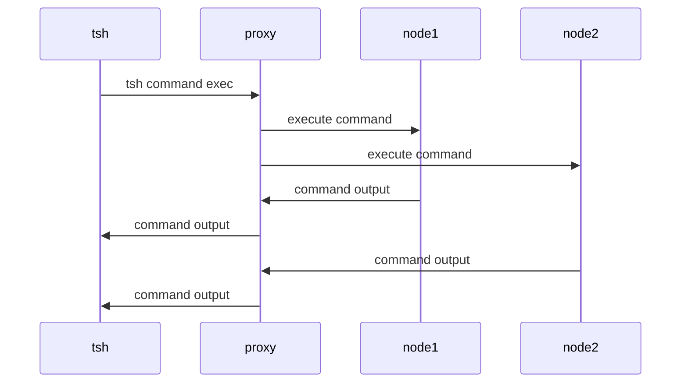

# RFD 01xx - Teleport Command

## Required Approvers

- Engineering: @r0mant
- Security: @reed || @jentfoo
- Product: @xinding33 || @klizhentas

## What

Implement Teleport Command, a non-interactive local host management agent, in
our infrastructure. The implementation of Teleport Command will provide a safer
interface for localhost debugging and management, reducing the reliance on
interactive shells for emergency debugging and recovery.

## Why

Our infrastructure often requires emergency debugging and management,
traditionally done through an interactive shell. This approach,
while effective, presents potential security risks as interactive shells can be
prone to exploitation. Implementing Teleport Command allows for stronger
authentication, authorization, and auditing of server management across
our infrastructure.

Example use cases include:

1. Debugging server issues: Teleport Command offers a safer interface for debugging
   server issues, reducing the risk of exploitation during emergency debugging.
2. Server management: With Teleport Command, we can better manage servers of any type,
   with a stronger focus on authentication, authorization, and auditing.

## Details

#### Teleport Command implementation design principles

The implementation of SansShell should fulfil the following design principles
to ensure maximum security and efficiency:

1. **Non-interactive:** SansShell is primarily a non-interactive agent,
   meaning it should not prompt for user input during its operation or accept stdin.
   This reduces the chances of exploitation through user input.

2. **Per command MFA:** Teleport Command will allow to make access even
    more granular by requiring MFA for each command. 

3. **Per command request access:** Teleport Command will allow to request
    access to a command. This will allow to implement a workflow where
    a user can request access to run a command on a particular set of nodes.

4. **Safer interface for debugging:** The implementation should replace
   interactive shells for debugging, providing a safer interface for these operations.

5. **Auditing capabilities:** The output of a command execution will be
   stored in the session recordings. This will allow for better monitoring and control
   over server management activities.

While these principles will guide the implementation, further details will need
to be established as we delve into the specific requirements of our infrastructure
and the capabilities of SansShell.

### Implementation

The implementation will re-use the existing Teleport SSH and Assist infrastructure.

### Command execution flow

Teleport Proxy will be used as the main command execution engine.

* It will allow parallel execution of commands on multiple nodes (configurable execution pool size).
* It will allow to stream output from multiple nodes to the client.
* Nodes will record the session and upload in the same way as interactive session are recorded.
* It will ensure that even in case of a network failure the command will continue to run on the node.
  (all commands should be one shot. If an initial connection to the node fails, the proxy will retry.
  If the connection is lost during the command execution, the command will continue to run on the node
  and proxy will not re-try it as we have no guarantee that the command is idempotent).
* (Optional) It will allow to specify a timeout for the command execution. If the command execution takes longer
  than the specified timeout, the command will be terminated on the node and the output will be streamed
  to the client.

### Command resource

We will introduce a new resource type `command` that will allow to define
commands that can be executed by Teleport Command. The resource will have
the following fields:

```yaml
#
# Example resource for a Command
#
kind: command
version: v1
metadata:
  # The name of the command. It must be unique.
  name: cpu-usage
  # Human-readable description
  description: Show top 10 CPU usage
spec:
  # Interpreter to use for command execution. If not specified, /bin/sh will be used.
  # This will allow to execute short Python or JS scripts.
  interpreter: "/bin/bash"
  command: |
    ps -eo pid,ppid,cmd,%mem,%cpu --sort=-%cpu | head
```

Interpreter is an optional field. It should allow specifying the interpreter
allowing to not only execute a shell command but also a short Python or JS script.

#### Picking up the OS user

When a command is executed on multiple nodes, an OS user has to be picked up for 
every node.
The user will be provided as a command argument. If the user doesn't exist on the node,
the command execution will fail. If one set of nodes requires a different user, 
command needs to be executed multiple times.

## Roles

Roles will be extended to allow defining access to commands. The following
example will allow to execute commands with `environment=dev-cmd` label on nodes
with `environment=dev` label. It will also deny access to commands with
`environment=prod` label.
This approach will allow to define a set of commands that can be executed
on a particular set of nodes (e.g. `dev-cmd` commands can be executed on `dev` nodes
but not on `prod` nodes).

```yaml
kind: role
version: v5
metadata:
  name: developer
spec:
  allow:
    # Labels selector for command execution.
    command_execution_labels:
      environment: ["dev-cmd"]
    # Labels selector for commands resource access.
    command_labels:
     environment: ["dev"]
  deny:
    command_labels:
     environment: ["prod"]
```

## tsh extensions

`tsh` will learn new commands:

1. `tsh command ls` - allowing to list all available commands.
2. `tsh command exec` - allowing to execute commands on one or multiple nodes. TODO: add a node query and mandatory user.
3. `tsh command cancel` - (optional) allowing to cancel a command execution.
4. `tsh command logs` - (optional) allowing to display output from a command execution.

### Display output from multiple nodes

Displaying the output from multiple nodes can be tricky as the output can be
very long. To avoid this, Teleport Command will detect long output and will
redirect it to a file. The user will be notified about this.

```shell
$ tsh command exec cat-log
node1: Detected long output. Redirecting to node1.log file
node2: Detected long output. Redirecting to node2.log file
```

Alternative approach is to always display the output if a command is executed
on a single node and redirect it to a file if a command is executed on multiple nodes.

### Per-session MFA

By design per-session MFA requires "a tap" for every node where a command is executed.
This is not ideal from the UX perspective as it will require a user to tap multiple times. 
To avoid this, Teleport will ask for "a tap" only once before executing all commands.
In the background, Teleport Proxy will generate certificates with mutliple principals
for every node and will use them to authenticate to the nodes. If one certificate cannot
carry all principals, multiple certificates will be generated.

### Security

Teleport Command will be protected by the same security mechanisms as Teleport SSH.

Notes: 
* Commands should take no user input - this will reduce the risk of exploitation
  through user input and to make sure that each invocation is the same.
* If a user is missing permissions to execute a command, an access request should be created
  before any command is executed.
* (Optional) On supported nodes, commands should be executed inside a cgroup
  created by Teleport to better control permissions (enhanced session recording).