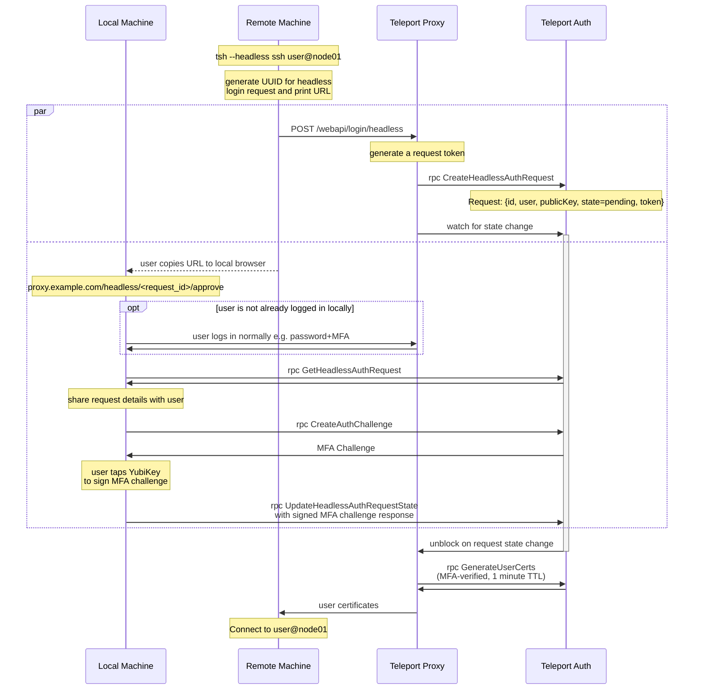

# RFD TBD - Headless Authentication

## Required Approvers

* Engineering: @r0mant && @jakule
* Security: @reed || @jentfoo
* Product: @xinding33 || @klizhentas

## What

Support headless authentication for Teleport clients.

Headless authentication is a non-interactive form of authentication that relies on a secondary party to authenticate a user. In our case, headless authentication will be used to authenticate a user on a remote machine using their credentials and MFA device on their local machine.

## Why

Some users have valid use cases for making `tsh` requests on a remote, sometimes shared, machine.

For example:

 1. Connecting to Teleport Nodes.
 1. Performing `tsh scp` from one Teleport Node to another Teleport Node.

However, `tsh` does not currently work well on remote machines for two reasons:

 1. Client credentials are usually saved to disk, where they may be overwritten, used, or stolen by anyone with access to the remote machine.
 1. Teleport widely uses MFA to authenticate client logins and actions, which may require direct access to a WebAuthn device. For example, with Per-session MFA, each SSH connection to a Teleport Node may require MFA verification.

Headless authentication will provide a secure way to support these types of remote use cases.

## Details

### Security

Headless authentication should fulfill the following design principles to ensure that the system can not be easily exploited by attackers, including attackers with root access to the remote machine.

1. **The Client does not write any keys, certificates, or session data to disk on the remote machine**

When using headless authentication, Teleport clients will generate a new private key in memory for the lifetime of the client. This private key will not be exported anywhere. Only its public key counterpart will be shared externally to get user certificates. Likewise, the user certificates will be held in memory for the lifetime of the client.

This solves two problems: 1) multiple users on the same remote machine will not have overlapping credentials on disk in `~/.tsh` and 2) attackers will not be able to steal a user's credentials from disk.

We will also lock the process memory using [`unix.Mlockall`](https://pkg.go.dev/golang.org/x/sys/unix#Mlockall) to ensure that an attacker can not swap out process memory to disk, in order to extract the client's certificates.

2. **Issued certificates through headless authentication are short lived (1 minute TTL)**

Since the user certificates are only meant to last for a single client lifetime, the Auth server should issue the certificates with a 1 minute TTL. This limits the damage potential if an attacker manages to compromise the user's certificate, whether through a faulty client or a clever attack.

Note: SSH sessions started with these certs will also be subject to the `max_session_ttl` role option.

3. **User must complete WebAuthn authentication for each individual headless `tsh` request (`tsh ls`, `tsh ssh`, etc.)**

Headless authentication, like any login mechanism, can be started by any unauthenticated user. To prevent phishing attacks, we must prompt the user to acknowledge and approve each headless authentication request with WebAuthn, since WebAuthn provides strong protection against phishing attacks. Legacy OTP MFA methods will not be supported.

4. **The Server must verify that the client requesting certificates is the only client that can receive/use the certificates**

To ensure the requesting client is the only client that can use resulting headless certificates, we will use the PKCE-like flow common to all Teleport login flows. The client provides their public key in the login request, and the server issues certificates for the client's public key. If the client does not have access to the corresponding client private key, they cannot use the certificates.

Note: The server can also encrypt the certificates with the client's public key. Since we don't currently do this for other login endpoints, we will omit this from the initial design.

Additionally, headless login will be handled by the Teleport Proxy endpoint - `/webapi/login/headless`. In this endpoint, the Proxy will make multiple Auth server API requests to initiate headless authentication and receive certificates. To prevent attackers from hijacking a headless auth request directly from the Auth server, The Proxy will generate a token for the auth request and pass the token in the initial headless auth request creation. The Auth server will keep this token a secret and authorize the latter API requests using this token.

5. **Limit the scope of headless certificates**

When a user requests headless login certificates, we know exactly what command they are trying to complete. This means that we can scope their certificate to provide the most limited possible privileges necessary to complete said action. This will help to reduce the blast radius if an attacker manages to steal the user's headless certificates and private key.

However, unlike Per-session MFA, which scopes certificates to a specific node connection, we will need to scope the certificates to the entire API flow for a `tsh` command. For example, `tsh ssh` needs to:

* Connect to Proxy
* List nodes
* View cluster details (Auth preference, etc.)
* Connect to Node

This means that for any given `tsh` command, the Teleport Auth server will provide different privileges to the certificates. Since each possible command will need custom logic to determine the lowest privileges necessary, we will only support a select few commands necessary for basic `tsh` workflows:

* `tsh ls`
* `tsh ssh`
* `tsh scp`

The awarded certificates should not provide access to roles usually awarded to the user, as these roles may provide more privileges than required for the requested command. However, some role provided fields should be included, such as `role.options.forward_agent` and `role.logins`. Additionally, the user should be notified of what command was requested and what permissions will be awarded to the headless session once approved.

Example:

```
Incoming headless request for command "tsh ssh server01", to connect to node <server01_uuid>. Upon approval, the request will be awarded the following permissions:

allow:
  options:
    max_session_ttl: 8h0m0s
    forward_agent: true
    port_forwarding: true
    require_session_mfa: true
  logins: ["ubuntu-user"]
  resource_ids: ["<server01_uuid>"]
  rules:
    resources: ["nodes"]
    verbs: ["read", "list"]
```

**Important note**: The server cannot guarantee that the client will actually use the resulting certificates for the `tsh` command advertised by the client. This means that a modified client could claim to need certificates for `tsh ls`, but then actually use the certificates for `tsh ssh`. In order to prevent potential permission workarounds, we will need to carefully consider how each supported command's awarded certificates may interact with other Teleport clients. For this reason, we may add more commands as they are requested, but each command may have significant security implications to consider. Each PR adding one or more new commands should include a security description and get a security review from the Teleport security team. This includes the commands listed above, as the most limited necessary permissions necessary to perform each command is not yet clear.

#### Caveat

Due to the implementation complexity of limiting certificates permissions by requested command, it will not be included in the feature's preview release.

Additionally, some details, like how the server will encode the permissions into the certificate, are currently missing. This will be addressed in a follow up PR before the official release of this feature, accompanied by an RFD update.

The feature will still be limited to `tsh ls`, `tsh ssh`, and `tsh scp` so that we don't need to remove functionality later.

#### Conclusion

With the design principles above, the only possible attack would be for the attacker to issue the headless request themselves and trick the user into verifying the request with MFA, with a direct phishing attack. This phishing attack should also be mitigated by notifying the user of the command requested and the permissions that will be awarded upon approval.

### Headless authentication overview

The Headless authentication flow will be modeled after our existing SSO authentication flows, where the user issues an `AuthRequest`, directs the client to approve the request via SSO, and then completes authentication with the approved auth request. Unlike with SSO authentication, we have control over the headless authentication flow through our Proxy/Auth APIs.

#### Diagram

The headless authentication flow is shown below:



This flow can be broken down into three parts: headless login initiation, local authentication, and certificate retrieval.

#### Headless login initiation

First, the client initiates headless login through the web proxy endpoint `POST /webapi/login/headless`. The client provides a request UUID, the command being requested (e.g. `tsh ssh user@host`), and normal login parameters (client public key, proxy address, etc.). The Proxy generates a request token which will be used to authenticate the proxy in the final steps of headles authentication.

The request details and request token are saved on the Auth server in a `HeadlessAuthRequest` object, with the backend prefix `/headless_auth_requests/`. It will be saved with a 1 minute TTL, by which point the user should have completed the headless authentication flow. The request will begin in the pending state, to be later approved/denied by the user locally.

```go
type HeadlessAuthRequest struct {
    ID string
    // User is a teleport username
    User string
    // PubKey is SSH public key to sign
    PubKey []byte
    // Command is the client command being requested
    Command string
    // State is the request state (pending, approved, or denied)
    State string
}
```

#### Local authentication

In parallel to headless login initiation, the client will generate a Teleport web Proxy URL for the client to complete headless authentication: `https://proxy.example.com/headless/<request_id>/approve`. The URL is shared with the user so they can locally authenticate the auth request from their local browser.

When the user runs the command or opens the URL locally, their local login session will be used to connect to the Teleport Auth server. If the user is not yet logged in, they will be prompted to login with MFA as usual.

Once connected, the user can view the request details and either approve or deny the request:

* If the user approves the request, they will need to pass an MFA challenge to update the request to the approved state.
* If the user denies the request, the request will be updated to the denied state.

#### Certificate retrieval

After the headless login is initiated, the request will wait until local authentication is complete. This will be handled by the Teleport Proxy by using a resource watcher to wait until the `HeadlessAuthRequest` object is updated to the approved or denied state, or it expires.

If the headless login request is approved, the Teleport Proxy will request MFA-verified, Single-use (1 minute TTL) user certificates from the Auth server with the `GenerateUserCerts` rpc. The proxy will provide the headless auth request ID and the request token previously generated to authorize the request. The login request details will be pulled from the `HeadlessAuthRequest` object to generate certificates.

The resulting user certificates will then be sent to the client, and the client will complete the `tsh` request initially requested, e.g. `tsh ssh user@node01`.

### Audit log

The following actions will be tracked with audit events:

* User initiates headless login
* User approves/denies headless login request

### Server changes

Headless authentication has a unique API flow compared to other login methods.

#### `POST /webapi/login/headless`

This endpoint is used to initiate headless login. Like other login endpoints, this endpoint is not authenticated and can be called by anyone with access to the Teleport Proxy address.

```go
type HeadlessAuthRequest struct {
    SSHLogin
    // User is a teleport username
    User string `json:"user"`
    // RequestID is a uuid for the request
    RequestID string
    // Command is the client command being requested
    Command string
}

// SSHLogin contains common SSH login parameters.
type SSHLogin struct {
    // ProxyAddr is the target proxy address
    ProxyAddr string
    // PubKey is SSH public key to sign
    PubKey []byte
    ...
}

// SSHLoginResponse is a user login response
type SSHLoginResponse struct {
    // Username contains the username for the login certificates
    Username string `json:"username"`
    // Cert is a PEM encoded SSH certificate signed by SSH certificate authority
    Cert []byte `json:"cert"`
    // TLSCertPEM is a PEM encoded TLS certificate signed by TLS certificate authority
    TLSCert []byte `json:"tls_cert"`
    // HostSigners is a list of signing host public keys trusted by proxy
    HostSigners []TrustedCerts `json:"host_signers"`
}
```

#### `rpc CreateHeadlessAuthRequest`

This endpoint is used by the Teleport Proxy to create a new headless auth request.

```proto
service AuthService {
  rpc CreateHeadlessAuthRequest(CreateHeadlessAuthRequestRequest) returns (HeadlessAuthRequest);
}

message CreateHeadlessAuthRequestRequest {
  // RequestID is the headless login request uuid
  string request_id = 1;
}

message HeadlessAuthRequest {
  // ID is the headless login request uuid
  string id = 1;
  // User is a teleport user name
  string user = 2;
   // Command is a `tsh` command in plain text
  string command = 3;
  // State is the headless login request state
  State state = 4;
  // PublicKey is a public key to sign in case of successful auth.
  bytes public_key = 5;
  // MFADevice is the mfa device used to approve the request in case of successful auth.
  MFADevice mfa_device = 6;
  // Compatibility specifies OpenSSH compatibility flags.
  string compatibility = 7;
  // Expires is a global expiry time header can be set on any resource in the system.
  google.protobuf.Timestamp expires = 8;
  // RouteToCluster is the name of Teleport cluster to issue credentials for.
  string route_to_cluster = 9;
}

// State is a headless login request state
enum State {
  NONE = 0;
  PENDING = 1;
  DENIED = 2;
  APPOVED = 3;
}
```

#### `rpc GetHeadlessAuthRequest`

This endpoint is used by Teleport clients to retrieve headless login request details before prompting the user for approval/denial.

The endpoint is only authorized for certificates from the user who requested Headless authentication (and for server roles).

```proto
service AuthService {
  rpc GetHeadlessAuthRequest(GetHeadlessAuthRequestRequest) returns (HeadlessAuthRequest);
}

message GetHeadlessAuthRequestRequest {
  // RequestID is the headless login request uuid
  string request_id = 1;
}
```

#### `rpc UpdateHeadlessAuthRequestState`

This endpoint is used by Teleport clients to update headless login request state to approved or denied. If the client requests to approve, the client must also provide a valid MFA challenge response for the user. An MFA challenge should be first requested from the existing rpc `CreateAuthChallenge`.

The endpoint is only authorized for certificates from the user who requested Headless authentication.

```proto
import "teleport/legacy/api/client/proto/authservice.proto";

service AuthService {
  rpc UpdateHeadlessAuthRequestState(stream UpdateHeadlessAuthRequestStateRequest) returns (stream UpdateHeadlessAuthRequestStateResponse);
}

message UpdateHeadlessAuthRequestStateRequest {
  // RequestID is the headless login request ID
  string request_id = 1;
  // NewState is the state that the request will be updated to
  State new_state = 2;
  // MFAResponse is an mfa challenge response used to verify the user.
  // MFA verification is required if NewState=Approved.
  proto.MFAAuthenticateResponse mfa_response = 3;
}
```

#### `rpc GenerateUserCerts`

This is an existing endpoint used to generate user certs. We will add the `headless_request_id` and `request_token` to retrieve request details from the headless auth request saved on the Auth server.

### UX

#### `tsh --headless`

We will add a new `--headless` flag to `tsh` which can be used to authenticate for a single `tsh` request. When this flag is provided, `tsh` will prompt the user to complete headless authentication on their local machine from the URL `https://proxy.example.com/headless/<request_id>/approve`. Once the user completes local authentication, `tsh` will receive credentials to complete the request.

```console
$ tsh --headless --proxy=proxy --user=user ssh user@node01
Complete headless authentication in your local web browser:
https://proxy.example.com/headless/<request_id>/approve
// Wait for user to complete local authentication with MFA
<user@node01> $
```

#### Environment variables

In the `tsh --headless` flow, users never run `tsh login` on their remote machine. Instead, we expect the `--proxy`, `--user`, and `--headless` flags to be supplied to each command. To reduce UX friction, users can set the environment variables `TELEPORT_PROXY=<proxy_addr>`, `TELEPORT_USER=<user>`, and `TELEPORT_HEADLESS=true` instead.

We prefer setting environment variables rather than saving config to disk (`~/.tsh/proxy.example.com.yaml` and `~/.tsh/current-profile`) so that the headless flow remains stateless, preventing conflicts on shared machines.

#### `tsh headless`

When the user goes to the headless authentication URL, the user will be prompted to login with MFA, if they are not logged in already. The user will then be notified of additional request details. Finally, the user is asked to verify with MFA to approve the request.

Example (Exact UI/UX TBD):
```
Headless request requires authentication. Contact your administrator if you didn't initiate this request.
Additional details:
  - command: "tsh ssh user@localhost"
  - request id: <request_id>
  - ip address: <ip_address>
Tap your YubiKey to approve
```

Note: When the user has to log in for the first time, we do not reuse their MFA verification to skip the second MFA check. Although this would be better UX, we cannot retrieve additional request details to share with the user until they log in. For security reasons, we should provide an MFA check after sharing the headless request details.

#### View headless requests

In the Web UI, we will create a new page to view and accept `tsh` requests for a headless session: `https://proxy.example.com/headless/<headless_session_id>/requests`. The UI may be very similar to the access request page, where a user can view requests, view additional details, and then click approve/deny. When the user clicks "approve", this will trigger a prompt for MFA verification to complete the approval.

#### Teleport Connect

Teleport Connect will also be updated to handle the approval link `https://proxy.example.com/headless/<headless_session_id>/requests` with MFA verification included.
