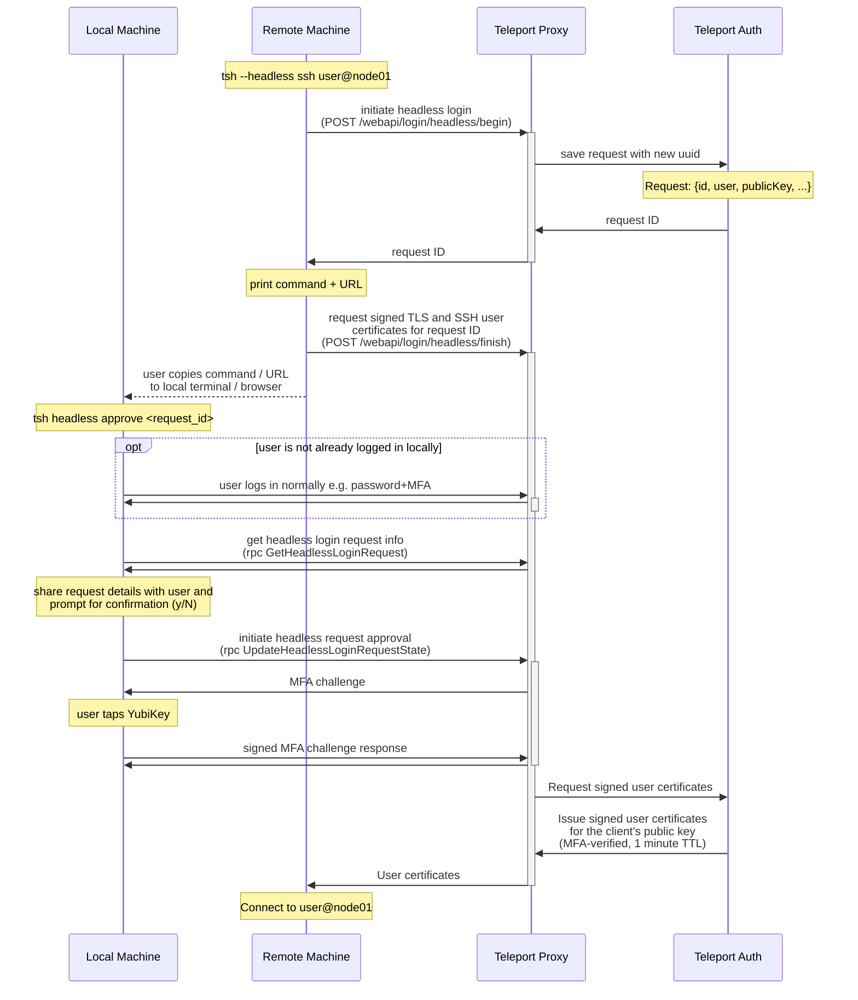

# RFD TBD - Headless Authentication

## Required Approvers

* Engineering: @r0mant && @jakule
* Security: @reed || @jentfoo
* Product: @xinding33 || @klizhentas

## What

Support headless authentication for Teleport clients.

Headless authentication is a non-interactive form of authentication that relies on a secondary party to authenticate a user. In our case, headless authentication will be used to authenticate a user on a remote machine using their credentials and MFA device on their local machine.

## Why

Some users have valid use cases for making `tsh` requests on a remote, sometimes shared, machine.

For example:

 1. Connecting to Teleport Nodes.
 1. Performing `tsh scp` from one Teleport Node to another Teleport Node.

However, `tsh` does not currently work well on remote machines for two reasons:

 1. Client credentials are usually saved to disk, where they may be overwritten, used, or stolen by anyone with access to the remote machine.
 1. Teleport widely uses MFA to authenticate client logins and actions, which may require direct access to a WebAuthn device. For example, with Per-session MFA, each SSH connection to a Teleport Node may require MFA verification.

Headless authentication will provide a secure way to support these types of remote use cases.

## Details

### Security

Headless authentication should fulfill the following design principles to ensure that the system can not be easily exploited by attackers, including attackers with root access to the remote machine.

1. **The Client does not write any keys, certificates, or session data to disk on the remote machine.**

When using headless authentication, Teleport clients will generate a new private key in memory for the lifetime of the client. This private key will not be exported anywhere. Only its public key counterpart will be shared externally to get user certificates. Likewise, the user certificates will be held in memory for the lifetime of the client.

This solves two problems: 1) multiple users with on the same remote machine will not have overlapping credentials on disk in `~/.tsh` and 2) attackers will not be able to steal a user's credentials from disk.

2. **Issued certificates through headless authentication are short lived (1 minute TTL).**

Since the user certificates are only meant to last for a single client lifetime, the Auth server should issue the certificates with a 1 minute TTL. This limits the damage potential if an attacker manages to compromise the user's certificate, whether through a faulty client or a clever attack.

3. **User must complete WebAuthn authentication for each individual headless `tsh` request (`tsh ls`, `tsh ssh`, etc.).**

Headless authentication, like any login mechanism, can be started by any unauthenticated user. To prevent phishing attacks, we must prompt the user to acknowledge and approve each headless authentication request with WebAuthn, since WebAuthn provides strong protection against phishing attacks. Legacy OTP MFA methods will not be supported.

4. **The Server must verify that the client requesting certificates is the only client that can use the certificates.**

Depending on the headless authentication API flow, it may be split into multiple requests. It is crucial that the server verifies that the client who requested headless authentication is the only client that can use the resulting credentials. This will be accomplished with a PKCE-like flow, where the client provides their public key in the initial request, and the server ultimately issues certificates for the original client public key.

Note: Ideally, we would ensure that the only client that can *receive* certificates is the requesting client, but ensuring the PKCE flow above is enough to defend against attacks since the certificates are useless without the client's private key. If we want to remove the possibility of an attacker attempting to intercept the certificates, we can use an HTTP websocket or gRPC stream endpoint to encapsulate the headless authentication request into a single API request.

5. **(optional) limit the scope of headless certificates**

When a user requests headless login certificates, we know exactly what command they are trying to complete. In theory, this means that we can scope their certificate to provide the most limited possible privileges necessary to complete said action. This would help to reduce the blast radius if an attacker manages to steal the user's headless certificates.

However, unlike Per-session MFA which scopes certificates to a specific node connection, we would need to scope the certificates to the entire API flow for a `tsh` command. For example, `tsh ssh` needs to:

1. Connect to Proxy
2. List nodes
3. View cluster details (Auth preference, etc.)
4. Connect to Node

Given the implementation complexity, this is likely overkill as we've already reduced this attack vector significantly:

* client key and certificates are not saved to disk
* certificates have a 1 minute TTL

#### Conclusion

With the design principles above, the only possible attack would be for the attacker to issue the headless request themselves and trick the user into verifying the request with MFA. To limit the possibility of this phishing attack, the user will always be notified of request details (`tsh` command, request id, ip address) before they can approve it with MFA.

Note: Since the `tsh` command is user provided, we cannot guarantee that the headless login will actually be used for this command, but we can guarantee that the request id and ip address are correct.

### Headless authentication overview

The headless authentication flow is shown below:



This flow can be broken down into three parts: headless login initiation, local authentication, and certificate retrieval.

#### Headless login initiation

First, the client initiates a headless login. In this stage, the client provides request details including the Teleport username, client public key, and the command being requested (e.g. `tsh ssh user@host`). The request will begin in the pending state, to be later approved/denied by the user locally.

```go
type HeadlessLoginRequest struct {
    // User is a teleport username
    User string `json:"user"`
    // PublicKeyDER is a public key user wishes to sign in PKIX, ASN.1 DER form.
    PublicKeyDER []byte `json:"public_key"`
    // Command is the client command being requested
    Command string
    // State is the request state (pending, approved, or denied)
    State string
}
```

These request details are saved on the Auth server in a `HeadlessLoginRequest` object, with the backend prefix `/headless_login_requests/`. They will be saved with a 1 minute TTL, by which point the user should have completed the authentication flow.

In response, the client receives a request ID generated by the server, which it will use to generate a client command or URL to begin local authentication: `tsh headless approve <request_id>` and `https://proxy.example.com/headless/<request_id>/approve`.

The command and URL are shared with the user so they can complete local authentication for the request in a local terminal or web browser.

#### Local authentication

When the user runs the command or opens the URL locally, their local login session will be used to connect to the Teleport Auth server. If the user is not yet connected, they will be prompted to login with MFA as usual.

Once connected, the user can view the request details and either approve or deny the request:

* If the user approves the request, they will need to pass an MFA challenge to update the request to the approved state.
* If the user denies the request, the request will be updated to the denied state.

#### Certificate retrieval

Once the headless login request is approved, the remote client can request MFA-verified Single-user (1 minute TTL) user certificates from the Auth server. In this request, the user will be challenged to sign for the public key saved in the request details on the Auth Server to confirm the client's identity.

The resulting user certificates will then be used by the client to complete the `tsh` request initially requested, e.g. `tsh ssh user@node01`.

### Audit log

The following actions will be tracked with audit events:

* User initiates headless login
* User approves/denies headless login request

### Server changes

Headless authentication has a unique API flow compared to other login methods.

#### `POST /webapi/login/headless/begin`

This endpoint is used to initiate headless login and get a request ID. Like other login endpoints, this endpoint is not authenticated and can be called by anyone with access to the Teleport Proxy address.

```go
type BeginHeadlessLoginRequest struct {
    // User is a teleport username
    User string `json:"user"`
    // PubKey is a public key user wishes to sign
    PubKey []byte
    // Command is the client command being requested
    Command string
}

type BeginHeadlessLoginResponse struct {
    // RequestID is a uuid associated with the headless login request
    RequestID string `json:"user"`
}
```

#### `rpc GetHeadlessLoginRequest`

This endpoint is used by Teleport clients to retrieve headless login request details before prompting the user for approval/denial. 

The endpoint is only authorized for the user who requested Headless authentication (and for server roles).

```proto
service AuthService {
  rpc GetHeadlessLoginRequest(GetHeadlessLoginRequestRequest) returns (HeadlessLoginRequest);
}

message GetHeadlessLoginRequestRequest {
  // RequestID is the headless login request uuid
  string RequestID = 1;
}

message HeadlessLoginRequest {
  // ID is the headless login request uuid
  string ID = 1;
  // User is a teleport user name
  string User = 2;
  // PublicKeyDER is a public key in PKIX, ASN.1 DER form
  bytes PublicKeyDER = 3;
  // Command is a `tsh` command in plain text
  string Command = 4;
  // State is the headless login request state
  State State = 5;
}

// State is a headless login request state
enum State {
  PENDING = 0;
  DENIED = 1;
  APPOVED = 2;
}
```

#### `rpc UpdateHeadlessLoginRequestState`

This endpoint is used by Teleport clients to update headless login request state to approved or denied. If the client requests to approve, the client will receive an MFA challenge and will need to reply with a valid MFA challenge response. To support this multi-step request, the rpc provides an rpc stream to both sides of the connection.

The endpoint is only authorized for the user who requested Headless authentication (and for server roles).

```proto
service AuthService {
  rpc UpdateHeadlessLoginRequestState(stream UpdateHeadlessLoginRequestStateRequest) returns (stream UpdateHeadlessLoginRequestStateResponse);
}

message UpdateHeadlessLoginRequestStateRequest {
  oneof Request {
    // Init is the initial request
    UpdateHeadlessLoginRequestStateRequestInit Init = 1;
    // MFAResponse is the client's signed MFA challenge response
    MFAAuthenticateResponse MFAResponse = 2;
  }
}

// UpdateHeadlessLoginRequestStateRequestInit is a request to update a
// headless login request's state (approve/deny). Approving requests
// requires the MFA challenge/response flow.
message UpdateHeadlessLoginRequestStateRequestInit {
  // RequestID is the headless login request ID
  string RequestID = 1;
  // NewState is the state that the request will be updated to
  State NewState = 2;
}

// State is a headless login request state
enum State {
  PENDING = 0;
  DENIED = 1;
  APPOVED = 2;
}

// MFAAuthenticateResponse is a response to MFAAuthenticateChallenge using one
// of the MFA devices registered for a user.
message MFAAuthenticateResponse {
  oneof Response {
    // Removed: U2FResponse U2F = 1;
    TOTPResponse TOTP = 2;
    webauthn.CredentialAssertionResponse Webauthn = 3;
  }
}


// UpdateHeadlessLoginRequestStateResponse is a response to update a headless
// login request's state. Denial requests should return an empty response, since
// MFA challenge/response flow is not needed.
message UpdateHeadlessLoginRequestStateResponse {
  // MFAChallenge is an MFA challenge for a user's registered MFA devices
  MFAAuthenticateChallenge MFAChallenge = 1;
}

// MFAAuthenticateChallenge is a challenge for all MFA devices registered for a user.
message MFAAuthenticateChallenge {
  reserved 1; // repeated U2FChallenge U2F
  // TOTP is a challenge for all TOTP devices registered for a user. When
  // this field is set, any TOTP device a user has registered can be used to
  // respond.
  TOTPChallenge TOTP = 2;
  // WebauthnChallenge contains a Webauthn credential assertion used for
  // login/authentication ceremonies.
  // Credential assertions hold, among other information, a list of allowed
  // credentials for the ceremony (one for each U2F or Webauthn device
  // registered by the user).
  webauthn.CredentialAssertion WebauthnChallenge = 3;
}
```

#### `POST /webapi/login/headless/finish`

This endpoint is used to initiate headless login and get a request ID. Like other login endpoints, this endpoint is not authenticated and can be called by anyone with access to the Teleport Proxy address. However, the request will be denied the the request ID, user, and public key do not match the `HeadlessLoginRequest` saved on the auth server.

```go
// FinishHeadlessLoginRequest is a request to receive login certificates
// for a previously initialized headless login request
type FinishHeadlessLoginRequest struct {
    // RequestID is the headless login request ID
    RequestID string `json:"request_id"`
    // User is a teleport username. This must match the username in the
    // headless request resource.
    User string `json:"user"`
    // PublicKeyDER is a public key user wishes to sign in PKIX, ASN.1 DER form.
    // This must match the public key stored in the headless request resource.
    PublicKeyDER []byte `json:"pub_key"`
}

// SSHLoginResponse is a user login response
type SSHLoginResponse struct {
    // Username contains the username for the login certificates
    Username string `json:"username"`
    // Cert is a PEM encoded SSH certificate signed by SSH certificate authority
    Cert []byte `json:"cert"`
    // TLSCertPEM is a PEM encoded TLS certificate signed by TLS certificate authority
    TLSCert []byte `json:"tls_cert"`
    // HostSigners is a list of signing host public keys trusted by proxy
    HostSigners []TrustedCerts `json:"host_signers"`
}
```

### UX

#### `tsh --headless`

We will add a new `--headless` flag to `tsh` which can be used to authenticate for a single `tsh` request. When this flag is provided, `tsh` will prompt the user to complete headless authentication on their local machine with the command `tsh headless approve <request_id>` or the URL `https://proxy.example.com/headless/<request_id>/approve`. Once the user completes local authentication, `tsh` will receive credentials to complete the request.

```console
$ tsh --headless --proxy=proxy --user=user ssh user@node01
Complete headless authentication on your local device or web browser:
 - tsh --proxy=proxy.example.com --user=dev headless approve <request_id>
 - https://proxy.example.com/headless/<request_id>/approve
// Wait for user to complete local authentication with MFA
<user@node01> $
```

#### Environment variables

In the `tsh --headless` flow, users never run `tsh login` on their remote machine. Instead, we expect the `--proxy`, `--user`, and `--headless` flags to be supplied to each command. To reduce UX friction, users can set the environment variables `TELEPORT_PROXY=<proxy_addr>`, `TELEPORT_USER=<user>`, and `TELEPORT_HEADLESS=true` instead.

We prefer setting environment variables rather than saving config to disk (`~/.tsh/proxy.example.com.yaml` and `~/.tsh/current-profile`) so that the headless flow remains stateless, preventing conflicts on shared machines.

#### `tsh headless`

When the user enters the headless authentication command or URL, the user will be prompted to login with MFA, if they are not logged in already. The user will then be notified of additional request details and asked to acknowledge that they made this request (`y/N` prompt). Finally, the user is asked to verify with MFA to approve the request.

```console
$ tsh --proxy=proxy.example.com --user=dev headless approve <request_id>
Enter password for Teleport user dev:
Tap your YubiKey
> Profile URL:        https://proxy.example.com
  Logged in as:       dev
  ...
Headless request requires authentication. Contact your administrator if you didn't initiate this request.
Additional details:
  - command: "tsh ssh user@localhost"
  - request id: <request_id>
  - ip address: <ip_address>
Approve? (y/N):
Tap your YubiKey
$ tsh headless accept <request_id> --proxy=proxy.example.com --user=dev
Headless request requires authentication. Contact your administrator if you didn't initiate this request.
Additional details:
  - command: "tsh ssh user@localhost"
  - request id: <request_id>
  - ip address: <ip_address>
Approve? (y/N):
Tap your YubiKey
```

Note: When the user has to log in for the first time, we do not reuse their MFA verification to skip the second MFA check. Although this would be better UX, we cannot retrieve additional request details to share with the user until they log in. For security reasons, we should provide an MFA check after sharing the headless request details.

#### Watch/View headless requests

To improve UX, we will also offer an option for a user to watch for and accept headless requests. This will reduce the friction of copy-pasting the command or URL for every headless request.

For `tsh`, we will add a new command, `tsh headless watch`, to watch for new requests. This will use the existing watcher API, filtering for the `HeadlessLoginRequest` resource for the user. When a request is found, its details will be shared in the user's local terminal. They will be prompted to acknowledge it (`y/N`) and then approve it with MFA.

```console
$ tsh headless watch <session_id>
Headless request requires authentication. Contact your administrator if you didn't initiate this request.
Additional details:
  - command: "tsh ssh user@localhost"
  - request id: <request_id>
  - ip address: <ip_address>
Approve? (y/N):
// y
Tap your YubiKey
...
```

Note: Unlike in the browser, `tsh headless watch` will have the ability to connect directly to the user's MFA key without additional prompts. Therefore, the `y/N` prompt is important to ensure a user knows what action they are accepting, rather than simply tapping their MFA key whenever it blinks, unsuspecting of attackers.

In the Web UI, we will create a new page to view and accept `tsh` requests for a headless session: `https://proxy.example.com/headless/<headless_session_id>/requests`. The UI may be very similar to the access request page, where a user can view requests, view additional details, and then click approve/deny. When the user clicks "approve", this will trigger a prompt for MFA verification to complete the approval.

#### Web UI

Initially, headless authentication will only be supported with `tsh`. After the initial implementation, we will expand support to the Web UI flow (`https://proxy.example.com/headless/<request_id>/approve`).

#### Teleport Connect

Teleport connect has the unique ability to detect when a `tsh --headless` command is run from its own terminal. This means that if a user connects to a remote machine using the Teleport Connect terminal and runs `tsh --headless ...`, Teleport Connect can immediately display the request details and approval/denial option, with MFA check. This can be done without the watch/view feature described above.

However, if the `tsh --headless` request is made from a non Teleport Connect terminal, we should provide a page like `https://proxy.example.com/headless/<headless_session_id>/requests` so a user can approve/deny headless requests within Teleport Connect.

Similarly to the Web UI, this may not be included in the initial implementation.
