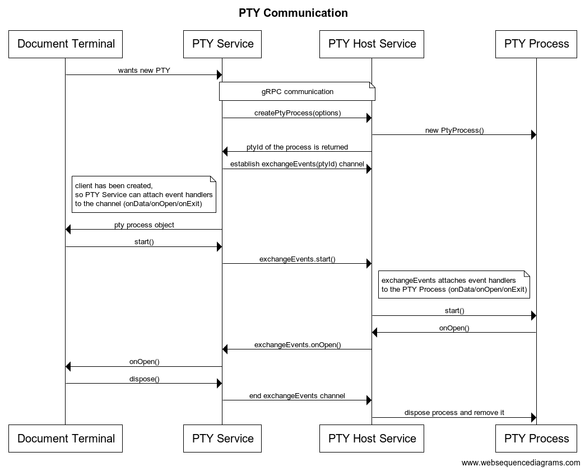
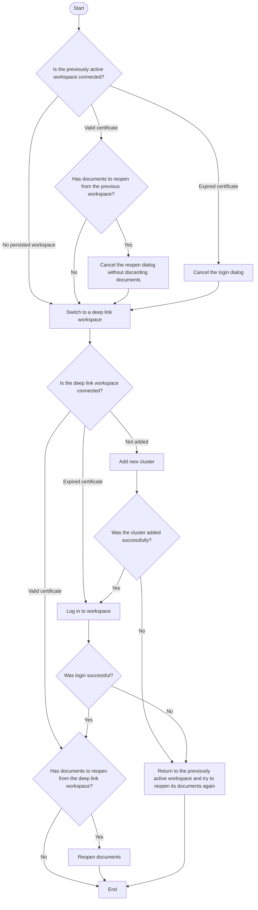

# Teleport Connect

Teleport Connect (previously Teleport Terminal, package name `teleterm`) is a desktop application that allows easy access to Teleport resources.

## Usage

Please refer to [the _Using Teleport Connect_ page from our
docs](https://goteleport.com/docs/connect-your-client/teleport-connect/).

## Building and packaging

Teleport Connect consists of two main components: the `tsh` tool and the Electron app.

To get started, first we need to build `tsh`.

```bash
cd teleport
make build/tsh
```

The build output can be found in the `build` directory. The tsh binary will be packed together with
the Electron app.

Next, we're going to build the Electron app.

```bash
cd teleport
pnpm install
pnpm build-term && CONNECT_TSH_BIN_PATH=$PWD/build/tsh pnpm package-term
```

The resulting package can be found at `web/packages/teleterm/build/release`.

For more details on how Connect is built for different platforms, see the [Build
process](#build-process) section.

## Development

```sh
cd teleport
pnpm install && make build/tsh
```

To launch `teleterm` in development mode:

```sh
cd teleport
# By default, the dev version assumes that the tsh binary is at build/tsh.
pnpm start-term

# You can provide a different absolute path to the tsh binary though the CONNECT_TSH_BIN_PATH env var.
CONNECT_TSH_BIN_PATH=$PWD/build/tsh pnpm start-term
```

To automatically restart the app when tsh gets rebuilt or
[when the main process or preload scripts change](https://electron-vite.org/guide/hot-reloading),
use [watchexec](https://github.com/watchexec/watchexec):

```sh
watchexec --restart --watch build --filter tsh --no-project-ignore -- pnpm start-term -w
```

This can be combined with a tool like [gow](https://github.com/mitranim/gow) to automatically rebuild tsh:

```sh
gow -s -S '✅\n' -g make build/tsh
```

### Development-only tools

#### Browser console tools

The `teleterm` object defined on `window` contains the entirety of `AppContext`. This is useful for
debugging state of different `AppContext` services.

The `deepLinkLaunch` function defined on `window` allows you to launch a deep link from the browser
console. Normally this feature is reserved only for the packaged app since the OS has to recognize
Connect as the handler for the custom protocol and send the deep link event to the main process.
This function completely bypasses the interaction with the main process and sends the URL straight
to the frontend app.

### Generating tshd gRPC protobuf files

Rebuilding them is needed only if you change any of the files in `proto/teleport/lib/teleterm` dir.

To rebuild and update gRPC proto files:

```sh
make grpc
```

Resulting Go and JS files can be found in `gen/proto`.

### Generating shared process gRPC protobuf files

Run `generate-grpc-shared` script from `teleterm/package.json`.
It generates protobuf files from `*.proto` files in `sharedProcess/api/proto`.
Resulting files can be found in `sharedProcess/api/protogen`.

## Build process

`pnpm package-term` is responsible for packaging the app code for distribution.

On all platforms, with the exception of production builds on macOS, the `CONNECT_TSH_BIN_PATH` env
var is used to provide the path to the tsh binary that will be included in the package.

See [Teleport Connect build
process](https://gravitational.slab.com/posts/teleport-connect-build-process-fu6da5ld) on Slab for
bulid process documentation that is specific to Gravitational.

### Native dependencies

If node-pty doesn't provide precompiled binaries for your system and the specific Electron version,
you will need to install [the dependencies required by
node-pty](https://github.com/microsoft/node-pty#dependencies).

### Linux

To create arm64 deb and RPM packages you need to provide `USE_SYSTEM_FPM=1` env var.

### macOS

To make a fully-fledged build on macOS with Touch ID support, you need two things:

- a signed version of tsh.app
- an Apple Developer ID certificate in your Keychain

When running `pnpm package-term`, you need to provide these environment variables:

- `APPLE_USERNAME`
- `APPLE_PASSWORD`
- `CONNECT_TSH_APP_PATH`
- `CSC_NAME` (optional, developer certificate ID)
- `TEAMID`

The details behind those vars are described below.

#### tsh.app

Unlike other platforms, macOS needs the whole tsh.app to be bundled with Connect, not just the tsh
binary. This is in order to support Touch ID and provide access to the same Secure Enclave keys.
That is, if you add Touch ID as MFA through tsh, we want tsh.app bundled with Connect to have access
to the same keys.

Since Connect piggybacks on tsh for authn, this amounts to just copying a signed & notarized version
of tsh.app into `Teleport Connect.app/Contents/MacOS`. All interactions with Secure Enclave are done
through tsh at the moment, so Connect doesn't need to do anything extra, other than skipping signing
of tsh.app during the build process (as we expect it to be already signed).

The path to a signed version of tsh.app should be provided through the `CONNECT_TSH_APP_PATH` env
variable.

#### Signing & notarizing

Signing & notarizing is required if the application is supposed to be ran on devices other than the
one that packaged it. See [electron-builder's docs](https://www.electron.build/code-signing) for a
general overview and [Teleport Connect build
process](https://gravitational.slab.com/posts/teleport-connect-build-process-fu6da5ld) Slab page for
Gravitational-specific nuances.

For the most part, the device that's doing the signing & notarizing needs to have access to an Apple
Developer ID (certificate + private key). electron-builder should automatically discover it if
Keychain is unlocked. The `CSC_NAME` env var can be additionally provided to point electron-builder
towards the specific developer ID certificate/key we want to use, if multiple are available.
`CSC_NAME` can either be SHA-1 of the certificate or its name.

On top of that, you must provide env vars that will be used for notarization. `APPLE_USERNAME` must
be set to the account email address associated with the developer ID. `APPLE_PASSWORD` must be [an
app-specific password](https://support.apple.com/en-us/HT204397), not the account password.

The Team ID needed as an input for notarization must be provided via the `TEAMID` environment
variable. The top-level `Makefile` exports this when `yarm package-term` is called from `make
release-connect` with either the developer or production Team ID depending on the `ENVIRONMENT_NAME`
environment variable. See the top-level `darwin-signing.mk` for details.

## Architecture

### Resource lifecycle

The general approach is that a resource can become unavailable at any time due to a variety of
reasons: the resource going offline, the cluster going offline, the device running Connect going
offline, the cluster user losing access to the resource, just to name a few.

Connect must gracefully handle a resource becoming unavailable and make as few assumptions about
resource availability as possible.

### Diagram

```pro
                                                  +------------+
                                                  |            |
                                          +-------+---------+  |
                                          |                 |  |
                                          |    teleport     +--+
                                          |     clusters    |
                                          |                 |
                                          +------+-+--------+
                                                 ^ ^           External Network
+------------------------------------------------|-|--------------------------------------------------------------+
                                                 | |           Host OS
           Clients (psql)                        | |
              |                                  | |
              v                                  | |
     +--------+---------------+                  | |
     |                        |        SNI/ALPN  | | gRPC
  +--+----------------------+ |         routing  | |
  |                         | |                  | |
  |     local proxies       +-+                  | |
  |                         |                    | |
  +-------------------+-----+                    | |
                      ^                          | |
                      |                          | |
  +---------------+   | tls/tcp on localhost     | |
  |    local      |   |                          | |
  | user profile  |   |                          v v
  |   (files)     |   |                   +------+-+-------------------+        +-------------------------------+
  +-------^-------+   |                   |                            |        |                               |
          ^           +-------------------+         tsh daemon         |        |    Electron Shared Process    |
          |                               |          (golang)          |        |            (PTY)              |
          +<------------------------------+                            |        |                               |
                                          +-------------+--------------+        +-------------------------------+
 +--------+-----------------+                           ^                                       ^
 |         Terminal         |                           |                                       |
 |    Electron Main Process |                           |    gRPC API                           |   gRPC API
 +-----------+--------------+                           | (domain socket)                       |   (domain socket)
             ^                                          |                                       |
             |                                          |                                       |
    IPC      |                                          |        +------------------------------+
 named pipes |                                          |        |
             v  Terminal UI (Electron Renderer Process) |        |
 +-----------+------------+---------------------------------------------+
 | -gateways              | root@node1 × | k8s_c  × | rdp_win2 ×  |     |
 |   https://localhost:22 +---------------------------------------------+
 |   https://localhost:21 |                                             |
 +------------------------+ ./                                          |
 | -clusters              | ../                                         |
 |  -cluster1             | assets/                                     |
 |   +servers             | babel.config.js                             |
 |     node1              | build/                                      |
 |     node2              | src/                                        |
 |   -dbs                 |                                             |
 |    mysql+prod          |                                             |
 |    mysql+test          |                                             |
 |  +cluster2             |                                             |
 |  +cluster3             |                                             |
 +------------------------+---------------------------------------------+
```

### PTY communication overview (Renderer Process <=> Shared Process)



### Overview of a deep link launch process

The diagram below illustrates the process of launching a deep link,
depending on the state of the workspaces.
It assumes that the app is not running and that the deep link targets a workspace
different from the persisted one.

<details>
<summary>Diagram</summary>



</details>
